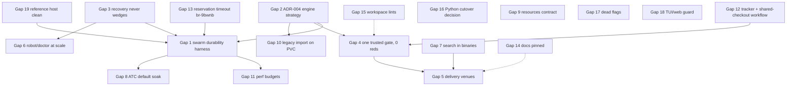

# Bridge Plan: MCP Agent Mail (Rust)

**Reality check date:** 2026-09-01 (Phase 1; artifact "Agent Mail Reality Check")
**Bridge plan date:** 2026-09-02 (Phase 2, revision 1)
**Workspace at plan time:** `f85b22c2` on `main` (v0.3.32 + the 2026-09-01 landing wave)
**Vision delivery at plan time:** 8 of 23 goals fully working (was 7 at the reality check), 9 partial, 3 regressed, 2 unproven or not enforced, 1 not started
**Gap count:** 4 critical, 9 major, 6 minor (19 resolutions below)
**Beads created so far for this plan:** 13 landing beads on 2026-09-01 (`br-vhxdc`, `br-z73au`, `br-0dw2c`, `br-ocys6`, `br-bx73n`, `br-ciwph`, `br-of0ra`, `br-ku0kl`, `br-ajiq8`, `br-95spu`, `br-sox5q`, `br-00gl8`, `br-9bwnb`); Phase 3a (epic + child beads from this document) has not run yet
**Estimated work:** roughly 5 XL, 6 L, 6 M, 2 S resolutions; the critical path is the durability program, which is gated by upstream engine work and by one maintainer decision (ADR-004)

This document is the Phase 2 output of the reality-check flow. It exists so that Phase 3a can turn every resolution into self-contained beads and Phase 5 can refine them in plan space. Code is ground truth for the "current state" lines; the README, AGENTS.md, VISION.md, the transition plan and the release checklist are the measuring stick for "target state". Where a line cites a file and function, that is where the work starts.

---

## 0. What moved since the reality check (2026-09-01 evening wave)

Commits `ba1b8a42`, `888aea20` (partly a parallel session's sweep of this working tree) and `f85b22c2` changed the status of several goals. The plan below is written against the state after those commits.

| Goal | Reality check | Now | What changed |
|---|---|---|---|
| 6 self-healing recovery | PARTIAL | PARTIAL (better) | breaker self-poisoning inside a process's own recovery admission fixed; false P0 on a healthy live mailbox fixed; read-only CLI processes no longer counted as owners; engine-dispatching read-only opener lets restored/reconstructed families be inventoried, backed up, salvaged and reconciled; promotion retires stale namespace records |
| 10 robot mode | PARTIAL | PARTIAL (better) | `am robot handoff` 600 s timeout → 0.30 s on the 40k-message mailbox, `--max-seconds` budget; `am robot metrics` reads live daemon counters |
| 11 doctor | PARTIAL | PARTIAL (better) | four disagreeing verdicts reduced: doctor health no longer P0 on a healthy file; doctor source selection by namespace authority; `doctor reconstruct` can salvage the current database |
| 15 description parity | NOT ENFORCED | ENFORCED (WORKING) | `tool_description_parity.rs` compares types through nullable arrays instead of passing on mismatch; 55-entry error catalog |
| 16 all tests green | REGRESSED | REGRESSED (smaller) | class A (27), C (23), D (20), E2 and most of E1 (28) retired; per-process `cargo nextest` is now the only trusted runner (the storage-root guard is nextest-safe again after a one-commit regression) |
| 21 docs are the truth | PARTIAL | PARTIAL (better) | README/AGENTS counts and flags corrected to the binary; `doc_consistency` pins doctor verbs, robot subcommands, themes; VISION carries dated reality notes |
| new finding | — | — | `file_reservation_paths` timed out twice at 30 s on the live daemon in the unattributed blocking-dispatch stage (`br-9bwnb`): direct evidence for the durability gap |

Still unmoved: goals 5 (swarm durability), 7 (engine strategy), 13 (search in shipped binaries), 14 (ATC default), 17 (delivery venues), 19, 20, 22, 23.

---

## 1. Critical gaps (the vision is undeliverable without these)

### Gap 1: Zero errors or corruption under swarm load (goal 5) — REGRESSED → WORKING

**Current state.** The README's "Rust vs Python gauntlet" section states the Python failure modes are gone. Field reports GH#257 (re-corruption 61 min after a clean integrity check at 316 msg/h), GH#278 (macOS snapshot conflicts then malformed pages) and `br-htobc` (index corruption under SIGKILL) say the failure modes moved from git index locks into the storage engine. The only test that could prove the claim, the 100-agent lifecycle test in `crates/mcp-agent-mail-storage/tests/stress_pipeline.rs`, is `#[ignore]`d for an engine correctness bug ("no such table: messages" across concurrent opens); `stress_150_agent_message_storm` (line 1935) is ignored for concurrent-open serialization (p99 ~50 s vs a 45 s guard, upstream `bd-xva84`). The pool p99 on the reference host reached 18.2 s acquire and 20 s write inside a 10-minute window, and on 2026-09-02 two `file_reservation_paths` calls timed out at 30 s in `blocking_dispatch_unattributed` while `release_file_reservations` returned instantly (`br-9bwnb`). `BEGIN CONCURRENT` exists but `Config::fsqlite_concurrent_mode` (config.rs:373) defaults to `false` because of an upstream snapshot-drift bug; 85 call sites use `BEGIN IMMEDIATE`. The pragma conformance harness (`docs/FRANKENSQLITE_PRAGMA_GAPS.md`) records 35 divergences.

**Target state.** A cross-process swarm harness that runs at or above the GH#257 rate (≥ 300 msg/h across ≥ 13 projects and ≥ 90 agents, with reservation churn and restarts) for 24 h on two hosts, ends with `PRAGMA integrity_check = ok`, `quick_check = ok`, zero foreign-key violations, archive/DB parity, and no `pending_sends` residue, and does so on the pinned engine line. The README claim is either re-earned by that run or rewritten to what the run proves.

**Success criteria.**
- [ ] `am e2e run --project . --tag swarm` (new tag) drives ≥ 90 agent processes (not threads) through send/reply/ack/reserve/release/handoff for a configurable duration and emits a JSON scorecard with message rate, p50/p99 tool latency, integrity verdicts before/after a SIGKILL restart, and reservation grant latency.
- [ ] The scorecard shows 0 corruption events, 0 unattributed timeouts, reservation grant p99 < 2 s, at 300 msg/h for 24 h on ts1 and on one other host.
- [ ] `stress_150_agent_message_storm` and the 100-agent lifecycle test are un-ignored or replaced by the harness, with their upstream blockers cited on the replacement.
- [ ] `br-9bwnb` closed with the attributed stage and a regression test that drives `file_reservation_paths` under a held archive commit.

**Implementation plan.**
1. Attribute the reservation timeout first: instrument the blocking-dispatch lane (`crates/mcp-agent-mail-server` dispatch metrics, the `contended_path` / stage fields already exposed in timeout replies) so every timeout names its stage; reproduce with the live mailbox using the `am` binary against a copy; fix the grant path (conflict scan of `file_reservations/` artifacts, JSON artifact write, DB insert) so it is bounded.
2. Build the harness as a native e2e suite (`am e2e` already discovers 153 suites at runtime; add `swarm_soak` with `--agents`, `--projects`, `--rate`, `--duration`, `--restart-every`): spawn real `am` processes over stdio, drive the MCP tools, sample `health_check` and `resource://tooling/metrics`, run the doctor's double probe at the end.
3. Run it on both engine lines the repo can pin (`fsqlite =0.3.14` now; the next upstream release when available) and record the results under `tests/artifacts/swarm_soak/<ts>/`.
4. Feed every corruption reproduction into the frankensqlite repo with a minimal SQL script; track the upstream issue ids on the bead (the maintainer already routes GH#257/GH#278 upstream).
5. Only after the run is green: either flip `fsqlite_concurrent_mode` on by default (with the 85 `BEGIN IMMEDIATE` sites reviewed) or document why it stays opt-in.
6. Rewrite README "Rust vs Python gauntlet" from the scorecard, with the date and hardware.

**Dependencies.** Gap 2 (engine strategy decision) determines which engine line the harness certifies; Gap 4 (verification) provides the runner and scorecard conventions. Upstream engine fixes gate the final green.
**Complexity.** XL.
**Vision goals served.** 5, 16, 22.
**Would existing beads close it?** No. `br-sa58k` (message-id election across processes), `br-pyalb` (GH#245 pool-timeout diagnostics), `br-22gm3` (Cx budgets into the DB layer), `br-htobc` and `br-9bwnb` cover pieces; no bead builds the harness or re-earns the README claim. New epic needed.

### Gap 2: Engine strategy (goal 7) — PARTIAL → DECIDED and enforced

**Current state.** VISION.md promises "FrankenSQLite only, no C SQLite". The runtime path is FrankenSQLite (`DbConn`, test-enforced by `normal_mailbox_connection_aliases_use_frankensqlite_runtime`), but `sqlmodel-sqlite` statically bundles C SQLite into every binary as a non-optional dependency of `mcp-agent-mail-db` and `-cli`, and the canonical engine is the verification oracle and recovery reader (`CanonicalDbConn`: doctor double probe, `neutralize_private_salvage_artifact`, backups, legacy import). The dual-engine seam is itself a defect source: mixed-engine fd-close lock destruction (`br-r6psd`), read-only canonical opens that cannot read a resting Franken WAL (`br-s9d8a`, class H), stale namespace records after promotion (fixed in `f85b22c2`), and the class-E1 refusals (mostly fixed by `pool::open_guarded_read_only_sqlite_file`). `fsqlite_raptorq_enabled` (config.rs:242) has no readers (`br-of0ra`).

**Target state.** ADR-004 records one of two strategies and the code enforces it: (a) "Franken runtime, canonical verifier": C SQLite is a declared, documented verification dependency; every cross-engine boundary goes through the dispatching opener or a private neutralized copy; VISION.md drops "no C SQLite"; or (b) "Franken only": canonical uses are replaced by Franken read-only probes plus an in-process page-level integrity check, `sqlmodel-sqlite` leaves the dependency graph, and a build gate forbids it.

**Success criteria.**
- [ ] `docs/ADR-004-engine-strategy.md` exists with the decision, the evidence from Gap 1's harness, and the list of every canonical use site with its disposition.
- [ ] Under (a): `rg 'open_guarded_read_only_(franken|canonical)_' crates` shows only the dispatcher, the two openers and deliberately engine-specific sites, each with a one-line justification comment; `docs/VISION.md` reality note replaced by the ADR link.
- [ ] Under (b): `cargo tree -p mcp-agent-mail-db | rg sqlmodel-sqlite` is empty and a `tests/docs_drift_ci.rs` case asserts it.
- [ ] Either way: the class-H tests (`br-s9d8a`, 6 doctor fixer tests) and class-B probes (`br-0dw2c`, 10 writer-lock tests) are green or rewritten to the invariant the ADR states, with the rewrite justified in the test.
- [ ] `fsqlite_raptorq_enabled` is wired to engine behaviour with a test, or removed with its docs.

**Implementation plan.**
1. Inventory every `CanonicalDbConn` use (`rg -n 'CanonicalDbConn' crates --type rust | wc -l` ≈ dozens) into a table: purpose, whether the input can be Franken-admitted, whether a private neutralized copy is used.
2. Decide (maintainer). The evidence to weigh: the class-B finding that Franken and canonical share no fcntl exclusion, the readonly_shm limitation, and how often canonical caught real corruption that Franken's own `integrity_check` missed (search the doctor artifacts under `~/.mcp_agent_mail_git_mailbox_repo/doctor/`).
3. Under (a): finish routing the remaining E1 sites (`cli::open_live_sqlite_read_only` / `open_sqlite_with_fallback` and their 13 callers; `tools::identity::open_health_check_sync_db_connection`; the cli index-repair classifier and physical probe); make `CanonicalDbConn` open sites accept only paths proven non-Franken-admitted (`pool::is_franken_admitted_family`) or private copies.
4. Under (b): implement a Franken-native full check (`PRAGMA integrity_check` through `DbConn` exists; add page-level header validation for the cases canonical caught), then delete canonical sites crate by crate, `sqlmodel-sqlite` last.
5. Decide `fsqlite_raptorq_enabled` with the upstream maintainers; wire or delete.

**Dependencies.** Gap 1's harness supplies the evidence; Gap 4 supplies the class B/H test beads.
**Complexity.** L for (a), XL for (b).
**Vision goals served.** 7, 5, 16.
**Would existing beads close it?** Partially. `br-0dw2c`, `br-s9d8a`, `br-00gl8`, `br-of0ra`, `br-vhxdc` follow-ups, `br-yrjwh` (registry adoption), `br-yzk37` (inert pragmas) cover pieces; no bead holds the decision. New epic + ADR bead needed.

### Gap 3: Self-healing recovery that never wedges (goal 6) — PARTIAL → WORKING

**Current state.** Reconstruct promoted a real 2.7 GB mailbox in v0.3.32 and the 2026-09-01 wave fixed the breaker self-refusal inside a process's own recovery admission (`RecoveryAdmissionDepthGuard::active_for`), the false P0, the owner classifier, and the restored/reconstructed-family refusals. Still open: the breaker chain described by `br-plksu` (startup fail-open does not recognise the live-salvage refusal shape); a 1-message archive-ahead delta triggers a full rebuild (GH#284, `br-lwx55`); startup exits 1 into a systemd restart loop when an archive-ahead reconstruct is refused despite a healthy live DB (`br-bgwj1`); reservation parity reports permanent `missing_archive` drift after a reconstruct lineage (GH#244, `br-mc0hz`); the reference host still runs with `INTEGRITY_CHECK_ON_STARTUP=false`, 5.7 GB of recovery debris and 57 `pending_sends` artifacts; the pre-init reconcile can rebuild through a symlinked storage root because the server canonicalizes `config.storage_root` before pool init (the db-side `archive_has_real_projects` guard is not reached; strace-verified 2026-09-02); three artifact-hygiene tests stay red (`restore_from_backup_leaves_primary_untouched_when_staged_backup_is_invalid`, `sqlite_family_cleanup_refuses_before_mutation_while_writer_is_active`, `archive_recovery_noop_on_healthy_db`).

**Target state.** One classifier produces the mailbox verdict that doctor, robot, MCP health and startup all report; startup never crash-loops on a healthy file; small archive-ahead deltas apply incrementally; recovery leaves no artifact behind that a later probe misreads; the reference host runs with the startup integrity check on.

**Success criteria.**
- [ ] `am doctor health --json`, `am robot health --format json`, MCP `health_check` and the startup probe return the same `mailbox_verdict` on the same file in a table-driven test that covers: healthy Franken family, healthy sidecar-less family, resting WAL with live owner, restored `.bak`, reconstructed primary, corrupt header, half namespace pair.
- [ ] `br-lwx55`: an archive ahead by ≤ N messages is applied by inserting the missing rows (with the message-id floor) instead of rebuilding; a test asserts the primary inode is unchanged.
- [ ] `br-bgwj1` and `br-plksu`: startup with a healthy live DB and a refused archive-ahead reconstruct serves and logs, exit code 0; the breaker is armed only after an attempt fails, never provisionally.
- [ ] The symlinked-root test (`probe_integrity_does_not_recover_from_archive_through_symlinked_storage_root`) passes because the server refuses a symlinked configured root before canonicalizing.
- [ ] The three artifact-hygiene tests pass; `am doctor health` on the reference host is green with `INTEGRITY_CHECK_ON_STARTUP` unset.

**Implementation plan.**
1. Extract the verdict logic into `mcp_agent_mail_db::mailbox_verdict::compute_mailbox_verdict` as the single entry point (it exists; make the cli doctor, `robot health`, the server health route and `startup_checks::probe_integrity` call it instead of their own probes) and add the table-driven test.
2. `br-plksu` / `br-bgwj1`: in `pool.rs` recovery admission, record the breaker failure after the attempt (the provisional `record_failure` before the attempt is the root cause found on 2026-09-01), and teach `startup_checks::probe_integrity` the live-salvage refusal shape (`SqlError` messages beginning "reconstruct live salvage") as "serve, do not reinitialize".
3. `br-lwx55`: in `reconcile_archive_state_before_init`, when `archive_max_id - db_max_id ≤ N` and the project identities match, call a new `reconstruct::apply_archive_delta` that parses only the missing message files and inserts them under the promotion barrier.
4. Symlinked root: in `startup_checks.rs` (before `capture_pre_recovery_snapshot`), refuse `config.storage_root` that is a symlink or has a symlinked parent (`mcp_agent_mail_core::pane_identity::path_has_symlinked_parent` already exists) with a `ProbeFailure`, and stop canonicalizing it for pool init.
5. Artifact hygiene: `restore_from_backup` must remove its `.restoring-*` staging on rejection; `sqlite_family_cleanup` must not leave `.am-recovery-breaker.lock`; `archive_recovery_noop_on_healthy_db` needs the canonical immutable reader to see Franken WAL frames (checkpoint the private copy first) — each is a small fix in `pool.rs` with the existing red test as its acceptance.
6. Reference host: run `am doctor repair --yes` for the 5.7 GB debris and the 57 `pending_sends`, then re-enable the startup check and watch for 48 h.

**Dependencies.** None hard; Gap 2 decides how the canonical corroboration in the verdict is retained.
**Complexity.** L.
**Vision goals served.** 6, 11, 16.
**Would existing beads close it?** Partially: `br-plksu`, `br-lwx55`, `br-bgwj1`, `br-mc0hz`, `br-jcgxg`, `br-zchj0`, `br-oyget`, `br-3p187`, `br-sz6k9`, `br-cxsgx`. No bead for the unified verdict, the symlinked-root refusal, or the artifact-hygiene trio.

### Gap 4: Every test passes, zero ignored, zero flaky, one trusted gate (goal 16) — REGRESSED → WORKING

**Current state.** `br-l1q6z` recorded ~212 deterministic reds on 2026-09-01; the evening wave retired classes A, C, D, E2 and most of E1, but the figure has not been re-measured with a full-workspace `cargo nextest run`. Remaining classes with baselines measured in a detached worktree: B (10 cross-engine writer-lock probes, `br-0dw2c`), F (about 12 relative-`sqlite:///` authority tests across db/server/cli, `br-z73au`), H (6 readonly_shm tests, `br-s9d8a`), source-bytes (`br-00gl8` + `strict_query_only_pool_rejects_writes_without_changing_file_family`), symlink-rejection probes in the server (3), dashboard/TUI placeholder tests (3), cli doctor salvage fixture tests (6), setup self-heal OMP tests (3), and singletons (`insert_system_agent_reselects_existing_name_case_insensitively`, `commit_tx_does_not_wait_for_external_reader_checkpoint`). 39 `#[ignore]` remain (3 heavy stress, 3 engine-blocked, the rest unclassified). `run_http_startup_preflight_probes_omits_port_check` is flaky under load. Plain `cargo test` never trips the harness guard on ts1; only nextest does. GitHub `ci.yml` has never passed (0 of 1,785). The release scorecard the checklist requires (`tests/artifacts/release_scorecard/<ts>/release_scorecard.json`) has never been produced; installed-binary parity looks for `/usr/local/bin/am` and has never passed here.

**Target state.** A single documented gate, `cargo nextest run --workspace` (per-process) plus `am e2e run --project . --tag reliability --release-scorecard`, is green on the reference host before every tag, its artifacts are committed, and CI either runs that gate or is retired.

**Success criteria.**
- [ ] A full-workspace nextest run on ts1 reports 0 failures; the run log is attached to `br-l1q6z` before it closes.
- [ ] Every `#[ignore]` carries a reason string naming an upstream issue or a `--ignored` manual-run rationale; the count is pinned by a test so new ignores need a reason.
- [ ] `release_scorecard.json` exists for the next tag and `docs/RELEASE_CHECKLIST.md` row 31 points at it; installed-binary parity resolves the `am` on `PATH` and passes.
- [ ] `docs/DEVELOPER_GUIDE.md` states the gate in one paragraph; `cargo test` is documented as not sufficient for guard-sensitive code.

**Implementation plan.**
1. Re-measure: `cargo nextest run --workspace --no-fail-fast` on ts1 (private target dir), attach the summary to `br-l1q6z`, and update the class counts on the bead.
2. Class F (`br-z73au`): decide the `sqlite:///rel` contract in `mcp_agent_mail_core::disk::sqlite_file_path_from_database_url` (preserve a missing relative authority end to end); fix `resolve_mailbox_sqlite_path`, readiness, tool_metrics and search_v3 together; the ~12 tests are the acceptance.
3. Class B (`br-0dw2c`): per ADR-004, either take classic fcntl locks in the Franken write path or rewrite the 10 probes to the stated invariant.
4. Class H (`br-s9d8a`): stage the family and checkpoint the private copy before any canonical read (the pattern `neutralize_private_salvage_artifact` uses), applied in the doctor fixers' offline candidate path.
5. Server symlink probes (3) and the dashboard/TUI placeholder tests (3): investigate individually; each is a small contract fix or fixture fix with the red test as acceptance.
6. cli salvage fixtures (6): make `sqlite_backup_candidates` accept a Franken-written `.bak` by neutralizing a private copy, or fix the fixtures to write standalone backups; decide the `doctor_reconstruct_prefers_readable_current_db_as_salvage_source` wording contract.
7. Flakiness: run the suite 3× and quarantine-by-reason (not `#[ignore]`) anything that flips; fix `run_http_startup_preflight_probes_omits_port_check`.
8. Scorecard: run `am e2e run --project . --tag reliability --release-scorecard` on ts1, fix the installed-binary parity path resolution (`which am`), commit the artifacts, and add the two commands to the release checklist as blocking.

**Dependencies.** Gap 2 for classes B and H. Gap 8 (CI venue) for where the gate runs.
**Complexity.** L.
**Vision goals served.** 16, 17, 22.
**Would existing beads close it?** Partially: `br-l1q6z` (tracker), `br-z73au`, `br-0dw2c`, `br-s9d8a`, `br-00gl8`, `br-qk7wu` (closed by evidence), `br-99aih` (pollution guard landed, closure pending a full run), `br-jpowg`, `br-y1elw`, `br-nq2kb`. No bead for the ignore-reason policy, the flake quarantine, or the scorecard run.

---

## 2. Major gaps (the vision is significantly degraded)

### Gap 5: Delivery venues (goal 17) — PARTIAL → WORKING

**Current state.** Signed v0.3.32 shipped manually via dsr and verified; the installer verifies minisign manifests end to end (goal 18 WORKING). `ci.yml` 0 of 1,785 successes, silent since 2026-08-19 (queue latency then clippy failure); `dist.yml` 0 successes; `docker.yml` never green and ghcr's newest tag is v0.3.13 while the v0.3.31 changelog claimed the image was unstuck (CHANGELOG now carries a Known-issues note); `deploy-pages.yml` is now dispatch-only with a `bundle_dir` input but the Pages site still 404s; `publish.yml` is manual-only and `mcp-agent-mail` is not on crates.io; release binaries are built `--features portable` (lexical-only search).

**Target state.** Every workflow under `.github/workflows` either passes on its trigger or is deleted; the newest ghcr tag equals the newest release; the docs site deploys; crates.io publication is decided; the release checklist is executable from a clean checkout.

**Success criteria.**
- [ ] `gh run list --workflow <each>.yml --limit 5` shows green for every remaining workflow.
- [ ] `docker pull ghcr.io/dicklesworthstone/mcp_agent_mail_rust:v<latest>` runs `am --version` matching the tag (`br-ocys6`).
- [ ] The Pages URL serves the bundle from `deploy-pages.yml`'s `bundle_dir`.
- [ ] `br-95spu` closed with a decision; if publishing, `cargo publish --dry-run` passes for every member crate in dependency order.

**Implementation plan.**
1. `br-bx73n`: decide the CI venue. Recommended: shrink `ci.yml` to fmt + clippy + `cargo nextest run -p mcp-agent-mail-core -p mcp-agent-mail-conformance` (fast subset) on the hosted runner, and move the full gate to a self-hosted rch-backed runner or document the local gate as the pre-tag requirement; delete `dist.yml` if dsr remains the release tool.
2. `br-ocys6`: add an image lane to the dsr flow (build `Dockerfile.release` from the verified release archives, push `v<tag>` and `latest`), or retract the claim permanently.
3. Pages: build `docs/site` with the existing tooling, dispatch `deploy-pages.yml` with `bundle_dir=docs/site`, verify the URL, then trigger it from the release flow.
4. `br-95spu`: decide; the blocker (frankensearch on crates.io) is gone, but the path deps on `../frankensearch-rel-0332` (`br-ku0kl`) must become registry deps first.
5. Search in binaries: ship one artifact with `--features hybrid` or state lexical-only in every doc that mentions search (README FAQ already does; AGENTS.md search caveat added); see Gap 9.

**Dependencies.** Gap 4 (the gate CI would run), Gap 9 (search feature decision), `br-ku0kl` (registry deps) for crates.io.
**Complexity.** M.
**Vision goals served.** 17, 13.
**Would existing beads close it?** Partially: `br-bx73n`, `br-ocys6`, `br-95spu`, `br-ku0kl`, `br-c2is6`, `br-gozln`, `br-nq2kb`, the P0 release-binding beads from Aug 25. No bead for Pages.

### Gap 6: Robot and operator surfaces correct at scale (goals 10, 11) — PARTIAL → WORKING

**Current state.** `am robot handoff` is fixed (0.30 s, `--max-seconds`); `am robot metrics` reads the live server. Still: `am robot overview` is slow at scale (GH#274); `/health` takes ~7 s on large mailboxes so doctor reports a healthy server as failing (`br-am-health-endpoint-slow-false-fail-45e0e`); `md` output exists only for `thread` and `message`; `doctor drain` and the ownership classifier now treat read-only readers correctly but `doctor locks` still reports the parallel-session `instest/am` daemon as the live owner without saying it is a test build; the doctor's diagnostic-source choice was only fixed on 2026-09-02 and has no table-driven test.

**Target state.** Every robot subcommand returns within 5 s on the 40k-message reference mailbox; no robot command returns constant zeros; `/health` is constant-time; the doctor's verdict on any family shape is table-tested.

**Success criteria.**
- [ ] A benchmark test (`crates/mcp-agent-mail-cli/tests/robot_scale.rs`, new) seeds 16 projects / 700 agents / 40k messages and asserts every `am robot  --format json` finishes under 5 s.
- [ ] `/health` p99 < 250 ms on the same fixture (`br-am-health-endpoint-slow-false-fail-45e0e`).
- [ ] `md` renderers exist for every robot subcommand or the README states which support it.
- [ ] The doctor source-selection table test from Gap 3 covers `LiveLogicalSnapshot`, `StagedFamilyCopy`, `OfflineCanonical` and `PrivateCanonical` outcomes.

**Implementation plan.**
1. GH#274: apply the handoff pattern (batched join-free `IN (...)` lookups, wall-clock budget, `truncated_by_budget`) to `robot overview`; profile with the reference mailbox copy.
2. `/health`: cache the expensive counts behind a 30 s snapshot (the TUI poller throttle pattern, see `br-y8k4z`) and answer from the cached verdict; expose staleness in the payload.
3. Add the scale benchmark test with a generated fixture (reuse `open_robot_test_db_with_real_schema` and a bulk inserter).
4. `md` renderers: extend `robot.rs` output dispatch for the remaining subcommands.

**Dependencies.** Gap 3 for the shared verdict.
**Complexity.** M.
**Vision goals served.** 10, 11.
**Would existing beads close it?** Partially: `br-am-health-endpoint-slow-false-fail-45e0e`, `br-4myjj` (landed, verification pending), GH#274 has no bead. New beads for overview, md renderers, scale test.

### Gap 7: Search V3 hybrid in shipped artifacts (goal 13) — PARTIAL → WORKING

**Current state.** Hybrid (lexical + semantic) search exists in source builds behind the `hybrid` feature; every shipped artifact (dist.yml, both Dockerfiles) builds `--features portable`, so releases are lexical-only. Global search falls back to `LIKE` full scans after the FTS5 decommission (`br-7x5fm`). The workspace builds frankensearch from a gated clone `../frankensearch-rel-0332` because the live sibling moved to asupersync 0.4.10 while fastmcp pins =0.4.9 (`br-ku0kl`). Tantivy is not optional in db no-feature builds (`br-eh8bj`).

**Target state.** Either one shipped artifact carries hybrid search with a documented model download path, or every doc that mentions search says lexical-only for binaries; global search goes through Search V3 in both cases.

**Success criteria.**
- [ ] `br-7x5fm`: `am search` and the `search_messages` tool never issue `LIKE '%…%'` full scans on the reference mailbox (assert via `EXPLAIN QUERY PLAN` in a test).
- [ ] Decision recorded: hybrid artifact (with `am search --semantic` proven in an e2e suite on a release binary) or lexical-only statement in README, AGENTS.md and `am --help`.
- [ ] `br-ku0kl` closed: path deps replaced by registry versions once fastmcp follows asupersync, with `dist.yml`/Dockerfile/install.sh updated in the same change.

**Implementation plan.**
1. Route global search through the Search V3 planner (`search_planner`, `search_service`) and remove the LIKE fallback path.
2. Decide the artifact feature set with the maintainer; if hybrid, add a `hybrid` build to the dsr release flow and an e2e suite that runs semantic search on the produced binary with the bundled model.
3. Watch fastmcp for an asupersync ≥ 0.4.10 release; then bump asupersync in lockstep, switch frankensearch to registry deps, and retire the clone.

**Dependencies.** Gap 5 (release flow) for the artifact; upstream fastmcp for the registry move.
**Complexity.** M.
**Vision goals served.** 13, 17.
**Would existing beads close it?** Partially: `br-7x5fm`, `br-ku0kl`, `br-eh8bj`. No bead for the artifact decision.

### Gap 8: ATC learning loop live and safe by default (goal 14) — PARTIAL → WORKING

**Current state.** `atc_note_*` hooks are wired from dispatch; the executor default flipped to Shadow on 2026-08-28. `atc_record_outcome()` has zero production callers although README named it as the outcome path (README now says the real path is `record_atc_message_outcome_from_tool_payload_with_pool`). GH#264 stays open: one field mailbox is 99.8% ATC self-traffic (`br-au76r`); GH#258 hydration stalls MCP (`br-z6m08`); the default pairing decision is open (`br-rl1s4`). The parallel session landed the complete `AM_ATC_*` flag registry and runbooks on 2026-09-01 (`a3a52caf`).

**Target state.** A fresh default install produces zero ATC mail in a 24 h soak; hydration is bounded; probe traffic has its own retention or state; the outcome path has one name.

**Success criteria.**
- [ ] `br-rl1s4` closed with the decision and the shipped default documented in `docs/FLAGS_REGISTRY.md`.
- [ ] A soak test (reuse the Gap 1 harness at low rate) shows 0 ATC-authored messages in ordinary inboxes over 24 h with defaults.
- [ ] `br-z6m08`: cold-start hydration is bounded by effect-queue capacity with a test at 940 recent agents.
- [ ] `atc_record_outcome` is deleted or called; README, AGENTS and the code agree.

**Implementation plan.**
1. Decide the default pairing (maintainer) and encode it in `Config` defaults + the flag registry.
2. `br-au76r`: route liveness probes to a dedicated state table or a retention class that never lands in agent inboxes.
3. `br-z6m08`: cap hydration by queue capacity, spill the rest to a background pass.
4. Remove or wire `atc_record_outcome`.

**Dependencies.** Gap 1 harness for the soak.
**Complexity.** M.
**Vision goals served.** 14.
**Would existing beads close it?** Mostly: `br-rl1s4`, `br-au76r`, `br-z6m08`; missing: the soak criterion and the dead-function cleanup.

### Gap 9: Read-only MCP resources honour their contract (goal 2) — PARTIAL → WORKING

**Current state.** 25 templates served and test-pinned. `resource://tooling/recent/{window_seconds}` always returns an empty list (`resources.rs:2129`, "not yet implemented; return real data only"); 7 of 8 `?{query}` variants parse and discard their parameters; conformance fixtures cover 23 of 25 while README says all 25 (`br-ciwph`).

**Target state.** Every resource either honours its documented parameters or is delisted from the registry, the fixtures and the docs, consistently.

**Success criteria.**
- [ ] `tooling/recent` returns the last N tool calls from a bounded in-memory ring the server already feeds for the TUI timeline, filtered by agent/project, with a unit test; or it is removed from `TOOL_CLUSTER_MAP`-equivalent resource registry, the Python fixture and README in one change.
- [ ] Each `?query` variant either applies its parameters (test per variant) or returns a typed `unsupported parameter` error.
- [ ] Conformance fixtures cover 25 of 25 or README says 23.

**Implementation plan.** As in `br-ciwph`.
**Dependencies.** None.
**Complexity.** S–M.
**Vision goals served.** 2.
**Would existing beads close it?** Yes: `br-ciwph`.

### Gap 10: Legacy Python import and upgrade (goal 19) — PARTIAL → WORKING

**Current state.** `am legacy detect/import/status` and `am upgrade` exist with tests. GH#268: `serve-http` fails after a successful import on its own fsqlite namespace gate (Kubernetes PVC repro, `br-lkhxw`); several P1 beads cover clobber-free publication of import artifacts (`br-1m1tv`, `br-8echk`, `br-hb3mk`, `br-cxsgx`).

**Target state.** Import → serve works on a PVC-style filesystem in an e2e suite; failed imports are retryable.

**Success criteria.**
- [ ] An e2e suite imports a Python-era mailbox fixture and then serves over HTTP from the same directory, on ext4 and on an overlay/bind mount that mimics the PVC report.
- [ ] `br-lkhxw` closed with that suite as evidence.

**Implementation plan.** Reproduce GH#268 with the dispatcher in place (the namespace-gate refusal is the same family as class E1: after import the family may be sidecar-less or carry stale records — apply `admit_private_database_with_franken` or the promotion-style record retirement at import publication), then the P1 clobber beads.
**Dependencies.** Gap 2 (namespace semantics).
**Complexity.** M.
**Vision goals served.** 19.
**Would existing beads close it?** Mostly: `br-lkhxw` + the four P1 beads; missing: the PVC e2e suite.

### Gap 11: Performance baselines current and honoured (goal 22) — UNPROVEN → WORKING

**Current state.** README performance tables are the 2026-02 numbers; the latest artifacts (2026-09-01) show archive batch-100 p95 of 6.5 s against a 250 ms budget; `benches/BUDGETS.md` deliberately leaves budgets unrecalibrated; the p99 budget for the swarm test was recalibrated from the README's 6.8 s to 120 s; `br-pyalb` (GH#245) asks for windowed timeout diagnostics and `git_commit_p99` exposure (the timeout payload now carries `git_commit_p99_ms`, seen on 2026-09-02).

**Target state.** Budgets reflect the current engine on named hardware, the bench suite fails when a budget regresses, and README tables carry current numbers with the date and host.

**Success criteria.**
- [ ] `benches/BUDGETS.md` has a per-case budget with a recorded baseline run id; `cargo bench`/the bench e2e suite exits non-zero on a > 20 % regression.
- [ ] README performance tables regenerated from `tests/artifacts/bench/<ts>/` with an era note.
- [ ] Gap 1's scorecard numbers (reservation grant p99, tool p99) become budgets.

**Implementation plan.** Run the bench catalog on ts1 after Gap 1's fixes; write budgets from the measured p95 × 1.5; wire the check into the release checklist; regenerate the README tables by script (a doc generator, not a hand edit).
**Dependencies.** Gap 1.
**Complexity.** S–M.
**Vision goals served.** 22.
**Would existing beads close it?** No bead; `br-pyalb` is adjacent.

### Gap 12: Deterministic fixtures and the parallel-session workflow (goals 16, 23) — REGRESSED → WORKING

**Current state.** On 2026-09-01 a second Claude session working in the same checkout committed this session's in-progress working tree under its own message (`888aea20`), left the cli lib tests uncompilable (E0027) and two clippy doc lints; 66 in-progress beads have been untouched since Aug 25–28; `bv --robot-triage` returns null on this host (`br-cdwya` adjacent).

**Target state.** Concurrent sessions cannot publish each other's edits, the tracker reflects live work, and `bv` triage works.

**Success criteria.**
- [ ] AGENTS.md "Typical Agent Flow" gains: reserve files via Agent Mail before editing, commit only your own paths (`git add <paths>`, never `-A` in a shared checkout), run `git status -sb` and `git log -3` before committing.
- [ ] Every in-progress bead older than 7 days without a comment is released to open or tombstoned; `bv --robot-triage | jq .quick_ref` returns data.
- [ ] Each epic from this plan exists as a bead with children; `br ready` surfaces plan work first.

**Implementation plan.** Docs edit; a one-time tracker sweep by the maintainer (claims belong to other agents); fix `bv` on this host (`br-cdwya`).
**Dependencies.** None.
**Complexity.** S.
**Vision goals served.** 23.
**Would existing beads close it?** No.

### Gap 13: The live daemon's reservation path (goal 5, operator-visible) — NEW → WORKING

Listed separately from Gap 1 because it is reproducible today without a harness: `file_reservation_paths` (5 paths, ttl 10800) timed out twice at 30 s on 2026-09-02 with `stage=blocking_dispatch_unattributed`, `blocking_dispatch_inflight=1`, pool/db/archive p99s in single-digit ms, `blocking_dispatch_timeouts_total` 12 → 13, while `release_file_reservations` returned in milliseconds (`br-9bwnb`).

**Target state.** Reservation grants are bounded and attributed.
**Success criteria.** As on `br-9bwnb`.
**Implementation plan.** Instrument the blocking-dispatch lane with the stage name and elapsed per step (conflict scan over `file_reservations/*.json`, artifact write, DB insert, coalescer enqueue); reproduce on a copy of the reference mailbox (1k+ reservation artifacts); bound the conflict scan with an index (reservation patterns per project are already in the DB) instead of a directory walk.
**Dependencies.** None.
**Complexity.** M.
**Vision goals served.** 5, 10.
**Would existing beads close it?** Yes: `br-9bwnb` (new).

---

## 3. Minor gaps (polish, completeness, hygiene)

### Gap 14: Docs are the truth for the shipped surface (goal 21) — PARTIAL → WORKING

**Current state.** README/AGENTS counts, flags, dependency table and the `DATABASE_URL` default were corrected on 2026-09-01 and `doc_consistency` now pins doctor verbs, robot subcommands and themes. Still outside the guard: the bench catalog names, the resource-coverage sentence, the ATC outcome-path name, the README perf era note, and three root-level planning docs that diverge from their `docs/planning` copies (`AGENT_MAIL_RUST_VERSION_REPO_TRANSITION_PLAN.md`, `PROPOSED_ARCHITECTURE.md`, `SYNC_STRATEGY.md`, plus `FEATURE_PARITY.md`, `PLAN_TO_PORT…`, `TODO*.md`, `UPGRADE_LOG.md`, `beads_*.md` duplicated at the root).

**Target state.** Every count or name the docs state is either generated from a registry or pinned by `doc_consistency`; planning docs live once, under `docs/planning`.

**Success criteria.**
- [ ] `doc_consistency` pins: bench case names (from the bench catalog), resource fixture coverage (from the conformance fixture set), the ATC outcome function name (grep), and the perf-table era note.
- [ ] Root-level duplicates are moved (git mv, never deleted) under `docs/planning/` with the diverged copies reconciled; `br-4meup` closed.

**Implementation plan.** Extend `crates/mcp-agent-mail-conformance/tests/doc_consistency.rs` (the `LiveCounts` pattern) with the four probes; `git mv` the duplicates after a diff review.
**Dependencies.** None.
**Complexity.** S.
**Vision goals served.** 21.
**Would existing beads close it?** Partially: `br-4meup`.

### Gap 15: Workspace lints everywhere — NEW → WORKING

**Current state.** Five crates (cli, share, storage, guard, conformance; about 250k lines) do not inherit `[workspace.lints]` (`br-sox5q`); clippy with `-D warnings` is only clean for them because their own lint sets are weaker.
**Target state.** All member crates inherit `[workspace.lints]`; the pedantic/nursery baseline is met or allowed per-lint with a comment.
**Success criteria.** `cargo clippy --workspace --all-targets -- -D warnings` clean with the five manifests carrying `[lints] workspace = true`.
**Implementation plan.** Per crate: add the inheritance, fix or allow lint by lint, one commit per crate.
**Complexity.** M (mechanical, large).
**Vision goals served.** 16.
**Would existing beads close it?** Yes: `br-sox5q`.

### Gap 16: Canonical Python repo cut over to Rust-first (goal 20) — NOT STARTED → DECIDED

**Current state.** `docs/planning/AGENT_MAIL_RUST_VERSION_REPO_TRANSITION_PLAN.md` says Active; the Rust-side pieces exist; the Python repo README still describes the FastMCP server; no PR (`br-ajiq8`).
**Target state.** Phase 1 of the transition plan executed (canary cutover PR from `docs/OLD_REPO_RUST_CUTOVER_PR_BODY.md`) or the plan marked superseded in the README FAQ.
**Success criteria.** `br-ajiq8` closed with a PR link or a dated "superseded" status in the plan and the FAQ.
**Complexity.** S (decision) + M (execution).
**Vision goals served.** 20.
**Would existing beads close it?** Yes: `br-ajiq8`.

### Gap 17: Dead flags and documented-but-dead functions — NEW → WORKING

`fsqlite_raptorq_enabled` (`br-of0ra`, see Gap 2) and `atc_record_outcome` (Gap 8). Success: both wired with a test or removed with their docs.
**Complexity.** S. **Beads:** `br-of0ra`; ATC cleanup needs a child bead under Gap 8.

### Gap 18: TUI and web polish (goals 8, 9) — WORKING → WORKING (guard)

Both goals work. Keep them working: the TUI snapshot suite is red against the frankentui main tip (`br-boq46`), the poller's full-snapshot sweep bypasses its throttle (`br-y8k4z`), and the read-only attach banner should print the reclaim command (`br-mljnz`). README should list the 42 themes by name from `NAMED_THEMES` (generated) rather than a hand-written five.
**Complexity.** S. **Beads:** yes (`br-boq46`, `br-y8k4z`, `br-mljnz`).

### Gap 19: Reference-host operational debt — NEW → CLEAN

The maintainer's own machine is not a clean oracle: `INTEGRITY_CHECK_ON_STARTUP=false`, 5.7 GB recovery debris (4.9 GB reclaimable staging), 57 `pending_sends` artifacts, 45 zero-byte `-fsqlite-ns-gate.corrupt*` sidecars, and a daemon served by another session's `instest/am` test build (observed 2026-09-02 via `am doctor locks`).
**Success criteria.** `am doctor health` green on the reference host with defaults; the daemon is the installed release binary; the debris is quarantined or reclaimed through `am doctor repair`/`vacuum`, never by hand.
**Complexity.** S (after Gap 3).

---

## 4. Dependency graph

Recommended order of epics: 12 (one day, unblocks honest tracking) → 13 → 3 → 2 (decision) → 4 → 1 → 5 → 6 → 7 → 8 → 10 → 11 → 9, 14, 15, 17, 18, 19 in parallel as fillers → 16 (maintainer).

---

## 5. Verification plan (one line per vision goal)

| # | Goal | How it is proven when the plan is done |
|---|---|---|
| 1 | 45 real tools | `am doctor mcp-selftest --format json` = 45, plus `TOOL_CLUSTER_MAP` test (already green) |
| 2 | 25 resources honour contract | Gap 9 unit tests per variant; fixture coverage 25/25 |
| 3 | No broadcast | existing `BROADCAST_DISABLED` tests (green) |
| 4 | Archive + index with coalescer | `health_check` WBQ/coalescer counters after the Gap 1 soak |
| 5 | Swarm durability | Gap 1 scorecard: 24 h, 2 hosts, 0 corruption, reservation p99 < 2 s |
| 6 | Self-healing recovery | Gap 3 verdict table test + reference host green with defaults |
| 7 | Engine strategy | ADR-004 + its build gate or dispatcher inventory test |
| 8 | 16-screen TUI | snapshot suite green against the pinned ftui (`br-boq46`) |
| 9 | Web UI | route tests (green) |
| 10 | Robot mode | Gap 6 scale test: every subcommand < 5 s on the 40k fixture |
| 11 | Doctor | Gap 3/6 table tests; `doctor health` = `robot health` = MCP health |
| 12 | Bare `am` works | `am setup status` drift 0 (green) |
| 13 | Search V3 | Gap 7 EXPLAIN test + artifact decision |
| 14 | ATC safe by default | Gap 8 soak: 0 ATC mail in 24 h |
| 15 | Description parity | `tool_description_parity` green (already real) |
| 16 | All tests green | full-workspace nextest 0 failures, ignore reasons pinned |
| 17 | Delivery | every workflow green or deleted; ghcr tag = release; scorecard committed |
| 18 | Installer verification | `install.sh` e2e (green) |
| 19 | Legacy import | Gap 10 PVC e2e |
| 20 | Python repo cutover | `br-ajiq8` decision |
| 21 | Docs are truth | `doc_consistency` extended (Gap 14) |
| 22 | Perf baselines | Gap 11 budgets with baseline ids |
| 23 | Beads are the truth | Gap 12: every epic in `br`, no stale claims |

---

## 6. Decisions only the maintainer can make

1. ADR-004 engine strategy: dual-engine with a declared verifier, or Franken-only (Gap 2).
2. CI venue: repair `ci.yml` to a runnable subset, or retire GitHub Actions in favour of the local gate (Gap 5, `br-bx73n`).
3. Container image: publish through dsr or retract the claim (`br-ocys6`).
4. crates.io publication (`br-95spu`) and the registry move for frankensearch (`br-ku0kl`).
5. Shipped search features: hybrid artifact or lexical-only statement (Gap 7).
6. ATC default pairing (`br-rl1s4`).
7. Python repo cutover (`br-ajiq8`).
8. Release of the 66 stale in-progress bead claims (Gap 12).

## 7. Explicitly out of scope for this plan

- The WASM dashboard epic (the only open epic today) — not a vision goal in README/AGENTS/VISION.
- Windows-specific recovery parity (`br-y1elw`) beyond keeping its tests honest.
- Rewriting the storage engine; upstream FrankenSQLite defects are reported, not fixed here.

## 8. Provenance

Phase 1 sources: full reads of AGENTS.md, README.md, VISION.md, every root and `docs/planning` plan, `docs/VERIFICATION_COVERAGE_LEDGER.md`, `RELIABILITY_COVERAGE_MATRIX.md`, `DOCTOR_FM_DISPOSITION.md`, `FRANKENSQLITE_PRAGMA_GAPS.md`, `CONFORMANCE_AUDIT_2026-04-18.md`, `RELEASE_TRAIN_PLAN.md`, the April reality check; five parallel code audits; the 2026-09-01 nextest logs; live probes on ts1. Phase 2 sources: the 2026-09-01/02 landing lanes (baselines in a detached worktree at `ba1b8a42`, nextest summaries on `f85b22c2`), `br list` on 2026-09-02 (108 open, 66 in-progress, 2248 closed, 208 tombstoned), and the strace trace of the symlinked-root recovery.
