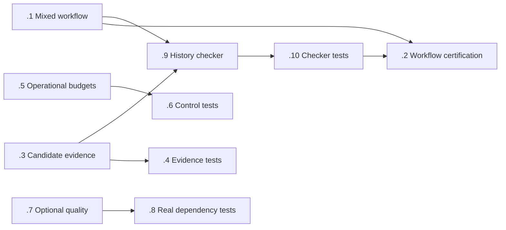
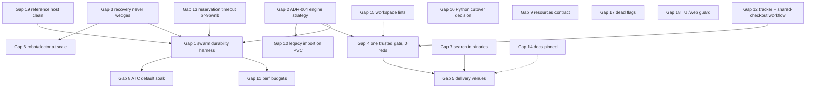

# Bridge Plan: MCP Agent Mail (Rust)

## November 10 production deadline follow-through — EmeraldEagle / br-asldx

- [x] Verify governing-file hashes unchanged, preserve the seven peer roots and
  inspect the ready Beads queue. The top checksum P0 requires the canonical DSR
  publisher and committed/pushed ACFS raw-installer authority, beyond optional
  Actions dispatch. Leave it open; no release, tag or downstream change here.
- [x] Fresh-review the previous archive/fixture fixes and the incoming serving
  readiness code. Strict production check of committed 87cc2575 fails 101 on
  three new Budget::with_deadline_secs calls. The name exists on mail_ui's local
  helper, not on the imported Asupersync 0.5 Budget. Preserve the failed receipt;
  an initial clean-overlay invocation also refused before work for its missing
  explicit --no-overlay argument.
- [x] Use the actual pinned Budget::new().with_timeout(wall_now(), duration)
  API at all three production call sites. Keep the original 1s serving probe,
  2s lexical observation and 2s quick-startup limits, default budget dimensions
  and caller-owned runtime context. The suggested with_deadline_at_secs API is
  absolute process time and would expire immediately in a long-lived server.
- [x] Run separate production and all-targets workspace checks, strict
  Clippy, formatting and stock full-file UBS on the repaired source.
  Final formatted source ebd8ba3f / lock208ea862 passes default production
  0/93.8s on vmi1227854, fingerprint ccdd59d5323f0d992923dc738d69a49857eaaca696ef142eb1f0262e2a00ff2d.
  Standalone fmt0 and full-file stock UBS0/status ok/no failed modules,
  0 critical/3560 warning/1839 info. All-targets first refuses disk admission120
  before Cargo on vmi1153651; fresh accounting finds vmi1152480 unreserved and
  admits an unchanged retry, which passes 0/614.1s. Strict Clippy exposes eight
  DB errors, then four server errors after the DB corrections; retain both
  actual 101 receipts. These earlier successes qualify their recorded bytes,
  not the following expanded four-file repair.
- [x] Read every Clippy finding before editing. Preserve short-circuit lexical
  maintenance, write notification data directly into its String, check the
  test duration subtraction and move its last-used config. Separate four doc
  opening paragraphs, preserve named cursor values and the benchmark count,
  and retain the migration rerun's empty-result invariant. No suppression,
  timeout, feature, ignored case, assertion relaxation or workload reduction.
- [x] Tighten same_owned_creation_sql: distinct strings with two missing CREATE
  prefixes cannot compare equal. Retain exact authored SQL and SQLite's narrow
  IF NOT EXISTS normalization. Add a regression for the real owned sender
  index, altered columns/uniqueness/predicate and the missing-prefix pair.
  Current production callers already supply authored CREATE constants; do not
  portray the helper boundary defect as a demonstrated live migration bypass.
- [x] Run the final four-file static checks against base 87cc2575. The exact
  hashes are retained in next-final-source-hashes.txt under the existing
  /data/tmp/am-archive-reader-20261110.t7ueMuTt receipt root. Final fmt passes0;
  full DB stock scans complete with no failed modules: schema0/944/105,
  response0/250/20, service1/1120/295 (critical/warning/info). The service
  critical is the preexisting query typo token "form:BlueLake", not a secret;
  retain it without suppression, and do not claim all stock UBS scans green.
  Final server stock scan0/3561/1838, no failed modules. Changed-line alerts
  are test assertions and the checked duration's expect, reviewed in context.
  Final exact-source all-targets0/218.8s, default production0/111.3s and strict
  Clippy0/150.0s share fingerprint
  c0cf66072498aa7e82475977a2e7f9d66af2be577d81c03ea8a2fbc133116ec8.
  A prior expanded all-targets request refused120 on vmi1152480 before Cargo;
  the successful final-source request used admissible vmi1227854. The stock
  service scan remains non-green; running the scan does not waive its result.
- [x] Check the actual portable production graph too: default-source success
  does not establish that the no-default-features/portable release graph builds.
  Preserve all existing default-graph gates and report the portable result
  separately, without claiming packaged release or cross-platform qualification.
  Final portable graph passes0/189.9s on vmi1227854, same c0cf6607 fingerprint.
- [ ] Execute the real readiness/search/migration regressions plus the complete
  previously selected population. Predeclare namespaces before execution, retain
  existing ignored benchmarks as unqualified, and keep actual 1800s/per-test240s
  and native30GiB growth/10GiB floor. Compile-only preparation earns zero bodies.
  Old one-file preparation finishes0/1173.2s; the final four-file execution
  request refuses120 before Cargo because another live worker reservation
  consumes protected capacity. Preserve it, retry only when admissible, and
  never claim preparation as test execution or relax native disk fencing.
  Fresh accounting finds vmi1149989 unreserved with positive native headroom;
  the unchanged final-source actual request is admitted and compiling there.
  That cold run reaches its actual1800s deadline and terminates137/1803.672s
  during compilation, zero bodies. Retain next-final-native-retry.log; disk
  usage reports peak growth1126486016 bytes, incomplete, not a pass or OOM
  diagnosis. Its last protected probe before termination showed free42775887872
  bytes, below the fixed floor+growth threshold for another native request;
  this is not a post-termination admission result. Fresh accounting finds vmi1227854
  admissible (free94290767872, existing reservation19327352832 bytes); request
  the same final four-file compile-only preparation there with14400s. This
  longer preparation limit does not change actual1800s/per-test240s execution.
  First preparation request exits2 before compilation: --no-fail-fast conflicts
  with --no-run. Retain it and use the previously validated preparation flag
  form, --no-run -E; execution-only flags stay on the eventual actual command.
  Corrected preparation completes0/7636.9s, zero bodies. Actual execution then
  finishes100: 805 executed, 785 passed, 20 failed, 8750 skipped, 330.607s;
  next-final-native-vmi1227854.log retains run5867479e-bd34-4a24-a720-fd114f83dcf8.
  Those failures keep this item open and supersede any inference from static
  checks. No deadline, resource fence or selected case was reduced.
- [x] Trace all 20 failures into five concrete groups. Preserve their receipts:
  four pool assertions compare randomized HashMap Debug ordering; the migration
  witness inserts unreferenced metadata intentionally excluded by v36; thirteen
  readiness paths reject a legitimate absent lazy generation token; one repair
  reuses a marker after index-prefix loss; one mail UI fixture lacks a running
  executor for actual search work. The UI cause remains a hypothesis pending
  its native replay; do not call it fixed on code inspection alone.
- [x] Repair production readiness to preserve optional source identity without
  minting a generation in a read-only probe. Keep actual file/memory identity,
  lexical clocks and serving-pool ownership; assert the token stays unseeded
  across the real probe. Recheck every changed observer/revoker call site.
- [x] Verify committed prefix coverage before marker resume and final count/max
  coverage before certification. Keep cancellation and proof revocation intact.
  Strengthen failed-repair retry with actual searchable-content readback; add
  paired intact/damaged-prefix cases with a real live-indexed tail masking loss.
- [x] Repair defective test witnesses without losing state assertions: compare
  ordered column metadata and typed cells, check both row lookup APIs, preserve
  all original pool assertions, and add eleven real transactional mutations
  with exact rollback checks. Keep the migration's positive projection witness
  by inserting an actual message and separately assert irrelevant metadata
  leaves revision zero. Drive synchronous UI fixtures with a real runtime;
  preserve their 60s context budget and all existing link assertions.
- [ ] Requalify the expanded seven-file source, frozen separately in
  next-repaired-source-hashes.txt. Rerun required compiler graphs, strict
  Clippy, fmt and stock scans, then all original805 cases plus both new real
  regressions. Compare actual test identities to the prior338 and C0 population;
  compile preparation, skipped benchmarks and historical passes cannot substitute.
  This intermediate38d01b85 source passes production0/617.6s and all-targets
  0/522.3s, but the next fresh review finds an additional production clock bug.
  Preserve those receipts as historical source qualification, not final passes.
- [x] Follow the cancelled UI search into request_budget_remaining_ms. The
  speculative undriven-fixture diagnosis above was wrong: search compared
  process-relative Asupersync deadlines against Unix epoch time and rejected
  valid timed requests immediately. Read the exact pinned wall_now/Cx::now
  implementation, use the caller's Cx clock, and restore the original UI helper
  byte-for-byte. Add a real runtime deadline admission regression, preserving
  expired-deadline tests, cost minima, zero-quota rejection and every timeout.
- [ ] Freeze and requalify the resulting six-file clock repair separately in
  next-clock-source-hashes.txt, including all original805 cases and three new
  regressions. Do not overwrite the intermediate seven-file manifest/receipts.
  Final fingerprint be2677f3526cd14122c711a433e7473f4fb2d11dd89ea95af0a970d099e7c0ef
  passes production0/197.8s, all-targets0/207.1s and portable production0/259.2s.
  The fmt0 claim here was later disproved (see correction below). Stock service
  scan1/1129/295 still flags only the existing typo
  fixture. The other five source files retain their individually scanned bytes.
  First final Clippy request refuses103 before Cargo for a stale worker capacity
  sample; probe succeeds and unchanged strict retry is admitted. Preserve both.
  Retry then refuses disk admission120 before Cargo; no fence changed. Fresh
  protected-capacity accounting and completion of the intermediate native job
  allow strict Clippy on vmi1227854:0/286.0s, same final fingerprint.
  Intermediate native preparation finishes0/2237.7s, zero bodies. A final hz2
  preparation unexpectedly rebuilds dependencies despite its historical cache;
  source/lock hashes match. Preserve the cold attempt and correct the unverified
  warm-cache description. Preview the exact owned build, follow its wrapper
  ownership guard, cooperatively cancel only rchw-a89644e2-01d3-41d5-a066-cc46e237d351
  (terminal143, zero bodies), and start the identical final preparation on the
  freshly refreshed vmi1227854 cache. No foreign job, artifact or ledger touched.
- [x] Correct the masked formatting result: the chained clock-fmt/diff/diff-check
  command returned the last command's0 while fmt actually emitted an import-order
  diff. Standalone replay exits1. Acknowledge the inaccurate fmt0/all-static-green
  report, retain both receipts, manually reorder only the two Asupersync imports,
  and observe standalone formatted-source fmt0. The rebuild cost is our avoidable
  diagnostic error, not an environment failure. No gate or assertion changes.
- [ ] Qualify the actual formatted six-file source recorded separately in
  next-formatted-source-hashes.txt. Positively identify our superseded preparation
  by its exact command, timestamp, lease and process-birth identity; cooperatively
  cancel only rchw-5c5b7d1f-0884-4e71-a0e6-31bd854ca4a0 (terminal143, zero bodies).
  Preserve the117 preexisting malformed RCH journals. Re-run standalone compiler
  gates and full original805+three native regressions on formatted bytes, without
  treating the pre-format packets as final-source passes. Preparation is now on
  vmi1227854; compiler checks use separately admissible hz2, same gate parameters.
- [ ] Trace any native failures to their cause without weakening assertions,
  fixture workloads, deadlines, resource fences or production guards.
- [ ] Re-read the final source and failure paths again; record exact-source
  evidence in br-asldx while leaving original readiness/control acceptance open.
- [ ] Verify tracker equality and acyclic dependencies; prepare owned changes
  for normal publication. Report actual push/reservation outcomes in handoff.

## November 10 mail UI fixture isolation — EmeraldEagle / br-asldx

This section records the earlier mail UI repair; the production deadline
follow-through above is current. The qualification checklists below are retained
historical checkpoints. The reader repair and every originally selected test
remain in the current selection.

- [x] Follow the real default-storage resolver: the generic mail UI helper
  creates distinct database files directly in the same temporary directory,
  but leaves storage_root unset. Ephemeral rerouting hashes that common parent,
  so even the isolated-home wrapper can give unrelated fixtures one archive.
  The earlier 12s acquire failure cannot be attributed solely to runtime context.
- [x] Bind each helper pool to an explicit archive path derived from its unique
  database filename. Add a two-real-pool regression with auto ephemeral mode
  and a private ephemeral base, so the old namespace collision is deterministic
  and the regression itself cannot touch an operator archive. Retain real pool
  initialization and all existing fixture data, comparisons and timeouts.
- [x] Repair two incoming benchmark formatting hunks manually; standalone fmt
  now exits 0. No benchmark body, assertion or ignore attribute changed.
- [x] Collect old af110866 compile-only preparation: 0/7542.5s on vmi1149989,
  fingerprint fe0d5151, zero bodies. Disable its automatic actual run before
  execution after discovering the shared fixture namespace. This preparation
  is useful compilation evidence only, not a pass for 180 cases.
- [x] Freeze the repaired integration graph at base af110866 plus seven explicit
  source overlays (the later peer changes plus the helper repair). Exact paths
  and SHA-256 values are retained in isolation-source-hashes.txt under
  /data/tmp/am-archive-reader-20261110.t7ueMuTt. Parent mail_ui 827e1ea3,
  unified afb330f1, unchanged reconstruction 6bb15508 / schedule 3d1b2dbc /
  lock 208ea862. The pool is pinned Git c9967106, not its registry namesake;
  verify its actual constructor/acquire implementation before using that review.
- [x] Expand the native selection before execution to the entire mail_ui
  namespace because the changed helper serves all its callers. Keep full
  reconstruction, original startup 12, full schedule 8, error classification
  and orphan inventory. Source attributes predict 338 active cases before
  platform cfg; the compiled runner count is authoritative. The existing
  ignored issue-382 large benchmark remains unqualified, not counted as a pass.
- [x] Run stock UBS on all seven overlaid files, no failed modules or suppression.
  Pool 0/4847/2306; queries 0/4159/652; mail_ui 5/826/342 (exit 1, the same
  timestamp-based fixture-name alerts); unified 0/277/31; storage 0/4916/1236;
  build_slots 0/421/157; messaging 0/1314/439. Counts are critical/warning/info;
  this is not an expanded-UBS-green or release-clearance claim.
- [x] Complete both required workspace graphs and strict Clippy for these new
  bytes. Initial requests used an unsupported --overlay spelling and exited 2
  before work; correct to the documented --overlay-path, retaining both logs.
  All-targets compiles on vmi1152480. Production refuses disk admission 120 on
  vmi1153651 before Cargo, started:false; retry on newly admissible vmi1227854.
  Repaired all-targets passes 0/570.5s and production retry passes 0/628.6s.
  Both bind identical overlay fingerprint
  933965b51d27906b4ae2661b4c2cd0e858d08ede883f0a0cf462c2bb605a2b09.
  Clippy first refuses disk admission 120 before Cargo on vmi1152480; after
  production finishes, request unchanged strict Clippy on vmi1227854.
  That retry passes 0/524.3s with the same 933965b5 fingerprint. All three
  required static graphs and standalone fmt now pass for the repaired packet.
- [x] Prepare then execute the full repaired native selection under strict RCH.
  Default features, dev.debug=0, one compiler job (within previous maximum 2),
  native 30 GiB growth / 10 GiB floor, actual 1800s / per-test 240s unchanged.
  The vmi1149989 preparation request refuses 103 for occupied slots; fresh
  protected accounting finds hz2 healthy with zero reservations and positive
  headroom, so request the same compile-only 14400s preparation there.
  Preparation completes 0/5240.0s with zero test bodies. Actual execution runs
  all 338 selected cases in 70.540s: 337 pass, one existing cancellation fixture
  fails its readback with 503. Both the isolation regression and previously
  failing real migrated-mailbox collector pass. Retain the native exit 100;
  9194 outside/ignored cases are not passes.
- [x] Trace that remaining failure through the pinned SQLModel acquire path:
  its timer intentionally observes the ambient cancellation context. The test
  cancels its write request, then tries to read with another explicit Cx while
  leaving the cancelled request installed. Use a fresh runtime request and a
  scoped ambient guard for the actual readback, restoring the cancelled write
  context before the existing ambient-identity assertions. Preserve the write,
  cancellation, persisted-row and context assertions; no production guard or
  timeout changed. Updated parent mail_ui hash aeb3ffa0; other source paths/lock
  unchanged. context-source-hashes.txt records the exact bytes.
- [x] Re-execute the same 338-case native selection after this correction, with
  the original actual 1800s / per-test 240s bounds. hz2 passes 0/642.3s overall:
  338/338 in 68.915s, 9194 outside/ignored cases not claimed. Both fixture cases,
  real migrated-mailbox collector, migration controls and four leaf cases pass.
  Final fingerprint b3f65fdad8e36facb069125a60c237d2d3754d9f8d2b28781f7bb4f2fdfd80e6.
  Keep the 933965b5 receipts historical, including the real native failure.
- [x] Finish both workspace graphs and strict Clippy on these final bytes.
  Standalone fmt is 0; changed mail_ui stock UBS is 1, status ok/no failed
  modules, 5/826/343. The five unchanged test-name alerts remain reported;
  the added info finding is the required scoped context clone. Other six
  source files retain their unchanged full-file scan results above.
  All-targets passes 0/745.6s on vmi1153651 with fingerprint b3f65fda.
  An unnecessary one-job/debug=0 production-check variant caused a cold
  rebuild; restore the exact standard command rather than spend more time on
  that variant. The first standard request refuses 103 before Cargo for
  critical memory pressure. Cooperatively cancel only the verified owned
  variant wrapper rchw-299c52cf-5411-45e7-9074-c9fe26b34514, build
  30097323753210610: local 143, daemon earlier 130, recovered delivery 120,
  terminal acknowledged. None is a check pass. Standard production retry now
  uses its previous worker/cache on vmi1227854; strict Clippy runs on vmi1149989.
  Collect both terminal results: standard production 0/118.5s, strict Clippy
  0/659.1s. Both bind the same b3f65fda packet as all-targets and native 338/338.
- [x] Fresh-review the final bytes/outcomes and record Bead comment 4221 without
  closing original readiness/control acceptance. Both tracker stores contain
  2867 unique equal records; only br-asldx comments/updated_at differ from HEAD.
  Status remains in_progress and the active dependency graph has zero cycles.
  Hashes and diff checks pass; prepare only the five owned source/tracker/TODO
  paths for publication. No peer untracked root is staged or removed.
- [x] Inspect incoming publication overlap: four peer commits through b7c57e1b
  add readiness/search/large-mailbox qualification work, with no file deletions.
  The only dirty overlap is unified.rs, whose two formatting hunks are identical.
  Preserve those commits through a normal merge; the frozen b3f65fda results
  do not qualify their newer source. Publication and exact lease-release outcomes
  are reported after they happen in the session handoff.
- [x] Collect post-merge formatting failure (54 hunks in incoming server lib.rs).
  Manually apply only those formatter suggestions, with one helper assigned the
  disjoint tail per AGENTS.md's parallel-simple-edits instruction. Parent then
  re-runs whole-workspace fmt: 0. The complete file matches a read-only canonical
  rendering of committed merge 525c7358 byte for byte (SHA-256 6bc10011).
  All assertions, fixtures, literals, limits and ignore attributes remain intact;
  no code-changing script or formatter write was used. Full-file stock UBS is 0,
  status ok/no failed modules, 0 critical/3560 warning/1839 info. Detailed results
  are retained in publish-ubs-server-lib.json. These are
  formatting/scan results, not new native qualification of peer behavior.

## November 10 final source qualification — EmeraldEagle / br-asldx

Frozen target: af110866db204319191a24c8e50c80a320c15eea, lock 208ea862.
The older receipts below retain their original source scope.

- [x] Re-read the reader repair, its callers, four regressions and migration
  setup again. Combined reconstruction 6bb15508 passed all 139 cases; the
  expanded server run executed 37, passed 36 and exposed the live fixture's
  first-acquire timeout. The runtime-context correction remains unproven natively.
- [x] Preserve shared work after another process committed/reorganized history.
  Our original 1c2bb22c survives at refs/retained/am-reader-1c2bb22c; its reader
  repair is now bcd46ba9. No reset, stash, force push or peer edit reversal.
  Source hashes remain reconstruction 6bb15508 / unified b96821de /
  schedule 3d1b2dbc, but error.rs, queries.rs, mail_ui.rs and storage/lib.rs
  have changed upstream. Old a5571948 graph receipts do not qualify this graph.
- [x] Review those four incoming diffs, including lifecycle refusal/extension
  handling, retryable-error precedence, orphan-reference deduplication and
  canonical-file probing. Stock full-file UBS reports no failed modules:
  error 0/274/36, queries 0/4134/651, mail_ui 5/824/342, storage 0/4860/1220
  (critical/warning/info). All five critical alerts refer to timestamp-based
  private test fixture names, not credential generation. They remain reported;
  no suppression or claim that the expanded scan is green. Final fmt exits 0.
- [x] Retain and reconcile the older native attempts. The original 37-case
  actual run with one compiler job reached its unchanged 1800s deadline:
  exit 137, complete:false, zero bodies. Official recovery acknowledges 137.
  One compiler job stayed within the prior maximum of two, without changing
  disk growth/floor, runtime parallelism, cases or per-test bounds. The cold
  compile-only a5571948 fallback was superseded by af110866 and cooperatively
  cancelled through its exact owned RCH wrapper: local 143, daemon earlier
  130, recovered delivery 120; acknowledged, zero bodies, no pass credit.
- [x] Predeclare the frozen native population before execution: reconstruction
  139 + original startup 12 + unified 17 + schedule 8 + error classification 1
  + UI error contracts 2 + existing orphan-inventory regression 1 = 180.
  The prior 179-case preparation refused before Cargo; adding the last case
  follows the newly reviewed queries diff, with no original case removed.
- [ ] Complete strict compile-only preparation of those 180 cases, then actual
  execution with original 1800s command / 240s per-test limits. Default features,
  dev.debug=0, maximum one compiler job, 30 GiB growth / 10 GiB floor retained.
  Initial af110866 preparation refused disk admission 120; production refused
  unfinished source ownership 103; all-targets refused disk admission 103.
  Both exact owned obsolete wrappers are now recovered. Fresh protected disk
  accounting permits a new preparation on vmi1149989; af110-prepare-180.log
  records that request, with no execution credit until bodies actually run.
  Terminal preparation is 0/7542.5s, zero bodies. Actual execution is superseded
  by the discovered helper-isolation defect and broader repaired selection above.
- [x] Complete af110866 production graph, all-targets graph and strict Clippy.
  Production retry passes 0/592.3s on vmi1152480; all-targets passes 0/641.0s
  on vmi1153651. Both bind clean base af110866, fingerprint
  fe0d5151031be8fda7951fe7fe1f42f7ce344018fdb3ed21e6ada866b230b195,
  tree 9b7720a661a95b56ecb9194c962f2282f8c4592b. Strict Clippy passes
  0/564.1s on vmi1152480 with that same clean-base identity.
  The a5571948 runtime-context overlay had passed all three static gates;
  those results remain historical, not substitutes for the frozen new graph.
- [ ] Record final native/static outcomes and fresh-review disposition, update
  br-asldx without closing unmet readiness/benchmark acceptance, verify equal
  tracker stores and an acyclic graph, publish normally and release exact leases.
- [x] Preserve four later peer commits (84c46ead through ba2f560e) after a fresh
  read of their five-file diff and a dirty-overlap/deletion check. These change
  the runtime dependency graph and unified collector. Frozen af110866 native
  preparation continues; its eventual result will not qualify these newer bytes.
  Another process advanced/published the shared checkout through c0816cf4,
  including this record's earlier checkpoint. No Git rewrite or duplicate
  merge performed here; import tracker truth after observing that advance.

## November 10 archive reader follow-through — EmeraldEagle / br-asldx

- [x] Verify unchanged governing docs and tracked 91fb1340; preserve seven
  peer roots. Re-read timing/fixture callers and measured inventory/floor paths.
- [x] Find a concrete adjacent gap: capped archive reads still follow leaf
  links and can block on a FIFO. Project identity inventory calls this seam
  without even a prior leaf check. Existing regular-file/no-follow opener is
  already implemented and used by the strict ID-floor reader.
- [x] Wire that existing opener into the shared capped reader, preserving
  the inclusive 64 MiB limit, UTF-8 validation, parsing and skip accounting.
  This guards leaves only; ancestor/directory binding remains br-xzgcj scope.
- [x] Execute real regular/empty/Unicode/missing/invalid-UTF8/cap-boundary,
  linked-project identity and writerless-FIFO regressions. The FIFO case uses
  an exact-one-test child and 5s watchdog; actual native 240s bounds stay intact.
  All four new cases pass in the full V1 module run.
- [x] Diagnose that full run's existing fixture failure: 133/134 pass;
  pre-v33 rollback setup excludes v34 but accidentally installs dependent v35.
  Truncate the fixture at v33's position, preserving every rollback/retry
  assertion and the separate real mixed-epoch refusal control. No production
  migration guard changes. V2 reruns the same full 134-case namespace.
  V2 finishes 0/388.7s on hz2: 134/134 pass in 10.980s, 3823 outside the
  selected namespace. Both migration controls and all four new cases pass.
- [x] Run retained inventory/symlink recovery cases and the original 12 startup
  cases on these new bytes. Old V5 green remains historical for the old source.
  Final V2 startup 0/428.1s on hz4: 12/12 pass in 8.782s, 5516 outside the
  selection. Persisted 100/10000 fixtures retain content/recipient/parity checks.
- [x] Complete both required workspace compiler graphs, strict Clippy, fmt
  and stock UBS; retain every failed/intermediate receipt without weakening.
  V1 source f8a6eaee / lock 208ea862, base 91fb1340 plus only reconstruct.rs,
  overlay9381d15d50a1e8d996dcb7c5c0ace10f6db48222c629dc07df4feb4c71eab9a5:
  production 0/622.0s (vmi1149989), all-targets 0/723.8s and strict
  Clippy 0/300.5s (vmi1153651), fmt 0.
  Stock one-file UBS 0: critical 0 / warning 1906 / info 689, failed modules 0;
  baseline 0/1875/670. Added warnings are test assertions/unwraps; no suppression.
  V2 source 488302b3 changes only the historical test setup after V1;
  overlay dea45c855b67385815c5a3427279ee1992f49f3f9e78f729e73ed04b04dcfd6a:
  fmt and UBS pass unchanged counts; all-targets 0/240.4s on vmi1153651 and
  production 0/546.8s on vmi1149989. Clippy queues out 103 before Cargo on
  vmi1153651; unchanged retry passes 0/733.7s on vmi1149989.
  First native preparation refuses 120 before Cargo on vmi1227854; hz2
  preparation completes 0/2348.9s with zero bodies. Actual execution initially
  refuses 120 because other live builds hold disk reservations. Recompute
  protected headroom after one finishes, then run the unchanged population:
  134 executed, 133 passed, one fixture failure above. Keep both refusals.
  Preparation 14400s earns no bodies; actual 1800s / 240s remain unchanged.
- [ ] Fresh-review reader, callers and tests again; mark actual Bead progress,
  verify tracker/DAG, synchronize normally and release only owned leases.
- [ ] Integrate seven incoming peer commits through a normal preserving merge.
  Fresh fetch finds origin/main at a5571948, seven commits ahead of base 91fb1340;
  peer frontmatter-only inventory reads complement the full-artifact reader fix.
  Requalify the combined source before the final publication claim.
  Source commit 1c2bb22c is preserved; normal merge has no conflict or deletion.
  Combined source 6bb15508 / unchanged lock 208ea862, base a5571948 plus only
  reconstruct.rs, overlay 01f5e0b97b4e74ecf544d2341f0969be6b938b754737a60c18daaf5239e0e81f.
  Combined production 0/196.5s and all-targets 0/206.6s; fmt 0; stock UBS 0,
  critical 0 / warning 1956 / info 708, failed modules 0. New production
  findings are bounded append-only slicing, bounded usize-to-u64 length and
  error-only formatting; remaining additions are the peer tests, no suppression.
  Combined native 139-case attempt refuses 103 before Cargo on hz2 at critical
  memory pressure; read-only disk accounting is also negative. After the
  12-case server job finishes, use that worker for the same full namespace.
  Combined startup finishes 0/456.5s on hz4: 12/12 pass in 25.132s, 5519
  outside the selection. Combined Clippy initially refuses disk admission 120
  on vmi1153651, started:false; unchanged retry compiles on vmi1149989.
- [x] Fix the combined Clippy 101's four real test lints without suppression:
  three empty-value assertions in unified inbox tests become diagnostic equality
  assertions; retention's test-only minute remainder uses checked subtraction
  with the same expected delay. Production behavior and assertions are preserved.
  Reserve only those two additional files; retain the failed receipt and the
  initial formatting diff, then manually match rustfmt (final fmt 0).
- [ ] Qualify final server test files (unified f07deff5, schedule 3d1b2dbc) with
  unchanged reconstruction 6bb15508 / lock 208ea862: both workspace graphs,
  strict Clippy, full-file UBS and the original 12 startup cases plus all 17
  unified-inbox and 8 retention-schedule tests (37 expected). The earlier
  33-case estimate missed four entries in a truncated listing; corrected from
  the full source before execution, with whole-module filters unchanged.
  Final production 0/100.1s, all-targets 0/154.8s and strict Clippy 0/109.9s,
  three-file overlay f5dc3b4812a3bf13815b0798c80edbb5d5df4d7e0009ad4b09829c4229843506.
  Full-file UBS: reconstruction 0/1956/708, unified 0/175/19, schedule 0/41/5;
  all status ok / failed modules 0 / no suppression. Unified baseline has
  identical counts; schedule gains one expected test-only checked-sub expect.
  Reconstruction's
  same 139-case module/source continues on hz4; the server tests are downstream.
  That native module finishes 0/1441.6s: 139/139 pass in 12.146s, 3845 outside
  the namespace. All four new reader cases, both migration controls and the
  peer prefix-reader cases pass. Original 1800s/240s limits remain intact.
  First 37-case request refuses disk admission 120 before Cargo; zero executed.
  A progress update initially described executable preparation too early;
  corrected explicitly. Fresh read-only accounting then finds hz4 reservations
  gone and positive protected headroom; retry the unchanged 37-case selection.
- [x] Execute that selection: 37 ran, 36 passed, one live-collector case failed
  before seeding while acquiring its first real pool connection (12s timeout).
  Retain final-server-37-retry.log. Its runtime existed, but the caller used a
  detached Cx::for_testing and fastmcp polling instead of the native owner.
- [ ] Qualify the runtime-context repair in that same real-mailbox test:
  mint the context from its existing runtime, install it for synchronous UI DB
  calls, and drive first acquire with runtime.block_on. Keep all mailbox data,
  original/reference comparisons, pool timeout and native 1800s/240s limits.
  Registry Asupersync 0.5 Cx::for_testing already uses Budget::INFINITE; the
  explicit native budget does not widen it. Final unified source b96821de;
  reconstruction 6bb15508, schedule 3d1b2dbc and lock 208ea862 are unchanged.
  Native request refuses disk admission 120 before Cargo; final fmt 0 and
  UBS 0/175/20 pass (no suppression). All-targets refuses critical-memory
  admission 103 on vmi1153651. Production starts on vmi1149989; read-only
  accounting finds vmi1152480 admissible and strict Clippy is requested there.
  Final context revision: production 0/650.0s (vmi1149989), strict Clippy
  0/572.6s (vmi1152480), three-file overlay
  1f970db6ddc1ee18d87393099a650e3b8bb22a1543652796fbc6de02a8c4dce9.
  All-targets retry is requested on the now-freed Clippy worker. Native remains
  pending: fresh accounting still finds no admissible tested native worker;
  hz4 now has one other project's live reservation. No guard/ledger/cache change.
  All-targets retry finishes 0/205.8s on vmi1152480. Thus all mandatory static
  checks pass for this context revision. Compile-only preparation of the exact
  37-case selection starts on newly admissible vmi1149989, preparation 14400s
  only; actual 1800s/240s remains required. It earns zero bodies. Later headroom
  improves on hz4; the unchanged actual run is queued there, not yet executing.
  Exact fallback wrapper rchw-edf9f82c-5ce9-4e93-aba0-3bb7854815b1 was matched
  to its live PID, project, worker and full --no-run argv. If actual proof
  succeeds first, cancel only that redundant owned preparation through RCH.
- [ ] Original bounded-readiness and two-size/control benchmark remain open;
  this is a reliability integration, not a measured speedup or combined scan.

## November 9 native startup follow-through — EmeraldEagle / br-asldx

- [x] Verify unchanged governing docs and clean tracked348aded6; reread the
  timing producer, retained-mail fixture, child runner and error-priority fix.
  No additional functional defect identified; preserve seven peer roots.
- [x] Read the actual RCH disk-admission implementation. It protects every
  live process-group reservation as well as the floor; raw free disk alone
  does not establish admission. No policy, worker config or ledger mutation.
- [x] Observe materially increased hz2 headroom (about84GiB versus the prior
  54,348,029,952-byte refusal). Reserve only the two source files, existing
  TODO and exact tracker paths. Frozen V5 startup5e2c4458/lib88ca3c0a/lock208ea862
  is unchanged; retain its completed compiler/Clippy/fmt/UBS evidence.
- [x] Complete strict RCH compile-only preparation of the unchanged12-case
  selection, default features/build-jobs2/dev.debug0, preparation14400s and
  original30GiB growth/10GiB floor. Preparation earns zero executed bodies.
  hz2's queue expired before Cargo. Read-only live-reservation accounting
  identified vmi1227854; its unchanged request passed disk admission and
  began compiling at22:47UTC. It completed0/3655.1s at23:47UTC, with zero
  executed bodies and final overlay7383d498. Retain both preparation logs in
  /data/tmp/am-startup-native-20261109.qSAd95rF.
- [x] Execute that exact selection with actual-run1800s/per-test240s unchanged.
  Preserve every refusal or failure; fix actual defects without narrowing the
  selection, fixture sizes, assertions or resource fences.
  Actual execution0/69.7s on vmi1227854:12 tests ran and passed in10.106s;
  5516 filtered. native-v5.log binds the same final overlay7383d498.
- [x] Verify persisted100/10000 retained totals/parity and every phase before
  interpreting costs. Record source-bound results; no listener-readiness or
  speedup claim. A safe source optimization still needs qualification below.
  Both fixtures pass all11 phases and runtime-engine message/body/recipient
  totals plus archive parity. Initial preparation104835/2235756us; integrity
  103180/2232474us; archive-preflight657/1540us. Integrity is the measured
  target, not the boot archive check. Its DB check, drift inventory and strict
  ID-floor scan still need internal attribution before choosing a safe change.
- [x] Repeat the persisted case20 times, unchanged source and1800s/240s
  fences:20/20 pass,138.580s test time,215.8s RCH total. At100/10000 messages,
  median preparation108551.5/1819366.5us; ranges82659–284701/1601539–2419713us.
  Median integrity fractions98.31%/99.91%. Preserve baseline-summary.json
  and raw attribution-baseline-20.log. High variance and observed worker I/O
  pressure prevent a stable latency-comparison or speedup claim; tails at
  n=20 are descriptive/conservative, not service SLOs or release evidence.
- [x] Inspect a separately labelled syscall diagnostic, with data buffers
  suppressed and the original1800s/240s fences. Separate fixture construction
  from preparation; do not use tracer overhead as production latency.
  Traced case passes0/163.8s RCH,93.758s test time; syscall-summary.json aligns
  approximate preparation windows from the unique child stdout-write lengths
  and measured elapsed times. The100/10000 windows contain100+100/10000+10000
  canonical message opens: best-effort inventory and strict descriptor-relative
  floor scan. Both have4 clone3 calls. These are observed operation counts,
  not a native-wall attribution or reproduction/refutation of the old ts2 run.
  Keep the249535105-byte raw trace; read/write buffers were suppressed.
- [x] Bind actual executed ELF5dc219b2e4bdbc091c06807f803ff1a94ff3ca57a54634e7d068a8c20e78bb0b
  (351548544 bytes) via the running baseline's /proc/exe. Its .comment gives
  rustc1.100.0-nightly908501772/2026-08-30, matching declared nightly2026-08-31.
  fingerprint-host.json records hardware only: its default host compiler
  6eeff9a52/2026-09-23 is NOT the build compiler, and its root-directory
  git_sha:unknown/git_dirty:false says nothing about source cleanliness.
- [ ] Implement and qualify a safe readiness optimization. Candidate: share
  a complete strict archive traversal across inventory/floor consumers while
  preserving all directory/file generation, incomplete-read and ID-allocation
  protections. Never reuse the best-effort inventory as an authoritative floor.
  No source change or speedup has been earned by the diagnostic counts.
- [x] Fresh-review the frozen producer, fixture, child runner and adjacent
  consumers. No further source defect found or source edited in this turn;
  all original assertions and required final-byte checks remain intact.
- [x] Update the original Bead as4216, keepin_progress, flush tracker data and
  verify both stores equal2867 unique rows, cycles0; only .asldx comments and
  updated_at changed. Fresh fetch before the data-only checkpoint shows0/0
  against both remote branches. Ordinary Git and exact owned-lease outcomes
  finish after this checkpoint and are recorded in the retained audit/handoff.
- [ ] Original .asldx bounded-readiness and two-size/control acceptance stays
  open until its original positive conditions are actually met.

## November 9 persisted startup attribution continuation — EmeraldEagle / br-asldx

Historical pre-execution checkpoint below; superseded by the native run above.
Final V5 source passed both workspace compiler graphs, strict Clippy, formatting
and the full two-file UBS scan. At that checkpoint12 cases were selected but
none had executed; the persisted fixtures and measurements were still pending.
Source changes were committed by another process asf8ee1195 (notes8034bca7);
their file hashes match the receipts, and publication does not clear acceptance.

- [x] Verify unchanged governing-doc hashes and clean tracked baseline24b873d5;
  reread the complete timing diff, production logging and actual startup
  callers. Initial reread finds no further timing defect. Preserve seven peer roots.
- [x] Read current ready work and linked .eru3j mitigation. Its healthy-verdict
  reuse already exists; do not duplicate it or bypass the runtime-engine check.
- [x] Reserve the existing startup source, TODO and exact tracker paths;
  comment4213 keeps .asldx in_progress. Previous scratch logs are absent here;
  comment4212 remains historical, not freshly available verification evidence.
- [x] Author persisted fixtures of100 and10000 messages with full base schema,
  recipient rows, matching canonical archive files and a real Git commit.
  Canonical SQLite seeds only the fixtures; actual startup uses the runtime
  engine and original checks. Keep all fixture paths private.
- [x] Exercise actual prepare_http_startup, including abort-mode archive
  preflight, and capture every phase plus total preparation time. Verify
  message/recipient/body totals and archive parity after each preparation.
- [x] Run the original10 cases, attribution and extended error-summary case
  (12 total) through
  strict RCH. Keep command1800s/per-test240s and default feature/resource
  fences; separate any compile-only preparation from executed bodies.
- [ ] Use measured phase costs to select and qualify the next source optimization.
  Integrity is the measured target; duplicate archive reads are a candidate,
  with strict archive-floor semantics still requiring a preservation proof. Fixture
  construction warms OS caches; this measures preparation, not listener
  readiness, the original ts2 workload or an incumbent-relative speedup.
- [x] Fresh-read the fixture and consumer twice; formatting0 and stock full-file
  UBS0 (critical0/warning561/info296, failed modules0; baseline0/518/283).
  No suppression or exclusion. Source startup977ba38a, unchanged server-lib64993695
  and lock208ea862; base458c5dd6 plus the two server-file overlays binds V1.
- [x] Deeper adjacent review catches the HTTP-path priority key typo:
  http_path never matches the probe's http-path name. Correct the table and
  extend the existing error-summary regression with reordered fd-limit/path
  failures, preserving its original database-root-cause assertions.
  V3 formatted sourcea9d49efc passes fmt0/UBS0 (critical0/warning563/info297,
  failed modules0) and all-targets0/138.3s on vmi1227854, overlay9b21c21bdcb86a638246f36cd5cd9b540a8a8e691a7bbf337ecd79b7d7f4d880.
  Earlier977ba38a passes remain intermediate. Native selection adds the error-summary
  case to the original10 plus attribution case:12 bodies expected.
- [x] Review catches new fixture process-state isolation: prepare_http_startup
  installs global startup state, so private paths alone do not isolate parallel
  cargo test. Reuse the existing prepared-startup child runner from the sibling
  test module, with its original exact-one-test assertion; preserve successful
  child stderr too. V4 startup5e2c4458/libf4eab0ff/lock208ea862, fmt0.
  These intermediate bytes get their own gates; V3 production0/574.8s and
  all-targets0/138.3s remain intermediate. V4 native compile preparation is
  submitted on the now-finished production worker; all-targets submitted on
  the other finished worker, with all original resource fences unchanged.
- [x] V4 full two-file UBS0: critical0/warning3990/info2093, failed modules0;
  formatting0, production lib/bins0/134.1s and all-targets0/545.8s on vmi1152480,
  all at overlay27e62a27db18036a39c36b5ea6a973281fff695d0d8c4c5d85e30d7d8c14bf38.
  The receipt tree33bc7029 is the base tree, not a merged-overlay tree.
- [x] Final strict Clippy eventually passes below; retain the initial
  vmi1293453 scheduler refusal103 (requires37GiB, reports26GiB free).
  No guard/config/resource changes or local fallback.
- [x] Strict V4 Clippy actually runs and catches redundant_pub_crate on the
  new helper visibility. Use pub inside the private cfg(test) module, with no
  production API exposure or lint suppression. Final V5 startup5e2c4458,
  lib88ca3c0a and lock208ea862; fmt0/full two-file UBS0 (0/3990/2093, modules0)
  and strict Clippy0/124.4s on vmi1152480, overlay7383d49892d9330bfd7ce855953613b89060d6ed8fc04014a694cd475136bcfb.
  Preserve the V4 Clippy101 receipt and do not credit V4 compiler passes to V5.
- [x] V5 all-targets0/537.4s and separate production lib/bins0/505.8s on
  vmi1227854 bind the same final overlay7383d498. The first V5 production
  recheck refuses120 at protected disk admission, started:false/growth0;
  retain it. V4 passes remain earlier-source evidence.
- [x] Preserve the V4 zero-body checkpoint: preparation on vmi1152480 refuses120
  at disk admission; actual normal1800s run on hz4 refuses120 before Cargo
  because the disk monitor cannot complete its probe. started:false/growth0;
  its free_bytes:0 is an unavailable-probe sentinel, not measured free space.
  Preserve30GiB growth/10GiB floor and240s per-test limits. No more unchanged
  native attempts or claims of measured phase costs in that earlier work block.
- [x] Preserve the earlier hz2 V5 refusal: a newly freed worker allows one submission
  after an observed slot-state change; its disk guard still refuses120 before
  Cargo (free54,348,029,952 bytes; unchanged30GiB/10GiB fences). No bodies or
  timing measurements at that checkpoint. It prohibited further unchanged
  retries until capacity changed. The positive12-case result above supersedes
  runtime-pending status; original performance acceptance remains open.
- [x] Complete required V5 compiler gates; retain all intermediate receipts.
  Initial native hz4 and all-targets vmi1153651 requests refuse120 before Cargo
  at protected disk admission, started:false/growth0. Keep both receipts.
  Production queue expires103 with no execution. Strict Clippy0/730.4s on
  vmi1227854 binds overlay512013d11979a2fa13a3a8a2e2eb1f0753af15a30443ef9489fc089e6dd5cb83.
  V1 all-targets runs on that worker. Separate hz2 native compile preparation
  also queue-expires103 without Cargo/bodies. Keep14400s preparation deadlines
  distinct from actual1800s/per-test240s; no unchanged placement retry.
  V1 all-targets finishes0/250.0s. Final V3 Clippy refuses120 at protected disk
  admission; final production is actually compiling on vmi1152480. Keep the
  final-byte all-targets pass separate from the earlier-source Clippy pass.
- [x] Record terminal source-bound results as comment4214 on the original
  Bead; keep it in_progress. This is partial source work and compiler proof,
  not new positive runtime qualification. One bounded connected-mail search
  yields no new DSR publication-command input; no new publisher helper.
- [x] Flush and verify both tracker stores match2867 unique records and
  cycles0; only .asldx comments/timestamps changed since24b873d5. Prepare
  only the remaining notes/tracker checkpoint. Source already matches both
  remote branches before that checkpoint. Actual normal Git and exact
  owned-lease release outcomes are recorded in the retained audit/handoff.
- [ ] Remaining original acceptance: safely bounded size-proportional work
  and the original two-size/control readiness benchmark. No closure on an
  attribution fixture, selected tests or compiler receipts.

## November 9 startup latency attribution — EmeraldEagle / br-asldx

- [x] Verify governing-doc hashes, current diff and ready Beads. Do not
  reimplement already-present recovery or memory-health repairs. Claim the
  actual missing first step of .asldx: per-phase startup timing.
- [x] Reserve the two existing server files, TODO and exact tracker paths;
  baseline full-file UBS0, no critical findings. No new repository file.
- [x] Add structured startup_phase_started/startup_phase_finished events with
  static phase and measured duration_us around real HTTP/stdio probes, listener
  detection, cold-start backup rotation and archive preflight. Finish means
  returned, not healthy. Preserve order, results, handoff skips and budgets.
- [x] Add tests for elapsed work and error preservation; real cold-start probe order
  after a failed auth probe; listener handoff must emit no fake timings for
  deferred DB-lock/integrity/rotation work. Preserve existing assertions.
- [x] Isolate the existing listener-handoff test's default mailbox paths; all
  its original assertions remain. Add timing checks to the existing stdio case.
- [x] Document phase fields and finish/error semantics in the existing operator
  cookbook, before advice about skipping startup checks.
- [x] Fresh integration review catches a new wiring error: the initial custom
  trace target falls outside the production LOG_LEVEL crate-prefix filter,
  and RUST_LOG alone does not override that policy. Correct the target to
  mcp_agent_mail_server::startup, use LOG_LEVEL=info in the headless recipe,
  and derive the test subscriber's expected target from CARGO_CRATE_NAME so
  the original wrong target cannot pass through a permissive capture.
  Both executable entrypoints initialize their stderr logger before probes;
  the actual production crate-prefix filter admits the corrected INFO target.
- [x] Fresh-read implementation and callers twice; fmt0 before freezing the
  source overlay. A shared process commits identical source228898de while this
  pass runs; do not attribute that Git operation here. Startup SHA8b96cef6,
  server-lib64993695, unchanged lock208ea862; base458c5dd6 plus only those two
  Rust file overlays bind the checks. Evidence
  `/data/tmp/am-startup-timings-20261109.JldsIK9W/`.
  Those first compiler/preparation requests cover the initial target and are
  intermediate; final corrected bytes require their own compiler/native gates.
- [x] Strict Clippy catches the new fixed-size chunks_exact call. Use
  as_chunks::<2>() without a lint suppression; final startup SHAad3619dc,
  server-lib64993695 and lock208ea862. Final overlay8b831e5389617721e17f7722a1884456a6544c211c1a51b0065f2ef5549754a5
  binds base458c5dd6 plus the two Rust files. Keep the initial Clippy101 receipt.
- [x] Final-byte all-targets0 (135.2s, vmi1153651), production lib/bins0
  (48.4s, hz3), fmt0. Initial-source all-targets0/758.5s and production0/393.5s,
  corrected-target pre-lint-fix production0/54.7s remain separate evidence.
- [x] Final-source strict RCH native run0 (288.7s, hz4), same overlay8b831e53:
  10 selected bodies pass, 5517 other server-library tests filtered out. Includes
  six startup/timing/handoff cases and four existing archive-preflight modes.
  This is focused regression evidence, not a full workspace or release gate.
- [x] Final full-file UBS0: critical0/warning3945/info2079, failed modules0;
  baseline0/3922/2072. Corrected and final-v3 scans also exit0 with the same
  totals. No exclusions, suppression or assertion weakening.
- [x] Final strict Clippy0 (263.4s, vmi1153651) after a vmi1227854 disk-admission
  refusal120. The same command on the finished all-targets worker passes;
  no guard changes. All three final compiler receipts bind overlay8b831e53.
- [x] Initial-source native preparation finishes0 (2130.8s, hz4), zero bodies.
  No golden, feature or resource relaxation. The actual final-source run passes
  with the normal1800s command and240s per-test limits unchanged.
- [x] Record exact results as comment4212 on .asldx; keep it in_progress.
  This attribution step does not establish constant startup cost or a speedup.
- [ ] Remaining original acceptance: mailbox-size attribution, a bounded
  readiness implementation and the original two-size/control benchmark.
  Do not close the task on the selected native tests or compiler receipts.
- [x] Prepare the exact source/docs/tracker checkpoint: both JSONL stores
  match2867 unique records, only .asldx claim/comments/timestamps changed since
  base458c5dd6, cycles0 and whitespace0. Final source hashes still match the
  compiler/native receipts. Normal Git publication and exact owned-lease
  release outcomes are recorded in the retained audit and final handoff.

## November 9 fresh verification continuation — EmeraldEagle

- [x] Governing docs retain their fully read hashes. Fresh-read the complete
  source-container/test diff and earlier encrypted-export helper/test; no new
  functional defect found. Preserve the pending UBS commit exception.
- [x] Triage current ready work: highest P0 publication work still requires the
  actual publisher command. Recovery/reservation tasks already cite source
  implementation; do not duplicate it or close their retained qualification.
- [ ] Execute the frozen .ku0kl full docs_drift_ci native gate with strict RCH,
  basee7ffb20f/overlayf3ddaa87, both actual-run deadlines1800s and unchanged disk
  fences. A fresh attempt after two hours is admitted on hz4 and reaches the
  server crate but exceeds the configured deadline: terminal137
  after1803.2s, native body count0. Retain that failed receipt. Finish a separate
  --no-run preparation for the identical source/selection, both preparation
  deadlines14400s and the same feature/profile/disk fences; preparation never
  earns body credit. Then execute with both original1800s limits unchanged.
  Follow-up preparation also refuses120 at disk admission, started:false/growth0,
  free68,144,254,976 bytes. No further unchanged retry, placement experiment,
  resource reduction or native pass. Both selections still have zero bodies.
- [ ] Continue .qpacg's existing encrypted-export native unit qualification:
  compile-only preparation on vmi1152480, default features/build-jobs2/dev.debug0,
  both preparation deadlines14400s. Preparation earns zero body credit; actual
  execution retains both1800s, per-test240s and growth30GiB/floor10GiB. Require
  real age/age-keygen and preserve original export/output assertions. The full
  original native release populations and early-return counts remain open.
- [x] That fresh encrypted-export preparation refuses120 before Cargo,
  started:false/growth0 at45,245,517,824 free bytes; preserve the original
  30GiB/10GiB fences and do not retry unchanged. No tool installation or native
  body follows this refusal. Official age1.3.2 asset metadata was read only;
  the archive was not downloaded and its presence is not project proof.
- [x] A shared process commits the already-frozen patch as915b4cf8 during this
  pass. Docker6d3b95a9/testf6a29970/lib2514d5c0 remain unchanged. Do not attribute
  that Git operation here, amend it, or infer an answer to the pending UBS
  exception question. Current native request retains its exact frozen inputs.
- [x] Reread the full Dockerfile/workflow, changed test module and earlier
  doctor diagnostic diff. Fresh fmt0; full test-file UBS1 retains exactly the
  previous critical3/warning45/info112 with failed modules0 and identical critical
  rule/message pairs. No suppression, assertion or source change.
- [x] Two bounded read-only local history queries supply no publication-command
  evidence. Initial dynamic subprocess wrapper is blocked by DCG before any
  execution; explicit metadata-only queries need no bypass and return no entries.
  This does not identify the actual publisher or satisfy either release P0.
- [x] Second fresh review finds no additional functional bug; no source edit
  is justified by this pass. Preserve the frozen Docker/test/lib/lock bytes.
- [x] Record terminal comments4209 (.ku0kl)/4210 (.qpacg), retain failed attempts
  in `/data/tmp/am-fresh-review-20261109.KyjLiOdI/`. Both stores match2867 unique
  records; only those two Beads' comments/timestamps changed since915b4cf8,
  cycles0. Exact leases1307-1311 released at handoff; peer roots untouched.
- [x] Prepare the data-only verification checkpoint: exactly this TODO and
  both matching JSONL stores, no supported code changed. Fresh fetch confirms
  the shared source/notes commits already match both remote branches. This
  checkpoint does not clear the source UBS findings or infer an answer to the
  prior source-commit exception. Native/full-image/installer/publication
  acceptance remains open; final handoff records the actual Git outcome.

## November 9 source-container dependency closure — EmeraldEagle

Continue the highest-ranked ready `br-ku0kl`; preserve its full acceptance.

- [x] Fresh-read latest diagnostic/test changes; no additional bug found there.
  Inspect ready Beads and actual dependency consumers before choosing work.
- [x] Trace installed DSR quality to its registry reader: actual MCP dry-run
  refuses4 with zero checks, while checks in repos.d are not consumed. Keep
  actual publisher enforcement open; this discovery does not identify the
  maintainer's publication machine or prove a release transition.
- [x] Claim .ku0kl and reserve Dockerfile, workflow, existing regression tests,
  TODO and exact tracker paths. Current Cargo sources use no sibling checkout.
- [x] Remove both unused source-container sibling fetches and stale workflow
  inputs. Use locked Cargo builds; preserve the existing missing-path refusal.
- [x] Fresh review catches unnecessary duplication: remove the Docker pin,
  Python validator and added Python dependency. Cargo.toml/Cargo.lock already
  select dependencies. Retain all intermediate controls and the reproduced
  ASCII-locale failure in scratch evidence; they do not qualify the final code.
- [x] Replace the obsolete must-clone assertion with actual offline Cargo
  metadata inspection of workspace declarations against dist's immutable pin.
  This inspects declarations, not a resolved transitive graph. Extend the
  existing container contract guard with locked-build and obsolete-input
  requirements, including causal mutations dropping --locked or adding an ARG.
- [x] actionlint1.7.12 passes0 on unchanged workflowb4e7b12c. Existing shell
  path guard passes valid metadata and refuses a missing-sibling fixture.
  Read-only containers and every failed/intermediate receipt are retained.
  No complete Rust image build or image publication is claimed.
- [x] Final formatting, BuildKit check (no warnings), all-targets0 (42.9s),
  production lib/bins0 (17.4s), strict Clippy0 (64.4s). Compiler commands run
  through strict RCH on vmi1153651/hz3/vmi1227854 respectively, against exact
  final overlayf3ddaa878158cbdfeab2bef99bbb89b1545aa565fe58317c432d2725d7c79bd0.
  Final full-file UBS remains red1: critical3/warning45/info112, failed modules0.
  Critical rule/message multiset equals baseline; no suppressions or weakened
  test assertions. This is not a clean scanner gate or project-wide pass.
- [ ] Execute the complete existing docs_drift_ci native gate. Compiler
  preparation/blocked admission are not executed tests.
  Initial-source all-targets/production/Clippy finish0 at overlay16a35ef6;
  native preparation finishes0 but executes no bodies. Intermediate V2
  all-targets/production finish0; Clippy refuses120 before Cargo. Initial
  Clippy hz2 attempt queues out103. Formatting corrections during first V3
  admission cause three fail-closed103 refusals; those are not executions.
  Both final-source native attempts refuse120 at disk admission, started:false,
  growth0. Native body count0, no fixture/control credit. Preserve actual-run
  build/test1800s, per-test240s, growth30GiB/floor10GiB; no placement experiments,
  resource reductions, local fallback or cleanup. Final Docker6d3b95a9/testf6a29970,
  workflowb4e7b12c, unchanged lock208ea862.
  Source basee7ffb20f plus Docker/workflow/test overlays only. Evidence
  `/data/tmp/am-dsr-quality-20261109.peMouTLD/`. A shared process committed
  intermediate implementation da2da72d during validation; do not attribute
  that Git operation here. Final source deliberately removes its redundant
  validator. Intermediate pre-format production0 (490.2s, overlay6b427ee2)
  remains separate from the final-byte production result above.
- [x] Fresh-read the complete final diff twice, preserve source identities and
  failed attempts; keep source patch byte-identical through final checks.
- [x] Record terminal evidence as owned comments4206/4207 on .ku0kl and4205
  on .nq2kb. Both stores match2867 unique records and cycles0; only the .ku0kl
  claim/status/comments and .nq2kb comments changed. No closures or graph edits.
- [ ] Publish the reviewable source/tracker patch. Own commit is
  held by suite/repository UBS Golden Rule: scan1 requires fix/re-run, so the
  three unchanged deliberate test-failure panics need an explicit narrow
  exception before committing. Do not modify them just to green the scanner.
  Exact owned leases are released at handoff; preserve seven untracked peer roots.
- [ ] Original source-installer/DSR/every-platform/native and publication
  obligations remain open until their actual named probes pass.
  dist.yml still fetches three siblings, including Beads explicitly retained
  for installer receipts; install.sh still clones/records those unused sources.
  This cross-path contract needs real source-install/receipt coverage before
  changing it; Docker-only validation does not close it.

## November 9 native encrypted-export prerequisite — EmeraldEagle

Continue original `br-qpacg` part2; no new issue or configuration switch.

- [x] Fresh continuation at committed a0db1a73: reread the complete recent
  Rust/workflow diffs and actual consumers; no additional defect found there.
  Cross-check graph recommendations against real Beads; existing contact-stats
  and reservation reconciliation repairs are already implemented, so do not
  reimplement them. Live health still reports leaked-page/stale-backup findings.
- [x] Provision official checksum-pinned age1.3.2 tools privately on vmi1152480:
  archive SHA cbe24006, age eb7dd1b5, keygen0a0009db. Both tools reportv1.3.2;
  real keygen `-y` plus encryption/decryption roundtrip passes byte comparison.
  Fixture directory700 and identity600. This proves the tools only, not the
  original compiled Agent Mail test. Exact task PATH is retained in the log.
- [x] Fix an incidental operator-health diagnostic under existing .5: the
  obsolete `proactive backup refresh failed` warning no longer exists. Point
  to current integrity-guard diagnostics and `automatic backup failed`; allow
  blocked as well as failed refreshes, and describe companion presence without
  claiming it blocks every refresh (some companions are quarantined). No
  status, age threshold, test assertion or backup safety decision changes.
- [x] Final-source compiler checks pass using fixed base a0db1a73 and the
  owned doctor/mod.rs overlay262f309d876219dc5b862cf698f8ab2f63ae672244d951fd524db61d54fcd49c:
  all-targets0 on vmi1153651 (105.4s), production lib/bins0 on hz3 (43.6s).
  Final doctor SHA7c1e4d7d; lib2514d5c0/lock208ea862 unchanged. The earlier
  d889fa9d production/all-target checks also finish0, but only final-source
  receipts above qualify the finished wording. Receipt treecf5be435 is the
  baseline Git tree; overlay fingerprints bind the additional file bytes.
- [ ] Strict Clippy and native execution remain unqualified.
  One hz4 actual-unit attempt times out in the worker queue (exit103), before
  Cargo. Sequential vmi1152480 Clippy and tool-populated native preparation
  each refuse120 at disk admission, started:false. Final-source Clippy on hz3
  likewise refuses120 before Cargo. No new Agent Mail native body or negative
  plant ran. Preserve all prior limits/receipts; no further placement
  investigation, guard reduction, source fallback or foreign cleanup.
  Current evidence: `/data/tmp/am-fresh-native-20261109.dQP7L2Pf/`.
- [x] Final-source formatting and full-file stock UBS pass (critical0,
  warning402, info259, failed modules0). Fresh-read the whole changed function,
  its caller/tests, real guard warning and companion quarantine path; no
  remaining functional change needed. Existing health assertions remain intact.
- [x] Record fresh results in owned comments4202 (.qpacg) and4203 (.5), keep
  both in_progress, and verify only their comments/timestamps changed. Both
  JSONL stores match2867 unique records; graph cycles0 and diff check0.
  Current handoff: publish source/tracker/TODO normally, then release only
  reservations1263-1265 and1271; final reply records terminal outcomes.
- [x] Review latest CI wiring and actual unit-test consumers; confirm the
  encrypted-export test returns success on missing/failed age/keygen. Existing
  share-crate crypto tests already require the real tools. Reserve exact paths.
- [x] Replace both silent skips with mandatory launch/status checks, derive
  the public recipient using age-keygen's existing `-y` surface, and emit actual
  prerequisite-execution evidence. Preserve every export/output assertion.
- [x] Fresh-read the complete source diff twice and pass `cargo fmt --check`.
  All original export/output assertions remain; no runtime or lockfile change.
- [x] Pass both required compiler graphs through strict RCH: workspace
  all-targets on vmi1153651 (628.7s), production lib/bins on vmi1152480
  (576.3s). Both exit0 against fixed base663201cf plus the owned lib.rs
  overlay21bfd80f, tree636bf676. Current lib SHA2514d5c0, lock208ea862.
  These are clean-overlay receipts, not the earlier full content-vector lane.
- [x] Run stock full-file Rust UBS without cache/exclusions/suppressions:
  exit0, critical0, warning10360, info5052, failed modules0. This covers only
  CLI lib.rs; the existing separate bench critical/full-project gate stays red.
- [ ] Strict workspace all-target Clippy remains unqualified. Attempts on
  vmi1156319/hz2 exit103; hz4/vmi1152480 exit120 with admission started:false.
  No Clippy compiler execution is credited. Preserve all four receipts.
- [ ] Prepare and execute the original named encrypted-export unit test with
  real age/keygen, unchanged features/profile and original disk guards. Keep
  compile-only preparation separate from actual native body counts.
- [ ] Execute missing/broken-tool plants against that exact compiled test
  executable; require a real failed test and the intended tool diagnostic,
  never a missing-script or zero-test result. Retain all attempt outputs.
  Native preparation twice and actual execution once all exit120 at remote
  disk admission, started:false, growth0. No test executable or body exists
  from these attempts; no negative plant or early-return count is credited.
  The original 30GiB growth/10GiB floor, features/profile and actual-run
  build/test1800s limits remain intact. A session-private transfer-root change
  then documented per-job target placement moved outputs to hz4 tmpfs, but
  worker-isolated Cargo caches still require admission on the constrained
  volume with competing reservations. Stop placement experiments; preserve
  refusal logs. Managed RCH config/workers remain byte-identical. Exact actual
  wrapper rchw-a99ad9d2-b9e4-434d-a5ab-b002b313d976 is finished, terminal
  acknowledged, exit120. Global job listing is incomplete and is not clearance.
  Evidence: `/data/tmp/am-qpacg-native-20261109.jnn1wUAF/`.
  Another process committed the frozen source as0ee76997 and initial TODO
  as2457fcc1 during validation; do not attribute those Git operations here.
- [x] Recheck the frozen source and record exact results as owned Bead
  comment4199; .qpacg stays in_progress. Both JSONL stores match2867 unique
  records; only its comments/timestamp changed. Graph cycles0, diff check0.
  Anti-ceremony audit in the existing scratch review is DRIFTING: no native
  test executed, and placement investigation consumed too much time.
  Publish this evidence handoff, then release only reservations1228-1231;
  the final reply records actual terminal publication/release outcomes.
- [ ] Original full native release execution and per-step early-return counts
  still gate .qpacg closure; this focused body and negative plants do not close
  them. Existing .5/.90/.45 release/native gaps and red receipts stay open.

## November 9 real test prerequisites — EmeraldEagle

Continue existing `br-qpacg`; original release-run acceptance stays intact.

- [x] Fresh-review the previous workflow patch and unchanged Rust consumers;
  inspect ready graph and actual tool availability. No local age/keygen exists.
  The historical bench unit-test am-PATH skip has already been removed; do not
  invent another fix for it. Existing full-integrity health remains red.
- [x] Claim .qpacg and reserve the exact workflow/TODO/JSONL paths.
- [x] Install a checksum-pinned real age/keygen release in workspace and share
  E2E jobs; preserve the separately pinned br installation.
- [x] Publish the freshly built am/server directory to dependent test/E2E
  steps and verify the workspace test job selects that exact am before tests.
- [x] Require the three existing HTTP/share/TUI harness pass switches so an
  adapter failure cannot be counted as a passing native gate in this job.
  Keep HTTP's focused sub-suites explicitly enabled: strict mode otherwise
  changes their default. No existing command, assertion or limit is removed.
- [x] Execute exact installation and prerequisite steps using real binaries;
  check missing-age and wrong-am refusal and archive tamper rejection.
- [x] Run the existing real-age interoperability/publication matrix with
  unchanged assertions, explicit candidate identity and retained private data.
- [x] Recheck workflow syntax, formatting, untouched test argv/limits and final
  source identity; update the owned Bead with bounded actual observations.
  Final exact installation succeeds twice. Pinned age1.3.2/keygen report
  v1.3.2; the initial unprefixed-version assertion failed and is corrected,
  with that initial script/log retained. Missing-age preflight exits127;
  an am outside this build directory exits1; damaged archive exits1 before
  extraction or PATH publication. Seven jobs now publish their built binaries.
  A final full-share reread finds its exit0 skip for absent sqlite3/Python:
  both workspace/share jobs now preflight those tools too. Final guards pass
  with real tools; targeted missing-sqlite3 and missing-python controls each
  fail127 with the correct named diagnostic. One private source-v2 extraction
  used the wrong cwd and its missing-script127 results are invalidated; retain
  those logs, then use absolute source paths and diagnostic-checked source-v3
  controls. A dynamic-log-path DCG refusal was resolved with literal scratch
  paths, without override or approval bypass.
  The shared checkout committed the implementation as081d6625 while validation
  continued. Final source-v3 guards match that exact committed workflow
  (SHA352c7112), and comparison against the fixed starting e0663f86 preserves
  all prior test commands/conditions/limits. A comparison against moving HEAD
  briefly saw zero differences after that shared commit; use the fixed base,
  never treat a moving-HEAD comparison as evidence. Four final negative controls
  and two real preflight successes are retained in source-v3/final-result.json.
  Both complete `--crypto-only all` runs pass the same18 case records,0 failed,
  0 skipped. The15 dispatch selectors expand corruption/truncation and two
  existing-output modes into18 records; an initial summary-count assumption
  of15 was wrong, while the unchanged matrix itself passed. All18 names and
  tool hashes match on fresh execution. Five publication-race cases pass,
  including parent substitution and exactly one complete concurrent winner.
  Actual am SHA7f9fb36b, age SHAeb7dd1b5 and keygen SHA0a0009db are retained.
  Actionlint/PyYAML/bash/fmt/diff checks pass. Rust sources, lock, crypto
  harness, CI triggers, test commands, conditions and time limits are unchanged.
  Evidence: `/data/tmp/am-real-test-tools-20261109.wneUBrYI/`; this is local
  setup/real-crypto evidence, not a dispatched Actions or full native run.
  CASS status finds no local database/index, so no older indexed-history audit
  is claimed. The preceding retained audit remains the available history.
- [ ] Add/qualify original fail-loud unit-test handling for missing or failed
  age/keygen outside these CI preflights; preserve existing real-path assertions.
- [ ] Original populated native release run and per-step early-return counts
  still gate .qpacg closure. No selected CLI lane or setup pass replaces them.
  Publish the bounded patch and release only reservations1221-1224; report
  actual terminal handoff results after those operations complete.

## November 9 fresh-eyes Beads handoff — EmeraldEagle

Continue `br-kp1in.45`; no new issue, release claim, or Actions dispatch.

- [x] Reread all suite/repository AGENTS and README; inspect recent Beads
  adapter changes, real fixture consumers and graph triage. The existing
  mailbox full-integrity failure remains red; do not repair the live mailbox.
- [x] Confirm workspace tests require a real external br, while CI only clones
  its unused source. Preserve dist.yml's separate installer receipt pins.
- [x] Reserve the workflow and existing tracker/TODO paths; keep .45 in progress.
- [x] Provision the official br 0.7.6 Linux x86_64 release with an in-source
  SHA-256 pin; export both PATH and AM_BR_BIN before workspace tests.
- [x] Remove all twelve obsolete CI Beads source clones and their stale
  path-patch comments. Preserve test commands, assertions and release policy.
- [x] Execute the exact setup step in private runner directories, verify its
  exports select the pinned executable, and exercise real create/show through
  the already qualified AA am. Verify damaged bytes fail before publication.
- [x] Validate workflow syntax and shell; reread the final diff and check all
  actual Beads consumers. Report local setup evidence separately from CI.
- [x] Repair the five preexisting YAML-invalid unquoted commands containing
  `:: `, verify their parsed commands preserve every argument, and retain the
  committed workflow's parser failure as the negative control.
  Exact setup executes twice successfully in fresh directories. Official
  archive SHA56baae2d and executable SHA73cbef7f are verified; both exports
  select that executable. Real private issue ci-fha renders all five declared
  table fields; full JSON equals real br and the fresh pass is byte-identical.
  The damaged-archive control exits1 before extraction or either publication.
  PyYAML, actionlint1.7.12, bash syntax and cargo fmt pass. Original five test
  commands are identical after parsing; no tests, assertions or limits changed.
  Evidence: `/data/tmp/am-beads-ci-review-20261109.yLx8dJRN/` (exact step,
  identity, original YAML failure, positive controls, tamper control, recheck).
  This is local CI setup proof using the unchanged AA runtime source, not a
  dispatched Actions run, native nextest execution or release qualification.
- [x] Flush the owned Bead evidence and check graph cycles and exact edit scope.
  Publication handoff follows validation: commit/push main and mirror, then
  release only reservations1217-1220. The final reply records terminal outcomes.
- [ ] Original final-AA native superset, 66 lifecycle bodies, full operational
  benchmarks, every-platform strict DSR and actual publisher enforcement stay
  open until their original acceptance is met. Prior failed receipts remain.

## November 8 evening native qualification — EmeraldEagle

Continue original `br-kp1in.5`/`.90` acceptance; no new framework or scope split.

Current candidate is AA: the last change distinguishes real br's explicit
no-workspace null from malformed output. Q was promoted manually only after
the superseded Z job was cancelled143, recovered120, acknowledged and source-
released. All3917 AAQ records are frozen; only the CLI library differs from Z.
AA all-target10179, strict-Clippy10180 and production10182 finish0 with exact
matching3917-file vectors. Formatting passes on main and Q. Full CLI10181
finishes0 with the same vector. Worker/returned/private ELF SHA7f9fb36b match;
three predeclared real CLI controls pass3/3 and final quiet stdio passes18/0/0
(malformed3885ms under unchanged5000ms). Native preparation10183 finishes0,
but actual AA superset10184 refuses120 before Cargo; final AA native bodies0.
The follow-up observes the prepared pool absent and exits3; no cold retry or
resource/profile/feature/deadline reduction. All four original Beads stay open.
Z's37 native and18 CLI/18 stdio results remain Z evidence.
The full AA two-file scan finishes0 with critical0, and its frozen inputs still
match main. A separate full bench scan retains one
critical configurable-command finding at bench.rs:718; the production caller
supplies current_exe plus catalog arguments, but the scanner finding is not
suppressed or waived. No project-wide clean-scan or release claim.

- [x] Reverify governing-document/main patch identity and ready Beads; health
  probe reports only leaked-page accounting on a private copy, no live repair.
  Initial19:03UTC ten-host census reused the earlier worker list and omitted
  currently enabled hz1/hz4. Correct that omission using the live registry;
  no complete-fleet capacity claim from that initial sample. Worker115
  has45,392,822,272bytes available; the remaining ledger group629821 has no
  surviving members in a complete procfs census. Normal RCH owns stale reaping.
- [x] Reverify all3,917 frozen U source records and actual-Q timeout config;
  submit original37-case compile-only preparation through strict RCH on115.
  Both timeout buckets must be14400 for --no-run; no runner-only flags there.
  Original source/features/profile/build-jobs2,30GiB growth/10GiB floor remain.
  Frozen-source/config checks pass. Initial115/build10130 fails before source
  preparation or execution on SSH connection reset; exact wrapper0d9f7403 is
  recovered terminal/acknowledged with sources released, never replayed while
  unconfirmed. A distinct attempt after a successful SSH check refuses103 because
  normal RCH temporarily bypasses115. No policy override or source/test credit.
  The corrected registry includes enabled hz4:85,470,289,920bytes free, one live
  foreign30GiB reservation and one fully absent group. Original own30GiB+floor10GiB
  fits beside the live reservation. Submit unchanged preparation on hz4 through
  ordinary RCH. Normal RCH owns stale reaping; no budget or worker-config change.
  U preparation10132 actually compiles, then is deliberately superseded by V.
  Cancel only its exact owned wrapper092f5fa3: original exit143, recovery
  delivery120, terminal acknowledgment and source release confirmed. No native
  body credit. Never replay an unconfirmed wrapper or touch foreign processes.
- [x] Supersede V preparation of the unchanged37-body population on hz4/build10146
  after the fresh review finds the two concrete defects below. Cancel/recover
  exact owned wrapperf9e7455b only: original143, recovery120, acknowledged and
  source-released. Zero body credit. Both preparation timeout buckets14400;
  original source/features/profile/build-jobs2 and normal disk guards unchanged.
  Earlier V attempts retained: hz4 disk refusal120,115 queue refusal103. These
  are admission results, never compiler/test failures or passing bodies.
- [x] After preparation passes, execute the unchanged original37-body population
  with test-jobs1/no-fail-fast and both deadline buckets1800. Record every
  outcome; do not infer body credit from preparation or old CLI controls.
  Z preparation10172 finishes0 after37m03s. Actual run10174 reuses that pool,
  compiles0.46s, and executes37/37 passing bodies across two binaries in8.566s;
  unselected3524 cases remain unqualified. Complete3,917-file receipt equals
  frozen ZQ. Both wrappers finish0/acknowledged/source-released. No retries.
  This closes the native execution gap for this selection, not .5's full
  measurement capability, any performance win, or .90's lifecycle acceptance.
- [ ] Execute remaining original66 lifecycle runs when their unchanged
  admission conditions permit. Preserve previous SLO failures and counters.
- [ ] Execute the fixed Beads/br/HTTP-asset predicate on the final source;
  retain these earlier Z attempts without promoting them to AA results.
  First actual request10175 refuses120 before Cargo:57,334,145,024free bytes
  cannot cover a live competing30GiB reservation plus unchanged own30GiB and
  floor10GiB. Terminal acknowledgment/source release confirmed; no Beads body
  runs in this request. The worker's real br0.7.6 hashc605cb68 is distinct from
  the local control executable and is recorded separately. A fresh all12-host
  physical census leaves only hz4/1152480 above40GiB, both with live competing
  30GiB groups; no unchanged request to either. Wait read-only for changed
  capacity, without foreign signals, cleanup, lower budgets or profile cuts.
  The bounded watcher observes the competing group gone23:04:26; submit the
  same predicate through normal RCH as10176. It reaches Cargo but recompiles
  dependencies despite the same configured target pool; earlier cache reuse
  is not a guarantee. Actual invocation keeps both1800s limits; no body credit
  before nextest execution. Separate lifecycle preparation10177 on1152480 also
  refuses120 before Cargo at46,734,385,152free bytes after a new reservation
  wins the race. Its predicate exactly equals all33 original clauses.
- [x] Fresh actual negative control finds a third adapter error: real br
  returns success with project_config:null outside a workspace, while Z am
  reports malformed output. Preserve the before-control and distinguish that
  explicit null from missing/non-string malformed fields. Main-only AA now
  reports no beads directory and br init guidance; the existing real-directory
  assertion remains unchanged. Active Q remains frozen Z until10176 settles.
- [x] Requalify AA compiler/executable/scan/real-CLI surfaces after the final Z
  job is terminal/acknowledged and source-released. Never edit Q during an
  invocation. All required compiler vectors, formatting, full CLI and the
  declared real positive/negative controls now pass on final AA. The separate
  benchmark scanner critical remains red, not waived by the two-file scan.
  Z10176 was cancelled before any bodies ran:143 original,120 exact recovery,
  terminal acknowledgment and source release verified. AA was then promoted
  manually, source3917 frozen. First AA preparation refuses120; after a real
  capacity change at23:26:26, AA preparation10183 reaches Cargo on hz4 and
  resumes compilation. Both preparation timeout buckets14400; actual bodies
  still require both1800. No original assertion or scanner rule changed.
- [ ] Execute the fixed final-AA native CLI superset containing ALL original37
  plus ALL Beads/br/HTTP-asset cases, then original33 lifecycle clauses twice.
  Keep separate population counts, default lifecycle features, both1800s body
  limits and all original assertions/budgets. CLI-only preparation10183 passes
  with the exact frozen vector; actual superset10184 refuses120 before Cargo
  at57,231,065,088free bytes with a competing reservation. It is acknowledged
  and source-released. Follow-up read-only watch exits3 at00:01:17UTC because
  the prepared pool is absent:51,598,946,304free versus75,161,927,680needed,
  live32,212,254,720byte group1473491. No unchanged retry, helper substitute,
  non-compilation reclassification, guard reduction or test-body credit.
- [x] Bind the returned AA executable to its actual source, worker/toolchain
  and private-copy hash. Predeclare three real CLI controls: no-workspace
  null produces exit1 plus no-beads-directory/br-init guidance without opening
  a database; the same real show-mpp issue retains ID/title/description/P1/open
  in table output; its full JSON equals a fresh real-br response. Then execute
  one original quiet stdio suite on AA with every original deadline intact.
  Report AA counts separately from the earlier Z18/18/37 populations.
  All3 controls pass, including exact full JSON equality and a complete strace
  child census with zero database opens on the absent-workspace path. All18
  stdio assertions pass, failures0/skips0; malformed3885ms. ELF296,617,488bytes,
  SHA7f9fb36b9e507b7a0e2b178dc9cb6207813dc9d85fe862e8c29c132941db7965;
  actual worker Cargo compiler cache records pinned rustc908501772/LLVM23.1.0.
- [x] Within .45's existing acceptance, review the stale embedded-Beads sibling
  checkout assumptions in CI and provision the external br needed by real
  workspace tests. November9's bounded follow-through pins and locally executes
  the external CLI setup; it does not execute or clear GitHub CI. The separate
  installer source-receipt pin contract is preserved.
- [x] Inspect the actual embedded Beads consumers: only name/discovery/redirect
  helpers use the Rust library; all data operations already use external br.
  Reject `br where` because prefix discovery can inspect SQLite even in no-DB
  mode. Real `br --no-db config path --json` passes7 workspace/redirect cases;
  a malformed-DB syscall trace opens no database and preserves its bytes.
- [x] Wire that existing database-free CLI discovery path while preserving
  exact explicit-project/directory, symlink, redirect and environment authority
  checks. Remove unused embedded library and its20 old engine patches, retain
  exact mailbox engine0.4.13, and verify lock resolution only prunes dependencies.
  This is real .45 implementation, not an incompatible upstream version swap.
  Lock shrinks868→824 packages:44 removed, none added, all remaining versions
  and checksums unchanged. Common feature removals were reviewed against actual
  consumers. Main and Q match at all3,917 frozen paths except this operator TODO.
- [x] Requalify separate production and all-target compiler graphs: actual V
  builds10135/10136 both exit0. Main's actual RCH footprint is5,971 files,
  including2,054 preexisting ignored/untracked extras, rather than the planned
  3,917 records alone. Both complete receipt vectors match, all planned records
  match, and post-run hashing of all5,971 paths finds zero changes. No deletion
  or exclusion of those peer files. Q is reused for the remaining clean-input
  checks; this does not reduce tests, features, resource budgets or thresholds.
- [x] Complete full CLI-library UBS scan with all stock Rust rules: exit0,
  status ok, critical0, warnings10,341. Earlier180s/300s timeouts remain failed
  receipts. A1,800s scanner-completion allowance permits the actual scan;
  no test/SLO deadline or scanner rule is relaxed. The older-source scan was
  explicitly cancelled before Q promotion, so claim no before/after delta.
  Formatting passes separately on main and Q.
- [x] Finish strict Clippy and all-target checks on XQ: exits0, complete
  3,917-file receipt vectors match frozen XQ exactly (builds10148/10153).
  Earlier admission/namespace
  refusals are retained. V1156319/build10147 is superseded after finding the
  two concrete defects: exact wrapper5160afc4 cancelled143, recovery120,
  acknowledged/source-released. No guard or worker-policy override.
- [x] Complete the final-source CLI before/after and poisoned-authority controls,
  separate production/all-target/strict-Clippy/fmt gates, and full CLI build.
  Bind executable/toolchain/source identity to Z as recorded below; old
  U/public-package binaries cannot validate this code. Original native Beads
  tests and37/66 populations remain separately unchecked.
- [x] Fresh consumer review reproduces an additional real display defect:
  installed br returns an array for show, but am's table renderer reads it as
  an object. Real private before-control exits0 printing only `show-mpp:`;
  title/description are absent. Fix the table view to select the issue while
  retaining the complete original JSON/TOON response. Add a real-br integration
  regression asserting ID/title/description/priority/status and exact JSON.
  This new main-only candidate is W; the active Q jobs still test frozen V.
- [x] A real non-UTF-8 path plus its existing UTF-8 replacement-character
  neighbor exposes lossy JSON path rebinding in implicit discovery. Reject
  that ambiguity before selecting a workspace; explicit valid UTF-8 paths
  remain usable because exact mode compares their canonical identity. Extend
  the original non-UTF-8 test with that real collision and explicit positive.
  Final candidate is X. W's scan uses frozen copies of its two earlier files,
  so neither W nor V can certify this additional path repair.
- [x] Settle both owned V wrappers before manually promoting final X to Q.
  All3,917 frozen paths match main except this mutable operator TODO.
- [x] Full W two-file UBS scan completes801s, exit1/status ok, critical1.
  The critical is an existing real HTTP test's PID-derived bearer token.
  Use the existing production cryptographic token generator instead, with no
  assertion, scanner-rule, timeout or gate relaxation. This test-only change
  makes final candidate Y; production library bytes remain identical to X.
  Stop only the owned superseded X scanner controller after verifying its
  birth, ancestor stdout and exact shadow path. Preserve its incomplete result.
- [x] After X checks on1156319 settle, promote the test-only Y change to Q.
  X production/CLI jobs on other workers keep their already-transferred X
  snapshots. This is insufficient: RCH also compares the caller's full source
  at completion. X production on116 finishes Cargo0 but invocation1 refuses
  the one changed integration-test file; exact wrapperc092ad8b retains ownership
  for recovery. The qualifier edit during those jobs was an operator mistake.
  Preserve the refusal, recover without replay, and keep Q completely frozen
  until every remaining invocation settles. No source restoration to obtain a
  pass. X CLI onhz2 can likewise fail its final barrier; rerun final Y normally
  after exact recovery, without bypassing the gate or manually fetching a pass.
  Bind each result to its actual receipt, never to intended source identity.
- [x] Settle the intermediate Y scans/compiler checks and supersede executable
  qualification with final Z below. X production/CLI builds used previously
  qualified worker pools under normal guards. X native hz4 attempt refuses120
  before Cargo because foreign
  reservations change again (62,286,622,720bytes available); no body credit.
- [x] Final Y full-file UBS completes802s, exit0/status ok, failed modules0,
  critical0, warnings12,134 across both complete changed Rust files. Both frozen
  scanner inputs still match main exactly. Preserve W's critical1 and the
  deliberately stopped X scan; neither is relabeled a pass. Y formatting0.
- [x] Final Y strict Clippy10154 and all-target10155 both exit0; each complete
  3,917-file receipt vector equals frozen YQ. Source differs from X only at the
  HTTP test's secure token construction, never at either production repair.
- [x] Final Y production graph10160 exits0 on1156319; complete3,917-file vector
  matches YQ and both other final compiler receipts. All three required compiler
  gates are now terminal0 on final Y. The old X source-barrier refusal remains
  separate; exact recovery acknowledges its compiler0, never a final-Y pass.
- [x] Further test review finds a genuine platform assumption: APFS only
  permits valid UTF-8 filenames ([Apple's filesystem contract](https://developer.apple.com/library/archive/documentation/FileManagement/Conceptual/APFS_Guide/FAQ/FAQ.html)).
  Keep the original Unix non-UTF-8 pin assertions, add the valid literal-U+FFFD
  exact-path positive on Unix, and preserve the whole physical collision plus
  post-refusal positive in a separate Linux test. No original assertion is
  removed; Linux gains one named test, and Unix retains its portable checks.
  This is Z, a test-layout correction only; production behavior is unchanged.
  Native macOS acceptance remains unexecuted, not inferred from documentation.
- [x] Finish final Z full-file scan, all three compiler gates and executable
  qualification after exact X CLI recovery, as recorded below.
  X CLI has reached its expected source-consistency refusal1 after compilation;
  no stale-source artifact earns a final-Z pass. Q stays Y until that owned
  wrapper is acknowledged/source-released; then promote Z manually and freeze.
- [x] X CLI exact recovery acknowledges compiler0 and releases its source;
  preserve original source-barrier refusal1. Manually promote Z only afterward.
  Final Z production10166, strict Clippy10164 and full CLI10165 each exit0,
  with complete3,917-file vectors matching frozen ZQ exactly. Last Z all-target
  check is running; all prior Y passes remain separately scoped.
- [x] Final Z complete two-file UBS exits0/status ok, failed modules0,
  critical0, warnings12,138. Frozen scanner copies equal current main. Z fmt0.
- [x] Preserve returned/private/worker ELF bytes:296,616,264bytes, all three
  SHA2567341a84157ca78131bc1b9be8f4cf6676c2b3b839967914578344820134a2a19.
  Worker hz2 uses pinned rustc908501772 and Cargo e8cb624d5. This is a qualified
  development executable, not a published release artifact or clean-commit build.
- [x] All18 predeclared real CLI controls pass, failures0/skips0/retries0.
  Same before-issue show-mpp now displays title/description/P1/open, with exact
  JSON preservation and complete TOON details. Real br0.7.6 seeds/queries the
  private workspaces; authority, redirect and encoding controls remain real.
  Lossy implicit refusal opens no beads.db in a full strace child census.
  No original37/66 native-body, performance-SLO or native-platform release credit.
- [x] Final Z all-target check10170 exits0 with exact frozen3,917-file vector.
  All three required final Z compiler gates, formatting and full scan pass.
- [x] Execute original37 preparation and bodies on the newly available hz4
  window. At21:54UTC all12 enabled Linux workers receive a physical/complete
  procfs reservation census: hz4 has62,039,117,824bytes free and no live competing
  reservation. Original30GiB growth +10GiB floor fits; normal RCH owns reaping.
  Start unchanged Z --no-run preparation with both timeout buckets14400;
  actual bodies still require both1800. Q is frozen; no further source edits.
  The21:56 attempt10171 refuses120 before Cargo after a foreign reservation wins
  the race; exact wrapperc50c38c8 is terminal/acknowledged/source-released.
  A bounded read-only watcher reports a fresh window22:08:45. Its proposed
  dynamic execution step was rejected by DCG's unverifiable-argv rule; remove
  that execution step entirely, use no override, and issue the full literal
  RCH command separately. The22:10 retry actually reaches Cargo and compiles
  final Z native targets. No body credit before native execution/results.
  Final preparation10172 and actual37-case execution10174 later finish0,
  as recorded above; these are Z results, not evidence for the later AA fix.
- [x] Settle Y production and both superseded X wrappers; complete final Z
  production and executable builds under normal guards. Retain actual
  worker/toolchain/returned and private-copy identities, no cross-frame pass.
- [x] Execute a fixed18-case real CLI control population: help/version;
  explicit status/list/ready; complete show table/JSON/TOON; poisoned ambient
  directory+database authority; explicit-child refusal and nested discovery;
  explicit symlink refusal; self/foreign redirects; exact _beads versus sibling
  .beads; lossy implicit refusal with no beads.db opens; explicit valid Unicode
  replacement-character positive; explicit non-UTF-8 refusal. Preserve all
  outcomes without retry; these controls do not replace original native37/66.
- [x] Commit final Z repairs as9ba8eede and push ordinary fast-forwards to main
  and its legacy mirror. The qualifier remains9d4ab4fb-dirty and immutable;
  this Git commit does not relabel it a clean-commit qualification build.
- [x] Execute one fixed original quiet stdio suite on the retained Z executable
  in a private mailbox, preserving every case and the original5000ms bound.
  All18 assertions pass, failures0/skips0; malformed JSON finishes3730ms.
  Executable SHA7341a841 remains unchanged before/after. Evidence is retained
  under review9/stdio-Z. This fresh-source control does not erase old failures
  or establish in-process lifecycle or loaded/durability acceptance.
- [x] Execute cold-source component positive and paired old-graph negative.
  Fresh private Cargo fetch succeeds; offline reconstruction uses only those
  new archives/index/bare Git databases, with no host checkout copying. Installed
  DSR c2554b53 capture AND verify authenticate812 dependencies,46,182 files;
  every dependency manifest is private and all3 Git roots have zero gitlinks.
  Old f61973ea source with old-only cached archives/bare parent Git database,
  never checked-out sources, exits101 specifically on offline materialization
  of legacy_sqlite_code/sqlite. Keep that negative's host-cache provenance
  explicit. This is preparation evidence, not a strict release-build result.
- [ ] Verify .45's original strict clean-source EVERY-release-target builds
  and native Beads tests; keep unmet public/all-platform acceptance open.
  Do not weaken the DSR source gate or erase either rejected upgrade.
- [x] Freshly reread the complete patch and consumers, fix confirmed defects,
  and qualify the final AA repair separately. Preserve the avoidable X caller-
  freeze error, late missing-workspace control, admission/cancellation losses,
  scanner critical and original SLO failures. Complete existing audit supplement;
  no independent verifier or release clearance. All own AA remote wrappers are
  terminal/acknowledged/source-released; no active native body or watcher remains.
- [x] Finish final tracker export/graph/diff/source checks:2867 unique records,
  both JSONL stores equal, only the four owned records' comments/timestamps
  changed, and dependency cycles0. Main code matches all3917 frozen AA inputs;
  only the operator TODO differs. Final handoff uses the four exact owned
  paths and retains all seven preexisting untracked roots. Commit/push and
  release of the ten exact owned reservations are reported in the session reply.

Creation worksheet: minimal invocation/source/capacity receipts serve the
operator's requested review and the original .5/.90 qualification decisions.
They prevent the observed stale-source/admission-versus-execution confusion;
they are evidence, not capability credit. No additional evaluator or gate.
Retire the TODO into existing acceptance history when those gates settle;
preserve receipts until user-approved cleanup. The next action is the actual
native preparation, not further policy or report design.

## November 8 clean-source dependency and stdio review — EmeraldEagle

Continue original `.5`/`.90` qualification and execute ready `br-kp1in.45`.
Evidence: `/data/tmp/am-clean-source-review8-20261108.Rkrsf387/`.

- [x] Reverify governing-document/source identities and reread the complete
  benchmark diff and real timing consumers. No additional confirmed defect.
  Existing U compiler/99 functional-control evidence remains scoped to U.
- [x] Check the live crates.io sparse index instead of assuming the newest
  Beads release is compatible. There is no published 0.3 engine newer than
  0.3.18. Beads0.7.5/0.7.6 pin 0.4.10, whereas published0.7.0 accepts ^0.4.4
  and Asupersync=0.5.0. Investigate0.7.0 with the mailbox's exact0.4.13;
  preserve the qualified engine fixes and DSR's submodule refusal.
- [x] Verify candidate crate checksum, used API signatures and dependency
  resolution; inspect release changes before choosing a source modification.
  A resolver-only probe is not workspace, embedded-Beads or release proof.
  Beads0.7.0 checksum68f6685c matches the live registry. Its minimal resolver
  selects all20 registry engine crates0.4.13, but the actual workspace exits101:
  Beads rustix=1.1.4 conflicts with qualified search rustix=1.1.5. Beads0.7.6
  actual workspace exits101 because its engine=0.4.10 conflicts with exact0.4.13.
  Neither candidate reaches compilation. Live upstream main117f81de still pins
  mixed engine0.4.10/0.4.12, not a compatible replacement. Retain both resolver
  stderr files; manually restore Q's manifest byte-identically, lock unchanged.
  No main dependency edit, engine downgrade, search-pin change or gate weakening.
- [x] Run a fixed population of exactly three original stdio suites on the
  retained current U executable, with private storage/HOME/temp and all
  artifacts retained. Keep the original18 assertions/5000ms bound unchanged,
  preserve every failure and report all three outcomes without extra retries.
  This adds real wire-path evidence, not original37/66 native-body credit,
  comparative performance credit or release clearance.
  All3 suites pass18/18 each,54/54 total, no failures/skips/retries. Original
  malformed-input whole-case times3791/4610/2991ms satisfy unchanged5000ms.
  Each actual executable agrees with retained U SHA2565081fe1c; no compilation.
- [x] Execute one real public v0.3.40 Unix binary install with the current
  installer, private HOME/destination/database, normal network downloads and
  mandatory cryptographic verification. Run --verify and compare both installed
  digests with independently authenticated public artifacts. Disable service,
  migration and MCP-client configuration so this receipt covers binary install
  only. Preserve failures; no fixture, source fallback or verification waiver.
  This is partial `br-8tszv` evidence, not native Windows/publisher closure.
  Exit0 in34.14s, --verify issues0, installerSHA2563de2d65d. Real public musl
  amSHA256eb4a7cc9/serverSHA256f36bb50e match independently authenticated
  public members byte-for-byte. The readiness line probes the preexisting
  localhost8765 endpoint; it does not prove this private install started a
  service. No live mailbox write or client migration/configuration claim.
- [x] Run one original stdio suite and one macro suite on the installed public
  binaries, retaining package hashes, exact executable identities and every
  result. These are public-package smoke checks, distinct from current U and
  the still-unexecuted original native37/66 populations. No retries on failure.
  Original stdio18/18 and macros20/20 pass,38/38 total, no failures/skips.
  Both runner and tested CLI are the installed public musl artifact. Retain
  the old public smoke archive's four FAIL receipts separately, without reset.
- [ ] Obtain a qualified compatible dependency source, implement it manually, run the
  required separate compiler gates and original embedded-Beads tests through
  strict RCH, and retain source/lockfile/toolchain/executable identities.
- [ ] Preserve `.45`'s full clean-private-Cargo-home/all-target DSR acceptance
  and negative submodule-source control. Leave unexecuted acceptance open.
- [x] Refresh all ten enabled Linux workers and recheck the one worker above
  40GiB against its authoritative ledger/full process-group census. At14:16UTC
  worker115 has48,781,225,984bytes free beside live foreign30GiB group2530400,
  all14 members non-zombie. Original own30GiB growth +10GiB floor now needs70GiB
  beside that reservation. All other workers are physically below40GiB. Do not
  submit an unchanged request, alter budgets or touch foreign jobs/ledgers.
  Original37 native bodies and66 lifecycle repeats remain0; old failures retained.
- [x] Re-read edits, update existing Beads with exact evidence, flush/import,
  and verify graph/export/diff integrity.
  Full3,917 frozen U records still match Q; main differs only at this TODO.
  Formatting passes0, unchanged benchSHA2567b8f8f66. `.45` stays in progress;
  `.8tszv` claim correctly refuses4 behind original quq4r/r1say dependency holds,
  so attach partial evidence without changing its status/edges. `.5` and nq2kb
  receive scoped runtime receipts. No new Beads, closures, commits or publication.
  Both JSONL stores contain2,867 unique records, SHA25606df4f8e; only the
  known earlier z369z addition and10 expected existing records differ from HEAD.
  All original dependency lists remain identical, cycles0 and diff-check0.
  Release exact own leases1175–1181 after this final document write; the retained
  `review8/lease-release-final.json` must confirm7/7 before reporting handoff.

Creation/work worksheet: the temporary dependency receipt answers whether the
published candidate can eliminate the specific release-source blocker. The fixed
stdio population exercises the real transport on an already qualified binary.
No new project framework, reporting surface, gate, budget or test threshold.
Retire this review section into the existing acceptance history when those named
gates settle; retain failed and successful receipts until user-approved cleanup.

## November 8 release-policy and fresh statistics review — EmeraldEagle

Continue the original `.5`/`.90` acceptance; separately execute ready policy
task `br-kp1in.22`. This is policy maintenance, not publication enforcement or
a performance win. Evidence: `/data/tmp/am-fresh-review7-20261108.0Qi5fnJK/`.

- [x] Reverify governing-document and tested T source identity, reread the
  changed benchmark construction and its consumers, and refresh ready Beads.
  No confirmed regression in the chronology repair. Native resource admission
  remains separate from production/all-target/Clippy checks already passed on T.
- [x] Trace installed DSR's actual quality/release entrypoints and local registry.
  DSR is already the accepted policy. This dispatcher's Agent Mail registration
  has no required quality checks or retained Agent Mail release manifest; its
  direct release contract does not consume the Agent Mail scorecard. Ask which
  machine/command actually publishes; do not wire an unconsumed helper and claim
  the live publication transition is gated. No publication or Actions dispatch.
- [x] Claim `.22`; retarget all six named existing release tasks to DSR/strict
  RCH with positive/adversarial execution and original public/native requirements.
  Preserve previous acceptance verbatim in notes, existing owners and all edges.
- [x] Finish real Minisign/installer regression rerun with retained temporary
  artifacts; distinguish real crypto from fixture binary-version checks and
  absent native Windows/public publisher execution. Full existing artifact-fallback
  harness exits0 at12:03UTC; all scenarios pass, retained log
  `/data/tmp/am-installer-review7-20261108.log` and tmpWiChS3Pcdl. No native
  Windows/public DSR transition claim from its static PowerShell assertions.
- [x] Verify the two closed signing-task scopes against original execution bounds;
  reopen `br-l8z1h` and `br-8tszv` for original complete-public-asset/native
  acceptance while retaining landed Minisign/exact-tag and bounded-test credit.
  Review each revised scope three times with `br show`/comments and `bv` between
  reviews. This is a targeted evidence-boundary correction, not a scored full
  compliance audit; no audit framework, score, dashboard or recurring job added.
- [x] Review revised scopes for omitted obligations, unwanted expansion and graph
  cycles; verify `br-bx73n` directly depends on `br-nq2kb` and `.45`; close only
  `.22` when its policy/retarget acceptance is satisfied. Close `.22` at12:02UTC:
  all six old acceptance texts preserved, owners/edge sets unchanged, direct
  parent gates verified and cycles empty. Only `br-nq2kb` is newly unblocked;
  downstream enforcement remains open, with no capability/release credit.
- [x] Probe the existing rounded-mean variance calculation through a frozen
  64-case real-CLI singleton population (evaluator SHA2561dbd970b). A singleton
  must have zero spread; retain all outcomes before deciding on a source change.
  T passes60/64. Four real singleton durations63.205/33.095/55.635/55.235ms
  incorrectly report standard deviation0.01ms; all exits/report checks pass.
- [x] Repair the reproduced defect manually in the existing constructor: use
  unrounded mean for variance and round only the reported mean. Strengthen the
  existing singleton and repeated-identical tests, preserving all assertions
  and the original native37 case population. U benchSHA2567b8f8f66; all3,917
  frozen inputs differ from T only at bench.rs. Main differs only at this TODO.
  Formatting0. Whole-file UBS1/statusok/no failed modules/1critical/213warnings/
  36info; six added warnings are intentional test assertions/expectations. The
  only critical is still the unchanged generic subprocess constructor at718.
- [x] Requalify U through exact separate production/all-target/strict-Clippy
  checks and complete CLI build via strict RCH, bind source/toolchain/ELF and
  replay the frozen64-case probe plus prior35 functional controls. No native-body
  credit from CLI controls. All-target1156319/build10124 exits0 in823s and strict
  Clippy1156319/build10125 exits0 in259s. Both complete3,917-record receipts
  match frozen U (roots7f7492ad and3121aae6). Effective compiler, Cargo,
  rust-toolchain and lockfile identities match on all three actual workers.
  Exact production11673/build10122 exits0 in1,916.1s; receipt1505c831 matches
  the same3,917 U records. All three required compiler checks pass separately;
  FullCLIhz2/build10123 exits0 in2,993.9s with the same complete input vector.
  Worker, returned and private retained305,529,072-byte ELF agree at SHA256
  5081fe1c4e69cb25975b4c33252ab26e9494d105e4a5f7824090ec699c380f14.
  Its inherited return root `/data/tmp/cargo-target` was absent at12:31UTC;
  retain the verified private review7/qualified-U copy for all controls.
  Unchanged singleton evaluator improves T60/64 to U64/64; all prior35 controls
  pass,99 functional CLI controls total. Native2-project/60-message Count fixture
  remains byte-identical. These controls earn zero original native-body credit.
  All4 compiler/CLI jobs are terminal/acknowledged/source-released/wrapper-dead;
  global inventory still has117 unrelated journal errors, not global health.
- [ ] Execute original37 native bodies and66 lifecycle repeats when unchanged
  admission terms are met; preserve prior stdio/load failures and zero counters.
  Fresh12:25UTC ten-worker census: only115 exceeds40GiB physical free,
  at43,141,877,760bytes. Its old30GiB owner/group796807 is gone, but an
  authoritative ledger/full-group census finds a different live8GiB reservation
  (group1681069/start179169467). Thus original30GiB growth +10GiB floor needs
  51,539,607,552bytes beside that live reservation. No native request is admitted
  or retried, and no ledger, foreign process, artifact or budget is changed.
  At12:51UTC a changed-capacity ten-worker census finds115 at50,437,566,464bytes
  and both ledger groups (8GiB1681069 and10GiB1851651) completely absent from
  the full process-group census. Submit the original37-case compile-only nextest
  preparation through ordinary strict RCH at12:54UTC, same full filter, features,
  profile, build-jobs2/test-jobs1,30GiB growth and10GiB floor. Normal RCH alone
  owns stale-record reaping. Request14,400s only for this --no-run compiler phase;
  the effective-config mistake and correction are retained below. Eventual test
  execution retains1,800s and configured per-test bounds. Selected
  worker is115; this initial preparation earns zero body credit.
  Initial build10126 exits2 at nextest argument validation: `--no-fail-fast`
  conflicts with `--no-run`. Retain the failure/complete U receipt. Correct the
  compile-only invocation by omitting runner-only --no-fail-fast/-j1 and the
  redundant client source-env prefix already injected by RCH; no feature,
  filter, profile, compiler jobs, budget or deadline change. Installed nextest
  0.9.143 help and official running documentation confirm the phase distinction.
  Corrected ordinary preparation10127 then reaches compilation. Actual execution
  restores original --no-fail-fast/-j1 and1,800s; original body counters stay0.
  Corrected build10127 subsequently times out at1,800s before any body. My
  effective-config check used main's cwd; qualifier Q overrides the test bucket
  to1,800s, and nextest uses that bucket. Retain client1/daemon130/recovered
  delivery120 separately. Exact wrapper2d96d2e2 is recovered/acknowledged with
  sources released, never replayed. Check the actual Q cwd explicitly: compiler
  preparation needs both RCH_BUILD_TIMEOUT_SEC and RCH_TEST_TIMEOUT_SEC=14400;
  actual test execution sets both1800. Both proposed configs are now captured
  and verified, with no global config, source, feature, resource or body-bound
  change. Earlier claims of an effective14,400s native compiler allowance were
  incorrect; this timeout is not product/test failure evidence or a pass.
  Distinct corrected-config10128 refuses120 before compilation at
  49,043,312,640free bytes. The13:38UTC full census finds a new live foreign
  30GiB group2377287/start179678728; original admission now needs70GiB beside
  that reservation, versus50,348,642,304physical free bytes. No unchanged retry,
  cleanup, foreign signal, ledger edit or reduced budget. All7 owned requests
  are terminal/acknowledged/source-released/wrapper-dead;37/66 counters stay0.
  Final13:42UTC ten-worker survey confirms the hold: only115 exceeds40GiB,
  at48,492,171,264bytes beside that live30GiB reservation. hz2 has
  41,981,206,528bytes, below the original42,949,672,960-byte minimum; all other
  workers are lower. Retain `final-capacity-hold-U.json`, no unchanged retry.
- [ ] Resolve actual DSR publisher identity before implementing its zero-failure
  consumer. Keep downstream enforcement and public/native verification open.
- [x] Verify current public v0.3.40 assets directly: download all15 assets, use
  real pinned-key Minisign to authenticate the exact-tag manifest and trusted
  comment, and verify all6 binary archives plus6 sidecar consistencies. Retain
  exact archive inventories for every build path. Public artifact checks supply
  partial signing-task evidence; no native Mac/Windows execution or U claim.
  The public smoke-evidence archive is absent from the authenticated manifest.
  All4 contained smoke receipts report `FAIL`; its README identifies smoke-host
  own builds rather than shipped archives. Record those distinct gaps on existing
  `br-l8z1h`/`br-nq2kb`; preserve public assets and every failed result. Host
  thinkstation2 is only a smoke-host lead, not established publisher identity.
  After authenticating the GNU/musl archives, materialize only exact regular
  members privately and execute both published binaries per libc:4/4 native
  Linux version checks report exact0.3.40. Retain executable hashes and output;
  these are version checks, not full installer/native Windows/U qualification.
- [x] Check the configured enabled Windows worker for potential native artifact
  verification. RCH wsurf probe completes diagnostics but reports connection
  failureRCH-E100 (healthy0/failed1); zero Windows cases execute. Retain the raw
  envelope rather than treating its outer success/exit0 as native proof. No
  host/key/worker-policy change or substitute platform; `br-8tszv` stays open.
- [x] Flush/import Beads and finish export/graph/diff/source checks. Both stores
  have2,867 valid unique IDs and identical SHA256e1c1a18c; HEAD has2,866 plus
  the known earlier installer taskz369z. Nine expected existing records change,
  none are removed. Correct the preliminary assertion that wrongly assumed
  HEAD already contained2,867. Active cycles0, git diff --check0, all3,917 frozen
  qualifier records unchanged, main differs only at this operator TODO. Governing
  AGENTS/README hashes still match complete prior reads; bench remains7b8f8f66.
  Four tracked paths and seven preexisting untracked roots remain preserved.
  Whole-file UBS1 still holds publication; no scoped waiver or commit.

Release exact own reservations1171/1172/1173/1174 after this final document write.
The handoff receipt at the evidence root, `lease-release-final.json`, must confirm4/4 before
reporting completion of that handoff. Remaining unchecked items above retain
their original acceptance; no whole-project or release clearance is claimed.

## November 8 sample chronology review — EmeraldEagle

Continue original `br-kp1in.5`; retain its full acceptance and `.90` holds.
Evidence: `/data/tmp/am-fresh-review6-20261108.Sj431N/`.

- [x] Verify governing documents and patch identity against complete prior reads;
  refresh42 ready Beads and shared health. No live repair. The three encoder
  entries point at an unsupported command and the available script is an R2
  test substitute; do not wrap that stub and call it real encoder capability.
  TUI contact-stats/macOS compile Beads already contain landed fixes and retain
  their distinct production/native-host verification requirements.
- [x] Trace result construction and identify the measured-sample order defect:
  `from_samples` sorts the vector later serialized as `timeseries_ms`.
- [x] Freeze a real-CLI evaluator before editing: final0bfc2a35, two pidfd-bound
  deliberate slow-iteration controls plus a native60-message Count control.
  Independently check statistics, retained reports and saved baseline p95.
  Initial draftf8a11148 incorrectly expects rounded p95/p99, unlike the actual
  existing contract. Preserve that script/run, correct only those expectations
  and saved-baseline rounding before any product edit; do not count its failures
  as product evidence. Final evaluator keeps population, delays and deadlines.
- [x] Execute the frozen evaluator against retained source-bound S. All3 cases
  fail only chronology: the independently checked statistics are correct, but
  serialized time series are sorted. Native control independently reads60 real
  messages. Both delayed controls observe only identity-verified own children.
- [x] Preserve measured ordering while keeping sorted statistics unchanged;
  strengthen an existing unsorted-input test without changing native case count.
- [x] Re-read the complete repair and affected callers, format, scan full changed
  files with UBS, and bind the final source before remote qualification.
  Both formatting checks0; final T differs from S only at bench.rs, SHA256c301e32a,
  with all3,917 records frozen and main differing only at this operator TODO.
  Whole bench.rs UBS1/statusok/no failed modules/1critical/207warnings/36info;
  only critical remains the unchanged generic runner. The new copy is needed
  for separate ordering/statistics; the new assertion strengthens the old test.
- [x] Run required separate production/all-target/strict-Clippy checks and build
  a complete CLI through strict RCH; bind all inputs and executable identity.
  Initial explicit-feature/job/profile production proposal refuses103 before
  compilation because11673 has one slot versus the two-core request. Exclude it
  from required-gate evidence; the exact default production command subsequently
  runs separately. Full CLI3651 is admitted with unchanged original flags.
  Exact production11673/build10117 subsequently finishes0 in1,885.5s;
  receipt235d902d matches all3,917 frozen T records. Separate exact all-target
  check follows. A read-only hz2 census finds zero live members for all three
  old ledger groups; its distinct ordinary full CLI request is admitted with
  identical flags. Do not remove ledger records or cancel the original build
  until a successful replacement is source/executable-bound and tested.
  All-target11673/build10120 finishes0 in850.8s; receiptd853ecd6 matches all
  3,917 T records and production. Strict Clippy runs separately. Effective
  toolchain reads from all three actual source directories agree on Rust
  1.100-nightly90850177/Cargo e8cb624d/LLVM23.1. No dev-only feature substitutes
  for the already-passed default production graph.
  Strict Clippy11673/build10121 finishes0 in424.5s; receipt0bd25494 matches
  all3,917 T records. Full CLIhz2/build10119 finishes0 in2,723.7s with the
  identical complete input vector, receipta9de8816. Worker, returned and retained
  305,528,144-byte ELF agree at SHA256
  42f5346c390dc01b8c00dc46c7629ed907ef164eaeffaf5614e10541045dc796.
- [x] Replay the unchanged chronology evaluator and prior32 CLI controls.
  Final frozen evaluator0bfc2a35 changes S0/3 to T3/3. First/middle deliberate
  slow samples stay in their measured positions; native Count also preserves
  order and independently reads60 messages. All statistics/report/baseline
  counterchecks pass. Prior duration6, numeric3, coverage4, original13 and
  Count4 pass; separate supplemental seeding2 passes:35 functional controls.
  The existing2-project/60-message Count database remains byte-identical.
- [x] Refresh original native/lifecycle capacity with unchanged budgets, features,
  profile and deadlines; retain refusals and every unmet original acceptance.
  Final survey: only115 exceeds40GiB physical free;49,628,979,200bytes coexist
  with a live matching30GiB reservation(group796807/start178632958). All other
  workers remain below40GiB, including hz2 at37,196,378,112bytes. No unchanged
  native request, reduced fence, cleanup or foreign signal. Original37 native
  bodies and66 lifecycle repeats remain zero; prior stdio/load failures stay red.
- [x] Complete the second review and original Bead comments. No further confirmed
  defect in the full Rust diff, constructors, timing producer, baseline callers
  or field consumers. Both original Beads remain in_progress. All5 admitted
  owned jobs are terminal/acknowledged/source-released/wrapper-dead. Redundant
  3651/build10118 is canceled only after full replacement qualification; retain
  client143, daemon130 and recovery120 separately, with no pass credit. Global
  inventory still has117 unrelated journal errors.
- [ ] Execute original37 native CLI bodies under their original terms; zero.
- [ ] Execute original66 lifecycle repeats and satisfy original stdio/load/
  persistence acceptance; zero, with prior failed SLOs retained.
- [ ] Resolve the unchanged UBS publication gate; the prior scoped exception
  remains unanswered. Code and coupled tracking remain uncommitted.
- [x] Finish graph/export/diff checks. Both JSONL stores have2,867 valid unique
  IDs and identical SHA256e304fe46; only .5/.90/z369z differ from HEAD. Export
  has no dirty issues, active cycles are empty and git diff --check0. Governing
  documents still match complete prior reads; bench.rs remains testedc301e32a.
  Release exact own leases1167/1168/1169/1170 after this final document write;
  retained handoff receipt must confirm4/4 before reporting completion.

## November 8 additional fresh review — baseline durations

Continue original `br-kp1in.5`; no reset of native, lifecycle, SLO or release
acceptance. Evidence: `/data/tmp/am-fresh-review5-20261108.rdn4qz/`.

- [x] Verify complete prior AGENTS/README reads still match current bytes, read
  all2,097 bench.rs lines and its current CLI admission/execution/report path,
  revisit published timeout selection and refresh all42 ready Beads.
- [x] Freeze a six-case real-CLI duration evaluator before implementation.
  Retained O ELF2d21c331 passes3/6: flat-negative and small nested-negative
  references both create native fixtures/reports before returning regression3;
  an unrelated negative reference even returns0 and overwrites planted output.
  Malformed-shape, valid-positive-with-extra and valid signed-zero controls pass.
  Positive controls independently verify2agents/60messages and native namespace
  markers; no actual shared mailbox is changed.
- [x] Reject nonfinite/negative p95 values while loading, before rounding, seeding
  or command execution. Preserve zero/signed-zero and valid extra entries.
  Strengthen the existing invalid-shape and legacy-format tests; retain every
  original assertion, threshold, skip condition and native test name/count.
- [x] Re-read the manual repair and affected callers, run formatting and full
  changed-file UBS without suppressions, and freeze exact S qualifier inputs.
  Both formatting checks0; whole bench.rs UBS1/statusok/no failed modules/
  1critical/206warnings/35info. The critical is still the unchanged generic
  command runner, so no commit-gate waiver. A failed absolute-path patch left
  Q unchanged; its accidentally started check finishes0/build10106 but all
  3,917 inputs match R, not S. Retain it only as old-source diagnostic evidence.
  After terminal/ack/source-release, normalize the patch header manually and
  apply its checked exact delta. Frozen S changes only bench.rs versus R;
  all3,917 main records match except this operator TODO document.
- [x] Run separate production, all-target and strict-Clippy checks through strict
  RCH with source receipts; build a complete CLI and bind its worker/returned
  executable identity. Preserve all refusals and source ownership boundaries.
  Production11673/build10107 finishes0 in88.1s; receiptfb593158 matches all
  3,917 S inputs. All-target11673 finishes0 in105.0s and strict Clippy11673
  finishes0 in125.9s, both with the identical complete input vector.
  Earlier full CLI on hz3 refuses120 before Cargo:28,245,606,400free bytes
  against active reservations, ordinary9GiB growth and10GiB floor. A fresh
  fleet survey permits a distinct normally admitted3651 request; no resource,
  feature or profile term changes and no manual ledger pruning.
  Full CLI3651/build10110 finishes0 in5,113.5s. Receipt9ea6b8c2
  matches all3,917 S records and every check vector. Worker, returned and retained
  305,541,168-byte ELF agree at SHA256
  ba24d7cba7e3262484781e2aaf52f879a2a83b391d96d46cee2099a777d34228.
- [x] Replay the identical six-case evaluator, previous numeric3/coverage4/
  original13/Count4 controls and supplemental native-seeding control on S.
  Frozen duration evaluator0ae48066 improves O3/6 to S6/6. All four invalid
  inputs exit1 before any fixture/report and preserve input/output bytes.
  Valid-extra and signed-zero controls seed2agents/60messages; zero still
  reports regression3 and preserves output. Numeric3, coverage4, original13 and
  Count4 all pass; separate supplemental seeding2 also passes:32 functional
  controls total, with the existing2-project/60-message database hash unchanged.
  These are real CLI controls, not original37 native bodies or lifecycle repeats.
- [x] Refresh capacity for original37 native cases and lifecycle repeats without
  reducing30GiB growth/10GiB floor or changing original test-run deadlines.
  At08:48 worker115 has47,134,613,504free bytes and a leader-absent30GiB ledger
  record; its old full CLI pool is now absent. Submit the already-planned
  compile-only nextest preparation there: same --lib/--test it, complete original
  filter, features, -j1 and build-jobs2/profile. Only this --no-run compiler phase
  has14,400s allowance; it earns zero body credit. Normal RCH admission must
  resolve process-group liveness. The actual run retains1,800s and per-test limits.
  Preparation refuses120 before Cargo at46,862,635,008free bytes: the protected
  floor plus full30GiB allowance and authoritative active reservations do not
  fit. Preserve this distinct receipt; no compile phase or native body passed.
  Ordinary source-receipt nextest uses a per-build source tree, but its forwarded
  CARGO_TARGET_DIR is rewritten to an absolute pooled worker directory. Absence
  of an inline managed build-dir does not prove cache reuse fails; actual reuse
  remains untested because admission stopped compilation. Correct the earlier
  stronger inference. A separate clean-overlay preparation with base49866939
  and explicit Q bench.rs/operator-TODO overlays reproduces all3,917 frozen S
  records offline, but refuses103 before compilation: RCH reports an owned
  runtime namespace collision or changed namespace skeleton. The precise cause
  is unproven. Preserve both refusals, do not modify RCH or remove its namespaces,
  and award zero native/lifecycle test credit.
  Final10-worker Linux survey: only115 exceeds40GiB physical free. Its later
  49,546,936,320free bytes coexist with a live matching30GiB reservation
  (group347422/start178398305), so the original30GiB request plus10GiB floor
  cannot fit. All other workers are below40GiB. No unchanged retry or cleanup.
- [ ] Execute the original37 native CLI bodies under their unchanged filter,
  features, profile, resource fences and1,800s test-run deadline; currently zero.
- [ ] Execute the original66 lifecycle repeats and satisfy the original quiet/
  loaded stdio and persistence controls; currently zero, with prior SLO failures
  retained. The32 CLI functional controls do not replace these populations.
- [x] Perform a second fresh review and update original Beads with exact results.
  Re-read the complete owned Rust diff and loader/comparison/caller boundaries
  after runtime controls; no further confirmed defect. Both original Beads have
  exact source/runtime/refusal comments and remain in_progress. All8 owned
  admitted wrappers are terminal/acknowledged/source-released/dead; the global
  inventory still has117 unrelated journal errors. Clean-overlay10115 retains
  both client103 and durable lease1, never a successful compilation or test.
  Preserve the unanswered UBS exception: repeated general work requests do not
  explicitly override the existing scanner commit gate; no red gate becomes a pass.
- [ ] Resolve the unchanged UBS commit gate before publishing the baseline repair
  and coupled tracking; the prior scoped exception request remains unanswered.
- [x] Finish honest graph/diff/export checks. Both JSONL stores contain2,867 valid
  unique IDs with identical SHA256275dbfde; only .5/.90/z369z differ from HEAD.
  Export has no dirty issues, active cycles are empty and git diff --check0.
  The four exact own leases1158/1159/1160/1161 are released after this final
  document write; the handoff requires their retained tool receipt to confirm4/4.

## November 8 fresh review and baseline coverage — EmeraldEagle

Continue original `br-kp1in.5` and `br-kp1in.90`; their full acceptance remains
open. Retained evidence: `/data/tmp/am-fresh-review4-20261108.CQcX6K/`.

- [x] Reread suite and repository instructions, verify README bytes match the
  complete prior read, and reread the entire Count change and affected readers.
  No new Count defect found. Shared live health is degraded by one reclaimable
  orphan page with rows readable; no live repair is attempted.
- [x] Refresh all42 ready Beads and original owned task state. Read current
  authoritative worker disk ledgers; none fits the unchanged30GiB growth plus
  10GiB floor alongside active reservations. Do not lower resource fences or
  clean another job's artifacts. Original native populations stay unexecuted.
- [x] Trace the distinct RCH build/nextest timeouts. Installed nextest supports
  compile-only `--no-run`; a preparation run can use a longer compiler allowance
  without changing the original test-run deadline. Do not count it as tests.
- [x] Reproduce two real K false successes: empty baseline with same-path save,
  and baseline containing only `lint` with a separate planted output. Both exit0
  and overwrite the output despite having no `help` comparison. Two matched
  baseline controls pass. Freeze that four-case evaluator before implementation.
- [x] Load and validate baseline coverage before seeding or executing commands;
  require every enabled selected benchmark, allow unrelated extra baseline rows,
  and preserve existing skip conditions and comparison thresholds. Extend the
  existing handler test with both missing-reference cases and byte/report checks.
- [x] Reread the complete repair and tests, format, and freeze exact qualifier
  inputs. Only the CLI library differs from K; selected compiled main/qualifier
  files agree. No Count or threshold/condition change; extra baseline rows remain
  valid and baseline values are loaded once before the measured work.
- [x] Run the separate production check: hz3/build10065 finishes0 in724.7s;
  receipt13d084c1 freshly matches all3,917 qualifier hash/size/executable records.
- [x] Strict all-target Clippy finishes0 on vmi1153651/build10067 in837.2s;
  receiptf16a4857 matches all3,917 inputs and the production vector.
- [x] Complete the separate all-target check through strict RCH.
  Original all-target request10068 refuses120 at ordinary disk admission on
  worker vmi1156319. After production settles and its own target still exists,
  a distinct hz3 request reuses that completed cache and finishes0 in295.1s,
  build10070/receiptbfaee776. Its complete3,917 records match production,
  Clippy and the frozen qualifier. Retain the earlier refusal separately.
- [x] Build the complete M CLI, verify source/executable identity, and execute the
  unchanged four-case evaluator plus original13 failure/report/baseline controls.
  First CLI request10066 refuses120 on worker115 disk reservations. Its old K
  pool is now absent, so no imaginary warm retry. A separate normally admitted
  hz2 build compiles from a fresh cache with unchanged features/profile/settings.
  Replacement worker115/build10073 finishes0 in3,840.4s. Receiptb5d88ded
  matches all3,917 qualifier records and the three source-check vectors. Worker,
  returned and retained ELF305,417,280bytes all have SHA256
  7b381a01fbb9db2bd942d8db31dbd2541d503dc9f64f5a3a70c1e0ca600fe5d1.
  The frozen evaluator improves from K2/4 to M4/4: both missing-reference
  cases exit1, preserve both baseline paths and produce no report; both valid
  cases execute and save. Original13 controls pass8+5; Count4/4 retains the
  unchanged2-project/60-message database. These are functional controls, not a
  performance or latest-main verdict.
- [x] Complete the whole changed-library UBS scan. The first unchanged default
  module allowance expires300s/exit2 with an explicitly partial result. Read-only
  doctor verifies the AST engine/module checksums and reports a healthy scanner.
  Rerun the same full file with documented `UBS_MODULE_TIMEOUT=1800`; do not
  enable partial acceptance, exclusions, suppressions or a looser severity policy.
  Full scan finishes0 in1,046s/statusok/no failed modules/0critical,
  10,338warnings/5,040info. All19 M-added-line findings were read: test
  assertions/private fixture I/O and path copies, a literal slash misread as
  division, and the one error-string allocation immediately followed by return.
  No suppression or project-wide clean-scan claim; old bench.rs critical stays red.
- [x] Inspect the externally published source6e826809 and planninge941a46c.
  Current main and frozen qualifier still agree on all3,450 selected compiled
  records (crates/scripts/tests plus Cargo/toolchain/nextest inputs). The earlier
  3,160 count used a narrower tracked selection; this is an explicit wider check.
  Source receipt vectors describe Q's complete3,917 inputs, not current main's
  later tracker/planning bytes. Preserve the separate qualifier Git stamp.
- [x] Finish M executable qualification. hz2's compiler runs at SCHED_IDLE/nice19
  and its Asupersync frontend shows55s CPU versus roughly700s runnable delay;
  leave scheduler policy intact. One alternate hz3 request expires103 in queue
  without Cargo. A fresh read-only census finds worker115 now has25,321,496,576
  bytes after reservations/floor and load2.35 on10 CPUs; a new ordinary full CLI
  request there compiles, with the same source/features/profile. Keep hz2 until
  a successful replacement is bound; then cancel only the exact owned wrapper.
  After the replacement is bound and21 actual CLI checks pass, exact wrapper
  fcf9df4a cancellation is acknowledged; its original client exits143. Recovery
  settlement and source release must complete before changing the qualifier.
- [x] Detect later peer commits through803a927a and preserve them. A full
  main/qualifier comparison now differs at the installer/workflow, reservation
  readers/query/resource code and tests, README/cookbook and planning file.
  The earlier matching snapshot and its M passes remain historical, not proof
  for the newer main. Import current Beads JSONL after the shared advance.
- [x] Read all4,039 lines of the captured five-file reservation/test patch and
  all472 lines of the installer/workflow/README/cookbook patch. No additional
  confirmed defect found; page counts, continuity, authority, encoded budgets,
  permit drops and explicit scoped cleanup are retained. Both installer shell
  syntax checks finish0. No exact installer-commit workflow run was returned;
  this is not native macOS or signed-release proof.
- [x] After both M builds settle, apply the exact reviewed peer changes to the
  isolated qualifier and freeze N. Keep M's receipts and executable identity
  separate; do not change a qualifier while its source ownership is active.
  All seven admitted M jobs are now terminal/acknowledged with sources released;
  the canceled69 settles120 while its original client143 remains retained.
  The two checked patches apply cleanly. Frozen N through803a927a differs from
  M at exactly nine reviewed paths; all3,917 source-manifest records agree with
  main except the explicitly operator-only planning file. N formatting0.
  N production finishes0 in2,947.0s, hz2/build10083/receipt74e9ef85;
  separate all-target check0 in484.2s, hz2/build10088/receipt0601dc52.
  Both complete3,917 records freshly match the qualifier and each other.
  First N CLI request on worker115
  refuses120 before Cargo at25,697,710,080free bytes against existing reservations
  and unchanged9GiB build growth/10GiB floor. No N executable or runtime pass yet.
  Alternate paths on115 are the same filesystem; hz3's separate /tmp is memory
  backed and is not adopted as a persistent-build/durability workaround.
- [x] N strict Clippy runs and fails101 on two reservation query documentation
  first paragraphs. Repair those paragraphs in main, preserving their
  snapshot/budget contract and keeping -Dwarnings. No lint suppression;
  final O must rerun the strict gate. Whole repaired queries UBS0/statusok/no
  failed modules/zero critical; final source formatting0.
- [x] Finish the normally admitted N CLI build10085 on worker115. The completed
  old M pool is absent, so this is a cold build. Keep Q unchanged: RCH explicitly
  re-enumerates and hashes local source after remote execution, and its receipt
  refuses lasting edits. N finishes0 in3,864.9s; all3,917 records match N's
  production/all-target/failed-Clippy vectors. Worker/returned ELF SHA256a5b2eda9,
  305,513,560bytes. All five N jobs are terminal/acknowledged/sources-released;
  preserve their101/120 failures. Only then apply the exact four-path O overlay.
- [x] A further numeric review reproduces a second defect on the retained M
  executable: finite flat1e308 and nested1.79e308 references overflow during
  decimal rounding, report null baseline/delta, return0 and replace the baseline.
  Freeze a separate three-case evaluator before editing: M1/3, including the
  unchanged ordinary-reference positive control. Keep the earlier four-case
  coverage evaluator unchanged; its M4/4 remains a different bounded result.
- [x] Fix the shared rounding helper to retain the original value when decimal
  scaling is nonfinite. A finite value this large already has no fractional
  digits at that precision. Extend existing load/serialization and comparison
  tests through the largest finite reference; preserve all threshold assertions,
  catalog cases and resource fences. Formatting0; native test bodies pending.
- [x] Complete the O evaluation after N source ownership settles. Apply its
  numeric, GNU-fallback/test and two doc-paragraph repairs only after settlement.
  Production/all-target/full CLI and numeric3/coverage4/original13/Count4 pass;
  strict Clippy101 exposes another mutex-lifetime warning, so O is not cleared.
- [x] Freeze O: all3,917 records agree with main except the operator-only planning
  file; exactly bench.rs, queries.rs, install.sh and its existing test differ
  from N. Main and qualifier formatting0. O full CLI worker115/build10093
  finishes0 in575.7s; receipte0503cd0 freshly matches all3,917 frozen inputs.
  Worker/returned/retained ELF305,516,064bytes have SHA256
  2d21c331fc94def4d0f9386507f97884b9f2340d29af56bc8387734609c247df.
- [x] Execute the unchanged numeric3/coverage4/original13/Count4 evaluators on
  that O ELF:24/24 actual functional controls. Replaying numeric3 on the
  source-bound prior N ELF gives1/3, versus O3/3; both large references/deltas
  remain finite. A separate real CLI boundary also preserves f64::MAX and its
  negative delta. None is a comparative-performance or native-test-body claim.
- [x] Add a supplemental real native-seeding control after implementation and
  replay the identical controller on retained K and O: K1/2, O2/2. K's missing
  message_count reference creates the native fixture and overwrites the output;
  O refuses1 before creating any fixture/report and preserves both baselines.
  Both valid controls seed2agents/60messages and independently read count60
  without changing the main DB hash. FrankenSQLite namespace gate/use markers
  are present. This adds real producer coverage; it does not replace original37.
- [x] Finish O source checks, retaining strict-Clippy101 alongside the separate
  production/all-target passes.
  Production worker1167313/build10094 finishes0 in2,012.2s, receipt234ec543;
  all-target build10095 finishes0 in829.6s, receipt9a2eceb8. Both complete
  3,917 records freshly match the O freeze and full CLI vector. Normal RCH
  admission performs its own authoritative process-group census before reusing
  the completed cache; no manual ledger pruning or foreign signaling.
  The first O production
  request on hz2 refuses120 before Cargo at34,927,648,768free bytes against
  existing reservations and ordinary6GiB growth/10GiB floor; its old N pool
  subsequently is absent. Do not invent cache reuse. A fresh ledger read finds
  worker1167313 can fit the ordinary allowance. No manual budget/profile/feature
  change or foreign cleanup. Keep the earlier refusal independently red.
- [x] Review the Clippy finding at resources.rs6266 and release the cache mutex
  after snapshot insertion, builder accounting and the reservation flag update,
  before returning the first page. No suppressed lint or changed cache policy.
  The complete resources UBS scan finishes0/statusok/no failed modules/
  0critical/1,297warnings/461info. Both main and qualifier formatting0.
- [x] Finish the separate P production check after the one-line mutex release. All five
  O jobs are terminal/acknowledged/source-released before applying the checked
  patch to Q; P differs from O only at resources.rs. Freeze all3,917 inputs and
  retain the distinct9d4ab4fb-dirty qualifier stamp. Strict Clippy uses the
  completed11673 cache but finishes101 on unchecked Instant subtraction in an
  existing expiry test. Use checked_sub with the identical one-nanosecond
  boundary in main. P production runs separately on worker115/pool393a;
  do not assume it shares O's full-CLI target pool.
  Production worker115/build10099 finishes0 in531.4s; its complete3,917 inputs
  match P's failed-Clippy101 receipt4a9edfbbe and frozen vector. Both jobs are
  terminal/acknowledged/source-released before Q changes again.
- [x] Qualify final combined R after P source ownership settles: preserve both
  upstream commits and the GNU-timeout fix, retain the mutex release, use checked
  test-time subtraction, then rerun the required strict compiler checks. The
  complete incoming three-Rust-file scan finishes0 with0critical/no failed
  modules; the merged installer and those real checkout files also scan0.
  R strict Clippy worker1167313/build10101 finishes0 in276.2s, receipt1dca8f8d;
  all3,917 records equal the final R freeze. The separate production request
  on worker115 expires103 at queue selection before any remote build/Cargo;
  preserve that refusal. The normally admitted all-target check now runs on
  the completed11673 cache. Place the separate production check after that
  job releases its reservation rather than lowering resource fences.
  R all-target worker1167313/build10102 finishes0 in285.2s, receiptca86794f;
  all3,917 input records match strict Clippy and the freeze. After settlement,
  a distinct normal production request uses11673's completed cache. At08:03UTC
  worker115 still has two live, start-identity-matched reservations of30GiB
  and5GiB against50,788,458,496free bytes; original native lanes cannot fit.
  The replacement production worker1167313/build10103 finishes0 in181.2s,
  receipta7fcf472. Freshly verify all3,917 Q hash/size/executable records and
  equality of all three R check vectors; main differs only at this TODO file.
  Both final formatting checks0. Publish the zero-critical reservation
  maintenance as49866939 and synchronize both remote source branches.
- [ ] Publish the numerical-baseline repair only after the requested explicit
  UBS exception. Its exact bench.rs SHA256cfcfe728 is unchanged from the tested
  O ELF input and has only the preexisting generic Command::new critical. The
  suite/repository Golden Rule requires exit0 before commit. Keep the complete
  repair in the working tree while the user's answer is pending; no severity
  weakening, suppression, API rewrite, inferred approval or native-gate waiver.
- [x] Finish four full peer-file UBS scans without exclusions or suppressions.
  Queries0/0critical/3,953warnings/647info; resources0/0critical/1,297warnings/
  461info. Reservation reader exits1/statusok/6critical/366warnings/119info:
  public JSON-RPC version, request-ID, content type and payload comparisons are
  classified as secret comparisons (two are added lines). Integration exits1/
  statusok/1critical/1,769warnings/424info on the unchanged process-ID-derived
  private-asset test token. All scans have no failed module. Preserve these red
  whole-file outcomes; tracing findings is not a waiver or project-wide clean
  scan. The597 added-line records are retained for review, separate from M's
  completed zero-critical changed-library scan.
- [x] Finish the complete O bench.rs UBS scan: exit1/statusok/no failed modules,
  1critical/204warnings/35info. Read all11 added-line records: test assertions
  and expectations, plus division by the fixed finite10^2/10^4 factor. The
  unchanged critical at718 is Command::new in the generic timing runner; its
  CLI caller supplies current_exe plus the fixed catalog, not user executable
  input. Preserve the red whole-file outcome; do not rewrite the API to appease
  the scanner, suppress the finding or claim the commit gate is green.
- [x] Run the unchanged Linux installer unit suite against N. It finishes1:
  52exit/16lock/10destination/58identity/105kernel/11native cases complete;
  capture stops after29 successes because timeout fallback returns124 where
  the exact KILL-status assertion requires137. The host timeout is uutils0.10.0.
  A separate real sleep probe reproduces124; --preserve-status returns137.
- [x] Track the reproduced installer defect as br-z369z/in_progress. The
  provisional preserve-status-only attempt still fails the unchanged descendant
  cleanup assertion: uutils leaves a process-group member alive. Retain that
  failed attempt; replace it with GNU identification and gnutimeout discovery.
- [x] Repair the GNU fixture to execute actual GNU coreutils, retaining original
  exact status/output, single-execution, descriptor and descendant assertions.
  Add Ubuntu gnutimeout and a non-GNU refusal-before-launch case; the native
  lock fixture also admits that real alias. Do not accept124 for GNU KILL,
  remove assertions, loosen deadlines or count unavailable gtimeout as passed.
  O2's122 captures pass but its native alias fixture fails; retain that result.
  Final O3 whole suite finishes0:52exit/16lock/10destination/58identity/
  105kernel/122capture/11native =374cases. Actual GNU and non-GNU fixtures are
  /usr/bin/gnutimeout and /usr/bin/timeout. Final Bash syntax and full two-file
  UBS0/statusok/no failed modules/zero findings. No native-macOS or signed-release
  installer verdict; the source/test overlay belongs in final O's input vector.
- [x] Read ACFS's complete946-line instructions for the required installer digest
  coordination. Its current mcp pin exactly matches published N6f17ca30.
  Build its mandated checker through strict RCH: hz3/build10089,134.8s,
  all153 source records match; returned executable SHA256141a8847.
  Local current-policy validate/list/check--dry-run--local all0. Dry-run lists
  48 installers but executes none; do not call it48 installed-app passes.
- [x] Publish the installer-only fix d067ffb0 and preserve upstream history with
  merge bc796a2d; relative to origin the published tree changes only installer
  and existing tests. Repeat the whole expanded suite in a fresh verification
  pass:470/470 including96 upstream config-guard cases. Full merge-file UBS0;
  both source branches pushed without force. Rust working-tree fixes stay separate.
- [x] Complete the required ACFS checksum coordination. Canonical live report
  observes45matches/3mismatches/0errors/0skips; defer the independently observed
  Atuin/Grok mismatches and build/validate the target-only candidate from that
  bound report. Public MCP installer SHA2563de2d65d exactly matches merged Git.
  Regenerate existing metadata; final policy ec9afc27 changes only the target
  and timestamp, with two derived hash literals. Required local checker
  validate/list/check--dry-run--local all0; drift0/121internal files/461contract
  checks; generated-shell ShellCheck0 and changed-file UBS0. ACFS63a9bac2
  publishes these three paths. No installer is executed by the downstream
  checker, no stronger external-checker live mode is claimed, and br-quq4r's
  release-blocking automation acceptance stays open.
  Public ACFS policy SHA256ec9afc27 matches local bytes, and both remote source
  branches are synchronized. Close br-z369z on the470-case fresh solo pass and
  both published revisions; do not call this independent verification.
- [x] Investigate the canonical preflight's changed public installer digest.
  MCP origin advanced two commits through b6158b53, including an overlapping
  installer config-admission repair; its exact public bytes hash4b8d85d2.
  ACFS origin76c58935 already pins those exact bytes. ACFS fast-forwards cleanly
  and imports unchanged Beads. Preserve the dirty MCP overlay and both histories;
  combine reviewed nonoverlapping installer functions only after qualified
  local work is committed. Unrelated atuin/grok updater differences are not
  authorization to change their pins. GitHub Actions is disabled on ACFS.
- [ ] Execute original37 CLI native cases and original lifecycle30 plus required
  repeats when ordinary capacity fits. If preparation is needed, keep compilation
  separate, then retain the original1,800s test-run and per-test deadlines.
  Final fleet survey after R settles still cannot fit the unchanged30GiB growth
  plus10GiB floor: worker115 has49,817,976,832free bytes and a live matching
  30GiB reservation; every other Linux worker has less than40GiB physical free.
  No fresh test admission is fabricated and no original native body is credited.
- [ ] Resolve the prior quiet stdio5,141ms versus5,000ms failure through an actual
  causal repair; another unmodified run cannot erase it. Preserve old-J control,
  diagnostic strace and loaded-send p99 6.011s versus5.000s failure.
- [x] Complete a second owned-source review and record exact outcomes on both
  original Beads; preserve .5/.90 in_progress, original SLO failures, missing
  host/corpus/load/null controls and unsupported stubs. Close only br-z369z on its
  actual fresh runtime evidence. Separate the numerical commit hold from the
  qualified installer/checksum/reservation publication.
- [x] Finish final Beads flush/cycle/diff checks. All three final R wrappers are
  terminal/acknowledged/source-released with no live wrapper. Global RCH inventory
  remains incomplete because of117 unrelated journal errors; no fleet-clean claim.
- [ ] Publish numerical repair and associated tracking together after the pending
  UBS exception. The tracking-only scan returns3/no supported languages, not a
  pass. Preserve it; do not enable UBS_ALLOW_NO_SCAN or claim JSONL/Markdown was
  scanned. Validate both JSONL files and the Beads graph independently. No user
  silence is treated as approval; keep the complete owned changes reviewable.
- [x] Release exact remaining MCP leases after final checks:1111/1112/1113/
  1138/1144/1152. Installer1140/1142 and ACFS1153/1154/1155 are already released.
  Preserve unrelated untracked files and all failed receipts. Tracking and the
  complete numerical repair remain local while the exception request is pending.

## November 7 fresh review and message-count wiring — EmeraldEagle

Continue original `br-kp1in.5`; no new task, closure, scope split or performance
claim. Prior J publication and all six lease releases are verified in
`/data/tmp/am-fresh-bench-review-20261107.X0h2EI/combined-j-final-handoff.json`.
This pass uses `/data/tmp/am-fresh-review3-20261107.6rNqNo/` for retained evidence.

- [x] Verify README and repository instructions are unchanged since the complete
  read; reread suite rules, the complete latest source diff and affected readers.
- [x] Recheck ready Beads. Release P0s retain their external DSR/public-artifact
  acceptance and owner-policy decision; do not turn obsolete workflow-only
  checks into closure. Continue the concrete operational benchmark gap.
- [x] Run all ten operational catalog cases on the verified J executable with
  private HOME/config/TMP/database/archive and no-server route. Nine pass;
  `message_count` fails all four child invocations because `am mail count`
  does not exist. The diagnostic controller completes but its failure remains
  a failure. No latency comparison follows from these functional samples.
- [x] Trace the existing canonical query-only reader and project resolver.
  Wire `mail count --project ... [--json|--format ...]` through that lane;
  parameterize the project ID, reject unknown projects and invalid count rows,
  classify the command read-only, and avoid creating an async runtime.
- [x] Add parser/read-only classification and real-database tests covering
  human key, slug, empty project and missing/injection-shaped project input
  without project creation. Extend the existing real HTTP isolation test with
  independent count60 readback and the formerly failing benchmark route.
- [x] Complete formatting and two source rereads; freeze matching main and
  isolated qualifier K inputs (all3,160 compiled records), preserving peer work.
- [x] Preserve a separate fresh-local-session failure (pool exhaustion at10.27s)
  and its metadata-only HTTP bootstrap control (then3.58s success). A second
  untouched J executable/new-mailbox trial succeeds in5.88s, so the proposed
  eager-bootstrap change and its test are withdrawn. Keep the failure and
  provisional patch; do not claim a deterministic cause or a session fix.
  Two further J trials using the original layout and environment both pass
  (8.53s and7.18s; each1project/1agent/0messages). The initial failure remains
  unresolved; these controls do not justify a startup-fix claim.
- [x] Run separate production, all-target and strict Clippy checks via ordinary
  strict-remote RCH admission; scan both changed Rust files without suppressions.
  K production0 on hz2/build10057/receipt5863f2b8 in1,436.7s; all3,917
  hash/size/executable records match the frozen qualifier. Both K file scans
  complete0/status ok/no failed modules/zero critical findings. Warnings remain
  (lib10,330; HTTP66), and the unchanged benchmark scanner finding remains red.
  The first all-target attempt expires103 in the queue without Cargo execution;
  the normally admitted retry finishes0 in649.8s on hz2/build10058/
  receipta63256f6. Strict Clippy finishes0 on hz2/build10062/receipt074da24a.
  All three complete3,917-file vectors agree and freshly match the qualifier.
  No gate is waived. The withdrawn-L diagnostic scans have no qualification
  role; retained K source bytes exactly match the earlier completed K scans.
- [x] Build the full default CLI and bind its complete source vector plus
  worker/returned/retained executable hashes before any runtime claim.
  Build10059/receipt7c6e08c5 finishes0 in3,890.2s on worker115. All3,917
  records match the three compiler vectors and the qualifier; all3,160 selected
  main inputs match. Worker/returned/retained ELF305,408,040bytes agree on
  SHA256d0dd8d4c3bb90b55aa3541be4863a5d98ce67379c228a78943704e8626ad9105.
- [x] Execute the frozen four-input Count evaluator against the same real
  2-project/60-message mailbox; verify its database hash and inventory afterward.
  K passes4/4 versus J0/4: human key60, slug60, existing empty project0,
  unknown/injection-shaped project error1 with no stdout. Main-file hash and
  the2-project/60-message inventory remain unchanged.
- [x] Execute the parameterized paired operational-catalog evaluator unchanged
  on K. Its fresh J run confirms9/10 cases pass and `message_count` fails;
  no comparative latency or full-catalog claim includes the unsupported stubs.
  K passes all10 operational cases (7 filter groups); no failed or skipped
  command and3 successful measurement samples per case. This is functional
  command coverage, not ATC-mode, model, loaded-performance or release proof.
- [x] Rerun all original13 CLI controls (8failure/report controls +5baseline
  controls), preserving original assertions and planted negatives.
  Both unchanged controllers finish0, with8/8 and5/5 checks passing.
- [x] Rerun both frozen real-mailbox oracles: inherited endpoint and inherited
  owned archive, each with independent persisted agent/message readback.
  Both finish0 with actual2agents/60messages,3 successful samples and reported
  local route. Each private server is stopped by its owned cleanup path.
- [ ] Rerun canonical18 stdio assertions after other local fixtures stop;
  preserve the original5000ms whole invalid-JSON case bound and report unknown
  zero-assertion observation rows separately.
  K finishes17pass/1fail/0skip: invalid JSON produces the correct parse error,
  but whole-case5,141ms exceeds5,000ms; timeout=true and forced exit143 fail
  the original contract. This remains red. A fresh unchanged old-J control
  passes18/0/0, whole malformed case2,391ms; one control cannot attribute the
  candidate timeout. Full candidate strace is diagnostic only (14/4 under
  instrumentation), not acceptance. Main-thread waits occur during startup;
  no safe causal source fix is established and no deadline is relaxed.
- [ ] Execute original35 plus the two new count tests with unchanged ordinary
  reservations. Initial inventory fits none;
  later worker14 has57,170,190,336free bytes and two dead reservation leaders.
  Ordinary RCH admits the unchanged30GiB/10GiB lane, with no manual ledger edit
  or foreign cleanup. The retained invocation names an unregistered HTTP test
  target and fails101 before compilation; correct it to the manifest's `it`
  aggregator while preserving every selected case. The corrected37-case request
  reaches the unchanged1,800s SSH/build timeout before test execution.
  Exact recovery of wrapper118e764a acknowledges exit120 (daemon earlier130),
  releases sources and retires its ownership. Cache inspection finds531
  completed rlibs/581,815,782bytes and54,806,016,000free bytes. One identical
  warm retry is now admitted; no timeout, assertion or resource fence changes.
  No native bodies or release clearance are inferred yet.
  The warm build10063 also reaches1,800s before test execution. Exact wrapper
  2422cd00 recovers120/acktrue with source ownership released. Its cache had719
  rlibs/928,007,796bytes before recovery, but the old pooled target later no
  longer exists. Worker14 then has15,351,160,832free bytes versus the unchanged
  42,949,672,960byte physical minimum. No invented warm-cache retry, cleanup,
  budget/profile/feature cut, foreign signal or local compile fallback.
- [ ] Execute the original separate lifecycle30 plus six fresh repeats when
  ordinary admission fits. The00:03UTC enabled-Linux-worker inventory still
  fits none alongside the two admitted builds. Reuse the existing selection,
  preserve quiet/loaded ownership/restart/durability criteria and failed receipts.
  Before execution, declare a superset for the repeats: run the same33-case
  selection (original30 plus3 existing storage controls) twice with nextest
  `--stress-count 2`, still `-j1`. This repeats every original case in a fresh
  process, including all six required repeats; report the66 runs and unique
  case names explicitly. The installed nextest's own help confirms this option.
- [x] Revisit the three unsupported `stub-encode` catalog entries through the
  existing encoder path. Keep the R2 stub lane explicit; do not add fake success
  or remove cases to make the catalog green. Original broader `.5` route/corpus/
  load/null/comparability/budget acceptance and `.90` loaded failure stay open.
  The existing script deliberately returns simplified fixed TOON; adding a
  public command around it would not qualify real encoder behavior. The three
  declared CLI entries remain unsupported and the original acceptance stays open.
- [x] Record final evidence on both original Beads, flush/check cycles and
  diffs, verify all seven owned remote jobs are terminal/acknowledged with
  sources released, and reread the complete final source/test diff.

Publication and release of the five exact owned reservations are the final
handoff actions. Their observed commit/remote refs and release results go in
the retained `handoff.json` after execution; no pre-publication checkbox or
second tracking-only commit is treated as proof. Original acceptance remains
open, including the failed untraced K stdio gate and unexecuted native cases.

## November 7 combined-source follow-through — EmeraldEagle

Main now contains parent-archive candidate I plus incoming peer commit9eae1660
(candidate J). After I Clippy settles0, the qualifier receives the exact peer
patch; all3,160 compiled inputs match main J. I/H/F evidence remains tied to
those sources; it does not qualify J.

- [x] Fetch and inspect incoming history, all seven modified paths and dirty
  overlap: no file deletions, no overlap with local edits, one fast-forward.
  Preserve the peer storage/retention reconciliation change and import Beads
  with `br sync --import-only` after the fast-forward.
- [x] Read the complete incoming diff and relevant authority validators.
  Conflict hints remain bounded, freshly revalidated, separate from healthy
  progress and transient retry debt; no obvious integration mismatch found.
- [x] Formatting0 on combined main J. Our two Rust files are unchanged from I,
  so their completed zero-critical per-file scans still describe those bytes.
- [x] Finish I Clippy0/build10051/receipt3245699f and retain its exact source
  vector; production10050, all-target10052 and CLI10048 match all3,917 records.
- [x] Apply the exact checked peer patch to the isolated qualifier after I
  source ownership settles, then freeze matching main/qualifier J inputs.
- [x] Run fresh J formatting, separate production, separate all-target and
  strict Clippy; verify full vectors without reusing I passes for J.
  J formatting0 on main and qualifier. Strict all-target Clippy0 in287.3s,
  worker vmi1149989/build10054/receipt8cb639a5; all3,917 records match J.
  The first J production request expires103 in the worker115 queue without
  Cargo execution; retain it separately. The normally admitted worker14
  production request finishes0 in1,517.4s, build10055/receipt970aa0f1;
  all3,917 hash/size/executable records match J and Clippy. The full J CLI
  build10053 continues on worker115.
  At22:00UTC fresh authoritative ledgers on all six workers fit no unchanged
  native reservation. hz2's smaller compiler reservation now fits, so the
  separate J all-target check starts there with the original graph/settings.
  The22:15 worker14 ledger still refuses the unchanged native reservation:
  51,306,602,496free bytes versus79,456,894,976required with active entries.
  J all-target finishes0 in1,792.0s on hz2, build10056/receipt6cd87221.
  All three compiler vectors agree across3,917 hashes/sizes/executable bits
  and freshly match the frozen qualifier. None of the earlier refusals is
  reclassified as a pass.
- [x] Build and bind the full default J executable, then rerun original13 CLI
  controls, both unchanged private-mailbox oracles and canonical18 stdio
  assertions, retaining the original5000ms invalid-JSON whole-case bound.
  J CLI10053/receiptffab7bab finishes0 in4,184.8s on worker115; its complete
  3,917-file vector matches all three compiler vectors. Worker/returned/retained
  ELF71ac1400776e33a913ad91876d2479da3ae30104d11cc6f9cc6f7456972e5ed8,
  305,395,312bytes. Every own remote job is finished/acknowledged with sources
  released. All13 original CLI controls pass8+5; both private-mailbox oracles
  pass with2agents/60messages,3 successful samples and reported local route.
  Canonical J stdio passes18/0/0 across7 cases in47,248ms; whole invalid-JSON
  case3,885ms < unchanged5,000ms. Both binary hashes remain unchanged afterward.
  Eight zero-assertion observation rows remain unknown, not additional passes.
- [ ] Attempt original35 and separate30+6 native populations only when their
  unchanged ordinary reservations fit. Original full acceptance stays open.
  Fresh22:37 authoritative ledgers fit none of six workers. No J native bodies
  run; retain original refusals/timeouts/missing-runner failures. Original `.5`
  route/corpus/load/null/comparability/host-budget and unsupported catalog work,
  `.90` ownership/restart/cancellation probes and loaded6.011s >5.000s failure
  remain open. No scope split, closure, baseline reset or release clearance.
- [x] Reread final producer/consumer/test diffs, preserve peer work and attach
  exact J results to the two original in-progress Beads. Source inputs remain
  frozen and matching. Solo review is not independent verification.
- [ ] Finish flush/cycle checks, scoped source publication and exact owned-lease
  release. This is the pre-publication checklist; final session receipts record
  the resulting Git refs and release, without a second tracking-only commit.

## November 7 parent archive isolation — EmeraldEagle

Candidate I is frozen in the qualifier after H build10042 settles0. Main later
fast-forwards peer9eae1660 without local overlap; combined J is tracked above.
All H passes below remain H; they do not qualify I, and I does not qualify J.
Continue original `.5`, no new task, acceptance split, closure or speed claim.

- [x] Trace parent seeding through the database-open and archive recovery paths.
  The private database URL used an ambient archive root for owner locking and
  reconstruction; the explicit-root helper already exists but was unused in
  production. Its post-bootstrap reopen also dropped the supplied override.
- [x] Reproduce with the retained real F CLI and a private live server A.
  The benchmark explicitly uses the existing local route, but inherits A's
  archive. It exits1 on A's exclusive archive lock before seeding/measurement.
  Raw parent-archive-before contains the real busy error and owner PID3480590;
  the private server stops through the existing owned-process cleanup. The
  control runner's JSON parse error reflects the CLI's early non-JSON failure,
  not a product panic. F's ordinary private local benchmark is a positive control.
- [x] Preserve both H source files and the original endpoint oracle verbatim.
  Extend the existing oracle with a separate owned-archive input mode, leaving
  its success assertions intact; run that same mode before/after I. The original
  endpoint pair uses the preserved .before-parent-isolation script unchanged.
- [x] Wire parent seeding to the existing explicit private-archive helper,
  preserve the override through its post-bootstrap reopen, and remove its now
  obsolete production dead-code allowance. Keep all owner refusals intact.
- [x] Strengthen the existing HTTP case by giving the parent both the other
  daemon's endpoint and its live archive. Keep every assertion and the original
  35-case CLI selection; no new Rust case or feature graph.
- [x] Main I formatting0 and HTTP-file UBS0/no failed modules/0critical.
- [x] Finish the full I library scan0 in823s, statusok/no failed modules,
  0critical/10,313warnings/5,025info; keep H results historical.
- [x] Let H's full CLI job settle; verify its receipt/ELF, then manually overlay
  I into the qualifier and freeze matching main/qualifier inputs.
  H build10042/receipt093c08e1 matches all3,917 records in its three compiler
  vectors and worker/local ELFa0610e1d/305,345,096bytes; source ownership is
  acknowledged. H passes its original endpoint oracle but still fails the
  owned-archive control, demonstrating the second bug independently.
- [x] Run I formatting, separate production, separate all-target and strict
  Clippy, preserving full source vectors and all real refusals. Production0
  build10050/receiptcad8e1a5, all-target0 build10052/receipt5d9188b6,
  Clippy0 build10051/receipt3245699f agree with CLI10048 across all3,917 records.
- [x] Build the full default I CLI with ordinary admission and verify worker,
  local ELF and exact source identity. Preserve useful prior executables.
  I build10048/receipt4e66832e finishes0 in232.7s using the ordinary existing
  pool. Worker/local retained ELF1aab21a0481fa9e8919b4a7d7da90b6633c919eccc6300f1769ca31f41eef4b6,
  305,345,056bytes. All3,917 records match the frozen qualifier.
- [x] Execute original13 I CLI controls:8 diagnostic/report controls plus all5
  unchanged baseline controls pass, preserving exit1/exit3, file bytes/absence
  and the same-second two-report population.
- [x] Execute the unchanged original endpoint oracle and unchanged owned-archive
  mode on I: each exits0 with2agents/60messages,3 successful samples and local
  route metadata; all processes are private owned fixtures.
- [x] Canonical I stdio passes18/0/0 in53,518ms. Whole invalid-JSON case3,004ms
  remains below the original5,000ms bound. Both executed and retained ELF hashes
  still match. Zero-assertion observation rows remain unknown, not pass claims.
- [ ] Execute original35 CLI cases and separate lifecycle30+6 when a fresh
  authoritative ledger fits their unchanged resource fences; no unchanged
  refusal retries. Latest20:11 reads fit neither eligible worker.
- [ ] Reread the complete final diff and consumers, record final original Bead
  outcomes, flush/check graph, publish supported work and release owned leases.
  Full `.5` and `.90` acceptance remains open until its original probes pass.

## November 7 seeded-fixture route isolation — EmeraldEagle

Continue original `.5`; no new task, scope split, closure or performance claim.
Frame H is the next source candidate. All frame-F passes below remain F only.
After G's strict Clippy settles0, freeze H. H changes only the HTTP test
fixture to use fresh random credentials and propagate readiness errors.
Production code is identical in G and H; old F/G results remain historical.

- [x] Trace operational CLI routing and the existing `NO_SERVER_PORT` path.
  Explicit inherited endpoints override private-mailbox discovery; benchmark
  children replaced DATABASE_URL/STORAGE_ROOT but retained those endpoints.
  Additional F supporting control uses that existing local route during a live
  benchmark parent: exit0 in24s,3 samples/no failures,2agents/60messages. This
  rules out a parent-ownership conflict; it does not qualify the H executable.
- [x] Reproduce with two private mailboxes and a real F HTTP server: the
  server rejects `/tmp/bench`, while the benchmark creates2agents/60messages
  in its separate fixture. All4 agents-list invocations hit the other server
  and exit1; the benchmark exits1 with all4 normal-exit failure records retained.
  No shared mailbox, message send, mock service, deadline or baseline reset.
  Raw fresh2-route-before under the existing review artifact root.
- [x] Preserve F's changed input bytes and verified ELF before editing G.
- [x] Route seeded children through the existing local path by overriding
  inherited endpoint configuration after per-case env; retain ordinary local
  ownership refusals. Expose the local seeded route in JSON/table output and
  include it in the fixture signature parameters.
- [x] Add a real HTTP regression in existing http_surface_isolation.rs: a
  responding different mailbox must reject the project, the seeded benchmark
  must succeed, and an independent local CLI read must return both seed agents.
  Isolate the shared test helper's HOME/config/HTTP path; preserve every original
  GH184 assertion and execute that existing case alongside the new regression.
- [x] Finish G production check0 on hz2/build30097323753210038, receiptb393d66b,
  and strict Clippy0 on vmi1149989/build30097323753210039, receipt88d501e6;
  all3,917 hash/size/executable records agree. This is G evidence only.
- [x] Complete H HTTP-file UBS0: statusok, no failed modules,0critical,
  51warnings/33info. Original G scan1 had a fixed test credential and explicit
  readiness panic; H uses the existing random-token generator, checks wrong-token
  rejection and returns readiness errors. No suppression or scanner-policy edit.
- [x] Formatting0 on main H. Whole-library default300s scan times out with
  partial/no-verdict; rerun with1800s, retaining the failed300s result.
- [x] Freeze H and run formatting, separate production, separate all-target and
  strict all-target Clippy; verify full3917-file vectors and selected main inputs.
  H production0 hz2/build30097323753210040/receipt55c0cae0; all-target0
  hz2/build30097323753210044/receipt2a34316d; strict Clippy0
  vmi1149989/build30097323753210045/receipt9abad75e. All3,917 records match
  the same vector; all3,160 selected main/qualifier inputs agree. The first
  H Clippy request on hz2 refuses120 before Cargo; retain it as a refusal.
- [x] Scan both changed Rust files without suppressions; keep the historical
  whole-bench critical red and distinct from these changed-file results.
  Library scan0/statusok/no failed modules in811s:0critical/10,313warnings/
  5,025info. HTTP scan0/statusok/no failed modules:0critical/51warnings/33info.
  All6 library and57 HTTP changed-line findings are triaged: required per-case
  env clones, tiny routing allocations, private fixture I/O and test assertions;
  slash-containing paths are scanner division-pattern false positives.
- [ ] Build the full default H CLI with verified source/worker/local ELF identity.
  Preserve the F ELF and failed native receipts; do not reuse F passes for H.
- [ ] Execute the unchanged two-private-mailbox oracle on H, original13 CLI
  controls, and canonical18-assertion stdio with the original5000ms whole-case
  bound. Verify route metadata and exact real fixture rows.
- [ ] Execute original33 selected CLI Rust cases plus both HTTP isolation cases
  (35 total) if ordinary30GiB growth/10GiB floor admission permits. Keep the
  separate original lifecycle30+6 population and feature graph unchanged.
  H vmi1149989/build30097323753210041 refuses120 before Cargo at58,563,690,496
  free bytes with active reservations; terminal acknowledgment is true.
  After the H all-target job releases, ordinary preflight selects hz2; one
  unchanged35-case request exits101 because cargo-nextest is absent, before
  any compilation/test body (build30097323753210046, acknowledged). Provision
  the existing verified nextest0.9.143/commit60fa45f6 binary on hz2:35,533,816
  bytes/SHA d97959a56feb7a1297576c1b47d9aaf7b5badd6be596e695ed203fa4490884ea,
  verified direct runner exit0; atomic new hardlink, no overwrite/deletion.
  Managed Cargo version-only probes refuseE301; retain them and the diagnostic
  assertion failures, without weakening that policy. The unchanged request
  after provisioning again refuses120 before Cargo at48,390,225,920free bytes
  plus active reservations. No test bodies ran. Do not infer capacity release
  from a finished own job; require a fresh authoritative ledger that fits.
- [ ] Reread producer, consumer and tests; update original Beads with cited
  outcomes, flush/check graph and publish only supported claims. Full `.5`
  route/corpus/load/null/comparability and `.90` ownership/latency acceptance
  remain open until their original conditions are met.

The admitted F native request on vmi1152480/build30097323753210037 reaches the
default1800s compiler transport limit before any test body. Exact-wrapper
recovery confirms120/acktrue and667 rlibs remain. This corrects the earlier
assumption that this nextest invocation used test_timeout_sec14400: RCH actually
uses the compiler limit here. Future native invocations explicitly align that
outer transport ceiling with the existing14400s test policy; individual nextest
4-minute and stdio5-second bounds, source/profile/features and resource fences
remain unchanged. The1800s attempt stays failed, not a passed or waived gate.

## November 7 regression-baseline follow-through — EmeraldEagle

This requested fresh pass reuses original `.5` and `.90`; evidence remains
under `/data/tmp/am-fresh-bench-review-20261107.X0h2EI`, with fresh2 prefixes.

- [x] Verify unchanged governing docs and all3,160 selected code/build inputs
  against the fully compiled and CLI-exercised frame E; zero differences.
  Reacquire the same five narrow leases and confirm live mailbox health.
- [x] Review timing errors, baseline load/compare/save and report/exit ordering
  again. The all-failed envelope repair has no newly confirmed regression.
- [x] Attempt the missing benchmark Rust bodies after the full CLI reservation
  releases: unchanged native30GiB growth/10GiB floor refuses120 before Cargo
  on hz3 at74,104,446,976free bytes. No test bodies, no unchanged retry.
- [x] Reproduce a separate baseline-loss defect with the verified frame-E ELF:
  `--baseline baseline.json --save-baseline baseline.json` against a private
  planted0ms baseline exits3 with regression_count1 but baseline_savedtrue,
  overwriting0 with12.29ms. Retain stdout, changed bytes and the receipt;
  this deliberately planted threshold is a correctness control, no speed claim.
- [x] Count regressions before baseline writing and prevent invocation failures
  and regression exit3 from saving a replacement or new baseline.
- [x] Preserve the original quick-handler assertions and extend the same real
  subprocess fixture with failed-regression existing/absent output paths and
  a non-regressing positive save control. No new CWD mutation fixture.
- [x] Run one unchanged five-case actual-CLI oracle against the old E executable:
  both positive saves pass, while all3 regression-preservation cases fail
  (same input/output, absent output, distinct existing output). Retain the
  deliberately red runner1, actual CLI3 and overwritten/created file bytes.
  Those same5 assertions will run on F; the previous8 control bodies are also
  byte-identical after adding only explicit binary/output-path arguments.
- [x] Freeze F separately from E's identity: only the CLI library file differs;
  retain the E library/driver verbatim and verify all3,160 selected inputs
  still match main and the qualifier. No old E result qualifies F.
- [x] Formatting0 and separate production0 (hz2/build30097323753210023,
  receipt030b3c11), freshly verifying all3,917 hashes/sizes/executable bits.
- [x] Separate workspace all-target0 on hz2/build30097323753210025,
  receipt880f8b36; all3,917 records freshly match the production vector.
- [x] Strict workspace all-target Clippy0 on vmi1149989/build30097323753210024,
  receipt93c1466d; all3,917 records match the same vector. That worker's pinned
  rustc90850177249efe0321573c569aec5d12b257f8d6/Cargo e8cb624d5 are verified.
- [x] Full changed-library UBS completes0 in940s:0critical,10,312warnings,
  5,024info, no failed modules. All31 changed-line findings are test assertions,
  necessary owned-path clones and private fixture I/O. The unchanged whole-bench
  critical remains a red precommit gate; no suppression or waiver.
- [x] Reconcile retained wrapper rchw-142f909d-b6fc-4083-aa66-bdc65013272e
  through supported recovery. Its F build30097323753210022 reaches the original
  1,800s limit, client1/E104, unverified cleanup and quarantine. Exact recovery
  fails E504/source-authority locks; supported cancellation is accepted, but
  subsequent recovery/attach still fails E504. Read-only worker completion
  matches its retained identity and reports120, while lease acknowledgment and
  source retirement remain false. A census finds no matching namespace process;
  that is not exhaustive group-death or authority-release proof. Keep the job
  unacknowledged until resolved. Later15:52UTC journal state changes to finished
  with source retirement; supported exact recovery now confirms120 and
  terminal_acknowledged:true. Retain every earlier E104/E504/client1 failure.
- [x] Finish the full default F CLI, verify source/worker/local ELF identity,
  then execute the same8 old controls plus all5 baseline controls (13 total).
  The retired target is absent, so an unchanged cold30-minute retry cannot
  reuse compilation. After reading the actual task contracts, make one cold
  build on vmi1149989 with supported RCH_BUILD_TIMEOUT_SEC=3600. This changes
  compiler transport time only; test_timeout_sec14400, Cargo profile/feature
  graph, normal resource admission, nextest4-minute bounds and stdio5s stay.
  The previous1,800s attempt remains failed, with no build-time speed claim.
  The cold3,600s build30097323753210029 also times out before the CLI at
  17:04UTC: client1, process group verified dead. Exact-wrapper recovery
  acknowledges120 (daemon130/delivery120 warning retained). A post-recovery
  read confirms795 rlibs remain and no CLI exists. A warm continuation is
  possible only after ordinary worker admission; initial preflight denies
  this worker as unreachable, despite the successful read-only SSH probes.
  Supported connectivity probe then returns ok and ordinary preflight selects
  the same worker with its normal10GiB growth/10GiB floor. Start one warm
  continuation at17:06UTC, with identical Cargo arguments and3,600s build
  transport; main and qualifier still match all3,160 selected source inputs.
  It finishes0 in2,097.8s (build30097323753210035, receiptb8633e49), freshly
  verifies all3,917 records and the three compiler vectors. Worker/local ELF
  SHA256a12320d49afeb75736e71673797370874504c7c12e811ef97e1164d8ca042fa8
  and305,340,032bytes match; the old E executable remains distinct. All13
  actual CLI controls pass: original8 plus the unchanged five-case baseline
  oracle. The three regression-preservation cases change from E fail to F
  pass; both positive saves remain passing. No performance or broader .5 claim.
- [x] Run the existing18-assertion stdio E2E on the verified F binary with the
  original5s malformed-case bound and retained private state.
  It passes18/0/0 in45,907ms; the malformed whole case is4,141ms against
  5,000ms. Post-run ELF SHA is unchanged. Preserve a byte-identical copy at
  fresh2-qualified/am before reusing the existing target pool for native tests.
- [ ] Execute the missing benchmark/native test bodies once ordinary admission
  permits; keep this separate from actual CLI controls and lifecycle30+6.
  After the successful CLI releases its reservation, original33 CLI cases
  still refuse120 before Cargo on vmi1149989/build30097323753210036 at
  50,576,302,080free bytes, unchanged30GiB growth/10GiB floor. A fresh worker
  inventory shows vmi1152480 regained about5.4GiB; ordinary preflight selects
  it, and the same33-case command now starts actual Cargo compilation there.
  No native case is counted until nextest executes it. Whole-command quoting
  preserves the filter: a multi-argv preflight had lost its quotes and wrongly
  classified it as a local non-compilation command; that result is retained,
  never followed locally. No workload, feature, assertion or deadline changes.
  A later preflight selects vmi1293453 with49.1GiB free; the original30
  lifecycle cases plus3 existing storage controls still refuse120 before
  Cargo at16:14UTC:44,954,963,968free bytes, growth0 and started:false,
  unchanged30GiB growth/10GiB floor plus active reservations. Zero original
  cases or six solo repeats execute; no unchanged retry or resource change.
- [ ] Repair the unsupported stub_encode catalog routes within original `.5`.
  The verified E executable rejects the advertised stub-encode verb with2;
  source still selects it when the fixture script exists. An enabled catalog
  row must dispatch its declared real route; no placeholder or silent skip.
- [x] Recheck the final producer/consumer/test diff, update original Beads and
  flush/verify graph consistency. No further defect in these changes; keep
  unmet native, scanner, catalog, route/load/comparability and release acceptance
  open. No structure, scope, acceptance or closure changes.
- [x] Preserve concurrent publication: another process commits source72ea482f
  and planning46dae119 at15:39UTC. Fresh fetch verifies main and its compatibility
  mirror match46dae119; all3,160 selected source inputs still match F. Earlier
  uncommitted status is historical. Publication supplies no new scanner,
  native-runtime, independent-verification or release credit.

## November 7 review after a2b77157 — EmeraldEagle

This continuation reuses the existing TODO and original Beads; raw results are
under `/data/tmp/am-fresh-bench-review-20261107.X0h2EI`.

- [x] Reread the complete suite/project AGENTS and README, recent source diffs,
  benchmark execution/aggregation/report/baseline consumers and changed tests.
- [x] Review the report-directory isolation, migration/mailbox assertions,
  optional golden diagnostics and lazy search-diagnostic merge again. No
  regression confirmed in those changes; retain the separate all-failed
  diagnostic gap below. No golden fixture regeneration.
- [x] Refresh mailbox health and ready-work triage. The live mailbox is healthy;
  CASS has no initialized archive, so no wider indexed-history claim. Existing
  release tasks still require proof on the accepted DSR publisher path.
- [x] Freshly verify all3,160 selected crate/script/build/test inputs against
  the qualified frame-D snapshot and frozen build tree: zero differences.
  The earlier four passing source gates remain source evidence only.
- [x] Identify changed ordinary capacity: hz4 reports66.6GiB free, versus about
  52GiB at the earlier refusal. Read-only preflight selects it with the same
  30GiB native growth budget and10GiB protected floor.
- [x] Complete one strict-remote native attempt preserving all30 original
  lifecycle cases plus3 existing storage controls. Supported isolated placement
  avoids the interrupted pooled namespace; actual admission still refuses120
  before Cargo with71,380,963,328free bytes against unchanged30GiB growth,
  10GiB floor and active reservations. Original30+6 execution remains zero;
  preflight selection was not an execution grant. Later, after the compiler
  jobs release their hz2 slots, a fresh preflight selects hz2 with53GiB free.
  The explicit original33-case command still refuses120 before Cargo
  (build30097323753210020, free56,649,977,856bytes, unchanged growth/floor).
  The exact filter matches the first attempt. No unchanged retry.
- [ ] If admitted and successful, verify all30 original case identities and run
  the original six fresh solo repeats; keep extra storage controls separate.
- [x] Retain the refusal and implement the remaining all-failed timing gap on
  original `.5`: the typed error owns its complete timing envelope, and the
  CLI moves that envelope into the report without duplicating failure records.
  Error exit, successful-only aggregation and baseline preservation remain.
- [x] Strengthen the missing-command case and add a real exit23 control with
  two warmups/three measurements, independent five-invocation counter, exact
  phase/iteration/status records, and failed aggregation. Existing partial,
  happy and typed error-count assertions remain intact.
- [x] Qualify new frame E with formatting, separate production, separate
  all-target and strict all-target Clippy. Only the two existing CLI source
  files differ from D; old passing source receipts cannot qualify E. Fresh
  formatting0 and production0 (hz2/build30097323753210014, receiptdb9d91ec,
  all3,917 hash/size/executable-bit records freshly match) now complete;
  separate all-target also finishes0 (hz2/build30097323753210016,
  receipt1ef56d85), freshly matches all3,917 records and the production vector.
  Strict Clippy on hz4 stops on output-scan/heartbeat failure, not a compiler
  verdict. Exact recovery, including supported cancellation, still returns
  source-pair-release E504. Its isolated retry queues out103 without a grant;
  isolated Clippy on hz2 finishes0 (build30097323753210017), freshly verifies
  all3,917 records and the same production/all-target vector. Later the hz4
  journal reports terminal acknowledgment; supported exact-wrapper recovery
  confirms120 with terminal_acknowledged:true. Its original monitor failure
  and both failed E504 recoveries remain retained, without compiler credit.
- [x] Complete and triage whole changed-file scans without suppression. Bench
  scan finishes1 with the unchanged parameterized-command critical finding,
  194warnings/35info; the CLI supplies current_exe and built-in arguments.
  Lib scan finishes0 in1,167s with0critical/10,293warnings/5,012info. Findings
  on new lines are test assertions, a shell printf literal, and necessary
  diagnostic string/name allocations; no additional confirmed bug or
  project-wide clean-scan claim. The required whole-bench scan remains red;
  the repository's zero-exit precommit rule is not satisfied by false-positive
  triage alone. Keep publication pending rather than suppressing the finding
  or changing the general command API to evade it.
- [x] Build the full default CLI and execute all eight actual controls. Their
  original exit/baseline/concurrency conditions remain; the all-failed case
  additionally requires all four invocation records instead of missing timing.
  A production server-library preparation includes the default CLI's existing
  core agent-detection feature; it reaches the unchanged1,800s limit after
  starting server compilation (build30097323753210013). Exact recovery
  acknowledges120. The first full CLI attempt uses that same explicit feature
  argument, already enabled by the CLI's core dependency, so the effective
  default graph is unchanged. It also reaches1,800s (build30097323753210018);
  exact recovery acknowledges120. Read-only inspection finds1,100 completed
  dependency libraries under the target's debug/build layout, so one identical
  warm attempt follows on the same worker, source, arguments and limits.
  That build finishes0 in693.5s (hz3/build30097323753210019,
  receipt2fa2f6ac), freshly verifies all3,917 inputs and the same three compiler
  vectors. Worker/local ELF SHA25625db2cfee2643d664a60d98504e430209e71ef6928c8b07f0fd10d4f6391dec1
  and305,335,856bytes match. Main/qualifier still match all3,160 selected inputs.
  All8 controls finish0 at the runner: two happy CLI0, four single-fault CLI1,
  all-failed CLI1 retaining all4 records, and two concurrent happy parents
  retaining two distinct same-second reports with exact contents. Every fault
  is parent-bound, pidfd-bound and observed stopped before signaling. No old ELF,
  feature cut, profile/deadline change, cold-build or performance claim.
  CLI native tests and broader `.5` route/load/comparability acceptance remain
  open on their original requirements.
- [x] Execute the existing18-assertion stdio E2E through this verified CLI and
  its canonical native entrypoint, retaining private state and the original
  malformed-case5s bound. It finishes18/0/0 in47,232ms; malformed whole case
  is3,914ms against5,000ms. The executable remains byte-identical afterward.
  Historical original-ELF passes cannot qualify E; these are new E results.
- [ ] Execute native CLI unit/integration bodies once ordinary admission allows
  them, including the new exit23 and strengthened missing-command cases.
  Compilation and actual CLI controls do not substitute for those test bodies.
- [x] Reread the final product diff, update original `.5`/`.90` with observed
  results, flush Beads and verify zero dependency cycles. Both JSONL deltas
  contain only comments/updated_at on those two owned in-progress issues;
  no new/removed tasks, scope/acceptance edits or closures. Diff check passes.
- [ ] Publish this patch after satisfying the required zero-exit UBS gate.
  Current code, TODO and Bead records remain uncommitted. Preserve the red scan,
  native admission failures and all raw receipts; no suppressions or waiver.

Consumer: the operator's requested detailed TODO and fresh-review handoff;
retirement: session history. Review, waiting and refused execution earn no
capability, native-test or release credit.

## November 7 benchmark failure propagation — EmeraldEagle

Original `br-kp1in.5` remains the owner of the broader measurement capability.
This requested TODO tracks a concrete source-confirmed gap: `run_timed` records
failed warmup/measurement invocations, while its CLI consumer discards them and
can report/save successful-only samples as a passing baseline.

- [x] Review the latest tracking diff and refresh governing-doc drift, peer
  ownership, mailbox health and ready work. No new defect in the previous diff.
- [x] Claim `.5` and reserve the two existing source files and tracking paths.
- [x] Trace timing, aggregation, report/exit and baseline-writing consumers.
- [x] Reject incomplete timings when constructing a successful benchmark result;
  keep partial-run raw samples and failed invocation details in the report.
  An all-failed run retains the existing typed error/count rather than a full
  per-invocation timing envelope; broader `.5` telemetry acceptance remains open.
- [x] Implement runtime failure for partial runs; retain a report even when every
  selected benchmark fails, and prevent invocation failures replacing a baseline.
- [x] Add real subprocess controls for warmup and measurement failures and
  retain the existing happy/empty/all-failed controls without relaxed assertions.
- [x] Reproduce both original CLI false successes with an owned child failure:
  warmup and measurement controls each exit0 and overwrite an existing baseline.
  A complete original happy control also executes four children and saves data.
- [x] Find and reproduce a report-retention oversight: two concurrent successful
  original CLI runs, same timestamp, retain only one file. Add process/sequence
  names, exclusive creation and a deterministic same-timestamp storage test.
- [x] Fresh-review the new report fixture's process-wide CWD dependency. Pass
  the output directory explicitly to the private writer and use the existing
  canonical temporary-directory helper in the test. It keeps the same two-file
  and exact-content assertions without changing CWD or taking a capture lock;
  the production caller still writes to benches/results.
- [x] Remove the quick benchmark unit test's obsolete installed-am PATH skip;
  the handler invokes current_exe, so the existing body needs no installed am.
- [x] Fix the real all-target compiler failure: the existing robot golden search
  fixture omitted the optional diagnostics field added by another change.
  Set it to None; the production type omits None when serializing. No golden
  content, assertion or update policy changes.
- [x] Freeze the final production source in a build-only detached worktree;
  verify 3,160 crate/script/build inputs against main. Final overlays are the
  one-line integration-fixture correction, the lint repairs below and the
  explicit report output directory. The first native --lib attempt captured
  the prior fixture version, which it does not compile; no native execution
  is attributed to the final source.
- [x] Reread timing/result/report/baseline consumers and report-path readers.
  Existing report consumers use summary_*.json; both filename changes fit.
- [x] Strengthen the private fault driver: bind a pidfd before identity checks,
  verify its parent PID, stop and observe the live owned help child, then kill
  it through that handle. Fresh parent-bound original controls also reproduce
  both false successes with all four children observed.
  This prevents a signal to an already-exited child masquerading as a fault.
  Both stronger original warmup/measurement controls still exit0 and overwrite
  the baseline; the measurement control retains only two successful samples.
- [x] Fix six real strict-Clippy findings in the existing mailbox, migration and
  search files: preserve empty-result assertions, lazily take a fallback tier,
  and simplify equivalent optional-diagnostic assertions. No lint suppression,
  weakened assertion or golden change. Retain both original lint failures101.
- [x] Complete frame-C formatting, separate production graph and strict workspace
  all-target Clippy: all exit0. Production receipt ad1e6fbd and Clippy4565bdb6
  each freshly match all3,917 source records, with identical input vectors.
- [x] Complete the separate all-target check on frame C: exit0 on hz2,
  receipt ffbd98f4, all3,917 fresh records match the production/Clippy vectors.
  Cargo retains an upstream proc-macro-error2 future-compatibility warning.
  Final all-target first refuses103 when hz4 becomes temporarily unreachable
  after the production pass; ordinary placement admits the successful cold
  second-worker compilation (25m07s).
  Earlier refused120/103, fixture101, actual1,800s timeout/recovery120 and hz3
  monitor_unavailable outcomes remain retained. Two hz3 exact recoveries return
  E504 with sources retired and terminal acknowledgment initially unresolved.
  Later supported exact-wrapper cancellation and recovery acknowledge both
  failures120; the original client137/native zero-case result is retained.
  None is
  waived or reclassified; no policy, budget, floor or timeout changes.
- [x] Requalify final frame D after making the report directory explicit.
  Formatting0; normal hz2 strict-Clippy admission refuses120 (normal7GiB
  growth,10GiB floor and existing reservations). The admitted hz4 Clippy run
  stops on output-scan deadline/3s guardian heartbeat, not a compiler verdict
  or measured disk exhaustion; exact recovery returns E504 for its source-pair
  release receipt. Supported exact-job cancellation followed by recovery now
  acknowledges that failure120; the earlier failed recovery remains retained.
  Final production on hz2 (ab43a6a4), isolated Clippy on hz3 (5f6973f0), and
  separate all-target on hz2 (9e72afc7) all exit0. Each full receipt freshly
  matches3917 files/byte sizes/executable bits and the same source vector.
  Retain the isolated-vmi114 all-target admission120 as well. The three older
  frame-C passes above remain historical, not substituted for these results.
- [ ] Build/execute the actual candidate CLI; verify happy, warmup/measurement
  failure, report/exit and absent/existing baseline preservation paths, all-failed
  reporting and concurrent report retention. Eight controls declared before
  candidate execution. First CLI attempt refuses103 at source namespace setup;
  frozen build compiles but reaches its unchanged1,800s SSH limit. Exact-wrapper
  recovery acknowledges exit120. A second one-job and a later two-job frozen
  compilation also reach1,800s; both are now acknowledged120 by exact-wrapper
  recovery. A concurrent warm attempt refuses120 under the ordinary disk guard.
  An ordinary three-job attempt refuses103 while the worker is temporarily
  unreachable. After recovery, normal placement refuses103 at source namespace
  initialization; documented clean-baseline/three-file-overlay mode also
  refuses103 at an owned-namespace collision. Neither grants execution. No
  candidate ELF or actual candidate control has run; no installed binary
  substitution, protected-namespace change, timeout or gate change. After the
  cold all-target pass, the ordinary frame-C default-feature build on hz2
  compiles until the unchanged1,800s limit; exact-wrapper recovery acknowledges
  exit120. Final frame-D candidate execution remains zero.
  After final frame-D checks pass, its ordinary default-feature CLI build is
  admitted on hz2 but reaches the unchanged1,800s limit; exact recovery
  acknowledges120. A normal production tools-library build on hz3 completes0
  in1,622s; receipt53f0c676 freshly verifies all3,917 records and the same final
  source vector. The full default CLI build on that worker's completed cache
  also reaches the unchanged1,800s limit (build30097323753210011); exact-wrapper
  recovery acknowledges120. No candidate executable, any of the eight real
  controls, or current-candidate stdio is qualified. The library pass is build
  preparation only, with no cold-build or performance win claimed. All
  original failures remain retained; no further equivalent build retry.
- [ ] Execute existing native CLI unit and integration cases: all bench unit
  cases, both report/quick-run consumers, actual-binary help snapshots and the
  search-query-class golden whose fixture was corrected. This genuine test
  lane builds the real CLI, but unifies dev features and does not replace the
  production graph check or reclassify the standalone-build failures. Both
  actual ordinary attempts refuse120 at disk admission; zero test bodies run.
- [ ] Execute focused native tests if ordinary admission permits; preserve
  environmental refusals and original `.90`30+6 acceptance. The declared real
  selection compiled until the hz3 monitor failure; no test body executed.
  A normal one-job retry refuses103 at source namespace setup. A later hz2
  eligibility probe identifies normal30GiB growth/10GiB floor, but actual
  admission refuses120 after accounting for live reservations (48.55GiB free).
  A clean committed9a68 Git snapshot attempt on hz3 queues out103. Original
  30+6 population is still zero. A later vmi1149989 attempt also refuses120
  before Cargo:45.9GiB actually free cannot cover normal30GiB growth, existing
  reservations and10GiB protected floor. No orphan-helper or release
  qualification, reservation clearing or resource override.
  RCH documents RCH_DISABLE_TARGET_REUSE=1 for interrupted pooled ownership;
  an ordinary attempt with that supported isolated placement queues out103
  behind the active compiler. It issues no execution grant or test pass.
  A dedicated three-component selection preserves all30 original cases and
  the3 existing storage controls, while leaving CLI benchmark tests separately
  open. It removes only the unrelated CLI/embedded-Beads build dependency;
  all original six solo repeats remain required. Its normal hz3 admission
  still refuses120 with64.3GiB actually free: unchanged30GiB growth,10GiB floor
  and active reservations. No native test body executes.
- [x] Finish supported full-file scans and classify actual findings. Two-file
  scans remain partial/exit2 at1,200/1,800s. Complete bench scan:1 critical,
  173 warnings (parameterized executable finding is on unchanged code); fixture
  scan:2 critical,17 warnings (unchanged panic and search-token literal). No
  suppression or partial-result acceptance. Full lib scan completes in1,488s,
  exit0,0 critical/10,293 warnings/5,012 info. Findings on new lines concern
  required test assertions, small diagnostic allocations and synchronous CLI
  I/O; no additional confirmed bug. This is not a project-wide clean scan.
  Final full-file scan of the three lint-touched files also completes0 with
  0 critical/1,498 warnings/205 info; changed-line warnings are test assertions.
- [x] Complete the full CLI lib scan again on final frame D: exit0 in853s,
  0 critical/10,292 warnings/5,011 info, no failed module. Changed-line findings
  are required assertions/expect calls and ordinary synchronous CLI file I/O;
  the reported division is the literal path benches/results. Same1,800s
  scanner module budget; no suppression or partial-result acceptance.
- [ ] Broader existing cross-module CWD/capture coordination still needs real
  parallel native qualification: existing mutators use unrelated locks. The
  new report fixture is isolated; no global test-harness repair is claimed.
- [x] Reread final timing/result/report/baseline and diagnostic merge consumers;
  compare all source changes again. No additional confirmed defect.
- [x] Record final evidence, keep remaining `.5` route/load/comparability and
  original `.90` requirements open, publish the bounded changes and hand off.

The first fix and TODO were committed by another process in `fdb5e763` and
`16b4889e` while qualification was running; publication precedes compiler
qualification. Raw controls/refusals: `/data/tmp/am-bench-failures-20261107.HKEhlZjC`.

Consumer: the operator's explicitly requested TODO; gate: this bounded fix's
review handoff; retirement: session history. No measurement-speedup, complete
operational benchmark, lifecycle or release qualification is implied.

## November 7 fresh-eyes continuation — EmeraldEagle

Review of `1d7c8eec`; raw results are retained under
`/data/tmp/am-fourth-review-20261107.MQDJRejQ`.

- [x] Check governing-doc drift, clean tracked state, mailbox health and ready
  Beads; preserve the seven pre-existing untracked paths and peer ownership.
- [x] Reread the doctor help changes, parent fixtures, output contract and
  startup-worker admission/cancellation/join code. No new confirmed bug found.
- [x] Check ordinary native admission without starting another known-insufficient
  build: a single-package server test still requires40GiB and the warm worker
  has22GiB. No disk floor, growth budget or build classification changes.
- [x] Run every existing help-snapshot case against the qualified executable:
  34/34 exact normalized matches; no fixture regeneration or code changes.
- [x] Run the real native-entrypoint stdio suite using that executable and
  private DB/archive state:18 assertions pass,0 fail,0 skip;64760ms runner time.
  Negotiation, actual tool calls, malformed input, EOF and stale-reservation
  release execute. Malformed-input whole case is3755ms, within its unchanged5s
  bound; this quiet run is not a new loaded-latency or in-process ownership proof.
- [x] Freshly compare all3,159 tracked crate/script/build inputs with the frozen
  qualifier:0 missing,0 different. Executable SHA-256 remains `a8be3447…1292b`.
- [x] Trace the accepted DSR release path: the local Agent Mail configuration
  has no strict release contract; its old check list is not the required
  publisher-side scorecard/ACFS enforcement. Preserve existing P0 release tasks
  and their real publication acceptance; no Actions dispatch or release occurs.
- [x] Record the bounded results on original `br-kp1in.90`; keep it in progress.
- [ ] Original `.90`: execute30 real native cases and six repeats once normal
  admission permits. Subprocess exit cannot establish the in-process barrier.
- [ ] Original release acceptance: resolve retained loaded-send latency failure,
  complete current-candidate full gates and prove the actual DSR publisher path.

This requested TODO records review and verification, not new shipped capability
or independent review. It retires as session history at handoff; original
acceptance conditions remain on their existing Beads.

## November 6 fresh-eyes review and startup ownership — EmeraldEagle

Continuation from `86a07526` (23:12 UTC), requested fresh review:

- [x] Refresh governing-doc drift, peer state, ready graph and mailbox health.
- [x] Reread the complete robot-filter production diff and test changes;
  trace authoritative readiness, scope, grouped/brief output, opt-in diagnostics
  and claim guards. No additional confirmed defect in those changes.
- [x] Inspect ready contact-stats work: its Rust classification repair is already
  wired; retained production macOS acceptance remains open, no duplicate rewrite.
- [ ] Continue original `.90` native qualification with unchanged30+6 selection.
  - [x] Measure changed capacity: vmi1152480 now50.64GiB free, no daemon-visible
    build on that worker, normal30GiB growth/10GiB floor. No resource changes.
  - [ ] Complete one source-bound frozen native compilation at that new capacity.
  - [ ] Execute selected real delayed/inflight, retry, scope and ownership cases
    plus six fresh repeats if admitted; preserve failures and original deadlines.
  Both changed-capacity attempts refuse120 before Cargo. The initially observed
  dead40GiB record is subsequently replaced by live20GiB+10GiB process groups;
  read-only thread inventory confirms ordinary competing reservations. No
  manual retirement, process signal, budget/floor change or further retry.
  Final read-only capacity:41.29GiB free; a10GiB group is positively live with
  23 tasks. Even ignoring the unobserved20GiB entry, native30GiB plus live10GiB
  plus unchanged10GiB floor needs50GiB. Original native population remains zero.
- [x] Claim ready `br-valyz`; source and actual compiled CLI confirm intended
  structured-report exit0, table/health exit1 on a missing database. Old help
  fails to explain the contract; all actual read-only exit controls pass.
- [x] Explain structured/table exit semantics in CLI help, operator cookbook and
  the inconsistent AGENTS table row; retain all exit codes and report fields.
- [x] Freeze help candidate, compile/check required graphs, inspect new help and
  execute the same real missing-DB controls plus a fresh solo repeat. No new
  mirror-the-help unit test or gate is needed for this documentation fix.
  - [x] Preserve original native help-negative and all six real exit/read-only
    controls; no mock or changed exit behavior.
  - [x] Freeze the three help/doc overlays after native workers terminate;
    main formatting passes. Production/Clippy and alternate CLI build admitted.
    Initial CLI/all-target attempts refuse120 under normal reservations.
  - [x] Production graph and strict all-target Clippy pass; freshly verify all
    3,917 input records with zero mismatches and identical source vectors.
  - [x] Complete the separate all-target check and source-bound CLI artifact.
    Retain the initial120, two hz3 admission103 refusals (slots, then disk),
    and warmed hz2 admission120. Later primary capacity changes to41GiB free
    with20GiB reserved: the ordinary all-target check completes0 at01:32 UTC.
    Receipt `7bcdeb5b`,3,917 fresh records, zero mismatch, same four-command input
    vector. No budget/floor/policy edit; original native acceptance stays open.
  - [x] Native CLI build0; worker/retrieved ELF hash matches `a8be3447`.
    All3,917 inputs freshly match the other gates. Rendered help and all six
    real missing-DB modes pass; no DB/WAL created. Preserve concurrent source/
    evidence publication32dc23e6/dd2e8fc7 at01:25/01:26; its all-target result
    completes later at01:32, with that timing corrected in the evidence.
  - [x] Catch the parent-help snapshot omission in the final reread. Both old
    fixtures match the old ELF; the new ELF differs only in the `check` purpose
    row. GOLDEN-CHANGE: manually update that row in both runtime-read fixtures;
    both new comparisons pass and reject the old ELF. No regeneration flag,
    assertion change or fixture mutation in the frozen compiler checkout.
  - [x] Commit the two reviewed runtime golden rows in `a50e9eef`. Fresh SOLO
    post-commit execution passes all six modes and both committed parent-help
    fixtures;3,079 runtime/build files and three help/docs match the compiled
    source. Close only original `br-valyz` on cited evidence at01:42 UTC.
  - [x] Full-file scan completes in898s/exit0 with no critical finding or failed
    module; retain10,285 warnings (10,281 located records map to unchanged source,
    four count-only warnings), none at the five added comments. Initial300s
    timeout remains partial/exit2. Supported900s scanner budget only; no source
    exclusion, partial-result acceptance or application/test deadline change.
- [x] Reread findings, update original Beads and existing evidence, verify the
  graph/export and prepare the exact owned handoff. `.90` stays in progress;
  all nine owned RCH wrappers are terminal/acknowledged, no live wrapper.
  Final ref publication and release of ten reservations are the handoff actions;
  their observed result is reported at session end. No release/independent claim.

This operator-requested TODO gates their fresh-review acceptance, records the
observed missing native execution and retires as execution history at handoff.
Original populated tests take priority over new status machinery.

Continuation from `60c34d76` (22:30 UTC), requested second fresh pass:

- [x] Refresh governing-doc drift, mailbox health, peer state and ready graph.
- [x] Re-read installer source preflight, exact-tag/dependency callers and BV
  labels producer/test; no additional defect confirmed in those edits.
- [ ] Execute the original `.90` native selection if normal disk admission
  permits:30 unique real cases and six declared fresh repeats. Keep the
  qualifier frozen, source-bound and all earlier failures/deadlines intact.
  - [x] Inspect current fleet capacity: native preflight selects vmi1152480
    with the original30GiB growth/10GiB floor; no resource changes.
  - [ ] Complete actual compilation, then execute the named populated cases.
    Actual build again refuses120 before Cargo:50,806,059,008 free bytes,
    unchanged budgets/floor and active reservations. Zero native cases; do not
    retry unchanged admission. Wrapper `rchw-f5faa4ec` terminal/acknowledged.
  - [x] Classify the admission failure; retain it without weakening criteria.
    Later capacity inventory has no worker with even40GiB free; no retry.
- [x] Trace the remaining `br-cdwya` broad-filter requirement through existing
  claimable routing and consumers; preserve library planning diagnostics.
  - [x] Add eight handler cases (mixed/inactive × full/brief/track/label), with
    enough parked P0 rows to catch filtering after TopN. Old code fails all8.
  - [x] Reuse cached authoritative actionability before the recommendation cap;
    enable it for robot output. Four original36-node JSONL/SQLite fixtures pass
    strict filtering across all five modes; current ten recommendations match
    real `br show`. Health inventory and original JSON schemas stay intact.
  - [x] Run build/vet successfully and start full tests. Retain the caught E2E
    conflict: existing future-deferral guidance must remain inspectable.
  - [x] Add explicit opt-in inactive diagnostics; preserve every existing E2E
    guidance assertion and add a default-exclusion assertion. Add opt-in
    handler coverage before final full tests/artifact/fixture verification.
    The second full run finds three more old planning assumptions: copied
    queries, brief blocked-item details and grouped layers. Preserve every
    original detail under explicit opt-in and add ready-only default checks;
    the focused real-binary E2E rerun passes all three. Final full Go suite0.
  - [x] Finish final gates, reread diff, publish source and rerun original
    populated acceptance in a fresh solo pass before closure.
    Build/vet/full tests0; aggregate3/4 remains red for33 unchanged vendor
    format files. All edited files are formatted; seven-file UBS has9critical/
    11warnings, no new critical/warning signature, raw exit1 retained.
    Publish upstream `516e96aa`; all nine qualified files match. Fresh solo
    post-commit re-execution passes all four36-row layouts and24 output checks;
    ten live-clock recommendations match actual `br show`. Close only original
    `br-cdwya`. No new release/global binary or independent verification claim.
- [x] Fresh review of final diff; required checks, honest Beads comments,
  existing evidence/TODO update, exact owned publication and lease release.
  Bound canonical ACFS candidate differs only by timestamp: leave policy/mirrors
  unchanged, verify published BV installer still matches. `.90` remains open.

Process gate: this operator-requested TODO is consumed by the operator for this
fresh review and retires as execution history at handoff. It prevents losing
the declared native population after observed zero-run refusals; no new process
framework. Actual startup qualification takes priority over more reporting.

Fresh continuation from `ae38477f` (19:00 UTC):

- [x] Refresh governing-doc drift, shared checkout, health and ready Beads.
- [x] Re-read lock acquisition, mutation checks, cleanup, Git authority and source callers.
- [x] Reproduce premature nightly refusal using real installed stable/nightly
  compilers and a private Rustup home; global toolchain settings stay untouched.
- [x] Reopen the original owned installer item for the regression introduced
  alongside its repair; keep its original lock acceptance unchanged.
- [x] Validate nightly in the verified release directory; preserve caller CWD,
  exact-tag checkout, explicit source selection and unchecked-bootstrap refusal.
- [x] Cover valid/stable/missing source contexts and missing tools: original
  source fails exactly the six new context cases; final 130 boundary cases
  and four genuine signed delivery modes pass. Actual installed nightly
  positive/repeat and stable/missing negatives pass without changing defaults.
  Real local-Git file/stdin source probes reach the unchanged dependency gate;
  these bounded probes do not claim a completed source build.
- [x] Recheck `.90` worker admission with normal resources. Worker vmi1152480
  refuses120 before Cargo (active reservations plus protected floor), zero of
  the original30+6 cases execute. No resource changes or unchanged retries.
- [x] Re-read final diff; run all mandatory compiler/static/format gates on
  frozen source, and preserve earlier red load/release acceptance.
  - [x] Freeze both shell overlays; syntax, formatting and two-file UBS0/zero findings.
  - [x] All-target check on the primary passes; receipt file `59a06e65`,
    3,917 freshly verified records and zero mismatches.
  - [x] Preserve production/Clippy admission120 refusals, including the primary
    retry. Read-only primary inventory confirms a live21GiB Clippy reservation;
    no foreign process, ledger, floor or budget was changed.
  - [x] Separate production passes on ovh-a: `59dd99d3`, same3,917 exact records,
    zero mismatches.
  - [x] Strict Clippy on hz3 passes: `275c7cbb`, identical3,917 records,
    zero mismatches. All three receipts are freshly verified; no refusal substitute.
- [x] Claim ready `br-cdwya` and execute its high-centrality tombstone controls
  against the installed `bv` image. Live selection excludes tombstones and
  emits actual `br` routes; absent tracker metadata refuses to invent a claim.
- [x] Validate the advertised JSON schema against real JSONL/SQLite outputs:
  catch nil labels emitted as null instead of the required array. Preserve
  the original schema failure and original stricter deferred-filter acceptance.
- [x] Add the upstream three-case labels regression and execute the actual
  unchanged-producer negative: nil fails, empty/populated controls succeed.
- [x] Fix only the upstream labels producer; run Go build/vet/full tests,
  formatting, scoped scan and compiled-CLI fixtures through DSR. Go is outside
  RCH's execution allowlist, so these are bounded local Go checks, not remote proof.
  Build/vet/full tests pass; aggregate format gate remains red for33 unchanged
  vendor files. Edited source is clean under Go1.26.10. The rebuilt CLI passes
  both original/current schemas on four36-node fixtures and two fresh repeats.
  Scoped UBS passes with0 critical,0 warnings,90 informational findings and no
  failed module; unsupported Go scratch retention attempt is retained separately.
  Upstream source/tests publish as `964cb5ce`; no global tool binary is replaced.
- [x] Keep `br-cdwya` in progress: its stricter original broader-recommendation
  filter fails all four fixtures because deferred diagnostics remain. No
  acceptance edit, new follow-up split, or claim that this original task closed.
- [x] Update original Beads, canonical ACFS pin/mirrors, evidence and handoff;
  publish owned changes and release leases.
  - [x] Publish installer/context regressions as `09b5215d`; reclose only original
    `br-x0aie` after fresh solo re-execution. `.90` and `br-cdwya` stay in progress.
  - [x] Preserve peer ACFS handoff `367ba8b0`: fast-forward clean checkout,
    canonical verify all48 (46match/two existing drift/no errors/skips), bound
    builder/validator differs only in timestamp, so leave policy unchanged.
    Exact MCP and unchanged BV pins match. Basic checker, ShellCheck and461
    manifest checks pass; stronger checker exit4 solely existing Atuin/Grok drift.
  - [x] Record all three worksheets in the existing evidence report. Verdict:
    DRIFTING in time allocation, two concrete fixes, freeze further scope.
  - [x] Inspect all seven owned RCH entries: terminal/acknowledged, zero live
    wrappers. Global117 unrelated journal failures are not a fleet-health pass.
  - [x] Flush/check graph, publish exact owned evidence/tracker files and release
    owned leases; preserve all seven pre-existing untracked peer artifacts.

Process worksheet: this requested TODO is PROCESS, with the operator as consumer,
their fresh-review acceptance as gate and the actual stable-default refusal as
observed defect; retire it as execution history at handoff. Raw source/probe
receipts are the minimum integrity control against losing failed evidence:
necessary here, minimal, no cheaper durable equivalent. The ready source-build
repair and original native controls take precedence over more status machinery.
Verdict: minimum requested gate; no new framework or runtime gate.

Continuation from `334400d0` (operator-requested review; same checklist, no new gate):

- [x] Re-read the three source edits and trace ATC query/hydration and recovery consumers.
- [x] Refresh health, peer state and ready graph; preserve untracked peer artifacts.
- [x] Retry the original frozen native build once with normal resources:
  refused120 before Cargo, zero library cases; `.90` remains in progress.
- [x] Inspect top release recommendations against accepted DSR policy; no
  disabled Actions work or release publication is substituted for that policy.
- [x] Claim ready `br-x0aie` and inspect actual kernel-lock wiring and existing tests.
- [x] Prove the public-directory lock defect with real UID65534 against UID1000:
  unchanged installer refuses before download; victim inode/bytes survive.
- [x] Move primary authority into a retained owner-only directory keyed by the
  destination owner. Bind destination and private inode/owner separately; root
  and the owner share one authority. Preserve cleanup, symlink and no-clobber guards.
- [x] Execute final 124 boundary cases: 46 exit, 16 lock, 10 destination,
  42 real-kernel and 10 explicit native-launch fixtures; zero failures.
  Fresh full script also completes four genuine signed file/stdin/default installs.
- [x] Repeat artifact authenticity/transaction controls and real live-executable
  history pruning. Fix only the renamed-multicall fixture; preserve its assertions.
- [x] Execute genuine signed v0.3.40 file/stdin installs while UID65534 holds
  the public destination lock, then repeat both from final source. Both pairs
  succeed without modifying the foreign witness or private authority inode.
- [x] Execute a privileged signed fresh install into UID1000's empty destination
  using that owner's retained private lock and its auxiliary alias. Keep the
  existing refusal to replace another user's installed binary pair intact.
- [x] Refuse missing nightly explicitly instead of piping unchecked Rustup
  bytes into a shell; execute file/stdin missing-toolchain controls.
- [x] Re-read final source/test diff; shell syntax, formatting and three-file
  UBS pass (zero findings, no suppression or weakened gate).
- [x] Complete final frozen all-target, separate production and strict Clippy
  gates: all exit0; each freshly verifies the same 3,917 source records,
  zero mismatches. Receipt file SHA prefixes: `94037c70`, `7fbff461`, `c9637e06`.
- [x] Record retained setup/observer failures and all three honesty worksheets;
  close only original `br-x0aie` after fresh solo acceptance re-execution.
- [x] Publish repair `6b584bef` and ACFS checksum handoff `3358273c` through
  the canonical bound-report builder/validator. Regenerate its two mirrors;
  basic checker, ShellCheck and all 461 manifest checks pass. Strong checker
  confirms MCP's exact hash and all 48 URLs; 46/48 hashes match. Its exit4 is
  solely existing Atuin/Grok drift; their pins remain unchanged.
- [x] Flush/check graph, publish handoff and release owned reservations.
  Only `br-x0aie` closes; `.90` retains its original unexecuted native criteria.
  Both repositories preserve peer work, and all five owned RCH wrappers are
  terminal/acknowledged. Verification is solo; existing red gates remain open.

Operator-requested review and granular TODO; Beads remains authoritative. This
section retires as execution history when the findings and evidence are handed
off. It introduces no runtime gate. Baseline: `aceebacc`; prior frozen receipts
do not qualify new source or the separately integrated peer changes.

- [x] Refresh shared checkout, governing rules, mailbox health and ready Beads.
- [x] Review checkpoint binding/restore/save and unchanged refusal boundaries.
- [x] Review WBQ spawn rejection, progress clock, retained receiver and admission.
- [x] Review backlog journal/claim retention and coalescer rollback wake/join.
- [x] Review test-fixture ownership, equivalent assertions and search writer guard.
- [x] Claim ready `br-kp1in.90`; reserve its existing source and tracker surfaces.
- [x] Trace all startup-worker ownership through stdio, HTTP, TUI and error exits.
  - [x] Check registration versus shutdown, concurrent shutdown and native cancellation.
  - [x] Check delayed/in-flight search, advisory probe and lock-healing boundaries.
  - [x] Check readiness bind timeout and deferred TUI starter drop/detach ordering.
- [x] Fix confirmed review findings; preserve original deadlines,
  mailbox authority, source scopes, completion markers and recovery refusal.
  Correct the stale startup-search comment claiming automatic DB recovery; the
  implementation already refuses it. The initial CLI build then found a real
  incoming ATC query compiler failure: SQLModel's one-argument `Result` alias
  captured a two-argument collector. Qualify `std::result::Result` directly;
  preserve all SQL, error refusals and existing assertions. Retain receipt
  `c59201fc` (client/remote 101, 3,917 fresh inputs, zero mismatches).
  Both corrected files matched main and the frozen candidate before execution;
  final compiler results are below and native acceptance stays open.
  Full Clippy subsequently clears that query but rejects two existing test
  assignments in `atc_population.rs` without semicolons. Retain receipt
  `470b31f8` (101, 3,917 fresh inputs, zero mismatches); add only the two
  semicolons, preserving the 300-case loop and every assertion. The candidate
  now has three source overlays, including this test-only correction.
- [ ] Execute real delayed/in-flight startup and subsequent-startup controls.
  - [ ] Complete native compilation; normal RCH admission repeatedly refuses
    before Cargo, including the post-CLI retry (120). Zero selected library
    cases executed. Predeclared selection: 30 unique cases
    (17 server, 7 DB, 6 storage), plus six fresh solo repeats.
  - [ ] Exercise native pool acquisition and retained Tantivy writer contention.
  - [ ] Exercise actual advisory reads and stale-lock evidence preservation.
    Execute the existing real interrupted-healing and interrupted-consistency
    controls plus four ordinary archive controls; retain original quarantine
    bytes, partial-metric refusal, retry and Git-index-lock exclusions.
  - [ ] Exercise deferred starter shutdown/detach and readiness retry.
  - [ ] Execute both existing native ATC population projection tests, including
    byte boundaries, embedded NULs, exact retained rows and full-refresh refusal.
  - [ ] Execute the unchanged population queue/scope metadata-bound control.
- [x] Execute original quiet/loaded stdio and full mail/durability workload;
  retain the failure and keep original acceptance open. Quiet and loaded each
  pass 18 assertions with no failure/skip; whole malformed cases are
  3,484ms and 3,946ms against unchanged 5,000ms. Full diagnostic: 54 checks pass,
  one fails (`send_message` p99 6.011s > 5.000s). All 8,830 swarm acknowledgements
  survive SIGKILL; all 19,788 DB messages converge to verified archive in21.453s.
  Development opt-level1 and deliberate concurrent stdio mean no release-build
  or comparative-performance claim. Earlier failed controls remain retained.
- [x] Run required all-target, production, strict Clippy, formatting and scoped
  static checks on any final source edits; re-read the completed diff.
  - [x] Strict full all-target Clippy passes: `e565e112`; the subsequent
    all-target check passes: `eabec2cf`. Both freshly match 3,917 inputs
    with zero mismatches and identical file records. Earlier failures remain.
  - [x] Separate production lib/bin check passes: `f1994bbe`, freshly matching
    the same 3,917 file records as both other compiler gates, zero mismatches.
  - [x] Frozen eight-file UBS: exit 0, zero critical, 12,603 warnings,
    4,026 informational findings and no failed module; no warning-free claim.
  - [x] Re-scan the corrected comment in main and check both trees' formatting.
  - [x] Build and hash the corrected CLI: client/remote0, `309123f5`, same
    3,917 inputs/zero mismatches. Worker and protected local SHA-256
    `caac40a68450b715cb17b9a03450b3b2c5a172d4b7493794ad7f7634dc625479`.
  No independent verification claim. Pending native helper controls complete
  the original cancellation criteria rather than create another gate or task.
- [x] Record actual results and limitations, update Beads on cited evidence,
  flush graph/cycle checks, publish owned work and release reservations.
  `.90` remains in progress; `.35` retains peer ownership and its original
  release-build requirement. Thirteen owned RCH entries are terminal/acknowledged;
  all eight leases are released at handoff. No Bead closes in this continuation.

## November 5 fresh-eyes continuation — EmeraldEagle

Qualification is pinned to source `5ec128ce`, which includes
`971c1d2e`'s reviewed fixes plus the incoming descriptor-pressure and ATC work.
Final reviewed source includes that ATC correction and four test-only overlays.
Native execution passes 81 unique cases: 55 checkpoint, 5 search, 5 reservation,
3 real OS spawn failures, 8 existing queue/backlog/coalescer controls, 2 typed
error-classifier controls and 3 real canonical-SQLite lifecycle controls.
Eight fresh solo repeats also pass. Correction: the existing CPU
comparison is an ordinary test and passed; the earlier ignored-case assumption
was wrong. No test or ignore was changed, and its child is not counted twice.
The classifier controls do not prove actual descriptor-limit exhaustion.
Native compilation uses three advertised RCH slots; a four-slot request was
refused before execution. Compiler gates and native test execution remain serial.
All final compiler graphs pass on 3,917 identical exact inputs. Native receipt
`8809b531` binds the executed storage `685b3391` and DB `14ad6a1d` images to that source.
The qualified implementation commit is `2c54ddb0`; later peer ATC/installer changes
are preserved separately and receive no qualification credit from this cohort.
Both owned Beads closed on November 6 after their original named acceptance.

The operator requested a meticulous review, fixes and continued Beads execution.
This revises the existing checklist; it adds no runtime gate or status framework.
Process worksheet: the operator is the consumer; their requested review and
task-completion report is the gate; their explicit request supplies provenance.
Retire this section as execution history after its findings are implemented or
recorded on the original Beads. No integrity-control exception is needed for
the checklist. The selected repair was obsolete-checkpoint rewinding after a
failed save; it is now implemented and qualified on the evidence below.

- [x] Refresh checkout, live mailbox health, ownership and governing constraints.
- [x] Trace new checkpoint binding through selection, restore, repair and save.
- [x] Complete diff and integration review of the earlier owned changes:
  - [x] Shutdown notification/start/join ordering, including replay supervision;
    original stop/join barriers remain and the separate detached startup gap .90 stays open.
  - [x] Inbox identity retries, cancellation, cache scope and timestamp seeks;
    retry only transient failures, preserve cancellation/non-busy errors, retain tie/page bounds.
  - [x] Diagnostic tree/error propagation and independent retained golden checks.
    Fresh shell syntax0 and real schema suite12cases/16assertions/0fail/0skip at20261105_202350.
  - [x] Warmup child isolation and GH372 snapshot test changes; child-only foreign
    archive sentinel and original counts/deadlines/assertions remain intact. No new native
    execution or large-memory qualification claimed from this source review.
- [x] br-kp1in.95: preserve independently current memory on obsolete checkpoint reads.
  - [x] Claim the candidate defect and reserve the existing code/evidence surfaces.
  - [x] Add a private test-only regression: real mailbox, changed logical generation,
    old checkpoint, real directory-blocked publication, real Git repair and a
    second read of the obsolete snapshot. Production remains unchanged.
  - [x] Execute the unchanged-production negative at its intended progress assertion:
    0pass1fail/0ignored/1043filtered in3.16s, exit101. The obsolete snapshot
    erased current `(Some(925), None)` progress after an actual failed save.
    Build receipt3f008c11:3,911fresh inputs/0mismatch; identified ELFc94cc040.
    Remote compilation0; client1 retrieval failure retained separately.
    Full original checkpoint-family baseline additionally executes52cases:
    51pass1fail/0ignored/992filtered in86.88s, exit101, only the new case fails.
  - [x] Validate the candidate distinction between current process memory and
    foreign disk hints; retain reset/refusal for unknown or changed bindings.
    Compile it in a separate frozen checkout alongside the unchanged original
    probe to avoid another serial cold build. Publish/close only after both
    the intended original negative and unchanged repaired positive execute.
    - [x] Integrate canonical6684bcfd/d903bf5a non-destructively, retaining all
      peer source/tests and the original77-line regression byte-identical.
      Combined checkpoint file is exactly incoming6684 plus that original block.
      Final family is55cases; fresh obsolete_checkpoint selector is5cases.
      Source prefix follows canonical captured-binding ordering. CLI br-hb3mk
      remains peer partial progress, without a native/full-exclusion claim here.
  - [x] Prove real message convergence and unchanged source rows/read/ACK receipts:
    final55 checkpoint cases pass in139.03s; fresh obsolete-checkpoint5pass in23.33s.
  - [x] Re-run original checkpoint/pool-reopen controls, all mandatory compiler
    graphs, formatting and reviewed static findings on frozen final source.
    - [x] Preserve the merged startup-search Clippy101 receipt (c526f06b,
      3,917 fresh inputs, zero mismatches); repair the lock-result expression
      and first documentation paragraph without suppressions or changed tests.
    - [x] Qualify that integration edit with the existing real Tantivy writer
      retention/error controls and all three cancelled-startup-backfill cases.
      Final5 pass in1.31s on the identified current DB executable.
    - [x] Preserve the next Clippy101 receipt (4a9b5a68, 3,917 fresh inputs,
      zero mismatches); box the existing private reservation helper's typed
      SQLModel error without changing SQL, parameters or retry classification.
    - [x] Run the original reservation-source controls:5pass/0fail/0ignored in21.55s.
      The CPU comparison was mistakenly described as ignored; it actually runs
      an isolated child. Retain its query-only measurements without a server
      performance claim or an extra count for that child.
    - [x] Preserve the actual server Clippy101 (`option_if_let_else`) and
      replace the branch with `map_or_else`, preserving both healing paths.
    - [x] Re-run all-target, separate production and strict Clippy on the final
      eight-file source; earlier narrower source passes remain historical.
    - [x] Preserve the additional Clippy101 at the incoming TUI lifecycle query
      (4ccc0df1,3,917fresh/0mismatch); use `map_or` with identical SQL and
      parameter insertion. No lint allowance or new runtime feature claim.
    - [x] Preserve final5ec Clippy101 at incoming ATC Option/doc lints:
      receipt0ea4bd37 freshly matches3,917inputs. Correct lazy guard selection
      and paragraph length without changing priorities or adding allowances.
      Seven-file scan0critical/11,711warning/3,930info, no failed modules; fmt0.
    - [x] Complete strict Clippy and both compiler graphs with that ATC correction:
      final receiptsd5c1fde4/de58c219/6509ac34 each match3,917fresh inputs/0mismatch.
      Final eight-file scan0critical/12,561warning/4,021info; formatting0.
    - [x] Correct actual later test-target failures: preserve the real stale
      snapshot directory under its current guard type, rename test locals,
      retain equivalent empty-vector assertions and factor the callback type.
      All assertions, checksums, fixture data and runtime bounds remain intact.
    - [x] Rebuild and identify the final native images; execute81 unique cases
      and8 fresh solo repeats after those test-only corrections.
  - [x] Fresh solo acceptance and second source review; record exact revision and
    proof limitations before closing. No independent-review claim.
- [x] br-kp1in.96 (dependency of .95): recover safely from archive worker spawn errors.
  - [x] Claim the source-derived WBQ/backlog panic and partial-coalescer startup
    findings; preserve the original UBS4critical receipt without calling it green.
  - [x] Keep staged WBQ operations and durable backlog claims on spawn refusal;
    publish no sender without a consumer, and allow an ordinary later retry.
  - [x] Add a startup rollback guard that signals and joins every earlier
    coalescer worker when a later spawn fails; preserve constructor refusal.
  - [x] Add three Linux x86_64 regressions using real OS thread-start errors,
    actual queued signals/message archives, and an observed running first worker.
  - [x] In shared main, synchronize the new backlog test's eventual
    claim-release assertion: queue-empty publication precedes claim release.
    Keep its original ten-second total budget. Current v5 inputs stay frozen
    until its compiler jobs terminate. Both v5 jobs are now acknowledged;
    v8 jobs and the preliminary main production check were subsequently stopped
    for the incoming source: clients143; exact recoveries137/120/120, all
    acknowledged, zero cases. Earlier v10 is based on d903bf5a, with all peer
    controls and both worker-test corrections. Its six sources match shared main.
    Final qualification is recorded by the81-case source8809b531 cohort above.
  - [x] Assert that the caught coalescer panic specifically reports the second
    thread's spawn error, so an unrelated test-hook panic cannot satisfy refusal.
  - [x] Execute those three regressions and normal queue/backlog/coalescer controls:
    final3pass in0.26s and8pass in1.80s, with zero failures/ignores.
    - [x] Correct false WBQ progress on rejected thread creation; publish the
      baseline only after success and preserve any actual worker progress.
    - [x] Execute its unchanged-clock/real-drain assertions, both existing
      shutdown/restart controls, and fresh5-checkpoint/3-spawn acceptance replays.
      Final fresh spawn replay3pass in0.23s; same existing deadlines and serial execution.
  - [x] Verify the trusted current-executable permission-test false positive in
    the root/uid-drop branch: identified old ELFc94cc040 passes1/0/0 in0.02s.
    Retain the narrowly justified scanner annotations for final qualification.
  - [x] Keep planted untrusted-executable and unconditional-panic controls red:
    exact2critical/exit1; frozen v5 scan5files exits0/0critical,9,854warning,
    3,410info/0failed modules. No warning-free claim.
  - [x] Re-scan final source after the test synchronization correction; qualify
    the intentional constructor-refusal annotation with the native rollback case.
    - [x] Preserve v8's six-file scan1critical: the existing cfg(test) synthetic
      registration token is a fixture, never a deployed credential. Main's
      line-specific annotation retains the exact value and all assertions.
      Its TUI scan exits0/0critical. Expanded same-file countercontrol retains
      all three planted hazards (including a credential literal), exit1/3critical.
    - [x] Complete final eight-file scan; constructor rollback passes on the
      real OS failure after an observed live first worker. Planted hazards stay red.
  - [x] Complete the same frozen-source mandatory compiler graphs and formatting,
    then freshly re-execute acceptance before any closure. No global lazy-pool
    restartability, loaded shutdown, performance or release qualification claim.
- [x] Use terminal findings to choose the actual incoming ATC compiler repair;
  refresh the ready graph (47 open ready issues at this observation). Keep
  original .35/.87/capacity/reader/memory/platform/release criteria open unless
  their original named probes actually pass.
- [x] Flush graph, verify empty cycles, commit/push owned changes, preserve evidence,
  release reservations and account for every owned job.
  Source/tracker publication and peer-history preservation precede the final
  evidence-only update. Final operator receipts record the terminal lease release
  and resulting remote heads; these events do not add capability or test credit.

## November 4 execution TODO — EmeraldEagle

The operator explicitly requested implementation, systematic Beads execution and
a granular TODO. This section is the execution checklist; Beads remains the task
authority. Check an item only on its cited result. Unmet acceptance remains open.
No new readiness framework or reduced release gate is part of this work.
Retire this execution checklist when its items are completed or handed off with
their corresponding Bead's evidence; retain it as history rather than a new gate.

- [x] Refresh checkout/graph/ownership; preserve unrelated base JSONL and history.
- [x] Run live mailbox health before coordination (healthy on this pass).
- [x] Claim br-kp1in.81 and reserve its code plus the next bounded edit surfaces.
- [x] br-kp1in.81: restore independent, read-only durability golden verification.
  - [x] Read retained35-cell fixture; preserve every field and policy invariant.
  - [x] Make ordinary verification compare retained expectations and fail clearly.
  - [x] Exercise wrong consequential field, missing and malformed fixture controls.
  - [x] Re-run correct expectation with read-only fixture; witness hash/size/mtime/mode.
  - [x] Retain nonzero case counts, exact source/build identity and first failures.
  - [x] Execute required all-target/production/Clippy/fmt and appropriate tests.
  - [x] Freshly recheck original acceptance; close only if all required proof passes.
- [x] br-kp1in.83: finish diagnostic enumeration within the original native budget.
  - [x] Claim the bead before editing its helper/tests.
  - [x] Replace per-file subprocesses with deterministic bounded-process metadata.
  - [x] Preserve relative names, exact sizes, complete inventory and visible errors.
  - [x] Test empty files, nested/spaced/backslash names, ordering and metadata errors.
  - [x] Exercise the retained330,984-file run; record count/time/process cost.
  - [x] Run existing artifact schema/negative controls without weakening validation.
  - [x] Re-run the unchanged paired native command with its original3600s budget.
  - [x] Keep runtime FAIL/FAIL separate from successful artifact collection.
  - [x] Freshly recheck original acceptance; close only on the named populated probe.
- [ ] Current-source runtime qualification and highest-impact repair.
  - [x] Inspect current reconciler/fairness/generation wiring and existing owner notes.
  - [x] Select exact compiled source, lockfile, features, worker and executable pair.
  - [x] Reproduce original no-read crash/convergence and mixed-load failures there.
  - [ ] Trace the actual remaining queue/fence/reader/engine cause before changing it.
  - [x] Claim unowned ready work or coordinate assistance without taking peer closure.
  - [ ] Repair the demonstrated cause; preserve content, authority and durability bounds.
  - [ ] Re-execute positive and consequential negative paths at final source.
- [x] br-kp1in.84: protect cold inbox scope lookups with the existing read retry.
  - [x] Preserve three actual inbox BusyRecovery failures across two exact-source probes.
  - [x] Trace pre-query project/agent lookups; distinguish the unprotected class from a named getter.
  - [x] Create/claim the bounded bug, reserve queries.rs and inform the existing integration owner.
  - [x] Prepare an isolated baseline matching all3,899 records of executed control02bb1b82.
  - [x] Manually wire the existing helper around three cache-miss lookups; acquire inside each attempt.
  - [x] Preserve SQL, ordering, aliases, caches, cancellation, budgets and hard-error classification.
  - [x] Formatting passes; raw UBS0critical/3,835warning/631info, no findings in changed functions.
  - [x] Complete fresh all-target, separate production, strict Clippy and existing query tests.
  - [x] Complete optimized build; verify actual worker/delivered/retained executable identities.
  - [x] Re-execute canonical identity/reserve/send/inbox/ack/reply and refusal/archive controls (33/33).
  - [x] Observe a real named scope retry during actual native consumer load (13:10:14UTC, human-key lookup).
  - [x] Complete the successful inbox workload and paired verdict; no individual RPC correlation is claimed.
  - [x] Execute the unchanged native harness against declared source control02bb1b82.
  - [x] Verify zero inbox BusyRecovery and intact integrity/crash/archive results; retain other failures.
  - [x] Fresh solo acceptance review and bounded closure onb32be5b9; capacity/release parents remain open.
- [ ] Reconcile both candidate histories under br-bx73n's existing prerequisites.
  - [x] Fresh fetch; preserve55local/18remote commits and verify0incoming file deletions.
  - [x] Resolve the two conflicted paths in an isolated worktree, preserving both histories.
  - [x] Retain all67 distinct namespace tests and both full historical evidence continuations.
  - [x] Bring the validated golden repair into combined candidate dd698266.
  - [x] Correct observed Result/Option test API mismatch and visibility/lint errors.
  - [x] Review exact UBS test-helper false positives; retain raw failures and four narrow waivers.
  - [ ] Verify the corrected combined source without hiding failed or unexecuted cases.
    - [x] All-target check, separate production check, strict workspace Clippy and formatting.
    - [x] Optimized portable build; verify worker/delivered/retained executable hashes.
    - [x] Actual HTTP task-identity flow:33/33, including exact archive and refusal effects.
    - [x] Preserve each missing-runner, duplicate-option, transport-timeout and SSH failure.
    - [x] Execute complete selected DB namespace/public-reader/snapshot/recovery/inbox families (red).
    - [x] Execute archive writer/reader concurrency and HTTP/rotation/producer families (red before qualification).
    - [x] Retain nonzero terminal counts, failed assertions, skips and source identities.
  - [ ] Exercise original current-source runtime and strict full-workspace/native prerequisites.
  - [x] Advance primary after meaningful combined-source checks, preserving dirty peer base JSONL; broader red qualification remains open.
- [x] br-kp1in.85: repair deterministic namespace and Git concurrency fixture setup.
  - [x] Retain FLOCK positive-control failure on device8:1 and archive duplicate-slug failure.
  - [x] Limit serial/negative-field replacement to the intended first occurrence.
  - [x] Initialize archive root before pool, then project archive after explicit identity seed.
  - [x] Retain HTTP pre-behavior failure reading an absent Git index; initialize it before writer lock.
  - [x] Preserve every original behavior, malformed-record, content, concurrency and deadline assertion.
  - [x] Formatting passes; source frozen for remote original-case tests and mandatory compiler gates.
  - [x] Original FLOCK parser controls pass on real worker filesystem identity.
  - [x] Original archive writer/inbox-reader test reaches and passes its full behavior (96 messages, local UID1000, retained remote-compiled image).
  - [x] Correct HTTP raw seeds to the same explicit no-parent metadata real sends persist; legacy-NULL refusal stays intact.
  - [x] Original HTTP responsiveness test reaches and passes its full behavior (qualified integration receipt d6ff5fc3; repeated current-candidate raw PASS8.001s).
  - [x] All-target/production/Clippy gates pass on the frozen fixture-repair source.
  - [x] Trace the current35-case post-source failure to a startup fixture opening the shared default mailbox.
  - [x] Isolate both generic and stdio startup fixture paths in a preserved exact-source checkout; retain every original probe/assertion.
  - [x] Repeat required production/all-target/strictClippy gates there; all3,899 source records match.
  - [x] Finish the original36-case rerun with a clean post-source barrier; 35pass/1separate initializer timeout, all original fixture cases pass. Preserve both failures.
  - [x] Resolve three reviewed pre-existing filename-nonce scanner false positives narrowly, retaining the raw scan and unchanged code behavior.
  - [x] Fresh bounded acceptance before closure: original five fixture paths pass under clean receipt5e534ff5, all four final files match mandatory compiler receipts; separate initializer timeout remains open under .87. Zero-case setup failures earn no credit.
- [ ] Diagnose remaining combined-source failures without weakening their gates.
  - [ ] Strict UID1000 reader inventory: protected same-UID systemd fd table remains a refusal.
  - [x] Three snapshot retention cases: verify fixture/producer permissions before repair; original cases pass after scoped .88 child-umask and .89 retained-window fixture corrections. Reader-safe/global retention acceptance stays separate.
  - [ ] Inbox cancellation: distinguish balanced nested snapshot releases from a leaked scope.
  - [x] HTTP cancellation: identify retained waiter/dispatch metric after the original cleanup bound; upstream SQLModel waiter guard is tracked in br-kp1in.87.
  - [ ] Rotation backlog: preserve original240s timeout; no deadline increase or workload reduction.
  - [x] Hourly producer: account for historical generations at hour0; .89 exercises all24original cycles with a populated keep3 window, retaining every payload assertion.
  - [x] External stdio: retain17pass/1fail/0skip during live paired load and the unchanged quiet repeat. Quiet run emits the correct parse-error response but still exceeds the five-second bound during shutdown; neither run passes.
  - [x] Diagnose and repair the demonstrated stdio shutdown delay without raising its five-second gate; notification/join fixes plus current quiet3752ms/loaded4397ms original probes qualify the bounded repair.
- [x] br-kp1in.86: join all stdio maintenance workers and satisfy the original fatal-frame bound; scoped closure November5 after current quiet3752ms/loaded4397ms original18/0/0 and retained real-worker/safety proof. Historical failures below remain retained; archive/capacity/release tasks remain open.
  - [x] Retain loaded and quiet external stdio17pass/1fail/0skip; quiet response is correct but exit times out.
  - [x] Identify omitted retention shutdown in the shared hook; keep latency attribution unclaimed.
  - [x] Claim task and reserve lib.rs; wire the existing join before WBQ/SQLite closeout.
  - [x] Add isolated real-worker regression: observe all five OS threads (including the replay supervisor), invoke common shutdown, require them gone.
  - [x] Formatting, UBS and required all-target/production/Clippy gates at frozen source; lib.rs scan0critical, many warnings disclosed.
  - [x] Run meaningful lifecycle, cleanup, pending replay and cancellation controls with nonzero cases (35/35 raw; separate source-barrier failure remains).
  - [x] Build/hash first notification executable: optimized263/ovh-a0, receipt22a7c7fe, three-way image7ebb32c2; unchanged quiet stdio is17pass/1fail/0skip at5,277ms, so .86 remains open.
  - [x] Preserve acknowledged mail and crash/replay/archive behavior: ef608c9c actual33/33 plus unchanged paired crash/archive/integrity checks pass; capacity failures remain.
  - [x] Diagnose and fix the remaining delay; retain earlier failures below. Current original quiet and loaded gates pass under their unchanged5000ms whole-case requirement, enabling scoped .86 closure.
    - [x] Preserve b666309b original quiet17pass/1fail/0skip: exact parse error, timeout143 at5,239ms.
    - [x] Trace a natural exit with real procfs workers: independent sleepers stop in serial join order.
    - [x] Notify integrity/disk/archive-maintenance sleepers before the first operator join; retain every join and flush.
    - [x] Add a real held-operator-mutex regression: other services must exit before that mutex is released.
    - [x] Execute the new regression against the old ordering as a consequential negative control; ordinary same-worker replay reaches the held-lock assertion (7.65s, exit101), distinct from earlier seed timeouts.
    - [x] Execute final positive regression and unchanged lifecycle/cleanup/cancellation families: real held-lock1.684s and retention1.576s pass; broader269-case run is262pass/7fail, not a green suite.
    - [x] Repeat required compiler/production/Clippy/fmt/UBS for the notification change; corrected visibility has all3 workspace gates0.
    - [x] Repeat original quiet stdio and actual mail on7ebb32c2: quiet17/1/0 remainsred, actual task/identity/archive/refusal33/33 passes. Do not spend another full load run on this superseded known-red candidate; the follow-up still needs original loaded/durability acceptance.
  - [x] Fresh solo acceptance before closure: original quiet and actual60agent loaded whole-case deadlines pass on verifiedcfd9c443; earlier source-qualified old-red/new-green worker controls and current acknowledgements/integrity/cancellation/stop effects retained. Live post-load archive failure is recorded on existing .35, which predates this repair; no release/performance claim.
  - [x] Finish the remaining retention notification order after the7ebb32c2 quiet stdio failure; source repair and original native quiet/loaded suites complete below. The stricter loaded5000ms acceptance remains open under .86.
    - [x] Preserve unchanged native quiet17pass/1fail/0skip, timeout5,277ms, correct -32700 parse error; task stays open.
    - [x] Inspect real worker timeline and existing lifecycle: active repair joined before replay is signaled, quota signaled last.
    - [x] Reserve all five retention lifecycle files; add nonjoining stop requests under their existing lifecycle mutexes.
    - [x] Notify every retention worker before common operator shutdown; retain all joins, independent lane cancellation, journal/flush/SQLite closeout.
    - [x] Extend the real held-operator-mutex regression to observe all8service workers; keep the original5s bound and release-before-assert cleanup.
    - [x] Preserve full candidate in private586d6f61 and prepare a control omitting only the new early-retention call; no source/threshold mock.
    - [x] Run that exact consequential negative (intended held-lock failure6.271s,6f05e9d0), then positive1.401s, retention join1.276s and real HTTP/replay/cleanup/cancellation controls. Shared-worker whole selection remains32pass/4reader-cleanup failures, not green.
    - [x] Fresh required all-target/production/strictClippy checks pass on the frozen follow-up; all5,952 records match each. UBS0critical/4,122warning/2,015info, no module failure. Three test-indent lines were manually corrected only after all source barriers; standalone fmt then passes0.
    - [x] Commit the source-qualified notification repair as3c17ebde; every existing join/flush remains. Final combined source passes all three required compiler graphs, fmt and focused scanner.
    - [x] Build/hash optimizedef608c9c; original quiet and loaded suites each18/0/0; actual33mail and clean paired durability pass. Keep loaded5135ms wholecase distinct from a strict5000ms bound.
    - [x] Preserve earlier5135ms result as unqualified. Current original loaded20261105_083702 passes18/0/0 with whole named fatal4397ms and transport4120ms at unchanged5000ms; quiet3752ms passes too. Exactimagecfd9c443, complete bundle validation0 and actual60agent marker+91s bind the observation. Scoped closure does not erase earlier failures or promise a universal host-independent deadline.
- [ ] br-kp1in.87: adopt the finished upstream pool cancellation repair.
  - [x] Reproduce unchanged real HTTP cancellation failure as ordinary UID1000.
  - [x] Capture real post-cancellation worker stacks; do not infer a surviving dispatch worker from stale accounting.
  - [x] Identify manual waiter decrement after an await; hard future drop skips it.
  - [x] Inspect published0.5.1: it still lacks the upstream waiter guard.
  - [x] Review immutable ee08466f pool production diff; all18 core source files match published0.5.1.
  - [x] Pin coherent0.5.1 family and immutable pool/core source, without a sibling dependency.
  - [x] Reject incomplete first ee08466 pin after native test-build failure; review completed c9967106 retirement/deadline follow-up and its corrected native controls.
  - [x] Regenerate lock with Cargo: only nine SQLModel package identities change; every other lock record is byte-equivalent and runtime engine/runtime pins remain unchanged.
  - [x] Mandatory all-target/production/Clippy/fmt/UBS at frozen source; raw scanner warning counts remain disclosed.
  - [x] Run original HTTP cancellation and real pool/reuse/cleanup controls; keep original deadlines (35/35 raw, then fresh original HTTP1/1; clean-source rerun pending under .85).
  - [ ] Diagnose the original fresh initializer timeout in the strict source rerun; do not close on successful repeats alone.
    - [x] Preserve strict249 result35pass/1fail, clean sourcebarrier and original10s acquire bound.
    - [x] Verify cancellation really released total/active/pending counts before the failed fresh acquire.
    - [x] Replay exact retained DB image on the same worker: original case passes0.82s.
    - [x] Replay under a timeout-branch debugger breakpoint: case passes6.87s, no timeout-branch hit; diagnostic only.
    - [ ] Capture failure-only fresh-acquire duration, actual pool state and opened-connection state without changing assertions or budgets.
    - [x] Explain a reproduced ordinary timeout: real fsqlite-worker is blocked in filesystem journal/page waits for about15s while the caller waits; the original10s cooperative acquisition deadline then correctly reports timeout. This is not a retroactive stack claim for run249.
    - [ ] Re-execute the original case on final source without weakening storage durability or its deadline; retain the failed runs and environment limits.
    - [ ] Diagnose original pool warmup failure at10.823s in the final broad run: one case opened0of5requested connections, not five failed test cases. Do not silently attribute its cause to the separately captured initializer stall.
  - [x] Build/hash c996 executable b666309b and exercise actual mail/durability effects; 33/33 task flow and original full paired native correctness pass, capacity gate fails in both arms. This predates the separate .86 notification patch.
  - [ ] Fresh bounded acceptance before closure; stdio, capacity and release stay independently gated.

14:35UTC: merged the five new upstream commits through4b8ddf30 as2a879886,
preserving both histories. The one cross-engine test conflict retains exact
integer normalization for TinyInt/SmallInt/Int and leaves other types distinct.
Upstream's source diff also corrects the fixture defects; this is source
corroboration, not independent execution or review. The original pool
cancellation case still failed before the pool repair. Main keeps a real pre-existing Git index in the HTTP fixture,
so its unchanged-byte assertion cannot pass by observing an absent index.
Main source is now frozen for the pool/shutdown qualification commands; do not
edit this plan or other tracked inputs until their terminal source barriers.

15:12UTC: the first ee08466 pool pin is superseded before acceptance. Its
production/all-target/Clippy/fmt gates passed, but upstream unit tests failed
to compile an obsolete guarded-Wait constructor. Reviewing its successor also
found the completed retirement deadline repair. Main now selects immutable
`c996710674d92c00d23f30fe17ecc5d9644818c7`; core changes only documentation.
The old consumer build/test commands were cancelled through their owning
wrappers, recovered terminal143/acknowledged, and earn no behavior credit.
All compiler and real behavior gates must run on c996 before acceptance.
The isolated old-source test-only correction is retained as a diagnostic
overlay; it is not shipped or described as an unmodified upstream pass.
Cargo's second update attempted unrelated broad-range dependency changes.
Those intermediate lockfiles are retained privately. Restore the previously
Cargo-generated lock (SHA a1bff40a, verified against its worker receipt), then
change only pool/core immutable source identities and validate with locked
Cargo metadata. The accepted graph must still differ only in nine SQLModel
packages. Locked full Cargo metadata now passes with exactly that delta.
Main is frozen again for the final c996 consumer gates; do not edit tracked
inputs until every active source-content command reaches its terminal barrier.

16:53UTC: current c996 production/all-target/strictClippy gates all passed
with receipts cf5ed89a/91bfdee1/d16abaf8; formatting0. Optimized portable build
238/vmi1153651 finished0 in5,318,631ms; receipt
`8f96e49cd92254548ffa376121625c55af0787f4481408a81bfe85de4037ad5b`.
All5,952 input records freshly match. Worker, delivered and retained CLI hashes
are identical:
`b666309b78426e06dc55d86d1dae4bffd0acaa2e2a130cb8857232476761080d`.
This unfreezes main; the isolated startup qualification checkout remains frozen.

Current35-case Nextest ran35passed/11,309excluded in83.775s. Original HTTP
cancellation passed30.790s: actual30,001ms timeout, waiter and dispatch permit
drained before releasing the held read connection, subsequent both inbox body
modes/8rows and receipt effects intact. Original HTTP responsiveness8.001s,
archive96messages8.218s, real five-worker retention join1.632s all passed.
However the strict source barrier FAILED on four shared SQLite sidecars;
recovering actual commandexit0/acktrue does not turn that receipt green.
The stdio startup fixture used default relative paths. A private preserved
checkout cd6620d4 now isolates it and the equivalent generic startup fixture,
without changing the probes/assertions. Its required production/all-target/
strictClippy gates all pass0 with receipts15a401ac/3ae530a8/919d16b5; all3,899
records freshly match. Original36-case rerun is pending. The first isolated
rerun had the wrong effective transport variable (1800s); it was canceled
before that timeout and restarted with verified RCH_TEST_TIMEOUT_SEC=7200 on
the same compilation cache. Runtime/per-test bounds are unchanged.

Fresh localUID1000 execution of the retained server958cd0df passes original
HTTP cancellation1/1 in33.87s and the new five-worker join1/1 in3.82s. These
are solo reruns, not independent review. Supplemental upstream mock pool
tests: unmodified c996 image39d0b972 passes99ordinary cases, but one original
fresh-process Nextest fixture assertion still fails/hangs because its clock
cannot backdate before epoch0. Two existing virtual-clock fixture corrections
in private c88ce7f preserve every retirement/drain assertion, add explicit age
preconditions, and pass99/99 Nextest plus strict packageClippy/fmt. Production
bytes and the application's public c996 pin remain unchanged. No full
upstream-workspace pass is claimed.

The first external stdio launch failed before assertions after my cross-device
hard-link setup error triggered an unwanted remote build. The exact wrapper
was canceled/recovered (actual exit1, terminalacktrue); native suite exit143
is a setup failure, not a behavior verdict. The prebuilt path now has exact
b666309b bytes and the original quiet stdio suite is running. Original5s and
all mail/crash/archive gates remain unchanged; .85/.86/.87 stay open pending
their remaining original criteria. UBS startup raw1 has3pre-existing
nonsecret filename-nonce classifications (production create_new plus2test
paths),495warnings/276info; no clean scan or blanket waiver is claimed.

17:36UTC: the b666309b full paired native run20261104_165607 is terminal1
in2,169,628ms, zero skipped suites. Both candidate and control have54passed/
1failed original checks. The single failure is the unchanged send p99<=5s
gate: candidate16.687659s over5,745samples, control17.904987s over3,212.
Different closed-loop populations and shared-host load preclude a comparative
performance claim. Candidate has0tool/connection/timeout errors outside the
declared kill window,0zombies and0stalled windows; all5,745 acknowledged swarm
sends and the120 earlier crash sends survive SIGKILL. All5,690 swarm inbox
calls succeed. Its10,563DB/canonical messages and37,434 committed copies
converge without client reads in33.288s; every mismatch/missing/duplicate list
is empty, independent stopped CSQLite integrity is ok and shutdown is clean.
The control also passes these correctness checks. Full bundle revalidation0;
receipt SHA eaa07f29b96eeb082256e50434784aadee06db0ba64e609aed3c35047fad50a9.
Harness04210cb8 and helperafbe29ac still match the compiled-source receipt.
This is bounded correctness evidence for b666, not a capacity/release pass
or behavior credit for the later notification patch.

The original quiet stdio5s failure is still real. The next patch notifies the
three independent integrity/disk/archive-maintenance sleepers before waiting
for the operator runtime, while keeping every original join/flush/SQLite
closeout. Its held-operator-mutex regression uses real workers and requires
them gone before releasing that actual first lock. fmt0 and five-file UBS0
report0critical/4,868warning/2,370info, statusok/failed_modules[]; three
existing filename-nonce classifications have narrow justified comments and
the raw3critical scan remains retained. Mandatory production254 and all-target
253 checks pass0, all5,952 records match, receipts414493e8/a1155bd7.
StrictClippy252 correctly fails101 on two pub(super) declarations in private
modules, receipt72e7a50. Changed those two declarations to pub as requested;
the containing modules remain private and effective external API is unchanged.
No lint allowance. Optimized255 was canceled/recovered143/terminalacktrue
before completing this known-lint-red source. This avoidable early build cost
earns no delivery credit. Re-run required gates at the corrected source;
start another optimized build only after strictClippy and the original
old-order negative/new-order positive regression are qualified.

18:00UTC: all corrected-source mandatory workspace gates pass0:
production `1d78cfbddbbf24a72ce621b8f24246bdf62d39d1f9faa4ba497c27e82516c247`,
all-target `d4d76560ef31c27c91ea65e96befa63325071849e527eedacc25a0023b036f4b`,
strictClippy `f1fdad43ab7d85597c64abd33fe9ce7242bb2f2edb7ba074385a7e10410095ad`.
All5,952 records matched before this plan update; fmt0. The two corrected
files' final UBS is0critical/834warning/242info, statusok/failed_modules[].
Main is unfrozen; the isolated old-order negative-control build259 remains
frozen. Do not credit it until it actually fails at the intended held-lock
assertion and the same test then passes with the real notifications.

The strict isolated36-case rerun249 has a clean source barrier but RED100
behavior:35passed/1failed/11,308excluded in123.673s, receipt
`5e534ff5eb06bfdb8672bf8092478eb82e7716d5d6a1ac54bc2eb84613734eb1`;
all3,899 records match. All three original fixture cases pass (FLOCK0.011s,
HTTP2.898s, archive22.756s), original HTTP cancellation32.857s and five-worker
join1.603s also pass. The failure is the original cancelled lazy initializer
case: cancellation returns every slot/count correctly, then a fresh caller
times out acquiring after the initializer owner is released. Total15.502s.
No larger deadline or ignored test. Exact retained DB image
`7b6a4eff51087805e0e19bb1befa142113ca5b4afbb94f7545fc5b772342a69b`
passes a fresh same-worker replay0.82s and a debugger replay6.87s with no hit
at the actual timeout branch. These do not explain or erase the first failure;
.87 stays open for diagnosis. b666 doctor selftest6/6 and serialized real
MCP decode/schema/write/read selftest5/5 pass in separate private fixtures,
not as a replacement for the already-executed live HTTP flow.

18:33UTC: fresh bounded fixture acceptance is complete; .85 is closed and its
four source files committed as `4d38cda7`. Their final hashes match all three
corrected-main compiler receipts. Runtime249 differs in startup_checks only by
the three reviewed scanner comments; all five original fixture paths passed.
The encompassing35/1 verdict is still red, not reclassified as a suite pass.

The old-order notification regression also reaches its intended held-lock
assertion in an ordinary untraced execution, exit101/7.65s. Earlier seed-timeout
runs remain separate failures. Positive broad run260/hz4 is compiling against
the real notifications, original lifecycle/cancellation families and all tests
in the three changed service modules. Its isolated checkout remains frozen.

A bounded procfs monitor of the exact retained DB image captured a fresh real
initializer failure,101/15.64s: from0.102s the fsqlite-worker is D-state in
`jbd2_log_wait_commit`, then from5.281s until14.972s in
`folio_wait_bit_common`. The test thread waits on its completion. This explains
that reproduced timeout as filesystem journal/page blocking, without proving
the earlier249 stack or a lost runtime wake. No fsync, durability mode, pool
deadline, assertion or workload was weakened. A9.07s successful ordinary
replay measured the whole test including teardown, not acquisition latency;
the initial commentary inference was explicitly corrected. Final failure-only
duration/state logging is test-only in run260. Both .87 and .86 remain open
until their final original behavioral acceptance is assessed.

18:46UTC: broad run260 is terminal100,262passed/7failed/11,076excluded in
361.349s. Its strict source receipt is clean:
`2c47de06f206a3305654d26bed38c2736f522ac356402d8dc78c167f1d2286d8`;
all3,899 records freshly match. Main's manifests, notification implementation,
and all four fixture files match the executed source byte-for-byte. The private
DB test differs only by failure logging; original assertions/budgets remain.
Real early-notification held-lock regression passes1.684s; the ordinary old-order
image fails at the intended assertion101/7.65s. All five retention workers join
in1.576s. Original HTTP cancellation31.332s and responsiveness2.501s pass, as
does the original lazy-initializer case4.881s. This does not erase earlier reds.

Seven actual failures remain: `pool_warmup_opens_connections` returns0rather
than5after10.823s; the six integrity cases are
`active_snapshot_reader_defers_repair_without_spending_export_allowance`,
`default_retention_repairs_large_backlogs_without_verification_authority`,
`refused_automatic_admission_reclaims_safe_backlog_without_export`,
`repeated_hourly_real_publication_keeps_verified_recovery_and_disk_usage_bounded`,
`replaced_parent_blocks_coordinator_and_all_admitted_cleanup`, and
`unpublished_automatic_attempts_reclaim_below_quota_and_preserve_verified_recovery`.
They report retained image/history limits, a bounded-pass progress assertion,
or the real private/non-shared/single-link namespace refusal. They remain part
of the broader reader/retention qualification; no guard was loosened.
Two progress comments incorrectly inferred whole-module success from recent
PASS lines; the complete failure inventory above explicitly corrects that.

Dependency adoption is preserved as `ac255f04`; notifications/retention join as
`27507bed`. Both tasks remain open for their remaining original criteria.
Formatting is freshly0. All corrected-main compiler gates remain valid for
the same executable source. Build the actual optimized notification candidate
and execute the original5s external stdio plus mail/crash/archive controls.

19:31UTC: optimized main build263/ovh-a is terminal0,30m24s Cargo/1,877.3s
end-to-end. Clean receipt
`22a7c7feade36f00025dc328f185452e8a0ab908f1012d5fd45c8f4dff635d91`;
all5,952 records freshly match main2f3819ba. Worker/delivered/retained image:
`7ebb32c2cba05496f6171653fb522cb19882a44929dc4a202f998fecd8e1277e`,
126,093,408bytes. Retained binary is
`/data/tmp/am-ee-shutdown-final.08TPPT/debug/am`. Main is unfrozen; .88's
isolated checkout remains frozen for its own source-bound compiler/tests.
The original native quiet stdio suite is now running, with an existing exact
prebuilt path and remote-required fallback protection. No own concurrent mail
load is running. No result or original5s pass is claimed before completion.

- [x] br-kp1in.88: make dedicated retention fixture children private under worker umask002 (f3302f26; bounded closure).
  - [x] Preserve broad269-case result262/7 and all six original retention failures.
  - [x] Exact old image4710c5ce under private077: parent-swap, active-reader and unpublished-attempt cases pass; three others remain red at deeper payload/directory assertions.
  - [x] Use a previously unused numeric UID61425 with private0700 HOME/TMP and no account creation to test the complete-reader prerequisite.
  - [x] Original large-backlog and refused-admission cases pass111.432/160.157s; hourly still fails1.93s. Independent5,320 fd/maps observations find0unobservable owned processes. This is a2/3result, not three passes.
  - [x] Trace existing empty-directory cleanup: it is already wired and intentionally refuses incomplete reader inventory.
  - [x] Patch only the existing exact-child branch with the existing safe nix umask API; route parent-swap through that helper. Parent process and production code are unchanged.
  - [x] Fresh fmt0 and targeted scanner0critical/717warning/233info, statusok/failed_modules[]; no new allowance.
  - [x] Verify parent002/child077 process-state witnesses on matching a6904332 server image: parent mask only0002, dedicated child0077, original parent-swap1/1 in10.03s, caller still002 before restore.
  - [x] Complete required workspace all-target, separate production and strictClippy checks on frozen source: receipts29a1d180/9bb24f35/17e8aa9c, all3,899 records match each.
  - [x] Execute final original family plus shared-file/hardlink/foreign-owner/live-reader negatives:275run274pass/1hourlyfail,11,070excluded,224.141s, clean receiptce072f54 and3,899 matching records. Foreign-UID tables supplement real filesystem/reader tests, not OS isolation qualification.
  - [x] Fresh solo scoped acceptance and closure onf3302f26; the exact fixture file matches native and all three compiler receipts. Hourly .89, release and reader parents remain open.
- [x] br-kp1in.89: fill the real keep window before the hourly reclamation assertion (3a789778; .88 prerequisite closed).
  - [x] Preserve original shared-worker and private-UID hour0 failures and retained payload.
  - [x] Establish canonical policy: cookbook614-626 and source1618+ rank resident and eligible historical images together; the current slot counts toward keep3.
  - [x] Independent existing keep-count control passes1/1 in3.56s on exact4710c5ce; raising the window retains all historical bytes and lowering it reclaims exactly3.
  - [x] Identify missing fixture precondition: slot+one historical image is inside keep3, not an eligible eviction. The720-cycle test was read as corroborating source only, never claimed executed.
  - [x] After terminal source barriers, seed two real prior resident generations newer than historical2000 before the24hour loop; source diff confirmed the exact intended test, no unrelated fixture change.
  - [x] Preserve every original scheduling/publication/count/bytes/blocks/empty-directory/live-content/verification assertion and budget.
  - [x] Publish the precise corrected-oracle win/lose split: out-of-window historical images now exercise eviction; current-window, busy/unverified authority, operator/WAL, symlink and hardlink preservation remain required. Exact finala88image passes12/12 real original/control cases under qualified execution identity, including all24hour cycles51.684s.
  - [x] Retain first observer-red12-pass run with3unclassified denials; demonstrate real OS zombie/live-readable/live-protected controls before correcting the observer. Fresh run reports8,455readable samples,2explicitZ/FD0/Threads1/noVM raw denials,0unresolved live/unknown denials,0monitorerrors; no retroclassification or production guard change.
  - [x] Required final all-target/production/strictClippy/fmt/scanner gates pass; every5,952source record matches each compiler receipt. Fresh solo scoped review closes only .89 on3a789778. Broader reader/pool/stdio/capacity/release acceptance stays open.

RCH holds are explicit: .88's initial cached namespace setup was killed before
Cargo, the cache/clean-overlay planners inspected excluded fuzz dependencies,
and one fixture test request was refused under critical disk/I/O pressure on
hz4. These are zero-case refusals, not product failures or passes. No local
compilation fallback, missing-sibling smuggling, pressure override or guard
weakening was used. Full-source native qualification is executing on a verified
Nextest0.9.143 VMI worker; all-target/production checks and an automatically
admitted Clippy replacement have passed. Both first build
refusals for main263 were retained and acknowledged actualexit1 after recovery.

20:35UTC: the first notification binary7ebb32c2 passes the real33-step
identity/reservation/mail/ack/reply/archive/refusal probe in9.949s, but original
quiet stdio remains17pass/1fail/0skip at5,277ms. Correct -32700 output does not
satisfy the original five-second process-exit bound. The newer retention
notification patch preserves all joins/flushes and extends the held-operator
lock regression to eight real service workers. Its old-order control is still
compiling; no causal or external-stdio pass is claimed yet.

Follow-up required compiler gates are now all terminal0: all-target271/hz3
receipt`f4335d03016d60af1ed7f8dfca8e620cd2fca622c319148558cb3f5ffb8b01ea`,
production274/hz2
`7cf68b4b162596a5200c8fb5260a0c1914e401349c23e3ac261b022b34f7d774`,
strictClippy272/hz4
`c60c6a1557b398d285614c3dd8df4033c5fd17e866ab4e327a74ae4c30947a6f`.
All5,952 files were freshly rehashed with0mismatches against each receipt before
unfreezing main. A shell reporting mistake had masked fmt1 with a later diff
check0. That claim was retracted in Bead3994; three test-chain indent lines
were then manually fixed after all barriers, and standalone fmt passes0.
The compiler receipts precede only that whitespace correction and this report.

The natural-exit diagnostic's old elapsed_s includes binary hashing after
process exit;7.62s/8.79s are observer totals, not exact exit latency. Worker
disappearance timestamps remain valid. Its updated probe captures exit time
before hashing; a retained-clone retry failed before execution because the
old harness work directory no longer exists. That failure earns zero credit.

.88's final275-case selection is executing, with11,070excluded. The original
initializer/warmup and selected intentional reader refusals pass so far; the
hourly case still fails at the known unfilled-window assertion. This is not a
terminal aggregate result, and neither earlier pool failure is erased.

20:42UTC: .88's selection is terminal100:274pass/1hourlyfail,11,070excluded,
224.141s. Receipt`ce072f54b5c0e947fbe4f327f504ab4051a310b67f937e6dc75ce7030893b706`
has all3,899 inputs matching before subsequent .89 edits. Final server image
`a69043325e595ca7ffe7ebb4e5c9ed902ef54b765d472842aa1e9f9bbb27bf96`,
2,145,506,848bytes, is retained at
`/data/tmp/am-ee-private-child-final-images.j6OdSpLt/server-tests` with matching
worker/local hashes. Its actual original parent-swap test passes1/1 in10.03s
while procfs witnesses parent0002/child0077. Fresh scoped review closes only .88
onf3302f26. The one remaining hourly failure is .89, with the two missing real
resident generations now manually seeded and every original assertion intact.
Fresh fixture fmt0 and UBS0critical/719warning/234info, statusok/failed_modules[].

The VMI worker reached ENOSPC during the later physical image-copy attempt,
after the native terminal receipt. Preserve that failed partial file; no worker
cleanup or pressure override was used. The completed source image was instead
copied to local storage. Upcoming combined-source compiler gates must use
admissible workers; no shared-fleet mutation is authorized by this task.
Main is frozen again for combined retention-notification/hourly-fixture gates;
the separate old-order control checkout remains frozen until its own terminal
source barrier. Pending execution and source checks earn no pass credit.

21:25UTC: the combined source now passes all required workspace graphs:
all-target275/hz4
`4199a35b9e460d0410404bf33e6b2e3a2594ea5db267385a5d5d0192f9a0543d`,
separate production278/hz2
`c0495c3b940d8ccb52c2d5f4f574fdbaba4382271f8902be598ae32434832c9c`,
strictClippy277/hz3
`eaa1b938de4da2d513b9663f8b7240be6764ff95d0916f6c3388688b6732ffa7`.
All5,952 inputs freshly match each receipt before this report update. Fmt0;
seven changed-server files UBS0critical/4,841warning/2,245info, statusok with
no failed modules. The fixture and lifecycle repairs are committed separately
as3a789778 and3c17ebde; .89 is closed, .86 is still open.

Consequential old-order8-worker control reaches its intended held-operator-lock
assertion6.271s, clean6f05e9d0 receipt and3,899matching files. Its exactcf06d23e
image is physically retained before rebuilding. Positive source279 has clean
receipt`476170324d18a778ab9342d0bc42fe9efd4ca18217abe58dbc4aae5da0af1572`,
all3,899records matching and no crate/Cargo/config mismatch against main.
Actual8-worker positive1.401s,5-worker join1.276s, HTTPcancel30.431s and
HTTPresponsiveness1.607s pass. The whole sharedUID1000 selection is32pass/4fail,
5,464excluded,403.683s; keep-window,large-backlog,refused-admission and hourly
cleanup failures stay red. The window case directly reports protected
`/proc/251356/fd` PermissionDenied. No whole-suite or five-second stdio pass
is inferred from these results.

Exact final server image
`a88e6950f9ba2173aef13ddd29f2943b072e82bf3c39274fb11fe32ab06bc750`,
2,146,156,104bytes, is retained at
`/data/tmp/am-ee-retention-qualified-final.R5uheQ0U/server-tests`, matching its
worker hash. All six original retention cases plus six independent preservation
controls pass12/12 under previously-unused numericUID61425, private0700 HOME/
TMP/XDG/work, no extra groups/no-new-privs, no account creation. Every original
assertion,24-hour cycle and240s per-case runner cap remains. The first observer
is nevertheless RED:7,820readable samples and3unclassified raw fd denials.
Those old events are not retroactively promoted.

Independent real OS controls show a same-UID zombie withZ/FD0/Threads1/noVM
returns fdEACCES, while a live nondumpable process also returnsEACCES with
S/FD64/liveVM; an ordinary live process is readable. The corrected diagnostic
records before/after evidence and still refuses live/unknown denials. A fresh
complete12-case replay passes0 with8,455readable samples,2raw denials explicitly
Z/FD0/Threads1/noVM both before and after,0live/unknown denials and0monitorerrors.
No production reader guard changed; every UID61425 test process is gone.
This is gate maintenance, not a retention performance win. The first dynamic
diagnostic launch was refused by dcg before execution; explicit static child
programs completed safely without allowlisting or bypass.

22:49UTC continuation: optimized build280/ovh-a is terminal0, 31m14s, clean
receipt`293f0323d6016f60caa0528b981a1fb66636d1cd4fad13c51a6d901a5abd1f76`.
All5,952 transferred inputs matched before the subsequent peer merge.
Worker/delivered/retained executable SHA256 is
`ef608c9ce28774cfa7bc93ec3019fc8ab9407d2b91bc6d0510208902f0806d46`,
126,092,896bytes, built from0783de81 (including3c17ebde production repairs).
Original quiet stdio20261104_220005 passes18assertions/0fail/0skip; fatal JSON
case exits1 with correct-32700 error in2,271ms under its unchanged5s bound.
Actual identity/reservation/send/inbox/ack/reply/archive/refusal probe passes
33/33 in8.827s with matching actual procfs executable hash and stopped canonical
SQLite integrity. Neither result qualifies loaded shutdown by itself.

The clean paired native20261104_220332 is terminal1/1,863,732ms, zero skipped
suites, unchanged300s soak/300s convergence/60agents/480s swarm/3600s budget.
Candidate52pass/3fail, read-retry9d55ebfe control51pass/4fail. Candidate send
p99=30.010547s,23dispatch timeouts and5Request-cancelled errors; control send
p99=30.090209s,188timeouts/33cancel errors and release p99=5.163162s. These
are actual failures, not a performance win. Candidate98early+2,296swarm
acknowledgements survive SIGKILL;6,895 DB/canonical messages and22,985 committed
copies converge without client reads in22.571s, every mismatch list empty,
full stopped CSQLite integrity and clean shutdown pass. Control durability and
integrity checks also pass. Receipt SHA256
`5c0cde4cf59d6873c4e978578b25dd15c6fa3a59ebb98ca0ecd6a010796a7024`;
fresh complete bundle validation passes0. The control is source-qualified
read-retry9d55ebfe, not the public release. This also corrects the earlier
b666309b comparison label in vision row23; its control was9d55ebfe too.

Main advanced concurrently to peer mergeb135c9d4. Full incoming inspection
finds test-only Rust changes, CI, tracker and historical vendor/evidence files;
no active production code, root Cargo manifest or lockfile changed. Thus the
ef608c9c behavior remains tied to0783 production inputs; new peer tests still
need their own qualification. Preserve both histories and all raw peer receipts.

- [x] Build/hash final optimized notification image and execute original quiet stdio.
- [x] Complete actual mail and clean paired native durability acceptance; retain red capacity.
- [x] Execute original stdio during a separate actual60agent swarm; keep deliberate diagnostic interference out of the clean paired comparison.
  - [x] Retain20261104_225700 original18/0/0, timeout_s5/timed_outfalse/exit1/correct-32700 and full bundle validation0.
  - [x] Disclose5135ms wholecase: existing poll checks exit before deadline, then measures writer/wait/clock overhead. Strict5000ms remains unproved; do not close .86.
  - [x] Capture separate actual process timeline under the swarm: response4.1399s, exit4.930s, no forced exit; this is not a retroactive timestamp for the5135ms case.
  - [x] Retain diagnostic native20261104_224922 terminal1/1039849ms,52pass/3fail: sendp99=25.553114s,1dispatch timeout/1cancel error. All3173acks survive;7741DB/archive messages,26397committedcopies converge71.218s, stopped integrity passes.
  - [x] Complete native bundle validation after terminal collection. Preserve the prematurely launched validation's incomplete-manifest JSON failure; corrected after-terminal validation passes0.
- [ ] br-kp1in.87: qualify the actual selected dependency in the merged CI gate.
  - [x] Verify actual Cargo selects public c9960.5.1; merged vendor0.5.0 is inert.
  - [x] Reserve workflow/evidence paths; derive selected manifest from locked metadata and preserve historical provenance.
  - [x] Validate all22 shell bodies, actual selection, and missing/ambiguous-selection failures.
  - [x] Complete actual selected-package native execution:99pass/0fail/0ignored, unmodifiedc996, RCHhz4/611.0s wrapper/0.37s tests; formatting0. Root nonmember101 and out-of-canonical-root103 remain zero-case attempts.
  - [ ] Qualify new peer inbox/HTTP tests on current source without overriding original assertions.
    - [x] Preserve new remotee088 in isolated exact-source checkout; inspect full production timestamp-seek delta and0incoming file deletions.
    - [x] Prepare uncommitted main merge, manually retaining both actual selected-source and native consumer CI tests, all shared/large/integrity gates and both source formatting checks;24shell bodies parse.
    - [x] Verify merged Rust/manifests/config byte-identical to isolatede088; that snapshot stays frozen for compiler and native jobs.
    - [ ] Finish all-target, separate production, strictClippy, DBgh374/shared/cancelled-init and two real HTTP tests on source-bound remote workers; fmt0, no pending pass claimed.
      - [x] e088 inbox/shared-snapshot suite9/9passes84.714s,3548excluded; source9df353848a8924df5267baeab381771b72efa9f5a4ab1a5c1d614e408d3c91bc,3910inputs0mismatch.
      - [x] All-target and separate production commands pass0 with3910matchinginputs each: da72417b2f766d1f398cd76b50cb76587cab127572479a11a8d6667d8057583c and2da289035b96e1b254204a63e8643563938f888aeff4b1c1cd308f33430f18ce.
      - [x] Count audit catches upstream initializer selector choosing0cases: actual module ispool_impl, notpool. Correct CI/docs and prove old0/new2 against the exact compiled executable.
      - [x] Retain current-source prebuilt initializer result1pass/1fail12.75s onhz3, original fresh-caller10s acquireTimeout. Cancellation counts/foreign-owner assertions passed before that failure; no current causal stack is claimed.
      - [x] Preserve the exact1,625,620,976byte image328dbda6349e2397805baf8a1013dc2c0b6aa4bb8e55ae3188474b9588a3d7a5 with worker/local/staged hash agreement.
      - [x] Record zero-case monitoring/admission attempts, not passes: Python and same native replay refused available cores; read-only observer matched no test process. No policy/config override or local compilation.
      - [x] Post-merge workspace, selected pool and historical vendor formatting pass; changed2Rust files UBSstatusok/failed_modules[],0critical/540warning/86info. Changed query-function region has0findings; the scan is static only.
      - [x] StrictClippy exits0, receipt3159847a1aff3273312d3ad9cecaabafadd5c5a988eca5b0350cce9e08b6bfef; all3910inputs match. Original HTTP Cargo command passes2/2 in76.00s,5498excluded, receiptf0e0badae55cf604519ac271821b1a8eb9d743fe70ba83966187d97618653657,3910inputs0mismatch. No case or deadline changed; initializer1/2 remains red.
      - [ ] Diagnose the unresolved current initializer/warmup bound before .87 closure; no successful repeat erases the failed originals.
    - [x] Preserve first HTTP zero-case101 (hz2 missing Nextest); retry explicitly on verifiedovh-a without local fallback or global installation.
    - [x] Freshly review terminal outcomes and complete preserved merge18c15f45: nine inbox cases, two HTTP cases and all compiler graphs pass; original initializer1/2red remains documented, so .87 stays open. Both histories and every failed receipt retained.
- [ ] br-v0ucm: investigate current-source WAL cost before selecting an optimization.
  - [x] Claim existing unowned task; retain original12storm/flatness/control/release criteria.
  - [x] Inspect actual0.4.13 autocheckpoint and already-wired application WalResetGate; do not assume old0.4.4 cause or missing wiring.
  - [x] Record host preflight; stripped release/shared powersave host is not a qualified hotspot profile.
  - [x] Record passive physical WAL/process observations during the separate diagnostic run, without SQL/checkpoints or mailbox mutation. Terminal421samples, peak26,590,512bytes and36observed length decreases do not reproduce sustained physical growth; logical frame work remains unmeasured.
  - [ ] Correlate only observed costs with actual call times; leave unproved causes and original acceptance open.
- [ ] br-kp1in.90 (P2): own detached startup workers through shutdown.
  - [x] Record source-confirmed dropped JoinHandle, default8s delay and absent lifecycle barrier; no existing stop/join helper can simply be connected.
  - [x] Distinguish this in-process ownership gap from the stdio latency cause: that worker remains asleep when the actual process exits.
  - [x] Source review also confirms discarded handles for HTTP/TUI advisory consistency and stdio startup-heal. The HTTP healing call is synchronous. These are ownership gaps, not demonstrated latency causes; retain all three paths in this existing task.
  - [ ] Exercise and own the advisory DB/archive reader and stdio stale-lock healing worker at cancellation/error/lifecycle boundaries; preserve real diagnostics and quarantine behavior.
  - [ ] Inspect bounded readiness and the deferred TUI starter before declaring all startup-worker ownership complete; no new runtime failure is inferred from their names.
  - [ ] Reproduce delayed/in-flight post-return work in a real live-process fixture; preserve independent source evidence.
  - [ ] Own, cancel and join it before mailbox activity locks drop, preserving lazy indexing, scope, correct completion markers and safe subsequent startup.
  - [ ] Execute real lifecycle/index controls, original deadlines and all mandatory compiler graphs before any closure; .90 stays open/unassigned behind current P1 qualification.
- [x] br-kp1in.91: qualify and integrate late upstream9f3bc1b5 without losing either history; scoped closure on published6e70244c, broader runtime work remains below.
  - [x] Fresh fetch finds both published branches at9f3bc1b5; inspect its complete94line project_mailbox diff and preserve an isolated exact-source checkout.
  - [x] Keep upstream authorship and scope explicit: typed delivered_ts minimum/message_id tie-break plus strengthened257delivery native-plan/count regression, not a measured latency win.
  - [x] Manually remove the stale extra borrow after the SQL changed fromStringto&str; no expectation, workload or boundary changed.
  - [x] Claim the task before further qualification; existing project_mailbox reservation remains owned.
  - [x] Start original module-family native tests through normal supported RCH pooled caching on verifiedhz3, explicit Cargo debug0 profiles; prior excluded-manifest failures remain failed, no global planner fix claimed.
  - [x] Static scan completesstatusok/no failedmodules,0critical/303warning/44info. Preserve its warning report.
  - [x] First source-bound native producer passes32/32 in44.921s,3525excluded, including original257delivery/3seek-page count regression. Receiptfbf01c6d3b52a7ca96f5d2e6bc72eff6f536d4157fdc234c1e1236f87a9cdf54 matches3910inputs before formatting edits. Initial formatting is RED at3incoming test-layout blocks; source stayed frozen through that producer.
  - [x] After the terminal barrier, correct only those3format blocks manually; final fmt0. Final-source runtime/compiler requalification remains pending, with worker-capacity and excluded-dashboard-path refusals preserved as zero-case failures.
  - [x] Wire the original exact257delivery obligation regression into CI with exact1pass/0ignored: its name falls outside shared_inbox_. Preserve every existing lane; all24shell blocks parse.
  - [x] Admit finalnative/production/Clippy/alltarget jobs on workers with directly checked disk headroom, using documented isolated targets after actual pooled packing failure. Cancel only our unstarted empty-log hz4 queue (130); no worker policy/config override or local compilation.
  - [x] Run all-target, separate production, strictClippy and fmt on final9f3runtime code, preserving source/executable identity and nonzero native counts.
    - [x] Final production lib/bin check exits0 onvmi1153651,3284.0s RCH wrapper; receipt80013ac7d3b666bf567d5a93f18c5017d60f4a1b618d6bf61a34cbc6ef4924a4 freshly matches all3910inputs.
    - [x] Final strict workspaceClippy exits0 onvmi1149989,3383.2s RCH wrapper; receipt5a8417c325fe7baa5da38cb280a7fca122147157c701a3c6ba8bf013cf64efa8 freshly matches all3910inputs.
    - [x] Final all-target check exits0 onvmi1293453,3974.4s RCH wrapper; receipt2a4c6603a35cc42ff0e8b257bf9d3b3a144c480643d71df5b122dcac761ce67d freshly matches all3910inputs.
    - [x] Final original portable native module family passes32/0/1 (one deliberate scaling benchmark ignored),3524filtered,43.06s. Receiptac2b9c8d904f8d2e8aeabc9f079c6282ed95572327c32262bae682e8df8f156b matches3910inputs; all four receipts have identical records. Native image128102944bytes/SHA73cf03e378e2ebc11ea76574826528899b18a6c6bd06946881aec5c8137ea730 verified on producingworker. Original257delivery case executes; unwind-negative panic output belongs to a passing rollback test, not an omitted failure.
  - [x] Finish earlier e088 merge18c15f45, then preserved9f3merge6e70244c with reviewed cleanup. Stage only the4intended source/CI/evidence paths; tracker/TODO dirt is retained for the final evidence commit.
  - [x] Freshly review original257delivery and adjacent snapshot/count/paging assertions; close only this scoped integration on terminal evidence, publishedcommit6e70244c and verified128102944byte native image. Other reliability/release tasks remain open.
  - [x] Fresh fetch confirms both prior refs9f3; both ancestor checks pass and outgoing deletions0. Ordinary source push and legacy mirror push succeed; direct remote refs both6e70244c19d826db3fabb04442cd1c11fe37e1ca at02:40UTC. No force or release publication.

- [ ] Qualify current production queries in the original full end-to-end workload.
  - [x] Keep this broader runtime work separate from .91's native query integration and from the earlier0783/ef608c9c full-run results.
  - [x] Start standard optimized portable CLI build from the same frozen final query source through strictRCH; no runtime deadline/profile/gate change and no local compilation.
  - [x] Complete release build, source barrier and worker/delivered/retained executable identity checks.
    - [x] Preserve attempt1's 7200s build transport timeout; RCH verified remote process group dead, supported recovery acknowledged terminal137. No completed CLI or runtime result.
    - [x] Retry normal pooled caching first on worker with directly checked26.7GB disk/26.2GB available memory; original excluded-dashboard containment refusal103 occurs before compilation, zero cases.
    - [x] Admit explicit documented isolated-target retry17556/vmi1293453, jobs2/build-only14400s; standard release profile and all runtime gates unchanged. Do not replay the killed attempt or compile locally.
    - [x] Retry17556 exits0: Cargo119m26s, wrapper7220.3s, receipt478754ebf17bdbac203ea8ed6f8ac7a5515b3a77f56651f5cf6dbf22c4aaa462 matches3910inputs. Standard optimized portable image126099488bytes/SHA cfd9c443f37d79f76feaac1e6eb9ba01f15ee0070e13d72724a40b7fd03b087e agrees on worker, delivery and retained /data/tmp/am-ee-current-query-cli.nsof9nu7/debug/am. The debug directory is lookup staging, not its release profile. Worker nightly2026-08-31 rustc90850177 and lock/toolchain-file hashes retained.
  - [x] Identify actual current published GNUv0.3.40 incumbent009ee7b746daafc26ec5f1ffe7627b38a942a031710c0076de4075323de115b4. Fresh GitHub release metadata matches retained archivef07fec3c5cbf1664f8ee0bef0a4913c48e6ff1bd9a970c468ebd3653228ec6ee; streaming archive member equals retained image; pinned-key Minisign and both current manifest asset digests reverified. Evidencecurrent-public-incumbent-verification.json; no private-control/public-release relabel.
  - [x] Record the erroneous manual dispatch for source6e70244c, run41957916399. This violated the explicit no-Actions-dispatch policy and earns no execution or capability credit. No account/worker settings or gates changed; failed withdrawal attempts remain recorded.
    - [x] Correction: that dispatch violated the explicit no-Actions-dispatch policy in RELEASE_CHECKLIST/ROLLOUT_PLAYBOOK. No hosted job executed. Ordinary and force cancellation both return409 "not been queued yet";09:01fresh read remainsqueued/jobs[]. Do not claim cancellation, execution or progress from this action; retain raw receipts and stop this path. Canonical DSR/strictRCH policy is unchanged. The earlier checkbox records an action, not its propriety or a qualification pass.
  - [ ] Record actual hosted native/25100archive/HTTP outcomes forrun41957916399; queued status is not execution or qualification. Keep any external queue/runner refusal explicit.
  - [x] While hosted CI remains queued, admit the identical existing25100archive and HTTP cases through strictRCH on separate workers with freshly checked42/44GB free. Cargo env config forces originalAM_TEST_GH374_LARGE_MAILBOX=1 for child execution; no source or assertion change.
  - [x] Complete original large archive case69468/vmi1152480 and record its failed verdict: 0pass/1fail/0ignored/31filtered,220.25s. Seed25100messages/117178368DBbytes/120236ms; unnamed participant acquireTimeout precedes secondary stop-on-unwind/interruption. Receipt828cdcc8683ba19808d02afc5db96b03d3bd7ba213118b3bc3b36096ae148bf3 matches3910inputs. This is not a45minute convergence verdict, integrity was not reached, participant/cause unproved.
    - [x] Add authored evidence comment to peer-owned .35 and notify BlueSpring without changing ownership/status; large acceptance remains open.
    - [x] Attempt exact prebuilt diagnostic retention; managed remote source tree is empty and local delivery lookup absent. Preserve ENOENT; do not invent an ELF hash or a trace for the original failure, and do not commission a cold rebuild merely to repeat it.
    - [ ] Diagnose the original timeout on a retained executable/trace and satisfy the original large archive acceptance; no connection/deadline/workload relaxation.
  - [x] Complete original large HTTP case28792/vmi1149989: exact1pass/0fail/0ignored/5499filtered57.43s; actual25100messages/418reads/186large overlapping reads split93metadata+93body. Eight batches/16repairs, phase11180ms/maxbatch1695ms/maxread248ms; original30s reads/5minute wall and payload/receipt/Git staging/drain/stop assertions pass. Explicitfull_convergence_checkedfalse; archivefailure remains. Receiptd5d9c422fa87cb307c036f50a165a9aa848bb30f5fb6413f120e128bda139d13 freshly matches3910inputs. Running worker/local retained327234936byte ELF hash4fc2770248855eb554f7520d0325083bff88a521ac5b91cd28174e0295c9c70d agrees. No comparative speed/release claim.
    - [x] Retain the exact executing HTTP image before managed cleanup; use only that image for the unchanged actual HTTP cancellation consumer case, no local compilation.
    - [x] Complete current-source prebuilt HTTP cancellation case8027:1pass/0fail/0ignored/5499filtered31.80s, native hash unchanged4fc27702. Original held-single-connection eight-message control times out30001ms, permit drains before release, both pending counts0, followup reads19/4ms and final total1/active0/idle1. No local compilation; initializer/warmup/archive failures remain.
  - [x] Refresh the advertised macOS x86 archive gap: current public0.3.40 has the exact archive/sidecar; comment on br-s1ejh preserves its missing canonical DSR matrix-enforcement condition. Archive presence is not native execution or closure.
  - [x] Complete .90's bounded readiness/deferred-starter inspection: TUI readiness and headless readiness also discard successful handles; the deferred TUI starter retains/joins its handle but starts the already identified unowned children. Record five startup paths in existing .90; no new runtime fix or causal attribution.
  - [x] Run actual mail/quiet stdio controls and the original full native workload against declared executable identities.
    - [x] Current cfd9c443 actual mail33/33 in6.787s, including /proc executable identity, exact archive/refusal effects and independent stopped integrity. Original probe/helper hashes retained.
    - [x] Current quiet stdio20261105_065650:18pass/0fail/0skip, wrapper48780ms. Whole malformed-frame case3752ms meets original5000ms; response is -32700 with omitted id. Later loaded20261105_083702 passes the same whole-case bound at4397ms; neither result erases the older5135ms failure.
    - [x] Freshly reverify publicv0.3.40 archive/member/manifest/signed-key digests immediately before the paired run; public binary remains009ee7b7. Never relabel private9d55 as public.
    - [x] Start original full clean public-control-first native pair20261105_072447 at07:24UTC, unchanged300s soak/300s convergence/60agents/480s swarm/3600s budget. No extra own local stress during this comparison.
    - [x] Terminal wrapper1; completed bundle validation0; receiptSHA3b0bfe73c9d71aa2a1ca587977de3611f2efa1ae3d0a1d37ccf902862ddbfe24. Candidate53/2: sendp99=5.620801s and300s archive convergence failure. Actual public control53/2: sendp99=6.619425s and2RESOURCE_BUSY; its18839messages/63808copies converge267.211s. No comparative win/source-isolated regression from different closed-loop populations/sharedhost.
    - [x] Candidate has0tool/dispatch-timeout/connection errors outside kill window, preserves all10518swarm+241early acknowledgements, passes stopped independent CSQLite integrity and graceful shutdown. Last complete archive snapshot287.440s:22485DB/22483canonical, missing17819/17820 and16uncommitted copies across17812/17815/17816/17821. Final300.036s TimeoutError contains2594partial records, not the actual archive total or a healthy empty-diff result. Preserve exact-ID contention logs; cause remains unproved.
    - [x] Record failure on existing peer-owned .35 and notify BlueSpring without changing acceptance/owner/status. Checkpoint was read after probe/final restart, but its embedded save08:02:45.698 precedes restart08:02:57; it is not original live evidence of lost retries.
    - [x] Defer optional additional diagnostic load after disk headroom falls45GBto12GB; .86 strict current loaded deadline stays open. Preserve completed raw evidence in /data/tmp/am-reality-preserved-20261105.AnVT1Bbf now, excluding active warmup-child files.
    - [x] At08:28UTC disk headroom recovers59GB without cleanup by this assessment. Start separate candidate-only original native20261105_082849 for loaded-stdio qualification while compiler gates finish; declare its diagnostic interference and no comparison/performance claim.
    - [x] Loaded original stdio20261105_083702 starts91s after actual60agent marker;18/0/0, wholefatal4397ms, transport4120ms, original5000ms/timed_outfalse/exit1, bundlevalidation0. Separate diagnostic20261105_082849 is terminal1/54pass1fail: sole failed condition archive convergence. All11606swarm+394early acknowledgements survive, stopped CSQLite integrity/clean shutdown pass. Lastcomplete278.939s has25520DB/25514canonical,6missingIDs and12uncommitted copies; finalTimeoutError scan is partial. ReceiptSHA6a9e85ee2e50332be9ba74ba534ab51650dd700e7cb891596ac3942bd16ea7fb; validator0. Added stdio/procfs observations are declared interference, no comparative performance claim. .86 closes only its now-satisfied original shutdown/deadline criteria; .35 stays open.
    - [x] After all owned native/compiler jobs finish, complete the nonclobbering evidence copy to /data/tmp/am-reality-preserved-20261105.AnVT1Bbf and retain the original. Freshly compare all5540copied regular files:0mismatches; verify all six protected CLI/snapshot/checkpoint images. Preserve the earlier honesty worksheet under its own name. Previously missing warmup images stay disclosed, not recreated or claimed present.
  - [x] Run current-CLI doctor selftest:6/6real private-directory mutation/backup/byte-identical-undo checks in274ms. Stderr explicitly identifies the inline run as legacy/unsealed; this qualifies primitive roundtrip only, not chain-of-custody verification, all7Ops or the complete FM registry. No real mailbox repair.
  - [x] Retain all capacity, crash, archive, integrity and collection outcomes, and distinguish this source snapshot from any later incoming changes; original25100archive and full current post-swarm archive failures remain red.
  - [ ] Revisit remaining .87/current capacity only on their original criteria; .86's scoped shutdown/deadline criteria passed above. No comparative performance or release claim from a partial or unqualified result.

- [x] br-kp1in.92: isolate the warmup fixture from unrelated inherited archive authority (751138c8; scoped solo acceptance, not independent verification).
  - [x] Claim the task and reserve pool.rs; preserve original-image failure0/1/0 in0.43s when inherited STORAGE_ROOT names a private regular-file sentinel. Original pool.rs matches current main; sentinel inode/mode/size/content unchanged. This is a distinct fixture defect, not a trace for the prior10.823s opened0of5 failure.
  - [x] Manually give the fixture a private archive while retaining min10/max20/requested5/current-thread runtime/ten-second bound and stats assertions; private checkout3a184ce5 stays frozen for jobs.
  - [x] First proposed regression passes original native1/0/0 in1.59s; all-target/strictClippy/fmt pass, each remote receipt3910inputs0mismatch. UBS0critical/4816warning/2304info, raw warnings retained. Native artifact retrieval returned0files; no invented local image identity.
  - [x] Preserve production setup failures: first namespace initKilled beforeCargo, recovered exit1/acktrue; second request2cores refused on1slot worker before admission. Supported -j1 retry6511 is admitted, no policy override or local fallback.
  - [x] Earlier prototype production6511 exits0 with receiptc9968d3b8e8aaea4f4bc6e8e36d3070dcdf23a879b9f51c4cee794484a9289fd;3910fresh0mismatch. Preserve this old checkout unmodified. Its gates do not qualify the corrected final child-process source.
  - [x] Fresh acceptance review catches the process-wide override helper: it serializes override writers but other parallel tests can read the poisoned root. Do not land that regression.
  - [x] Prepare separate final checkout3a184ce5 at /data/projects/mcp_agent_mail_rust-ee-warmup-isolation-final-20261105 while leaving earlier active inputs frozen. Only26cfg(test) lines added: child-only Command.env, original case/runtime/count/deadline/stats, explicit private archive and parent sentinel check. No process-wide override.
  - [x] Final source fmt0, UBSstatusok/failed_modules[],0critical4819warning2305info. Fifteen changed-function findings are ordinary test assertions/unwrap, new scratch sentinel I/O and literal-argument self-exec; retain raw findings, no suppressions or clean-scan claim.
  - [x] Requalify corrected exact source with native nonzero case counts, all-target/separate production/strictClippy/fmt and source receipts. Earlier gates qualify the earlier snapshot only.
    - [x] Read five incoming commits; preserve nonoverlapping history by fast-forward toa318493a and import Beads. Incoming CLI fixes and standalone GH372 tests/workflow keep peer authorship; their own native qualification remains pending.
    - [x] Prepare combined frozen checkout /data/projects/mcp_agent_mail_rust-ee-warmup-merged-20261105, identical26line pool edit and fmt0. Stop only superseded3a child Clippy/production wrappers via supportedcancel/recover; both terminal143/acktrue. Original3a alltarget passes0 receipt91500f4f33cdc8cfba338a157e844eacf7f8b342dac75f5eeeea9da985d76639; original3a native continues on identical DB library inputs.
    - [x] Combined alltarget2core request is refused103 before admission because worker now has1slot. Follow supported -j1 hint; alltarget86302/Clippy4374/production48363 admitted, no global policy/pressure override or local compilation.
    - [x] Corrected original native fixture1pass/0fail/0ignored/3556filtered in2.13s; receipt9a773c10c0bbd38fa3f936d1ffe8034959e4934cf0851fd12aec584ddff8b319 freshly matches3910inputs. WorkerFD/retained/local128110616byte image allSHA bbb60aed2b4f8ccb9f1d44e26cb855a3b86630b2af48c1bfe61993930d36ad17. Additional direct leaf with actual OS foreign-root environment passes1/0/0 in2.870s and preserves sentinel inode/mode/size/bytes. Parent child-regression and leaf remain distinct observations; no zero-case credit.
    - [x] Later10:48image check: both recorded local/worker warmup paths are absent, causeunknown; fresh invocation127 executeszero, not a new pass. Original terminal receipts/hash/leaf evidence remain retained. Stop bounded lookup; no new cold rebuild just for missing artifact. Native snapshot fresh-solo reexecution separately passes1/0/0/817filtered1.88s from hash85f5c703.
    - [x] Complete combined checks and bind native source exceptions explicitly: the five incoming files do not enter the DB-library test target. Do not claim all raw3910/3911source records or the older optimized CLI are the new merged snapshot. Final repaired-source alltarget56650b97/production8a5d0bf9/Clippyef9145ca each3911fresh0/recovered0/acktrue; fmt0. Current pool sourceSHA1991ac7c matches original native receipt exactly.
  - [x] Integrate only the qualified cfg(test) edit, freshly review original acceptance, commit751138c8 and close this fixture task after .93. Keep .87's original timeouts, large archive, capacity and release open. Existing optimized image predates this test-only change; never claim3910new-main-byte identity for it.

- [x] br-kp1in.93: repair four incoming GH372 strict-Clippy failures without weakening their tests (751138c8).
  - [x] Preserve combined-source Clippy101 and receipt93d2bf96; earlier alltarget/production passes do not override it.
  - [x] Manually rename measurement vector, use if-let and extract the existing real SQL read helper. Preserve all eleven snapshot observations, workloads, memory bounds and assertions; no allowance.
  - [x] Freeze combined pool/snapshot source and fmt0. UBS retains two unchanged intentional panic findings,249warnings/70info, raw exit1; no suppression or clean-scan claim.
  - [x] Final production graph Cargo0; initial collection fails1, exact supported recovery acknowledges0. Receipt8a5d0bf95ab342bc4c6eaab719064667f64afc9bd42c9bf29ba92d20d2838bca freshly matches3911/0.
  - [x] Final strictClippy Cargo0/recovered0/acktrue, receiptef9145caddd5567f45a7d4b7bb335bbeebf1bc4bfb270b849f7d3eb03c21bf57,3911fresh0. Real snapshot case1/0/0/817filtered0.69s, receipt23d904831d79e0c9a2889aa1704e7999d9076498030687e69202cbfeac627a53,3911fresh0/recovered0/acktrue. ProducerFD/retainedworker/local106990160byte image allSHA85f5c703128e30133ce36097771af85e07558676593da051cc46afbabc50b327. Collection failures retained separately; no larger-memory qualification.
  - [x] Finish final alltarget/strictClippy and real snapshot integration case; preserve initial budget120 and namespace103 refusals. Alltarget56650b97 finishes0/recovered0/acktrue,3911fresh0. Fresh snapshot replay1/0/0/817filtered1.88s.
  - [x] Integrate qualified source byte-identically, fmt0 on main, commit751138c8; fresh solo acceptance review (not independent review), then close .93 before dependent .92. No memory/scale/release closure.

- [x] br-kp1in.94: establish and repair same-mailbox retry-debt loss across pool recreation.
  - [x] Identify source reset before dirty-debt merge; no attribution to original full-workload failure.
  - [x] Add private test-only paired control with real mailbox/fence refusal/checkpoint I/O refusal/second owner. Keep production unchanged.
  - [x] Preserve zero-case disk refusals and stopped attempt; supported cancellation/recovery acknowledges120 despite client143. Correct invalid test Binding clone before the intended run. Corrected fmt0.
  - [x] Establish initial cursor through a real fenced reconciliation pass rather than assigning source identity. Corrected final fmt0; after prior native slot release, normal strictremote admission starts build30096144080044043 onvmi1153651, no pressure bypass. Frozen original production; no intended negative result yet. Bounded FD-retention observer watches the exact managed target.
  - [x] First probe ends101/acktrue,1pass1fail0ignored1039filtered4.75s, receiptd4851d48/3911fresh0. It fails the key prerequisite before the intended assertion: create_pool reuses the still-live weak-cache pool. Retain as invalid setup, not debt-loss proof. Failed-setup98,096,200byte imageca1a30a3 is copied into protected evidence. No production edit. Corrected private enum explicitly tests Keep/CachedFactory/NewPool; NewPool uses real DbPool::new, keeps different-key assertion, adds cached-factory positive control. Predeclare3cases/2controlpasses/1intendeddebtfailure. Fmt0; normal pooled-source receipt build30096144080044046 admitted, no local fallback or policy override. First65minute build wasted on avoidable constructor assumption.
  - [x] Execute original-code control and intended failing case with exact counts and source/image identity: corrected3-case run2pass/1fail/0ignored/1039filtered8.61s. Fresh independent Binding equals old, NewPool key differs, retry903 retainedfalse/committedfalse/scanned1/repaired1; deepest assertion is the intended loss. Receiptdca9d75b/3911fresh0,98,096,904byte imagec27748e3 retained and delivered. Fresh local replay repeats2/1/0 in8.94s at exact903assertion. Original .35 failure cause stays unproved.
  - [x] Only if the negative establishes the defect, preserve dirty debt on independently identical physical/source/archive binding; replacement sources must still reset/refuse.
    - [x] Private two-file draft after actual negative: trusted process-local full Binding; rekey only nonempty source on equality, preserve dirty debt for existing merge, reset changed binding/generation. No sidecar-supplied proof, cache-key parsing, GUID-only carry, new runtime, unsafe code or weakened bounds. Old3-case block byte-identical. Source-only fast-forward751138c8 includes the qualified fixture changes; main33d65 metadata differs only in reports/tracker, no compiled-source difference.
    - [x] First repaired family50pass/1fail/0ignored/992filtered60.04s, receipt78f629b1/3911fresh0; all3original cases pass. Newgen control reaches fresh925commit/old903queueclear but wrongly unwraps missing Git entry. Retain red source and imagec95370e5,98,126,376bytes. Fix only oracle with filesystem NotFound plus typed Git NotFound; no arbitrary error accepted. Sourceproduction unchanged. Finalfmt0, UBS parent0critical698warning96info/child0critical844warning209info, no suppressions.
    - [x] Preserve alltarget namespace-lock failure/recovered120/acktrue and superseded prod/Clippy client143/recovered120/137/acktrue; no pass credit. Stop only owned exact wrappers before test edit. Finalv2 native/prod/Clippy use normal pooled mode, alltarget uses documented isolated fallback, original compiler gates/flags intact.
  - [x] Final corrected native checkpoint family51pass/0fail/0ignored/992filtered53.34s, receipt7093617b/3911fresh0. Cargo0, collection client1 recovers0/acktrue. Producer/worker/protected local98,129,568byte imagefb613ab3 agree. All positive and changed-source controls pass; earlier failed oracle retained.
  - [x] Final alltarget Cargo0 in26m56s; collection client1 recovers0/acktrue, receipt53b05e50/3911fresh0. Fresh solo replay from protected final image4pass/0fail/0ignored/1039filtered12.87s; not independent verification.
  - [x] Final production1e005676 and strictClippyaaa4cab2 Cargo0; collection clients1 recover0/acktrue,3911fresh0 each. All four final receipt input tables agree. Exact two-file integration, mainfmt0, sourceb600735b; fresh solo acceptance explicitly not independent verification. Close .94 only; original .35/.87/capacity/release criteria stay open.

- [ ] Continue ready backlog in dependency order, informed by each terminal result.
  - [ ] Reader-safe recovery: original br-5nr0m/private-worker criteria and deadlines.
  - [ ] Capacity: original latency/error bounds, fixed offered-rate windows and real control.
  - [ ] Large-mailbox consumer memory/engine probes for br-kp1in.44/.46.
  - [ ] Real contended TUI action/effect proof under br-kp1in.2.
  - [ ] Reconcile unique local/remote candidate changes without losing either history.
  - [ ] Qualify combined candidate, native installers/platforms and real optional paths.
- [x] End this work block with evidence-bound Beads updates and a fresh solo acceptance/honesty audit; explicitly not independent verification. Audit disposition CAPTURED for excessive rebuild/wait/report cost, despite the qualified narrow runtime repair.
- [x] Flush JSONL; verify empty cycles; commit only owned useful changes. Sourceb600735b preserves history; the separate final report/tracker unit contains no production edits.
- [x] Push qualified sourceb600735b with preserved history to main and the compatibility mirror; no force, reset, deletion or peer overwrite. Final evidence/tracker publication is a separate commit with its push receipt retained.
- [x] Release the six remaining owned reservations (583/584/629/632/697/725). Final local process audit finds no matching assessment-owned process; all four final RCH wrappers are finished/acknowledged0. The policy-violating hosted run remains queued with0jobs at14:49UTC and rejected409withdrawals; no execution or cancellation claimed.

Execution evidence through08:14UTC: diagnostic helper commit7f963ce5 completed
the unchanged native paired probe in2,636,852ms; complete bundle revalidation
passed. Runtime remains FAIL/FAIL (candidate53/2, control49/6); this is no
runtime win. Filename fixtures now respect Windows API constraints; Linux
native artifact-schema recheck passed in4,463ms, zero skipped suites. No native
Windows qualification is claimed. The unchanged330,984-file tree matched an
independent inventory in10.99s with9 total execve calls including shell setup.
Golden repair's frozen14-case nextest and nine retained ordinary-test controls
passed; the first postbarrier failure caused by concurrent local edits remains
failed. Required production/all-target checks passed Cargo/source proof (the
latter required supported terminal-delivery recovery); Clippy rejected one new
test-only chunks_exact lint. It is fixed with as_chunks, without suppression;
final-source gates must run again before closure. Current-source optimized
build hit its original1,800s SSH build timeout and was verified stopped. The
supported per-invocation RCH_BUILD_TIMEOUT_SEC=7200 override is verified by the
installed client's config reflection; this affects build transport only, not
the original runtime, latency, recovery or native-suite acceptance limits.

09:04UTC progress: br-kp1in.81 is fixed in0d9927f2 and closed after final strict
source-content focused14/14, all-target, separate production and strict workspace
Clippy commands all exited0; fmt0. The final executed test binary is
`da43bd159a8f3f655531bebbbf82d08d10730b41e8387ebf85cb34b64ad78760`.
A fresh committed-source pass reran nine private ordinary-test controls: two
correct expectations pass; seven wrong/missing/malformed/structurally invalid
expectations fail, exactly one test each. Hash/size/mtime/mode stay unchanged.
This is a shared contract-matrix check, not mounted-surface or release clearance.
br-kp1in.83 is closed on7f963ce5/b5dbf32e and the original populated native probe;
fresh committed-code artifact-schema recheck passed in4,564ms with zero skips.

Current-source optimized Linux build30093240094949551 onhz4 now has a valid
terminal0 source-content receipt, root
`628d0d37f4f96fbab3e2be4fbd60942f1e146e2ff65f39e1f607375ff72cf7fc`.
Cargo finished in35m05s (2,217.1s end-to-end), using the declared build-only
7,200s transport budget; the original1,800s failure remains failed. The portable
feature graph, release profile and unchanged Cargo.lock select runtime0.4.13.
The actual GNU x86_64 `am` SHA is
`f230d26cf398de71ff6d69a56753ed4f3643d9d6970018b77fb9e04c2342a4e2`.
The unchanged original native3600s/300s/60-agent/480s/5s probe is running at
`tests/artifacts/release_smoke/20261104_085930/`, paired with authenticated
public0.3.40 GNU control009ee7b7. Its initial crash phase passed386 acknowledged
IDs surviving SIGKILL plus no-client-read archive convergence. Soak/swarm and
final wrapper verdict remain pending. This Linux host build is not a claim of
distribution ABI-floor, other-platform, optional-model or release qualification.

Combined candidate dd698266 preserves origin8a107d96 and local unique history
in private branches. The primary checkout has not advanced to it. Initial
integration production check passed, but all-target caught an incoming archive
test using Option::is_some_and on git2's Result; Clippy caught two redundant
pub(crate) declarations inside private modules. The live reader tests are still
compiling; keep that source frozen until their terminal source receipt. UBS
also reported one critical at a test-only fixed Python `-c` POSIX-lock probe;
review the exact constant program/argv boundary and publish any narrowly
justified false-positive waiver, never silently call the raw scan clean.

The first broad workspace run was canceled before tests after discovering its
worker lacked age and had a different installed am. It earns no pass. Verified
private age1.3.2/age-keygen tools are staged outside source and shared config;
the proper retry must bind its actual am and enable the existing strict native
harness flags. br-bx73n's claim was correctly refused while its named blockers
remain open; it remains open/unassigned with assistance notes, no bypass. Both
private worktrees and failed canonical-root/cross-device attempts are retained.

Latest November4 execution evidence: the pre-integration native run at
`tests/artifacts/release_smoke/20261104_085930/` completed in2,410,622ms and its
full artifact bundle revalidated. Candidate/control both53pass2fail. Candidate
send p99=5.986977577s exceeds5s, with two inbox RESOURCE_BUSY errors. Its named
no-client-read archive criterion passed at292.539s:24,937 DB/canonical messages
and86,155 committed required copies, with every mismatch list empty. Earlier
265.849s still had two uncommitted IDs. br-kp1in.35's owner/status stay unchanged;
neither capacity nor whole-release acceptance closes on this bounded result.

The six-file combined-source correction now passes all required compiler/lint/
format checks. Optimized build30094688589447187/hz4 is terminal0 with receipt
`c67b639f0bcfcd73acdb223fb6f84685434fbbe93736b60f970c8775b24cff2f`.
Worker/delivered/retained executable SHA is
`02bb1b821789f0d87f49b87e20ac74201a5cf749d8bb128bdb6f0da123bd6631`.
The actual HTTP task-identity probe passed33/33: resume preserves canonical IDs,
reservation/send/inbox/ack/reply work, exact canonical profiles and all committed
copies agree, and traversal/duplicate/broadcast controls refuse without forbidden
mail. The same final probe rejects the old f230d26c executable at registration.
Retained scratch-probe failures exposed a wrong two-row assumption (default auto
contact policy adds an approval) and an unhandled JSON-RPC error envelope. Its
corrected oracle requires the exact three legitimate rows and typed rejection;
the failed runs remain. This validates upstream's completed identity feature,
not authorship of it, sustained capacity or release readiness.

Three first corrected Nextest commands still died before cases at the actual
1,800s SSH cap: only the build timeout had been overridden. All are recovered
and acknowledged137, retaining earlier daemon130. Explicit build AND test
timeouts7200 were then verified in the integration checkout. Its UID1000 reader
retry lost SSH before compilation and recovered255; a private hash-verified
Nextest0.9.143 now enables an alternative UID1000 worker. No shared tool/config
or per-case limit changed. Corrected reader, live-Git archive and real HTTP plus
rotation/producer runs are pending on frozen source. The unchanged paired native
probe is running at `tests/artifacts/release_smoke/20261104_110607/`. Fresh
origin3803436f adds four reviewed commits after8a107d96; no file is deleted and
those changes remain outside this frozen candidate until its jobs finish.

The complete02bb1b82/public-GNU run is now terminal1 in1,950,378ms, zero skipped
suites; fresh full-bundle validation passes. Candidate sends4,823, p99=15.333835s,
one142ms inbox BusyRecovery, zero dispatch timeouts. All4,823 acknowledgements
survive; the no-client-read archive reaches8,573 DB/canonical messages and30,543
committed copies in34.815s, every mismatch list empty. Control is also FAIL
(send p99=30.839409s,119 send timeouts, reservation p99 failures and tool errors).
This is not a capacity or performance win; closed-loop offered counts and load
differ. Full raw receipt SHA256 is
`8df9d112b9d88661727eb45636a10f9610ea7357553be5b59ea390b83a785d68`.
Use the full `archive_convergence.jsonl` records for exact archive evidence;
human check details are intentionally truncated and are not complete JSON.

New br-kp1in.84 is in progress under EmeraldEagle, with queries.rs lease597.
Its separate checkout first matched every one of the control's3,899 input
records, then changed only queries.rs. It reuses run_read_with_mvcc_retry for
get_project_by_slug, get_project_by_human_key_exact and get_agent cache misses;
the existing inbox retry and every gate remain untouched. Required fresh checks,
query tests and optimized build are active on that frozen source. The initial
explicit hz4 build request refused103 on queue timeout before compilation;
normal worker selection with build parallelism1 is admitted. No shared fleet
configuration changed. Its source-matched before/after native run must exercise
a named scope retry before this bounded task can close. No result is claimed
for pending jobs, and neither private correction has been promoted to main.

## November 3, 2026 comprehensive reality check (November 4 UTC)

This assessment supersedes older current-status statements below. The historical
receipts remain evidence for their own revisions. EmeraldEagle read the complete
suite AGENTS, repository AGENTS and README before assessing the implementation.
The measuring stick is the current README, accepted contracts and explicit safety
decisions; February proposals are not authority to re-enable automatic config
rewrites, broadcast, live repair, or the deferred live browser mirror.

**Verdict:** the core coordination product is implemented and usable on the tested
Linux paths. The complete README reliability and release promises are not yet
qualified. The largest remaining work is sustained-load correctness, archive
convergence, engine/recovery safety, resource bounds and trustworthy qualification.
Another feature inventory or another release dashboard would not close those gaps.

### Identity and fresh evidence

- Source inspected: `24d83dce7de5149c6f12233b21fdfdbe930bdd98`, workspace version
  0.3.40, pinned nightly-2026-08-31. Initially only peer-owned
  `.beads/beads.base.jsonl` was tracked-dirty; it is preserved. The checkout is
  44 commits ahead and 18 behind its cached remote; no pull, reset or history
  reconciliation was performed. Assessment/graph edits do not change runtime code.
- A fresh fetch later confirmed18 remote-only commits ending
  `8a107d96e6744b25d18ca29c30e07179b6c834b3`; remote main and its compatibility
  mirror agree there. They include GH374 inbox/recovery qualification, recovery
  authority changes and stable task identifiers. Local history also contains
  unique runtime fixes and new assessment commits. The two trees differ in45
  files with extensive overlapping source edits; neither a blind fast-forward
  nor a force push is valid. Incoming source is inspected as an integration
  boundary, not merged or qualified by the local run. Preserve both histories,
  choose/reconcile one candidate, then qualify that combined source under the
  existing br-bx73n acceptance. Stable task identifiers advertised only by the
  incoming README are not claimed as tested in the local adjective+noun flow.
- Installed pair: `/home/ubuntu/.local/bin/{am,mcp-agent-mail}`, version 0.3.38.
  Public latest release: v0.3.40, published November 1 at 03:27:13 UTC. These
  are three different evidence subjects, not interchangeable candidate identities.
  The release tag7d94ecf pins FrankenSQLite0.4.10; the inspected source pins
  0.4.13. The same displayed Agent Mail version therefore does not identify the
  same runtime graph, and the packaged failures do not qualify or falsify the
  newer source's engine fixes.
- Downloaded v0.3.40 and v0.3.39 musl pairs were authenticated with the pinned
  Minisign key and each signed SHA256SUMS manifest before private extraction.
  Candidate `am` SHA256:
  `eb4a7cc989e52f918ac02c8e074d2111e6d6fca145b85c4694ba3a9f27c312c5`;
  control `am`:
  `aeb222d8efbc9199cc00bb93f1875bca672ded4daabaaf0e6d990f04b34d5805`.
  This verifies these downloads; it does not qualify all installers or platforms.
- Installed and signed-release server pairs each passed a private 29-check real
  HTTP/CLI smoke: authentication refusal, initialize, 45 tools/25 templates,
  two identities, keyed sends/replies/acknowledgement, inbox/events, lexical search,
  keyed reservation/conflict/release, four web routes, robot/doctor JSON, archive
  materialization and clean owned-process shutdown. The transcripts contain actual
  acknowledged=true receipts. This is small-fixture real-path evidence, not scale
  or all-resource behavior qualification. Signed-release stdio: 18 assertions
  passed, zero failures/skips, through the unchanged native E2E entrypoint.
- Focused strict remote nextest reported **3,226 passed, 3 skipped** for core,
  search-core and guard. The enclosing RCH invocation exited 1: its remote source
  postbarrier detected a rewritten tracked golden fixture. Therefore this is not
  a clean source-content receipt or a workspace pass. The test's unconditional
  rewrite is independently visible in `core/src/mailbox_durability.rs:990`.
- Separate production-check requests were refused before Cargo: parked-manifest
  dependency closure (RCH-E413/code103) or live-checkout protection. The first
  full-workspace request ended at worker admission/queue timeout. The hz4 and hz3
  replacements reached linking/integration-test compilation but became heavily
  I/O-bound; both were canceled with wrapper exit143 and no native test verdict.
  Formatting passed. No fresh full check/production/strict-Clippy pass is claimed.
- The unchanged paired release smoke uses the signed v0.3.40 candidate and
  signed v0.3.39 control in one invocation. The candidate has already failed the
  default 60-agent send p99 limit: **6.6477 seconds > 5 seconds**, 7,259 samples,
  and one `send_message` RESOURCE_BUSY. It also failed no-read archive convergence:
  at294.983s,20,178 DB messages versus20,177 canonical messages, with exactly
  one missing message ID:17208. No observed copies remained uncommitted.
  The final300s sample exhausted its observation
  deadline; its zero counts are unobserved values, not an empty archive. All7,258
  acknowledged swarm sends survived SIGKILL in SQLite, and stopped independent
  integrity passed. The final paired receipt records FAIL for both arms.
  Earlier candidate phases preserved all 336 acknowledged IDs after
  SIGKILL, converged the archive without helpful client reads, passed independent
  stopped-server integrity, and passed the five-minute mixed soak. Those passes
  do not cancel the swarm failures or establish a relative speedup.
- Read-only live doctor health exited 1 on a reservation thread-provenance
  discrepancy in the operator mailbox. The connector's separate, much smaller
  mailbox reports green. Neither result is evidence about the other's state.
  No shared mailbox repair or process takeover was attempted.

Fresh evidence root: `/tmp/am-reality-20261103-nSlwbq/`. The paired smoke's native
artifact root is `tests/artifacts/release_smoke/20261104_043932/`.
Retained scratch probe setup errors, worker refusals, skips and first reds remain
separate from product verdicts. No gate, default duration or limit was weakened.

### Vision checklist and bead coverage

WORKING below means the stated bounded path was freshly exercised. PARTIAL means
the implementation exists but the broader promise has a known gap. UNPROVEN means
source/test machinery exists without a decisive fresh result in this assessment.
No status represents whole-product release clearance.

| # | Concrete promise / README source | Current reality and decisive implementation | Status and remaining owner(s) |
|---|---|---|---|
| 1 | 45 tools, 25 resources, stdio/HTTP (§Tools, §Modes) | Real FastMCP router, tools/resources modules; fresh HTTP inventory and stdio E2E | WORKING inventory/transports; full behavior/current-source compatibility remains br-bx73n, br-kp1in.2 |
| 2 | Durable messages, replies, acknowledgements, retry safety (§Write Path, §Inbox Cursors) | `tools/messaging.rs`, DB queries/events, canonical archive; fresh exact-key replay/conflict and two-agent flow | WORKING small fixture; mixed/restart/history acceptance br-kp1in.1/.2/.9/.10, br-8j6cb |
| 3 | Broadcast always refused (AGENTS rule2) | Hard BROADCAST_DISABLED branch, verified with real transport | WORKING; preserve the refusal |
| 4 | DB-first acceptance eventually reaches committed Git (§Consistency) | Async WBQ/coalescer and `storage/recovery/message_reconcile`; earlier bounded b666309b convergence passes, but current cfd9c443 full pair20261105_072447 fails original300s post-swarm convergence: last complete287.440s sample22485DB/22483canonical, two missing messages and16uncommitted copies. Separate original25100archive case also fails on pool acquisition | PARTIAL, current broad archive acceptance FAIL; br-kp1in.13/.35, br-8j6cb, br-kp1in.19 remain open. Current all10518swarm acknowledgements survive and independent stopped integrity passes, which does not establish Git parity |
| 5 | Concurrent/restarted service loses no accepted data (§Footguns, §Recovery) | Real engine/pool, WAL and reconstruction guards; crash tests exist | PARTIAL; br-0flbu, br-htobc, br-kp1in.33, br-rhmqn. No fresh engine-corruption fix inferred from a successful recovery |
| 6 | Safe backup/import/restore authority (§Diagnostics, §Recovery) | `db/snapshot*`, stable handles, CLI recovery election and verifier; latest private-worker preflight is source-present | PARTIAL; br-5nr0m, br-kp1in.63/.75/.76, br-xzgcj, br-8asz3, br-cdsge, br-3p187, br-hb3mk, br-oyget, br-cxsgx, br-yfzgx, br-dbt24, br-lkhxw |
| 7 | Bounded memory, connections, disk and background work (§Config, §Performance) | Bounds/backpressure and FrankenSQLite0.4.13 index fix exist; upstream executable evidence is narrower than consumer qualification | PARTIAL; br-kp1in.44/.46, br-eru3j, br-v0ucm, br-qbhs0, br-asldx, br-oiok2. Ten-day/large-mailbox bounds not proved by a short empty-fixture smoke |
| 8 | Correct identities, contacts, topics and opt-in session proof (§Agent Config, §Registration Proof) | Real identity/contact/topic and session context implementations; small two-agent flow passed | PARTIAL/UNPROVEN broader isolation; br-sgaee, br-kp1in.2/.9/.10, br-17tyc |
| 9 | Advisory leases, TTL/renew/release and pre-commit enforcement (§Reservations) | Real reservation tools and guard; exact/glob conflict, own lease, replay and release exercised | WORKING bounded reservation flow; server-read/parity/current stress gaps br-gh368, br-kp1in.19, br-kw4yv |
| 10 | Product bus, macros and build slots (§Cross-Repo Workflows) | Actual products/macros/build_slots modules; not placeholder functions | UNPROVEN complete fresh workflow; br-kp1in.1/.2 and br-bx73n; disabled build-slot coordination must be explicit, not a performance claim |
| 11 | Safe bare-am launch and explicit setup (§Quick Start, §Setup) | Real CLI launcher/server/TUI; setup is opt-in, healthy-owner attach defaults safe | PARTIAL fresh interactive/platform proof; br-bx73n, br-17tyc. Do not resurrect the historical auto-rewrite/kill-on-port proposal |
| 12 | Credentials and config writes preserve authority (§Config, §Threat Model) | Token handles, no-follow/stable directory mechanisms and private writes | PARTIAL; br-3cqr4, br-x2jf5, br-yfzgx, br-x0aie. Local trusted collaboration is not hostile multi-tenant isolation |
| 13 | Responsive, usable 16-screen terminal console (§TUI) | All16 registry entries have real screens; poller, shared state, rendering and actions exist | PARTIAL; br-bdo5g, br-drvoq, br-l4fk6, br-kp1in.2, br-bx73n. Action-menu tool calls explicitly block the UI loop; .2 now explicitly owns a real contended-action PTY/liveness/effect probe. This is a proof gap, not a reproduced freeze |
| 14 | Web inspection, share/export/full snapshot and real crypto (§Web, §CLI) | Real `/mail` routes; share snapshot/bundle/crypto pipeline, staged no-clobber publication | WORKING four GET routes only; broader PARTIAL/UNPROVEN br-kp1in.49/.52/.77, br-r1say, br-bx73n. Runtime metadata retention and Windows crash semantics need their own actual probes |
| 15 | Truthful scalable robot/health/doctor output (§Robot, §Doctor) | Real robot and65-FM installed registry,27 auto-fixable; JSON smoke passed | PARTIAL; br-kp1in.12/.18/.19, br-am-health-endpoint-slow-false-fail-45e0e, br-valyz. Cheap health cannot certify every DB/archive semantic invariant |
| 16 | Reversible scoped doctor repair/undo (§Doctor) | Detector→mutate chokepoint, backups/hash witnesses, election and quarantine; current cfd9c443 private selftest6/6 includes byte-identical undo. Its inline-run warning explicitly says legacy/unsealed; earlier serialized MCP/write-read selftest5/5 stays source-bounded | PARTIAL; primitive roundtrip does not qualify sealed chain-of-custody, every Op/FM or later upstream source. br-kp1in.2 and stable-authority/recovery tasks in#6 stay open. Shared live state was not a repair fixture |
| 17 | Useful lexical search and truthful optional hybrid (§Search) | Portable local TantivyBridge real; FrankenSearch hybrid optional compile feature plus runtime opt-in | WORKING basic lexical query; PARTIAL/UNPROVEN models/ranking/reader concurrency br-kp1in.7/.8/.18, br-ku0kl (current pin is already immutable, not a missing sibling) |
| 18 | Useful LLM summaries and real TOON (§Tools, §Robot) | Real providers/fallback code plus explicitly substituted test lanes | UNPROVEN decisive real-model/encoder quality here; br-kp1in.7/.8. Stub success is not compensation |
| 19 | Quiet, bounded, private ATC (§ATC) | Actual policy/effect/data-minimization modules and dedicated sidecar | PARTIAL; br-au76r, br-hwney, br-kp1in.1/.2. Dense policy tests do not prove no ordinary-mail spam during real idle/restart workflows |
| 20 | Signed, transactional native install/update/container (§Installation) | Real six-platform release assets, signed manifests, staged-pair installers and built-in update verifier | PARTIAL; br-nq2kb, br-bx73n, br-kp1in.22/.45/.77, br-ah0au, br-r1say, br-quq4r, br-54v1u, br-p9zor, br-s1ejh, br-8n66x. Public artifacts are not proof that all candidate gates passed |
| 21 | Intentional legacy migration and cutover (§CLI, transition plan) | Legacy import/recovery code exists, namespace and stable-authority fixes ongoing | PARTIAL; br-dbt24, br-lkhxw, br-hb3mk, br-yfzgx; product decisions br-ajiq8/br-95spu. No unauthorized repo migration or crates.io publication |
| 22 | Fresh correctness gates actually detect defects (§Development) | Large consolidated nextest topology and source witnesses exist | PARTIAL; br-kp1in.3/.4/.28/.75/.81/.83, br-sox5q, br-ra7jp, br-qpacg. Golden independence and the late observed diagnostic-tree timeout were uncovered and now have populated acceptance tasks |
| 23 | Honest operational performance (§Benchmarking) | Original current cfd9c443/public009ee7b7 full pair20261105_072447 is53pass/2fail in each arm. Candidate sendp99=5.620801s, public6.619425s; both exceed5s. Candidate has0tool/dispatch-timeout/connection errors outside kill window but fails archive convergence; public has2RESOURCE_BUSY and passes267.211s archive convergence | PARTIAL, current capacity gate FAIL. Different closed-loop populations/sharedhost do not isolate a speed win or causal regression. Earlier source-qualified private9d55 comparisons and their failures remain historical. br-kp1in.5/.6/.35, br-v0ucm, br-qbhs0 and br-bx73n stay open |
| 24 | Accurate active operator/developer documentation (§Documentation) | Extensive contracts and current notes supersede many historical proposals | UNPROVEN full current-docs gate; the uncovered archive-member contradiction was corrected in both active README paragraphs under br-kp1in.82, with validator/artifact comparison and clean diff. No full-documentation or installer qualification follows from that small correction |
| 25 | Privacy-safe public browser WASM replay (current browser work) | Dashboard WASM shares registry; sanitized deterministic replay and limited aggregate export are implemented | PARTIAL/UNPROVEN fresh native/WASM/privacy/artifact gates br-f9avw/.10, br-mq9q1. This is not the deferred live `/web-dashboard` mirror or permission to export mailbox content |

The initial frozen lockfile contained runtime FrankenSQLite0.4.13 and the distinct
patched Beads0.3.18 family, FastMCP0.13.0, SQLModel0.5.0 and Asupersync0.5.0.
The implementation continuation adopts coherent SQLModel0.5.1 with immutable
pool/core revisionc9967106; the other named runtime families remain unchanged.
Canonical
verification/recovery and the separate ATC sidecar still bundle C SQLite; “no C
SQLite anywhere” would be false. No Tokio/Hyper/Reqwest/Axum/Smol/async-std package
was present in the inspected lock. This does not waive a selected-feature check.

### Bridge from gaps to executable completion

The pre-edit graph has 2,548 closed,55 open,36 in-progress and3 blocked issues
(94 unfinished; tombstones excluded by the listing). Its active dependency graph
has zero cycles. Closure percentage is not product completion. Every large
functional family already has an implementation and an owner; two concrete
uncovered gaps are golden mutation and the active archive-member documentation.

| Workstream / goals | Concrete next change and unchanged completion test | Existing tasks, complexity and sequence |
|---|---|---|
| Archive/concurrency correctness (#2,4,5) | Reproduce latest no-read crash orphans and mixed-load stalls against an exact binary. Profile queue/lock/fence stage before changing it; retain each accepted ID, payload, recipients and committed canonical/mailbox copies. Verify fence-deferred FIFO/fairness and generation checkpoints already landed instead of implementing them again. Test idle drain and late historical orphan, SIGKILL/restart, then stopped independent integrity and original60-agent bounds | br-kp1in.13/.35, br-8j6cb, br-0flbu, br-htobc, br-rhmqn; L/XL. Capture witnesses first, fix the demonstrated cause, then br-bx73n |
| Reader-safe recovery (#6,12,16,21) | Execute the existing private-worker kernel counterexample and original five reader-census criteria against the latest preflight repair. Keep original240s deadlines, foreign/own live-reader refusal, namespace/FD reuse and unmapped/mapped-reader cases. Bound scans without weakening refusal; verify exact content, aliases, no-clobber publication, durable election, undo and restart | br-5nr0m, br-kp1in.63/.75/.76 and stable-authority tasks in#6; L/XL. Compiler/checkpoint proof precedes any repair claim; no deleting retained evidence to reduce cost |
| Capacity/operational budgets (#7,13,15,23) | Run fixed offered-rate and original closed-loop windows, preserving both. Collect per-stage queue/service time, WAL/checkpoint debt, RSS/FD/disk/backlog and errors, with same-invocation actual control and A/A/order controls. Apply one profiled capacity lever; rerun exact workflow, gate and content witness. Validate large-mailbox RSS/descending-index regressions on runtime0.4.13, not only upstream CLI | br-kp1in.44/.46/.5/.6, br-v0ucm, br-qbhs0, br-eru3j, br-bdo5g, br-drvoq; L. A lower reservation wait may increase offered sends; neither that explanation nor an overall throughput gain turns6.65s into a5s pass |
| Evidence/build integrity (#1,22) | Replace unconditional golden mutation with read-only mismatch assertions; require a deliberately wrong policy cell to fail, unchanged tracked bytes/metadata on normal runs, and no swallowed read/parse/write failure. Retain all35 state/surface expectations. Fix normal preserved-mtime cache/admission separately; preserve old false-fresh receipts. Run all-target, production-only, strict Clippy, fmt and full nextest; rejected source witness remains rejected | br-kp1in.81 plus br-kp1in.3/.4/.75, br-sox5q; S for golden, L for cache. No gate relaxations, bulk regeneration or new certification framework |
| Real-path feature proof (#8–10,14,17–19,25) | Extend existing mixed harnesses: cross-project/contact/session/lease/event histories, real bundle→crypto→verify and platform rollback, optional real model/encoder failure/isolation, quiet ATC cold/restart and queue-capacity hydration. Compare semantic output/content, not only response envelopes. Run public-WASM sanitizer/adversarial privacy and actual browser artifact gates independently of live-mirror ambitions | br-kp1in.1/.2/.7/.8/.9/.10/.49/.52/.77, br-gh368, br-hwney, br-au76r, br-f9avw/.10, br-mq9q1; M/L. Reuse real-path fixtures and existing logging; do not count substituted dependencies as qualified |
| Actual delivery (#11,20,21,24) | Apply already-accepted DSR policy to existing tasks, gate the exact packaged pair with zero failed/skipped decisive checks, native receipts on all six targets, both GNU/musl smoke, transactional update and ACFS raw-installer checksum. Correct the exact active README member claim against both validator and signed archive. Keep Python/crates.io decisions explicit | br-kp1in.22/.45/.82, br-nq2kb, br-bx73n, br-r1say, release tasks in#20; S/M/L. Do not re-open a venue debate or blindly implement already-landed workflow fixes |

**Would finishing the existing beads deliver the vision?** Before this audit,
only partially: major families are covered, but the two concrete uncovered
defects and current-source proof remain. With the deduplicated additions and
the existing full acceptance criteria executed successfully, the graph covers
  the present supported vision, including the late .83 artifact-stage finding
  below. Marking every issue closed without those probes
would not establish it. Deferred live browser parity, hostile multi-tenant
isolation, federation and unauthorized publication are not silently added scope.

The order is user impact: accepted-data/archive/engine and reader safety first;
capacity and decisive real-path proof next; complete candidate/install acceptance
after those; small documentation correction alongside them. Changing scorecards
cannot compensate for the observed runtime failures.

### Skill execution and bounded process disposition

Initial generation created only br-kp1in.81 (golden verification) and .82
(active installer documentation), after searching all existing issue descriptions,
notes and titles. Existing feature/recovery/performance work remains with its
owners. Tests are acceptance inside each implementation task rather than separate
closure tasks, following the suite's prohibition on scope-splitting; this takes
precedence over the skill's generic companion-test-bead example.

Phase3a was applied with its frozen instruction verbatim:

```text
OK so please take ALL of that and elaborate on it and use it to create a comprehensive and granular
set of beads for all this with tasks, subtasks, and dependency structure overlaid, with detailed
comments so that the whole thing is totally self-contained and self-documenting (including relevant
background, reasoning/justification, considerations, etc.-- anything we'd want our "future self" to
know about the goals and intentions and thought process and how it serves the over-arching goals of
the project.) The beads should be so detailed that we never need to consult back to the original
markdown plan document. Remember to ONLY use the `br` tool to create and modify the beads and add
the dependencies.
```

**Ambition round1 — separate durable acceptance from eventual archive repair.**
The initial plan identifies the right families but needs an executable obligation
for each acknowledgement. Strengthen the existing convergence work with two
separate predicates: every acknowledged ID/envelope survives in durable DB state,
and every recoverable DB message eventually gets correct immutable committed
canonical/outbox/inbox copies without client assistance. A shared count or empty
queue is insufficient for the second. Reuse the bounded history checker and
existing reconciler fairness/generation checkpoints; do not pretend DB and Git
form one synchronous transaction. The fresh signed-release counterexample above
is a named acceptance input for br-kp1in.35 and br-bx73n, not permission to
reimplement their already-landed scheduling mechanisms. Record the latest valid
comparison separately from a final deadline-exhausted observation. This raises
the plan's completeness without adding another coordinator or a new proof suite.

**Ambition round2 — qualify latency, offered work and durability together.**
The plan needs more than “make sends faster.” Keep the original closed-loop
60-agent release gate, and separately measure fixed offered-rate windows against
the same real control. Reconcile in-flight work, completion rate and residence
time in stable windows (Little's law); record queue and service contributions,
busy/error/canceled calls and archive debt. Faster leases can move more clients
into the send queue, so a latency change alone does not identify a slower send
service. Conversely, a throughput explanation cannot pass a failed absolute SLO.
Re-establish the current0.4.13 WAL/commit cost before applying September0.4.4
checkpoint/fsync hypotheses. Prefer one demonstrated capacity lever with the
same data/crash witness; removing a durability flush or forcing checkpoint over
live readers is not an acceptable shortcut. br-kp1in.5/.6 and existing engine
capacity beads already own this work, so no duplicate performance epic is added.

**Ambition round3 — make false confidence fail through the existing gates.**
The golden bug is a concrete failure of expectation independence. Freeze the
retained35-cell policy matrix, demonstrate that a consequential wrong expectation
fails, and witness unchanged content/size/mtime/mode during ordinary verification
(ordinary filesystem access-time updates are irrelevant). Preserve first reds
and distinguish compiler admission, executed tests and source postbarrier outcomes.
The same discipline applies to runtime0.4.13: upstream index-density proof is
valuable, but the consumer's pooled large-mailbox RSS, legacy migration and
doctor-vacuum preservation probes still have to execute. Existing scorecard,
source-cache and engine-adoption beads cover those boundaries. Reuse their native
runner and receipts; no new “proof platform,” relaxed threshold or additional
dependency campaign is justified. Phase3a's frozen generation instruction was
re-applied: the improved plan requires refinements to existing beads, not more
new feature tasks.

Phase5 applies the following frozen instruction verbatim on each pass:

```text
Check over each bead super carefully-- are you sure it makes sense? Is it optimal? Could we change
anything to make the system work better for users? If so, revise the beads. It's a lot easier and
faster to operate in "plan space" before we start implementing these things! DO NOT OVERSIMPLIFY
THINGS! DO NOT LOSE ANY FEATURES OR FUNCTIONALITY! Also make sure that as part of the beads we
include comprehensive unit tests and e2e test scripts with great, detailed logging so we can be
sure that everything is working perfectly after implementation. Make sure to ONLY use the `br` cli
tool for all changes, and you can and should also use the `bv` tool to help diagnose potential
problems with the beads.
```

**Refinement pass1 — coverage and factual independence.** Rechecked all25 goals
against the94 pre-existing unfinished issues and both additions; no whole
supported feature family is unowned. Verified the golden's actual35-cell
cardinality and distinguished policy labels from five mounted surfaces. Git
history shows that the archive-member documentation defect is longstanding
(README wording August25, validator support September16), rather than a new
November regression. Corrected br-kp1in.82 accordingly; no historical closure
or peer status is rewritten. The two new descriptions are self-contained and
include their own meaningful acceptance and evidence limits.

**Refinement pass2 — dependencies and ownership.** Confirmed br-bx73n already
blocks on the actual convergence, crypto, snapshot, DSR-policy and build-closure
work. Added one missing executable prerequisite: br-bx73n depends on .81's
populated golden negative-control proof. The regression fix/test task itself is
not blocked behind release acceptance or an unrelated performance result; the
normal-cache defect stays separately owned in .75. The small .82 documentation
correction does not serialize runtime repair. Parent links, existing assignees
and statuses are preserved, and the active cycle count remains zero. This is
the only new blocking edge, rather than a new layer of release orchestration.

**Refinement pass3 — decisive negatives and claim boundaries.** The golden task
must execute the ordinary comparison against a retained private wrong fixture,
not a test that asserts the comparison helper exists. Preserve complete cells
and fields, reject missing/malformed expectations and never swallow an error.
Fixture content and mtime witnesses catch identical-byte regeneration; access
time is excluded. For convergence, keep the latest populated comparison and
the deadline result separate; a later heal cannot retroactively pass300s, and
one missing archive copy is not evidence of SQLite message loss or permanent
deadlock. For runtime capacity, errors/cancellations remain in the report. The
documentation-only task needs validator/artifact comparison and diff checks,
not invented Rust tests. Detailed logs are retained without real credentials.

**Refinement pass4 — shipped/source/platform scope and actual deployment.**
Rechecked accepted DSR task scope and the existing br-bx73n prerequisites; no new
release venue decision is needed. The failure above belongs to the authenticated
packaged0.3.40 executable;24d83dce identifies the inspected runtime/harness tree,
not the release binary's build commit. The unreleased private-worker reader
repair is not tested by that shipped executable. The signed binary also survived
a real PTY launch, all16 jump inputs, help/palette/theme/resize inputs and clean
quit with alternate-screen restoration. That observation lacks the pyte visible
screen oracle (not installed here), semantic/action-under-contention and native
platform gates; it is not full TUI acceptance. Preserve macOS native test/lint
and Windows publication/owner-handle requirements, even where cross-build fixes
are source-present. Trusted-local auth and sanitized browser replay stay within
their documented boundaries. No broad claims are upgraded by download hashes,
small HTTP/stdio success, a shared-contract golden or a Linux PTY transcript.

**Refinement pass5 — convergence review.** Re-read both new complete descriptions,
their acceptance/notes and the affected release/reconciler/budget dependencies.
Every supported goal has an implementation/proof owner; no further task,
dependency or acceptance change was needed. `br dep cycles` reports zero active
cycles. `bv --robot-triage` and `--robot-plan` load a claim-safe complete authority;
the plan intentionally skips some expensive metrics, so it is not an independent
all-metrics graph certificate. Its stale high-priority workflow titles do not
override newer source and owner notes. At this pre-implementation checkpoint:
57 open,36 in-progress,3 blocked,96 unfinished (two additions). Existing peer
statuses and assignments are intact. All3,450 tracked compile/test input hashes
in the pre-edit witness still match; shared commits during the assessment have
changed planning/tracker metadata only. The native/source jobs remain bound to
their original subjects. Terminal test results and the small docs fix follow.

### Direct answers to the five assessment questions

1. **Working now:** the tested real two-agent mail/ack/reply/retry, lease/conflict/
   release, lexical search, web inspection and robot/doctor JSON flows, plus
   signed-release stdio and bounded interactive terminal launch/navigation.
   These sit on substantial real Rust implementations, not a facade of TODOs.
2. **Not delivered completely:** the signed current release fails the default
   high-concurrency latency/error and no-read archive-convergence gates. Broad
   current-source, native-platform, large-mailbox, recovery/retention, optional
   dependency quality and full operator action proofs remain incomplete.
3. **Blocking completion:** actual archive/engine/reader/capacity defects and
   incomplete decisive qualification. The unconditional golden writer and
   current strict-build admission/cache problems additionally obstruct honest
   verification; report generation does not repair them.
4. **Would every old open/in-progress bead suffice?** Only partially before
   this check, because concrete gaps were untracked. With .81/.82, the late .83
   finding below and the
   refined existing acceptance actually met, the supported present vision is
   covered. Closing records alone cannot supply missing runtime evidence.
5. **Previously uncovered goals:** goal22's retained golden independence and
   bounded diagnostic artifact generation, and goal24's active archive-member
   wording. These three concrete gaps now have specific tasks; the
   rest maps to existing owners. Deferred live browser parity and out-of-scope
   hostile multi-tenant isolation are not newly invented missing features.

### Bounded implementation and process audit

After the five refinement passes and graph checks, .82 was claimed and its two
README paragraphs corrected manually. Both actual validators and the signed
four-member musl archive were compared; Windows's every-entry non-empty rule
remains explicit. `git diff --check` passed. Only this small documentation task
was closed, with evidence and no installer/platform/runtime credit. .81 and every
pre-existing unfinished issue retain their acceptance and status. The current
unfinished count is95 (56 open,36 in-progress,3 blocked).

The anti-ceremony review sampled the actual last12 commits and separately the
eight most recent issue closures. The commit sample has10 PROCESS entries and2
unqualified retention ENABLER candidates; it does not demonstrate a newly shipped
runtime improvement. The separate closure sample has7 concrete USER-purpose
fixes and1 test ENABLER, with scoped cited receipts rather than a whole-project
clearance. Thus it would be wrong to call the entire project report-only, and
equally wrong to label this report-heavy recent commit stream feature progress.
Verdict for that commit window: DRIFTING if treated as delivery. This explicit
operator-requested assessment is bounded PROCESS. Finish it; the next runtime
block belongs to the original reader-safety/convergence/capacity probes and their
actual repairs. The full filled worksheet is retained in the scratch evidence
root, with no new framework or proposed governance program.

### Completed paired executable gate

The unchanged harness finished both arms at05:23:51 UTC on thinkstation1, with
the default300s soak/300s convergence/60-agent480s swarm and5s tool p99 limit.
`release_smoke/release_smoke_receipt.json` under the native artifact root records
candidate FAIL and control FAIL. Its SHA256 is
`5f188d20ae4af08b37f9d2a8665617215af968b4930eb8b976fddd6b9063a3f2`;
harness SHA256 is
`04210cb8d6f92e73319890cda0393462624dfea432cf2e324a855918ac59df2d`.
Both observed server executable hashes equal their respective authenticated
candidate/control binary hashes. CPU governor was powersave; load averages were
2.72/2.91/3.36 at start and5.02/7.13/8.22 at finish. These identify this run's
conditions, not an all-host performance claim.

| Phase | v0.3.40 candidate | v0.3.39 control |
|---|---|---|
| Basic flow / cross-project safe handling /16-client storm | PASS | PASS |
| Crash / independent stopped integrity | PASS | PASS |
| Five-minute mixed soak | PASS | FAIL: WBQ progress windows and health-stall agreement |
|60-agent swarm | FAIL: send p99,1 RESOURCE_BUSY, archive convergence | FAIL: three tool p99s,28,570 send connection errors, WBQ progress, archive convergence |
| Individual checks |52 pass /3 fail |47 pass /8 fail |
| Acknowledged swarm sends retained after crash |7,258/7,258 |3,052/3,052 |

Candidate send p99 is6.6477s, control10.4283s; control reservation/release p99s
are23.3042s/24.1595s. The original absolute failures stand. Neither a relative
timing difference nor a higher completed-send count qualifies a performance win
when these functional/SLO gates fail. Unobserved control health windows are
reported separately from observed stalls. The last populated candidate archive
comparison and final deadline failure are retained separately above. There is
no acknowledged-ID loss in the observed DB checks; this is not a power-loss or
long-uptime corruption proof.

**Late terminal finding — diagnostic machinery exhausted the native budget.**
The original native command ended FAIL at3,600,021ms, suite exit124 (runner
exit1), after both executable arms and their final receipt had completed.
The330,984-file retained artifact tree has summary/meta/metrics and redacted
environment output, but no completed `diagnostics/tree.txt`. Source and the
observed remaining sort/bash process tree locate the unfinished stage at
`e2e_write_diagnostics_files`→`e2e_tree`, which still starts a separate stat
command substitution for every file. The later bundle-manifest path already
batches hashing/stat; its existing optimization must not be rediscovered as
new work. No test or artifact process survived the native timeout in the owned
process-tree check.

Filed br-kp1in.83 after deduplicating the full graph. It is a bounded repair to
the existing diagnostic enumeration, with real same-scale inventory/error and
end-to-end original-command proof, deterministic output, preserved artifact
enforcement and no deadline/workload reduction. A repair cannot turn the paired
runtime FAIL/FAIL into PASS. The issue was reviewed for scope, negatives,
dependency direction, portability and its process-only benefit; no extra report
framework or implementation-only closure task was added. br-bx73n now depends on
both .81 and .83's populated probes. The final additions are two open gate bugs
(.81/.83) and one completed small documentation correction (.82):96 unfinished,
57 open,36 in-progress,3 blocked. This late observation extends goal22's existing
proof work; it does not reopen the completed ambition/refinement cycle or imply
new runtime capability.

### Current-source gate execution boundary

The hz4 full-workspace attempt30093240094949508 genuinely compiled and reached
multiple test linkers, but after about an hour had not started nextest execution.
A read-only10s process sample showed no linker CPU advancement, with full I/O
pressure73.30% over60s/80.55% over300s and127GB available RAM. This is observed
worker I/O pressure, not a source compiler/test failure. Once fleet capacity
changed, hz3 had free slots,87GB disk and negligible sampled I/O pressure.
Only the exact owned hz4 wrapper was canceled through `rch jobs cancel`.
That RPC reported RCH-E504, but the original wrapper subsequently exited143;
a fresh namespace-scoped process census found no remaining Cargo/Rustc/linker
processes. A proposed pidfd signal was not executed because the wrapper had
already exited. No shared daemon restart, lock removal, peer cancellation or
source cleanup was performed. All original logs and the contradictory RPC
outcome are retained.

The replacement strict invocation is30093240094949522 on hz3, source-content
root `source-content-30093240094949522-2bd17251505109a1/mcp_agent_mail_rust`,
build label `1d8973dc5bc9b7a6a7eb1313870646b022c86b14-dirty`. Its runtime/test
input bytes remain the same3,450-file witness as initial24d83dce; intervening
local commits affect assessment/tracker/README metadata. Both requests use
`RCH_REQUIRE_REMOTE=1 rch exec --worker <worker> --source-content-receipt -- cargo
nextest run --locked --workspace`, with original feature graph and test limits.
No local compile fallback or gate relaxation was used.

The replacement reached integration-test compilation, but hz3's full I/O pressure
rose from negligible admission-time pressure to83.83% over60s/75.88% over300s.
Earlier process sampling showed real CPU progress; this is not a compiler error
or proof of a deadlock. At approximately55 minutes, before nextest execution,
the assessment stopped this exact owned request rather than substituting a
smaller test selection or changing its bounds. Wrapper exit143 is cancellation,
not a source test failure or pass. The first `rch jobs cancel` timed out with
RCH-E504 and left20 scoped remote processes; direct build-ID cancellation was
refused with an ownership-mismatch JSON envelope despite shell exit0. Retrying
the exact durable wrapper cancellation returned `status: cancelled`. All these
different outcomes are retained. A fresh namespace-scoped remote census then
reported zero remaining owned processes. No shared daemon, peer job, lock or
source tree was manually cleaned up.

There is no full current-source workspace result. Final graph comparison
preserves every original ID, status and assignee: exactly
.81/.82/.83 were added, with2,549 closed,57 open,36 in-progress and3 blocked.
`br dep cycles` reports zero active cycles; fresh `bv --robot-triage` and
`--robot-plan` load complete, claim-safe authority (the plan deliberately skips
some expensive metrics). All3,450 original compile/test input hashes still
match, and the source/gate/configuration diff against24d83dce is empty.
No source or release clearance is implied by the completed paired executable
run or a partially linked build.
No pre-existing unfinished issue has been closed and no implementation owner
changed. Only the newly created, verified README correction .82 is closed; no
runtime feature credit is claimed by this assessment. It is operator-requested
PROCESS; its consumer is the operator's completion/prioritization decision. The next runtime
block belongs to the named data-safety/capacity work, not a new audit framework.

The completed honesty inventory is retained at the scratch evidence root. Its
scope is this assessment's commands, source/gate diffs, selected commit/closure
samples and prior context, reviewed by the same agent rather than independently
certified. No source, test, golden, validator or threshold was edited locally;
the original failed receipts, setup mistakes, skips and infrastructure outcomes
are retained. One factual draft error was corrected: the golden matrix has35
cells (7 states by5 surfaces), not21. The first archive inventory assumption also
proved wrong against the unchanged validators and signed four-member archive;
that became the bounded README correction, not a relaxed installer contract.
The installed CASS reports no database or index at its configured archive path,
so no clean verdict about the entire older conversation history is claimed.

## Current priority: live workers with unshared reader tables

- [x] Test the inbox retry hypothesis against real kernel WAL locks using
  retained CLIbf35 and the unchanged HTTP harness. Original README flow19
  passes. A recovery-byte control returns the unchanged inbox; blocked reader
  slots return it after release. With documented cache capacity1 and a fresh
  agent insertion, a five-second reader-slot fence still succeeds with unchanged
  populated content. No cache-miss or per-call stage trace was captured, so
  eviction/cold-lookup execution is not established. No original four-BUSY reproduction, cause or repair is
  inferred; do not increase retry budgets or patch lookup code speculatively.
- [x] Attribute the reproducible 16,641-directory timeout on actual server
  image84588f86 in the existing UID65534/umask002/full-proc role. Preserve a
  30-second instrumented early-stop diagnostic: 1,036,222 syscalls, 40 unlinks,
  245,769 reads and 210,357 openat calls. This is debugging, not acceptance
  timing or a performance baseline. Preserve all evidence directories.
- [x] Read the separate CPU sample: 2,342 samples, no lost samples. The largest
  named user-space leaf is the repeated VmSize line walk (8.11%); UID parsing
  is 2.75%, with prefix comparison and whitespace iteration also visible.
  These sampled diagnostic shares are not an application speedup claim.
- [x] Draft one measured change: collect status fields in one line walk,
  preserving first-occurrence/error precedence, full bounded input reads,
  late VmSize evidence, valid zero threads and all existing reader policy.
  Add a malformed-first-field/duplicate/order/late-mapping unit control.
  Main and both validation copies match e3df3a49. Formatting passes; UBS
  retains one unchanged critical, with all 22 added-line findings confined
  to the new test and none critical. Validation remains pending.
- [x] Preserve the optional source-receipt requests' pre-Cargo failures:
  native namespace initialization is killed/refused; the compiler request
  rejects path dependencies of the excluded dashboard-WASM manifest. No
  Cargo tests/checks execute in those attempts. Normal strict RCH retries
  are admitted on hz4/vmi1152480; each actual live process matches 3,896
  present inputs plus the same six historical JSON omissions. Freeze both
  source trees while they compile. Original 141 cases plus the new control
  yield 142 selected cases, with original workloads and deadlines unchanged.
- [ ] Complete new-source compiler/native verification and the original
  large-directory gate before claiming its performance acceptance.
  - [x] Preserve both first normal RCH jobs' 1,800-second transport timeouts
    during dependency compilation: no tests executed. Recover only their
    exact owned wrappers; both acknowledge remote exit137 with no replay.
  - [x] Set per-invocation RCH build/test command ceilings to 14,400 seconds
    for the cold compilation; preserve Nextest's original per-case deadlines,
    all 142 selected cases, workloads, reader policy and admission gates.
  - [x] Complete the new all-targets check on vmi1152480: remote compile
    1,196.6 seconds, outer RCH exit0 in 1,224.0 seconds. The live source
    witness has 3,896 matching present inputs and six historical omissions.
  - [x] Preserve hz4's normal queue timeout and hz3's missing-Nextest failure,
    each before compilation. Install the exact existing Nextest0.9.143 image
    on hz3 without overwriting a file; local/hz4/hz3 SHA256 agree. Its retry
    starts through normal strict RCH; live Nextest/Cargo source witnesses
    again have 3,896 matches, six omissions and no changed present input.
  - [x] Run formatting directly again; exit0.
  - [x] Finish the separate production-feature check: remote compile692.7s,
    outer RCH exit0 in712.2s. Strict workspace Clippy with warnings denied
    also exits0. Preserve the initial empty Clippy source observation; the
    admitted-process retry has3,896 matching inputs, six historical omissions
    and no changed present files. All four required static gates pass.
  - [ ] Finish the native 142-case run and retain the actual executed images;
    compare ordinary-worker and consistent-role results separately. The hz3
    client loses SSH at01:56 UTC while compiling dependencies; completion is
    unconfirmed and all three actual-image collectors finish with zero records.
    Original Nextest/Cargo later disappear. Preserve attach/recovery refusals:
    the daemon retains this exact job's claim and recovery cannot obtain its
    source locks. Supported cancellation records exit130 as an intent, with
    terminal acknowledgement false; it is not an observed native exit code.
    A separate normal strict RCH validation starts on vmi1152480 using the
    identical frozen compiler checkout, all142 cases and original deadlines.
    Its live Nextest/Cargo inputs again match3,896 present files with six
    historical omissions and no changed present input. Local profile-env
    requests are absent from the remote Cargo environment; do not claim those
    settings were applied or change the running compilation's profile.
  - [ ] Recheck the real five-mode reader guard and original 16,641-directory
    gate using the new actual image, populations and 240-second deadline.
  - [ ] Preserve terminal evidence durably on trj, update the original Beads,
    and release only this block's owned file reservations. No performance
    acceptance, original five-criterion closure or release clearance yet.
- [x] Finish the authorized coordinator relocation of the inactive 18,617 MiB
  se525 benchmark-artifact subtree. The larger 28,387 MiB parent fails the
  external-hardlink guard and stays intact. The selected whole subtree passes
  the complete six-hour/protection/Git/mount/hardlink/open/cwd guard. Preserve
  the safety hook's three refused archive/stream forms; plain rsync copies to
  a new private trj destination. Verify all contents/modes/owners/link targets,
  archive and fsync there, then repeat the full source manifest and guard
  before any cutover. The complete20,855-entry source/copy/archive manifests
  match; the canonical original stream and archive share SHA256f3008daf8f42.
  Archive size19,617,935,360 bytes; manifest SHA25612721e8f7a57. Preserve the
  two SSH255 resets while remote verification/archive workers continued;
  full data checks establish completion without inventing their exit codes.
  Fresh source content and complete guards pass with unchanged mtime/ctime
  maxima. Authorized cutover at2026-11-04T02:35:26Z raises root headroom
  from495 to19,112MiB: measured net18,617MiB. The owned0775 restore stub
  is synced and names full hashes. Fourteen exact operator receipts, the
  authorization/command/UTC record and directory chain are verified/synced
  on trj; the archive is protected. Earlier external headroom jumps are not
  credited to this move. Active peer caches and the hard-linked parent stay.
- [x] Run the retained CLIbf35 under a bounded mapper debugger observer with
  all six original phases,60 agents/480 seconds,300-second soak/convergence
  and unchanged deadlines. A real NOT_FOUND control proves each breakpoint;
  no global ptrace-policy change. Flow/cross/storm/crash/soak pass. Swarm
  reports zero tool errors and all10,298 acknowledged sends survive SIGKILL;
  stock integrity passes. Send p99=5.410s and live archive convergence fail
  under instrumentation, so no release/performance verdict is inferred.
  Two non-control mapper calls name send's contact-evidence collection;
  their error kind is not decoded. The original four inbox BUSY errors are
  not reproduced or explained. All private servers and six debuggers stop.
- [ ] Test the potential own-worker reader gap with the same retained native
  image and real shared/unshared file-table controls before a Rust change.
  The excluded-verifier path skips own workers assuming a no-open preflight;
  generic empty-directory reclamation has none. Keep this a hypothesis until
  a real held-inode witness proves the public behavior. Do not call unsafe
  Rustix unshare or its unsound deprecated facade to evade the crate policy.
- [x] Restore the live mailbox's write outage discovered at handoff. The
  corruption breaker refuses reservation release; stock SQLite independently
  reports orphaned pages149-155. Gracefully quit the exact original TUI via
  its native mux pane and confirm the supported drain is safe. Preserve the
  complete quiesced DB family. Keep the first copied-namespace refusal; a
  separate generation rehearsal passes the supported vacuum. Apply it only
  after that proof: all 23 original non-statistics tables retain identical
  typed rows and schema, full stock integrity is ok and foreign keys pass.
  Restart the same installed binary in the same pane/shell/environment,
  PID189418. Live MCP health is green; accepted queued intents release all
  eleven owned leases, and read-only SQL confirms their released timestamps.
  CLI doctor health still reports the unrelated reservation346 provenance
  mismatch. Keep br-htobc open: this is operational recovery, not an engine fix.
- [x] Preserve and independently verify the complete bounded incident bundle
  on trj, including the raw database failure and both rehearsal outcomes:
  64 entries, 4,229,120 bytes, SHA256
  723efcc8ce5e32581c01a36229ce868e184cdd3b280ea69c06047b6c73be75fe.
  Full content/mode/owner/symlink manifests match; archive, controls and
  directory chain are synced. Preserve sources and credit zero reclaimed bytes.
- [x] Review the subsequent shared-checkout merge 9d38fd84 in full. Upstream
  a73ae5e3/71fda742/a3cdd223 change only the rotation/guard production files:
  numeric-generation reclamation order, sticky refusal after unconfirmed
  namespace mutations, and budget deferral before snapshot admission. Five
  added tests preserve the original populations and deadlines.
- [x] After all frozen 11d binaries finish compiling, fast-forward the clean
  validation checkout to 9d38fd84. The two changed server inputs receive mtimes
  after the old artifacts finish, while the already-running remote namespace
  continues to match 11d. Freeze all 3,902 expected source inputs again.
- [ ] Re-run required compiler gates and the complete now-139-case selection.
  Normal hz3 admission refuses unavailable slots; the hz4 rerun refuses the
  combined I/O/disk-pressure gate before Cargo. Preserve both failures and
  finish the authorized verified move; never override admission or capacity.
  After the move, normal hz4 admission starts the frozen 9d native build;
  normal vmi1152480 admission passes all-targets in 3,937.2 seconds. Its
  subsequent production request refuses before Cargo; that worker then reaches
  zero disk headroom during unrelated builds. Preserve the pass and refusal
  separately. A normal vmi1149989 request starts the remaining production and
  strict Clippy pipeline. Live native/all-targets input witnesses match all
  3,896 present files with the same six historical JSON omissions. Native
  execution finishes 117 pass and 22 fail across all 139 cases, with no timeout
  and 10,461 outside selection. All five new regressions and the five-mode
  visible-reader negative pass. Separate production passes on vmi1149989:
  Cargo 103m07s, remote 6,200.579 seconds, RCH exit0. At 20:36:01 UTC retire
  only the paused sequential Python controller after verifying its child is
  terminal with exit0; neither RCH client nor compiler is signalled. Preserve
  an independent terminal receipt because the original driver did not record
  the result. The old Clippy follow-up does not run. Both controller and child
  are confirmed gone. The new parser pipeline retains its own strict Clippy.
  11d compiler/server results do not qualify the new server edits.
- [x] Complete the authorized hz4 storage relocation before admitting its
  native retry. Preserve and verify all 78,193 entries in the 14,378,229,760-byte
  archive on trj, independently hash/fsync it, repeat the complete source
  manifest and idle/open/cwd/protection/Git checks, then cut over at 17:10:24
  UTC. Recover a measured 13,492 MiB and leave a synced owner1000:1000/mode0775
  restore stub. Preserve and verify all 17 operator receipts, including the
  user's authorization, exact command and UTC time. Keep active/protected
  caches and proof images; no NAS recovery is inferred.
- [x] Diagnose the full vmi1152480 disk and preserve a safe recovery candidate. Keep
  the original six-hour idle refusal. At zero available bytes the operator
  skill permits a shorter floor: the 5,924 MiB Cargo target passes the complete
  one-hour guard after 1.276 hours idle, with no Git/protection/open/cwd/mount
  or external-hardlink exceptions. Complete the verified 12,803-entry,
  6,176,040,960-byte archive and independently hash/fsync its manifests and
  ten operator receipts on trj. Root headroom returns independently to about
  33.5 GiB before cutover, so retain the source and cancel source removal:
  the emergency shorter floor no longer applies. Credit zero reclaimed bytes.
  No RCH capacity,
  source, timeout or product gate changes are permitted.
- [x] Retain and independently verify/fsync the actual merged-source images on
  trj. The unchanged DB images match ab40be30/74eee95c; the changed server image
  is 6e0b047411b67b75b38c49f3c5968e9a1029f7a50d5cb3d68e9d976aaaeee5c9,
  351,912,336 bytes. Both live collectors finish with no copy errors. The
  535.602-second runtime is a red result, not a performance qualification.
- [x] Check the empty-directory failure with the complete original server
  selection: the same 6e0b0474 image executes all 76 cases as UID65534,
  umask002, full host procfs: 75 pass and the 16,641-directory case times out
  at its original 240 seconds. Empty-directory cleanup passes in 2.027 seconds;
  the 720-cycle case passes in 150.274 seconds. Preserve the ordinary-worker
  117/22 split separately; this is neither a role-independent pass nor a
  load-20/incumbent performance comparison. Role and host both differ, so
  the precise cause of the ordinary empty-directory failure remains open.
- [ ] Diagnose the newly observed opaque-unlink, empty-directory and worker-status failures
  without changing policy or assertions. The original 720-cycle case fails
  after 110.882 seconds on a worker status with no valid thread count. Preserve a
  premature partial image install before staging the complete hash-verified
  executable; no test ran against the partial image.
- [x] Reproduce the parser's rejected input directly on hz4's actual
  7.0.0-31 kernel. A pinned real worker status emits Threads=0, State=R,
  FDSize=0 and no VmSize while its leader remains present. Capture the whole
  status after 25 reads in the first bounded attempt. This is a real kernel
  input, not a captured status from the exact failed test PID.
- [x] Draft a minimal production parser correction on main: accept the kernel's unsigned zero count;
  preserve terminal-state/UID predicates, pinned group enumeration, bounds,
  retries and all existing refusal behavior. Add two Linux unit cases covering
  missing/malformed/negative/overflow records and both live/dead-leader group
  scans with a planted surviving reader. Formatting passes after manual fixes.
- [x] Execute the draft's required static gates and full native selection in
  its separate checkout while the remote 9d build stays frozen. The new selection
  is the original 139 plus two parser/group controls, 141 total. Run actual
  production/all-targets/strict-Clippy checks and real-reader native tests;
  the parser fixtures alone are R3, compensated only by separately cited real
  kernel/public-reader evidence. No passing 9d gate qualifies the new draft.
  Normal vmi1152480 admission passes all-targets: Cargo99m24s, remote exit0,
  outer RCH exit0 in 5,993.7 seconds, with all 3,896 present inputs matching
  and the same six historical omissions. The separate production check passes:
  Cargo20m59s, remote exit0 in 1,268.014 seconds, outer RCH exit0 in 1,303.0
  seconds. Its live witness has the same 3,896 matches and six omissions.
  Strict workspace Clippy with -D warnings passes: Cargo15m33s, remote exit0
  in 938.201 seconds, outer RCH exit0 in 970.8 seconds. Its live source
  witness again has 3,896 matches and the same six omissions. The complete
  three-gate controller exits0 at 21:38:46 UTC. Fresh formatting also passes.
  The first native request refuses before Cargo at zero admitted hz4 slots.
  At 20:24 UTC, fast-forward the original local producer to 05d2bc1b and apply
  the identical parser overlay manually. All 3,902 inputs match the separate
  compiler checkout. A new native request is admitted normally on hz4 using
  the existing protected target path. Before/after remote witnesses confirm
  vmi1149989 retains the older 9d inputs despite the local producer advance;
  both new native processes match all 3,896 present inputs, with the same six
  historical JSON omissions. The execution-time witness confirms the same
  source. Native compilation takes 122m58s; all 141 cases execute in 479.674
  seconds: 120 pass, 20 fail, one times out, 10,461 outside selection. Both
  added zero-thread controls pass; the real five-mode public reader guard
  passes in 6.385 seconds. Opaque-unlink accounting passes in 5.450 seconds,
  without establishing the cause of its earlier failure. The 720-cycle case
  reaches its unchanged limit at 240.100 seconds. Preserve every refusal and
  the large-directory failure; no performance qualification follows. The
  shared checkout now records the parser change in b2a29afa; the validation
  base plus explicit overlay remains the qualification identity.
- [x] Replay the exact complete 141-case population on the three captured
  images in one consistent coordinator role: UID/GID65534, CapEff0,
  dumpable/readable controller, umask002 and full host procfs. All 141 names
  match the ordinary selection and image hashes are stable before/after.
  Result: 140 pass, zero non-timeout failures, one 240.005-second timeout on
  the original 16,641-directory case. The 720-cycle case passes in 152.652
  seconds. Host and role both differ; keep the ordinary 120/20/1 result
  separate. The original five acceptance criteria and root Bead remain open.
- [x] Preserve the actual executed images on trj, with whole-file hashes and
  fsync: DB unit76c51a9c, integration48e35f92, server84588f86. One raced
  /proc/1035138/exe capture error is retained; the successful complete copies
  have stable open identities. Do not describe the entire collector as clean.
- [x] Refresh the available native platform boundaries without interrupting
  the frozen builds. Windows SSH still times out. On the reachable arm64
  Mac (Darwin25.2.0/macOS26.2, lsof4.91), run the exact production lsof argv
  against real closed, single-FD, two-FD and mapping-only states, three times
  each including closed-after controls: all 18 raw outcomes match, no stderr,
  original bytes preserved. Median calls cost 0.191–0.313 seconds. This is
  dependency-boundary evidence, not a Rust retention run, cost optimization,
  incumbent comparison or completion of the original macOS acceptance.
- [x] Preserve the completed new compiler/format/UBS/source records, old
  production terminal and cleanup identities, and native Mac probe on trj:
  26 members, 5,406,720 bytes, SHA256 b39aff5111a61558576c17b3d90c01fb08867a217c317472a18b250143e81c47.
  Verify all member hashes/metadata and the full archive, then sync files and
  directory chain. This copy removes no source and credits zero reclaimed
  bytes; its compiler evidence is separate from the native results above.
- [x] Preserve the complete native terminal/source/collector records and
  finish the evidence handoff on trj: the 25-member terminal archive is
  1,474,560 bytes, SHA256
  423f10864a83ef5f3e36f785095415b14c4ed0a1249dce33f56eb24062400958,
  with every member hash/metadata and the whole archive checked and synced.
  The entire stopped role-replay tree is
  already verified and synced: 15,356 entries, compressed SHA256
  726dc631dd15baae76211f14d91d4030c1ff7fdb90e18dacda0323f420217dc3,
  manifest61261a45, including all images, outputs and the timed-out fixture.
  No source is removed and no reclaimed bytes are credited.
- [x] Finish preserving the executed full isolated
  release-smoke harness against retained CLI bf35a95b with its original
  300-second soak/convergence and 60-agent/480-second swarm. Bind it to its
  older 9513cc33 plus doctor811 source manifest; it is a diagnostic for the
  open archive-stall/crash tasks, not current-parser or release qualification.
  No source, harness, latency or population setting changes. README flow,
  cross-project, 240-send storm, 356 acknowledged crash-survivor IDs, archive
  convergence and stopped-server stock integrity checks pass in the log.
  Five-minute mixed soak passes all nine checks. The complete run exits1 and
  shuts down cleanly at 22:17:54 UTC: five phases pass, swarm fails on four
  fetch_inbox RESOURCE_BUSY responses among 10,265 calls and live Git archive
  convergence exceeding the original 300-second observation budget. All
  10,319 acknowledged swarm sends survive the crash and full stock integrity
  passes. The last completed live observation has all 22,989 DB/archive
  messages, with some uncommitted copies and an advancing HEAD. A separate
  stopped-server comparison passes in 15.168 seconds with all 79,287 required
  copies committed; it never replaces the original live failure. No harness
  or gate is edited. Preserve all 353,969 fixture/provenance entries, exact
  CLI and full logs on trj: all content/modes/owners/symlinks match, files
  and directory chain synced, gzip SHA256
  3ffc3aa56188d66b481f4b8393de45c7a98aa3f76d2e91f09b098961d9303adf,
  source/archive manifest6ee96138. Sources remain intact, zero reclaim credit.
  The inherited Git observer discards child stderr, which limits diagnosis;
  preserve the original failure rather than infer missing diagnostics.
  Keep the other owner's P0 task and original br-kp1in.35
  release-build/named-probe acceptance open.
- [x] Complete the bounded anti-ceremony/honesty review. Verdict DRIFTING:
  useful runtime repairs and original failing probes are real; repeated
  bookkeeping and speculative analysis cost too much. Fresh solo verification
  is not independent review. The next implementation must address an observed
  runtime blocker, without expanding reports, weakening an oracle or splitting
  acceptance to close a task.
- [ ] Resolve the original retention acceptance: named refusal diagnostics,
  hidden-reader namespace negative, the 16,641-directory load-20 bound,
  scan-bound/per-pass cost and native Rust macOS validation. The ordinary
  native failures and separate role timeout remain red, with Windows and
  release qualification also open.
- [x] Check the suspected live-worker gap against the real kernel: an
  unprivileged CLONE_FILES-unshared worker holds the exact generation inode,
  its leader has no matching descriptor and the leader still has VmSize.
- [x] Reproduce through the unchanged actual public SnapshotRetentionGuard
  test and image 90210e68. Ordinary reader: pass in 27.66 seconds. The same
  reader program b3592c84 in a live unshared worker: exit 101 in 1.117 seconds,
  with an admitted ReclaimedFileBytes at the original refusal assertion.
  Independent kernel evidence is captured before publishing readiness.
  This counterexample already exists in the pre-follow-up image; it is not
  proof that 09b362e0 introduced the external-worker gap.
- [x] Checkpoint repair 11d262da: pinned live-worker descriptor scans, shared
  mappings checked once, full dead-leader survivor inspection and no recursive
  group enumeration. Preserve current-thread strict preflight, own-worker
  no-open coverage, PID/task pinning, real retry and the shared inventory bound.
- [x] Extend the existing public visible-reader negative with real live FD
  and O_PATH workers. Require a distinct worker TID, a still-live leader,
  matching worker inode and no matching leader descriptor. Preserve every
  original mode, refusal, byte, accounting and release assertion.
- [x] Execute that complete five-mode negative on the actual repaired 11d
  integration image: pass in 21.864 seconds. Whole image SHA-256 is
  74eee95c3f030c24da9cc7e7747b3d49e3780945c074d9b8b2ca043f540c6a09;
  both new modes and reader_descriptor are present. The restart fixture,
  dead-leader and ordinary descriptor/mapping protections also pass. The
  complete 134-case run finishes 113 pass, 20 fail and one timeout in
  1,043.433 seconds, with 10,461 cases outside selection. This is not a green
  full-run claim. The 720-cycle case reaches its configured 240-second limit;
  the recorded 260.186 seconds includes process termination. Concurrent
  archival I/O is explicit, and no performance qualification is inferred.
- [x] Run all 63 original database cases on the same repaired images in one
  consistent coordinator role: UID/GID 65534, CapEff zero, readable ordinary
  controller, umask 002 and full host procfs. All 63 pass with one populated
  test per invocation and stable image hashes before/after. Preserve the first
  harness run's 28/35 result: its UID1000/0711 parent refused RDONLY directory
  opens. A direct kernel probe demonstrates that refusal and the corrected
  UID65534/0700 parent's successful open. No production policy or oracle changes.
  This separate role result does not replace the ordinary 113/20/1 run.
- [x] Formatting/diff checks pass. UBS retains four existing critical fixture
  patterns; all 15 added-line findings are reviewed, with no added critical
  or production findings and no suppression. All-targets passes in 237 seconds;
  its live witness has 3,896 matching present inputs and six historical JSON
  omissions, with no changed present inputs.
- [x] Strict workspace Clippy passes on 11d262da in 385.5 seconds.
- [x] Finish the separate production graph on this repair: normal hz2
  execution passes in 1,712.5 seconds. Its live source witness matches all
  3,896 present inputs, with the same six historical JSON omissions. Earlier
  namespace refusals and queue timeouts never reach Cargo and stay failures;
  exact owned-job recovery acknowledges remote exit 1 without replay.
- [x] Let the f0 native job finish: 112 pass, 21 fail and one original
  240-second timeout across 134 cases. Retain the three actual images,
  including clean library and integration/server collector receipts.
- [x] Reject the later canonical 0.45-second fresh build as stale: its
  failure locations match f0 rather than 11d262da despite transferred source
  hashes matching. Its 112/21/1 results do not execute the new worker cases.
  Preserve this recurrence under br-kp1in.75; do not infer cache repair from
  isolated validation or alter the original task's acceptance.
- [x] Execute all original namespace, public-guard, rotation, legacy and
  warning controls on the repaired source, including both new live-worker
  cases and original 16,641-directory/720-cycle workloads and deadlines.
  The 11d result is the explicit 113/20/1 result above; execution does not
  establish passing acceptance. The merged 9d rerun remains open separately.
- [x] Preserve the counterexample wrapper, unchanged input program identity,
  kernel witnesses and original failing output on trj, with full archive,
  member/metadata verification and fsync. This is a failing counterexample,
  not passing repair evidence; no source data is removed.
- [x] Finish the separate-checkout 11d hz4 native run, with collectors already
  running before test execution. Verify the actual integration image contains
  both new modes and capture the real positive/negative runtime results.
- [x] Preserve the 11d runtime evidence and original f0 terminal log on trj.
  Independently verify and fsync all three actual 11d image hashes and the
  1,002-member terminal/source/role archive. Retain the raced collector error,
  initial 28/35 harness result and corrected 63/0 result. These proof copies
  preserve their sources and claim zero reclaimed root bytes.
- [x] Update the existing validation record and Beads and preserve the final
  small terminal bundle. Release only this agent's reservations at handoff.
  Preserve the shared unpublished history; publication stays held. The broader
  br-5nr0m acceptance remains open; no performance win, whole-workspace runtime
  or release qualification is inferred.

## November 3 UTC: qualify the published opaque-reader retention change

- [x] Finish and commit the source-bound doctor and legacy-comparison repairs
  in `715440a9`; close only br-doctor-project-config-discovery-j0bh5 and
  br-kp1in.80 on their original acceptance evidence. The 147 native passes,
  five fresh cases and real-MCP repair/undo passes precede the change below.
- [x] Review all five files in published `159e9bb5`, including the complete
  namespace diff, and merge both histories without conflict at `775cac5c`.
  Run `br sync --import-only`; claim br-5nr0m without closing its broader work.
- [x] Record the contract change explicitly: qualified superseded snapshots
  may lose their pathname despite an opaque reader, while the reader retains
  its inode bytes. Generic and incident reclamation keep strict exclusion.
  Incomplete reader inventory never establishes physically reclaimed bytes.
- [x] Preserve the first compiler request's pre-Cargo namespace refusal,
  exit 103. Recover exact wrapper `rchw-e704bdb8-6657-498b-8b29-885afbd71376`:
  remote exit 1 acknowledged, without replay. Retry through normal RCH;
  do not alter admission, source isolation or worker capacity.
- [x] Check formatting on the merged source: pass.
- [x] Complete the pre-reporting merged-source all-targets compiler check:
  exit 0 in 3,990.2 seconds. Its direct live Cargo witness matches all
  3,902 tracked inputs. This precedes the reporting and fixture edits below.
- [x] Wire the DB's incomplete-reader flag through rotation summaries,
  completed-unlink errors and the shared default-warning renderer used by
  startup and automatic cleanup. Add actual opaque-reader byte preservation
  and tracing warning/ordinary-pass controls; no reader-admission change.
- [x] Preserve the first native result: 41 pass, 22 fail of 63 cases,
  4,645 outside selection. Three legacy cases pass; all seven public Linux
  cases execute, with six failures. Retain the actual DB library dd4dea95
  and integration cda0281f images. Thirteen failures retain strict census
  refusal; nine reject accidentally shared test fixtures.
- [x] Diagnose those fixtures with the same retained ELFs and assertions:
  three selected cases each fail with umask 002 and pass with 077.
  Actual retained roots are mode 0775 versus 0700. FIXTURE-CHANGE:
  explicitly make fixture roots 0700 and mailbox/owned-source files 0600;
  keep all file-0622, parent-0777, owner, alias and replacement refusals.
  Make the replacement itself private so the inode negative is independent
  of permission rejection. Production admission and deadlines are unchanged.
  Formatting passes; the fresh runtime request refuses before tests because
  hz3 has 13.9 GiB free and zero admitted slots. No pressure override.
- [x] Restore hz3 headroom through the authorized verified relocation
  process; preserve protected, active, Git-bearing or insufficiently idle trees.
  Move the 200-hour-idle HFDT target to trj `/bulk`, verify all 2,548 entries
  and the full archive, and fsync payload, manifests and directories before
  the authorized source cutover. Archive SHA-256 is dff2c633bb1249b8a35bf5463876e2afe5a991a62897ae8d008f50764fb9640d.
  Cutover at 10:41:24 UTC recovers a measured 13,005 MiB; preserve owner/mode
  and a synced restore pointer. Verify/fsync all 17 operator receipts too.
  Normal RCH admission restores three hz3 slots, without a policy override.
- [x] Resolve strict Clippy's three redundant visibility errors inside the
  private namespace module, keeping its effective crate-private exports.
  Replace the extra report boolean with a count rather than allowing a lint.
  Count-source Clippy, all-targets and production checks pass in 501.3,
  277.1 and 250.6 seconds. These precede the last test-directory helper.
- [x] Make historical test directories private at creation, independently
  of umask. Final-source server run executes all 68 selected cases: 61 pass,
  six fail and the original 720-cycle case times out at 240 seconds.
  Both new real-opaque-reader and default-warning controls pass. Preserve
  every failure and the actual 350,932,632-byte ELF, SHA-256 89d9fae6ddbf55f5090624cb783f01c4a0b5b85512c0cf01cf736fb71f4422bf.
  A complete same-ELF unprivileged replay with umask 002 is diagnostic only;
  it cannot erase the ordinary-worker failures or certify load-20 performance.
- [x] Review the final four-file UBS result: exit 1, four unchanged critical
  fixture patterns, 2,166 warnings and 783 informational findings. Review
  all 67 added-line findings; none is critical. Keep the three intentional
  failure panics and fixed Python argument literal; no scanner suppression.
- [x] Review all seven files in newly fetched maintainer follow-up 09b362e0.
  It adds logical-byte accounting, avoids redundant own-thread reader scans,
  and adds parked-window regressions. Preserve the earlier-source runs above.
- [x] Merge 09b362e0 with the local reporting and private-fixture repairs;
  retain one reporting vocabulary, the default warning and real reader test.
  Preserve both histories at f0a835cc and import Beads after merging.
  Resolve all three overlapping files manually. Keep upstream count and
  logical-byte accounting, including completed-but-unsynced operations;
  retain the local default warning, private fixtures and actual hidden-reader
  test, now checking both aggregate and per-kind logical bytes.
- [x] Finish the complete pre-follow-up unprivileged server replay using
  actual ELF 89d9fae6, umask 002 and unchanged 240-second per-test bounds:
  67 pass, one timeout of 68 cases. The original 720-cycle case passes in
  77.696 seconds in this role; the 16,641-directory case still times out.
  Preserve both this failed aggregate and the ordinary-worker 61/6/1 result.
- [x] Freeze the merged source and create an isolated verification checkout
  at `/data/projects/am-retention09-qualification-20261103`; all 3,902
  tracked regular inputs match. Preserve two pre-compiler source-ownership
  refusals on vmi1227854 and a queued-worker refusal on hz3, all exit 103.
  Do not override the unfinished broad source claim on vmi1227854.
  Merged-source Clippy starts on normally admitted hz3 from the isolated
  checkout. Its live witness matches all 3,896 present inputs; preserve
  the same six omitted historical performance JSON files and observer exit 2.
- [x] Review merged-source UBS: exit 1, the same four unchanged critical
  fixture patterns, 2,243 warnings and 783 informational findings. None of
  the 70 changed-line findings is critical; no suppression or weakened guard.
- [x] Check merged f0a835cc before the final corrupt-file fixture edit:
  strict workspace Clippy passes in 1,915.9 seconds, all-targets in 266.3,
  and the separate production library/binary check in 351.1 seconds.
  Live source witnesses have 3,896 matching present inputs, the same six
  omitted historical performance JSON files and zero changed present inputs.
- [x] Finish the private-fixture pre-follow-up DB run: 49 pass, 14 fail of
  63 in 80.629 seconds after a 3,408.333-second remote invocation. Six public
  cases pass; the restart case rejects its deliberately corrupt file's
  inherited mode 0664 before the intended full-verification assertion.
  The other 13 failures retain strict ambient-process reader refusals.
- [x] Diagnose that last fixture with identical retained image 90210e68:
  the complete restart case fails under umask 002 and passes under 077
  in one paired invocation, with unchanged image hashes and assertions.
  Commit c004204a makes only that corrupt fixture mode 0600. Its bytes,
  full-verification refusal, real SIGKILL/restart and deadlines stay intact.
  Formatting passes. UBS remains red on three unchanged fixture panic paths;
  the only added-line finding is the required setup unwrap.
- [x] Preserve a collector mistake: stdout redirection prematurely created
  each helper's exclusive receipt path. Both collectors copied the actual
  live images, then failed to write their final local receipts. Retain both
  tracebacks and independently recover/re-hash the retained c2c71a07 library
  and 90210e68 integration images. Do not call these intact original receipts.
  Later collectors use distinct stdout and helper-owned receipt paths.
- [x] Repeat all-targets, production lib/bins and strict workspace Clippy
  after the final one-line fixture edit in c004204a: pass in 40.2, 37.5 and
  34.9 seconds, respectively; formatting also passes. Preserve the first
  queued Clippy refusal and the observer attempts before Cargo started.
  These short reruns have no separate live-observer qualification claim.
- [ ] Execute every public Linux retention case on the merged source,
  including opaque FD/O_PATH/mapping byte preservation, visible-reader
  refusal, dead-leader threads, real permission refusal and interrupted cleanup.
- [ ] Execute strict namespace controls and the original legacy comparison;
  preserve environmental refusals rather than turning them into skips/passes.
- [ ] Exercise the existing server tests for the shared resident/historical
  keep window; the GH#373 keep-count repair already exists in this checkout.
- [ ] Retain actual source and executable witnesses, terminal results and
  any failures; update this checklist and br-5nr0m with the bounded outcome.
- [ ] Review and commit owned tracking changes; fetch again and preserve any
  new remote history before a normal push and compatibility-branch mirror.
- [ ] Continue original persistence, authority, performance and platform
  acceptance work. This selected run cannot close those tasks or qualify a release.

## November 2: restore client access and connect doctor discovery

- [x] Reproduce real client failures: six project configurations receive HTTP
  401 from the live MCP server. Preserve original files privately before repair.
- [x] Run native project-only setup for Cline, Cursor, Factory, Gemini,
  OpenCode and Windsurf with hooks/user-config updates disabled. All six
  configurations subsequently authenticate with HTTP 200 and green MCP health.
  The canonical token file remains byte-identical; files are mode 0600.
- [x] Preserve and manually repair the remaining three project entries:
  Codex TOML, legacy Codex JSON and Claude settings. Canonicalize the Codex
  source alias to remove OMP's duplicate. Requests using all three repaired
  entries return HTTP 200. `am doctor check` now reports healthy=true and
  token parity OK; lesser missing/unclassified/stdio warnings remain visible.
  This validates the configuration entries, not an application restart for
  each coding-agent product. The separate reservation-provenance drift stays
  open. Native setup's secret-ignore additions to `.gitignore` are reviewed.
- [x] Reproduce the repair blind spot on an authenticated private MCP server:
  the installed CLI finds one stale home token but misses the stale project
  token and wrong project URL. Its read-only OMP fallback is untouched.
  Baseline-only evidence is not a successful repair claim.
- [x] Claim br-doctor-project-config-discovery-j0bh5 and remove the accidental
  OMP-only filter from the existing shared mutation inventory. Preserve legacy
  home paths, deduplication and read-only OMP exclusions. Add two discriminating
  inventory tests; the original OMP test and all fixer assertions stay intact.
  Formatting and whitespace checks pass. No dependency or feature change.
- [x] Preserve the next real baseline failure: installed CLI detects
  `~/.claude.json` but applying its token repair refuses with exit 4 because
  that supported file is outside the default scopes. Reproduce the refusal
  again with the same installed executable; all six files remain byte-identical.
  Add only that explicit file to default scopes, plus a native control that
  HOME, `.claude.json.bak` and an unrelated sibling remain out of scope.
  This admits one documented config path, no broader home-directory authority.
  Real candidate repair/undo still must pass; the original red run is retained.
- [x] Finish the strict remote workspace all-targets check on vmi1156319.
  Its actual source snapshot matches all 3,902 tracked regular-file inputs,
  including the dirty patch, with zero omissions or changed present inputs.
  The separate release-box request refused because that id is not in the
  active RCH configuration; no worker configuration or admission policy changed.
  That first snapshot predates the file-specific scope repair; repeat the
  all-targets gate on the final source rather than crediting it to later edits.
  Final doctor-source check passes in 73 seconds. After the two equivalent
  assertion edits below, all-targets passes again in 38 seconds.
- [x] Complete the production lib/bins check: 645.7 seconds initially,
  then 24.3 seconds after the test-only assertion edits. Preserve the actual
  source witnesses and distinguish compiler checks from executed tests.
- [x] Preserve strict Clippy's exit 101 on two pre-existing retention-test
  `assert_is_empty` lints. Acquire conflict-free lease 422 and replace only
  those two conditions with equivalent empty-vector equality/inequality
  assertions. Formatting passes; strict workspace Clippy then passes in
  206.9 seconds. No assertion, timeout or scanner exemption is removed.
  UBS reports three unchanged intentional fixture panic paths in this test
  file; keep its red result and review, with no UBS-green claim for that file.
- [x] Finish native inventory/token/URL/alias fixer tests through normal RCH
  on vmi1156319, with the verified Nextest runner and private root-owned
  HOME/TMP/XDG paths: 64 pass, zero fail, 3,144 outside the selected scope.
  Both actual runner processes and a late witness match all 3,902 frozen
  tracked inputs. Cold build takes 7,545 seconds; test execution takes 6.736
  seconds. The observer did not preserve its executable copy; retain that
  failure. Recover the original 243,772,592-byte image by stable open-file
  identity and full SHA-256 9ec7794d3f0227748033ddb665fc53678150312691f297b01de1aee9cdcbcff3.
  All three new cases pass again individually in a fresh private root.
  Preserve the image, actual source, original observer failure and results in
  a 12-member archive on trj; every member and the archive are verified/fsynced.
  This pre-merge native scope does not qualify later namespace changes.
- [x] Build and retain the new CLI, then execute the private real-MCP test:
  two token findings and one URL finding, dry-run byte neutrality, intended
  field-only repairs, real authenticated requests, idempotence, exact undo,
  renewed 401 rejection and untouched read-only fallback/unrelated entries.
  Portable production CLI bf35a95b (290,327,568 bytes) builds successfully
  in 7,134 seconds, with all 3,902 live source inputs matching. Primary and
  fresh-fixture solo runs each pass all ten actual CLI calls, including the
  original secret-artifact refusal before protection, intended field-only
  changes, real HTTP 401 to 200, zero-action idempotence, reverse exact undo
  of all six files and renewed 401. Read-only fallback/unrelated entries stay
  untouched. Each executing CLI image matches bf35a95b; both private servers
  exit 0 and both stderr logs are empty. Fresh solo is not independent review.
  Preserve the executable, unchanged harness, both runs, per-call image
  digests, original red runs and source/gate witnesses in trj
  `doctor-undo-real-mcp-0630/`: 293,488,640 bytes, 69 verified members,
  SHA-256 99b23e81ccb1f7009188cf0de830819b77962e379630cbbff8bba17c79476d8b.
  Archive, manifest, receipt and directories are verified and fsynced.
- [x] Retain the workspace-built standalone CLI 0c5e26bd (309,760,848 bytes)
  by stable source-file hash and byte-verified/fsynced coordinator copy. This
  is the merged workspace test feature graph, not the separate production
  artifact. Its source witness has the six historical JSON omissions below.
- [x] Preserve its first real-MCP failure: the fixture's `.gitignore` does not
  protect adjacent credential artifacts, so the unchanged safety gate refuses
  exit 3. Preserve original harness 84e9f581 and failed fixtures. Correct only
  the scratch fixture to native setup's exact five patterns per client file;
  ten real-Git positive and three negative controls discriminate protection.
  The revised harness first requires exit 3 with all six config bytes and
  `.gitignore` unchanged. Original positive repair/undo assertions stay intact.
- [x] Observe actual token/URL repair, HTTP authentication and idempotence on
  that CLI. Preserve its next real failure: URL undo refuses the repaired
  project config as outside default write scopes. This is not an end-to-end
  pass, and the doctor Bead stays open.
- [x] Qualify the resulting undo repair: add only mutable project-config
  files to shared fix/undo defaults, reject canonical paths escaping the
  project, and add positive/file-bounded/static-parent-symlink controls.
  Formatting passes; UBS exit 0 has zero critical findings. All 22 added-line
  findings are reviewed test expectations, filesystem fixtures and path strings;
  no scanner suppression. Current-source all-targets passes on hz4 at
  05:03 UTC (3,022.6 seconds); its live snapshot matches all 3,902 inputs.
  Production lib/bins first refuses admission for a missing capability;
  after normal capability refresh it starts on hz4 at 05:38 UTC, again with
  3,902 matching inputs and no omissions, and passes in 583.2 seconds.
  Final all-targets including the legacy comparison test also passes;
  the live observer misses this short run and exits 1. Its later 3,902-match
  read is explicitly post-terminal, not live proof. Final strict Clippy
  passes in 538.8 seconds with all 3,902 live inputs matching. Formatting
  passes locally and read-only on hz4 over SSH; its RCH non-compilation job
  refuses an oversized default request, with no policy change or SSH compile.
  The focused native request refuses
  before execution because a healthy peer job occupies hz3; no override.
  Final selected native run passes 147/147 in 32.304 seconds, with 8,080
  tests outside the selection. Both new scope cases, original home and undo
  controls, both help snapshots and the real crypto/Beads cases execute.
  All five fresh cases pass individually on retained actual CLI/DB test images,
  within unchanged 240-second bounds. The real-MCP primary and fresh-solo
  flows pass on production CLI bf35a95b. Broader authority tasks stay open.
- [x] Close this bug on those source-bound native/CLI results: closed
  br-doctor-project-config-discovery-j0bh5 at 07:38:54 UTC. Keep the existing
  authority tasks br-3cqr4/br-x2jf5 and wider release work open. Fresh solo
  verification is not independent review or native Windows qualification.

## November 3 UTC: finish headroom recovery and integrate retained work

- [x] Preserve the full-workspace native retry's admission refusal at
  23:52:37 UTC: exit 103, zero tests. Normal hz3 telemetry reports critical
  I/O pressure and low headroom; do not override admission or pause peer builds.
- [x] Reject the 28 GiB cold fln-wf-gate tree because it is protected by
  `.sbh-protect`. Select the unprotected MossyTrout tree only after full
  ancestor/tree marker, idle, mount, root-privileged open-file and cwd guards.
  It has been idle over 54 hours and has no external hard links.
- [x] Under the user's explicit relocation authorization, preserve all 124,227
  entries in a 24,118,026,240-byte archive on trj `/bulk`. Stream digest,
  entry count and source/archive per-file metadata/content manifests match.
  Archive SHA-256 c5192654fd4e12ba63103bf103b1a7d4de33b1ff1364deaffc57aa462c06a8c9.
  Fsync archive, manifests and directory before the fresh full source guard.
- [x] Execute the provided relocation cutover at 00:43:25 UTC. It removes
  only the verified source payload and leaves a verified, synced restore
  pointer. Net root space rises 23,222 MiB during cutover, from 15,046 to
  38,268 MiB. Do not credit later external space jumps. Exact authorization,
  command, time and ten byte-verified/fsynced receipts are retained on trj in
  `hz3-mossy-root-2357/` under the existing relocation root.
- [x] Refresh normal RCH telemetry: initial stale critical state remains a
  refusal boundary; the next normal probe clears it to warning, with over
  53 GiB free. No pressure, cache, source, slot or admission policy changes.
- [x] Recheck headroom as the full-workspace build progresses: root free
  space falls to about 21 GiB. Select CreamHill, vt-891549b4b and vt-29c6eb0cf
  (about 12,908 MiB combined) only after complete protection-marker, 64–70-hour
  idle, root-device, no-Git-metadata, no-external-hardlink, nested-mount,
  root-privileged open-file and process-cwd checks pass for all three.
- [x] Complete the provided lossless copy/stream-hash/entry-count/per-file
  manifest checks into trj `hz3-cold-targets-root-0327/`. Existing explicit
  move authorization is recorded. All three are VERIFIED by 04:01 UTC;
  remaining vt originals stay until durability and fresh cutover guards pass.
- [x] Complete CreamHill independently while the other copies continue:
  5,069,045,760 bytes, 48,595 entries, SHA-256 cd2c906aa44c78f18266e265fe9130943290bfb32e863a1f190b4891f14b06fd.
  Verify all manifests and fsync before a fresh marker/metadata/hardlink/mount/
  open-file/cwd guard. Execute the provided cutover at 03:43:57 UTC, recording
  exact authorization/command/time. Root free rises 19,307 to 24,184 MiB:
  credit only the measured net 4,877 MiB. The sole remaining child is a verified,
  synced restore pointer; its root owner and mode match the archived original.
- [x] Fsync all verified archives/manifests, repeat full guards and prove no
  change since copy start before any cutover. Preserve synced restore pointers,
  exact authorization/command/time and measured net root headroom afterward.
  Remaining vt cutovers start 04:11:33 UTC; net root increases 7,982 MiB
  (18,891 to 26,873 MiB). Both pointers, owners and modes match and are synced.
  Three-directory total is 12,859 MiB measured net. All 36 operator-receipt
  archive members verify on trj; archive/manifest/receipt/directory are fsynced.
- [x] Finish the doctor native/CLI qualification. Shared commits abfc61fa
  (legacy comparison), 3ccc84b1 (two help fields), cce5fa19 (tracker) and
  d73e4bb5 (plan) record already-reviewed work; this agent did not invoke
  those commits. All 647 code/lock/toolchain/help inputs still match the
  actual native snapshot. Preserve them; commit only the owned final update.
- [x] Commit the doctor repair as 58025b24 after its compiler/lint/format gates,
  explicitly retaining pending native/CLI acceptance and the open Bead.
- [x] Preserve both histories with normal merge 6fef128c, integrating remote
  f4b9da4f/534a8dd6 (procfs retry/pinned-inventory fixes). Review the entire
  incoming code/test/doc diff and import Beads after the merge. Later peer
  commit 13afff25 changes only tracker metadata; compiled inputs are identical.
  Never force-push or flatten. The old native pass is not incoming-code proof.
- [ ] Run required checks and full-workspace native validation on the merged
  source. Normal RCH admits the hz3 workspace native run at 00:58 UTC; it is
  compiled in 170 minutes and starts 20,762 tests across 27 binaries, with 54
  existing skips. Run aee8ebe1-7a51-4397-9f4a-b93837aaf913 reaches its unchanged
  four-hour limit: 10,200 PASS and 42 FAIL terminal records survive; remaining
  tests are unexecuted or unreported. No full-suite pass. Exact wrapper recovery
  acknowledges exit 137 and releases ownership without replay. Its source
  witness matches 3,896 present inputs but misses
  six historical perf JSONs: the complete-input observer exits 2, retained red.
  The first merged compiler request refuses 103 before admission. Retry only
  after the CLI worker advances to current source; no admission overrides.
- [x] Preserve and resolve the full run's six real-`br` fixture failures:
  this invocation's private PATH omitted `/home/ubuntu/.local/bin`, where the
  worker's actual installed `br` resides. Keep the current run's environment
  fixed and its failures visible; include that real directory in the next
  source-bound invocation. No mocks, assertion changes or test exclusions.
  All six original cases pass individually in fresh private fixtures with
  actual br 0.7.6 on PATH and retained CLI test image 9ec7794d. The other 136
  CLI Rust source files match its producer; the newer doctor module is
  explicitly outside this claim. Preserve the original full-run failures.
- [x] GOLDEN-CHANGE: review the stale vacuum description in both doctor-help
  goldens against actual CLI 0c5e26bd and immutable source change 3194449a.
  `acquire_doctor_vacuum_locks` refuses live-owner overrides; the handler takes
  locks, retains a content-verified backup before compaction, and verifies the
  result. Six existing native vacuum controls pass in the running suite.
  Semantic diff is exactly one line per fixture: "Reclaim orphaned pages
  INSIDE the live database" becomes "Compact the mailbox database offline
  (verified backup, VACUUM + ANALYZE)". Manually update only those two expected
  descriptions under leases 441/442. No bulk regeneration, normalization
  change, removed assertion, bypassed owner guard or new product behavior.
  Preserve the original snapshot failure; full native recheck remains pending.
- [x] Complete the original real-age matrix with required dependencies:
  18/18 pass, zero skips, on retained production CLI 50658da2. Thirteen cases
  use ordinary real age; five bounded publication probes delay return only
  after real age completes, including two actual CLI contenders with one
  complete winner. Age/keygen 1.2.1 binaries are byte-verified copies from trj.
  This is existing crypto-path requalification on a pre-undo artifact, not new
  implementation, latest undo qualification, Windows proof or release clearance.
- [x] Retain actual Core test image 6b96e829 (19,935,760 bytes), verify/fsync
  worker and coordinator copies, and verify current setup/embedded installer/
  lock/toolchain match its producer source. The old run passed 235 setup tests.
  Execute the original ignored group-readable case separately: one test passes
  in 1.379 seconds within the unchanged 240-second bound, UID 1000, zero
  effective capabilities; sudo only prepares the foreign-owned fixture.
  Keep br-3cqr4 open pending its remaining compiler/lint/platform acceptance.
  Fresh solo execution of the same image again passes all 235 default setup
  tests in 16.94 seconds, with the original opt-in still ignored in that
  default invocation. All 80 Core/installer/manifest/lock/toolchain inputs
  match its producer. Required current compiler/lint/format gates now pass;
  native Windows remains unverified, with no independent-review claim.
- [ ] Resolve and retain the ordinary UID-1000 host's reclamation boundary:
  same-UID systemd PID 2212 has unreadable `/proc/2212/fd/0`; strict reader
  census correctly refuses. Do not whitelist names, loosen inspection, or
  turn these failures into a general unprivileged Linux pass. br-cdsge stays open.
- [x] Investigate the legacy-upgrade preservation test's Int/BigInt comparison
  and independently verify complete payloads before deciding on a gate fix.
  Read-only analysis of the complete first failed assertion finds exactly
  25 canonical Int wrappers versus native BigInt wrappers; widening those
  wrappers alone makes both complete debug payloads identical, preserving all
  quoted text. That read-only analysis alone did not execute later phases;
  the subsequent original native test and fresh repeat now do, and pass.
  GATE-CHANGE for br-kp1in.80: primary adapter source independently confirms
  canonical SQLite narrows i32-range INTEGERs while FrankenSQLite returns
  BigInt. Widen only Int to BigInt in the existing test comparison helper;
  preserve every original migration, payload, timestamp, ID-floor, recipient
  and integrity assertion. Add a real two-engine file probe for raw wrapper
  differences, signed integer boundaries and five unequal/type negatives
  (8, text '7', float 7.0, blob 0x37, NULL versus integer 7). Native acceptance
  publishes how the original veto and all negatives resolve; no runtime
  repair or performance win is claimed. Formatting passes. UBS remains red
  on two unchanged intentional test panic guards; no suppression or removal.
  Preserve the original failure and the capacity-replay p95/p99 loss; no
  threshold changes or data-preservation claim from a type-width hypothesis.
  Actual verdict: the one previously vetoed legacy test passes every original
  migration/write/timestamp/recipient/integrity assertion in 6.330 seconds,
  and passes again fresh on DB test image b4f9f486. The new real-engine
  integer-bound/type test also passes twice. Close br-kp1in.80 at 07:39:11 UTC.
  This is test maintenance, with no runtime corruption-repair or performance win.
- [x] Finish the undo-scope standalone CLI build and its real-MCP/fresh-solo
  acceptance. The pre-undo production CLI 50658da2 reproduces undo exit 3;
  the new build's live witness matches all 3,902 frozen inputs at 9513cc33-dirty.
  New bf35a95b passes both original real-MCP runs. Source-bound selected native
  checks are admitted on hz3 after the peer job ends: doctor/undo/new scope
  controls, Beads, help snapshots, crypto and canonical legacy upgrade. The
  two-job request uses two configured slots without an override. Both live
  source witnesses match 3,896 present files; six historical perf JSONs remain
  missing and the complete-input observer stays red. Retain actual CLI and
  integration test images from Nextest PID 3004111: all 147 selected tests pass.
  Nineteen of the original 42 failures are rechecked and now pass; the other
  23 are not selected. The original full run remains red/partial. The first
  comparison script mistakenly included old passes; preserve that output and
  the corrected FAIL/TIMEOUT-filtered count before citing the result.
- [x] Preserve all four actual native ELF images, early/runtime source
  witnesses, 147 results, five fresh cases and original failures on trj
  `native-final-147-0730/`: 897,751,040 bytes, all 45 members verified,
  SHA-256 7d0975c36ad5327aeb94f5da1ff1e73e6b397cdbd1de5e1f491f5955b471381b.
  Archive, manifest, receipt and directories are fsynced. Two observer PIDs
  disappear before a later proc lookup; both still bind the same complete
  verified af132457 integration image. Preserve those raw observer errors.
- [x] Execute the original opt-in setup permission case within its unchanged
  240-second bound after full-workspace native processes finish: one actual
  test passes, as detailed above. Recheck malformed Codex TOML with actual
  retained production CLI 50658da2: exit 1, refusal, unchanged bytes, neither
  credential in either output stream. Preserve the initial project-path
  fixture failure; correct the fixture to setup's supported HOME path.
  Comments 3912/3913 record the evidence and unmet acceptance. Keep br-3cqr4
  open. No Windows-native, release or soak qualification is implied here.
- [x] Preserve the exact pre-undo production/Core/age executables, actual
  source witnesses, crypto/setup results and original full-run failures in
  trj `real-crypto-core-0542/`: archive SHA-256
  2a4b09aea8f8270082eca9f42e58a8904db4ac507f0bc9bfc211447f3a567b0a,
  322,007,040 bytes, all 24 members verified. Archive, manifest, durable
  receipt and containing directories are fsynced. Real operator configs and
  their private backups are excluded. This older archive remains scoped to
  its pre-undo artifact; the two newer archives preserve the qualified repair.
- [ ] Continue the remaining P0 authority/platform and P1 persistence work
  against its original acceptance before lower-priority read-routing expansion.
  Windows is online in Tailscale but its configured SSH port times out.
  Existing reconciler candidate patches remain unapplied: refresh and verify
  their current-base inputs before adoption, retaining the original orphan
  counts, 300-second probe, BusySnapshot and release holds.

## November 2: populated CLI reads and coordinator headroom

- [x] Claim br-kp1in.18. Bind the retained real CLI to its SHA-256
  c2d7351c0e9581d3 and the already-qualified source manifest 399faa76.
  Current robot commands, CLI library, DB queries and reservation tools are
  byte-identical to those captured build inputs. No new implementation credit.
- [x] Create a private authenticated daemon and send 10,000 messages through
  the actual MCP transport and runtime engine, using two senders. Confirm
  10,002 stored messages, recipients and archive files (two automatic messages).
- [x] Run search, robot health and doctor health three times with the daemon
  running; all finish below the predeclared 10-second ceiling, without LockBusy.
  Retain the real post-load red health detail rather than declaring it green.
- [x] Stop only this private daemon and run all three direct fallbacks; all
  succeed. Search returns actual scored fixture hits without a daemon.
- [x] Restart the same populated mailbox in a fresh solo verification pass.
  Check three live searches for 20 distinct positive-score matching hits and
  a missing-term negative control; verify daemon route and no CLI database
  open using strace. Both health commands complete; robot health is green.
- [x] Finish the recipient-kind negative control and fresh stopped fallbacks.
  The kind-filtered branch explicitly bypasses the daemon in current source;
  `--kind bcc` returns the correct empty result in 28.9699 seconds. The fresh
  stopped search/robot-health/doctor-health calls pass in 1.83/1.75/1.45 seconds.
- [x] Prepare the bounded empty-kind pagination repair in the detached,
  isolated checkout /data/projects/am-kind-read-20261102. Preserve the first
  backend call and diagnostics; stop later pages only if the real recipient
  table proves the kind absent. Add absent-kind, later-page and backend-error
  controls; leave the original cursor/paging tests intact. Formatting passes.
- [x] UBS scans the changed CLI file: exit 0, no critical findings, 2,725
  warnings and 911 informational findings. All 20 findings on added lines
  concern test setup/assertions. No suppression or scanner-policy edit.
- [x] Re-execute the five original archive-inventory cache controls with the
  retained real tools ELF in a fresh private root. All five pass. The health
  test asserts one scan for five calls, then a second scan and an error verdict
  after an epoch/message advance ahead of SQLite. This qualifies existing
  cache behavior, with no new implementation or independent-review credit.
- [x] Promote the exact reviewed patch into the canonical checkout; source
  SHA-256 af582885189e1d87 is unchanged. Another actor committed it as
  1af19a7c while validation was running; this is not a completed qualification.
- [x] Execute the five collector tests: 5/5 pass, 3,200 skipped; the same
  five pass in a fresh private-root solo repeat. Retain the actual executing
  CLI test ELF c8df80458aa3a6df. These backend-runner controls use real recipient
  tables but are R3 search evidence under the canonical rubric: their backend
  pages are fabricated to force branches. Correct the earlier R2 label;
  the real CLI comparison remains required.
  Original live/post source inputs match (3,764 present, six historical JSONs
  omitted). The final typed source receipt fails on 139 peer-added file/directory
  deltas; preserve that red barrier and separate recovered remote exit 0.
- [x] Complete both mandatory workspace compiler checks: production lib/bins
  and all-targets pass remotely. All-targets finishes in 11m12s on hz3 after
  relocation and fresh normal telemetry. Its live/post source audit includes
  the 107 peer-added preservation files: 3,871 present inputs match, with six
  omitted historical perf JSONs explicit. The dependency proc-macro-error2
  emits a future-Rust compatibility warning; no warning is hidden.
  Preserve admission refusals and optional source-receipt containment failures;
  use normal strict RCH with actual live Cargo source witnesses. All-targets
  fails with ENOSPC, exit 101; exact-wrapper recovery acknowledges that failure.
  Retry with debug/incremental artifacts disabled, without changing feature
  coverage, assertions or lint policy. Production lib/bins graph passes;
  its post-source audit matches 3,764 present inputs, with six omitted
  historical perf JSONs explicit. The low-debug retry is canceled through RCH
  when worker root falls below 2 GiB: local wrapper exits 143, exact recovery
  reports remote exit 101. Its terminal compiler diagnostic was not captured;
  do not invent one. First recovery fails releasing the source lock; after
  externally restored headroom a second recovery acknowledges the terminal
  result. Resume gates only with usable worker headroom. Real CLI build remains
  pending; no admission, source, pressure or lint gate is weakened.
- [x] Finish strict workspace all-targets Clippy with -D warnings: exit 0
  remotely, 10m18s. Live/post source audit matches all 3,871 present frozen
  inputs, with the same six historical JSON omissions. No source edit or
  suppression is needed. The dependency's future-Rust warning remains explicit.
- [x] Build the real repaired CLI through normal RCH: 199m28s, executable
  SHA-256 4b7b100560f93a15. All 3,770 frozen source inputs match live/post.
- [x] Complete the declared 24-call old/new comparison against the same
  populated mailbox in one invocation, including nonempty-kind and malformed
  cursor controls. Report any self-speedup as maintenance, not an incumbent win.
  Two attempts remain failed: guidance equality, then equal-count facet order.
  Preserve both original checkers and raw failures. Existing source already
  specifies kind-specific guidance and sorts facets only by count. Six unchanged
  baseline calls produce both tied facet orders; 13 checker controls accept only
  those documented differences and reject semantic drift. The complete pair
  subsequently passes with the retained rebuild. The first returned executable became unavailable
  locally and at its recorded remote pool path; its cause is unestablished.
  A normal hz3 rebuild is now admitted after a queue-timeout refusal, with 3,871
  present inputs matching and six historical JSON omissions explicit. Retain the
  returned executable outside the build target and sync it to trj immediately.
- [x] Start copy-only executable retention and bounded continuation under
  /tmp/am-reservation-read-20261102/. It waits for a successful returned build,
  runs the 13 checker controls, declared 24-call pair and fresh six-call solo,
  then preserves the executable and all raw results on trj, including failures.
  It makes no tracker closure, publication or release decision automatically.
- [x] Observe the continuation's terminal pass: all 13 checker controls,
  24 old/new calls and six fresh solo calls pass. Empty-kind old calls take
  31.07/31.68/31.71 seconds versus 1.98/1.93/2.07 seconds after repair.
  Matching-kind, daemon-route and invalid-cursor controls pass. This is
  maintenance against our own prior binary, not an incumbent campaign win.
  Rebuilt ELF f7637a6ecc100b93 is retained and synced to trj; evidence archive
  7746ffbb95a0aaa1 verifies all 72 files and is fsynced. Post-build source
  matches 3,871 present frozen inputs; six historical JSON omissions remain
  explicit. This older source excludes subsequent retention and doctor edits.
- [x] Fresh solo recheck: six real new-CLI calls pass, including matching and
  absent recipient kinds, daemon routing, rejected cursor and stopped fallbacks.
  Absent-kind calls take 1.877/1.879 seconds; no independent-review credit.
  Source was committed by another actor as 1af19a7c before qualification.
  Keep br-kp1in.18 in progress: its broader routing acceptance remains incomplete.
- [ ] Finish recipient-kind daemon routing within the same original task.
  Source review confirms `robot_commands.rs` explicitly bypasses the server
  for `--kind`, while the MCP search tool and typed `SearchQuery` have no
  recipient-kind field. Add real server-side filtering; removing the CLI
  condition alone would silently lose the filter. Preserve project authority,
  relevance, pagination and cursor validation, including matches on later pages.
- [ ] Route the remaining empty-query branch without losing its existing
  CLI guidance: the server's compatibility response is intentionally empty
  and has no guidance. Keep stopped-daemon direct reads correct.
- [ ] Qualify the complete routing change on the original 10k-message real
  daemon fixture with mixed recipient kinds, matching later-page results,
  absent-kind and invalid-cursor negatives, and stopped-daemon fallbacks.
  Preserve the original archive-walk counter controls and timing bounds.
  No routing closure from the earlier absent-kind shortcut or these source reads.
- [ ] Execute full workspace native tests. The earlier Nextest invocation was
  canceled before admission and ran no tests; compiler passes are not test passes.
  A fresh normal hz3 Nextest invocation was submitted at 22:25 UTC with private
  HOME/TMP/XDG roots and application credentials unset. It refused before
  admission at 22:29:51 UTC (exit 103, queue_timeout): zero tests ran. Retry only
  after worker capacity changes. Other probed workers lacked sufficient root
  headroom or the runner; trj is healthy storage but not a configured RCH worker.
- [x] Diagnose the live installed mailbox write breaker independently: stock
  SQLite confirms pages 135/136 never used; the responsive owner is an unmanaged
  am 0.3.38 TUI in FrankenTerm pane 42. Preserve failed reservation renewals.
- [x] Gracefully stop that exact foreground owner through the native mux input
  API and documented two-press Ctrl-C confirmation. No process kill, takeover,
  owner override, mux restart or deployment. Doctor drain reports safe_to_mutate.
- [x] Preserve the complete quiesced mailbox on trj before mutation: archive
  SHA-256 a924bd4b77d2cd19, 78,254,080 bytes, all 3,657 file hashes verified and
  synced at live-quiesced-2206/ beneath the existing relocation root.
- [x] Rehearse actual installed doctor repair on live and quiesced copies;
  all 22 table row counts/content hashes survive. Preserve the generic live
  repair failure at its backup-integrity guard; it did not complete repair.
- [x] Preview and rehearse the dedicated am doctor vacuum operation on an
  untouched quiesced copy, then apply with no live owner. Stock integrity and
  foreign-key checks pass; all 22 tables exactly match the quiesced snapshot.
  Two physical pages are reclaimed. Restart the unchanged installed executable
  in the original shell/pane. The previously blocked reservation write succeeds
  (leases 402/403, no conflicts); this is operator recovery, not an upstream fix.
- [x] Finish post-restart owner/config/health checks: new live owner 2886325;
  authenticated MCP health reports green; actual authenticated MCP renewal
  succeeds for both leases. Subsequent stock integrity and foreign keys pass.
  Preserve the separate CLI health finding: FrankenSearch reservation 346 has
  thread-provenance drift; the native per-FM detector plans zero automatic fixes.
  Attach incident evidence as br-htobc comment 3902 and CLI limits as br-kp1in.18
  comment 3903. Keep that
  upstream corruption bead open: neither SIGKILL causality nor an engine fix
  has been established by this recovery.
- [x] Measure current coordinator writers: a peer FrankenSearch build writes
  197 MiB in 45 seconds. Preserve that useful work; do not call it the unique
  cause of root growth. Root has approximately 15 GiB free before relocation.
- [x] Recheck the idle 13,867 MiB target under mistycondor-53bnp/work with the
  provided dry-run guard. Scan all marker depths, ancestors and mounts; no
  protection, nested mount, open file or cwd is present. Newest entry is over
  six hours old. This is preservation, not permission to discard cache work.
- [x] Record the operator's exact move authorization. The provided archive
  helpers reject hidden basenames; atomically rename only this idle target to
  am-read-cold-target-20261102-1645 with no-clobber and leave an original-path
  restore pointer. The complete source bytes remain until verified cutover.
- [x] Finish copying to trj:/bulk/worker-relocated-20261102-am-reservation-read/
  ts1-cold-target-1645/. Require stream hash, entry count and per-file metadata/
  content agreement; sync archive, manifests and authorization before cutover.
- [x] Repeat full marker, activity, modification and mount checks. Run the
  provided cutover helper under the existing authorization; preserve exact
  command/time, restore pointers and before/after disk headroom on both hosts.
  Coordinator cutover completes 17:27:55 UTC: 13,867 MiB allocated, net
  13,839 MiB headroom. The separate external space jump receives no credit.
- [x] Preserve two idle hz3 scratch trees with all three archive checks and
  authorized cutover. Correct the volume-selection mistake: /tmp is tmpfs;
  14,282 MiB freed there provides no root-disk gain. Keep that result explicit.
- [x] Finish the verified archive of hz3's actual root-volume vt-4bde2b1b4
  tree to hz3-vt-root-1816/ on trj. Its 36,150 MiB allocation has no outside
  hardlinks. Require all three checks, sync, and fresh full activity/protection
  guards before cutover; measure actual root headroom and retain safe restore
  pointers. Do not move protected or recently active peers' trees.
  All three checks pass: 20,295 entries, 38,419,292,160 bytes, SHA-256
  9b0f3b0a7b6c1fb912d5f1332a8d29e4643f7413025969497e0853c73200a77d.
  Sync archive/manifests/authorization, then two full guards pass. DCG rejects
  an assembled SCP argument list before execution; literal commands succeed
  without an override. Authorized cutover at 19:25:49 UTC raises actual root
  free space from 2,721 to 38,871 MiB. Preserve exact authorization, command,
  execution interval, logs and safe restore pointers beside the archive.
- [x] Resume required checks through normal RCH admission. The first hz3
  attempt after cutover is still refused for critical disk-pressure telemetry;
  preserve exit 103 and refresh normal worker health, without a gate override.
  Fresh telemetry reports warning-level pressure and admits the check; the
  all-targets check then passes. Attribute no external headroom changes to us.
- [x] Preserve the quiescent 10,002-message mailbox for real-path replay,
  without removing its original. All three copy checks pass at 20:00:30 UTC:
  134,370 entries, 2,120,519,680 bytes, SHA-256
  517d7472e09e0f9443bcf02a7262c54c0b2bf390b52c5dbe7d1ae70dc2d4fd82.
  Archive/manifests, replay harnesses and the old CLI c2d7351c0e9581d3 are
  verified and synced in kind-read-fixture-1955/ on trj. Native and compiler
  receipts are also hash-verified and synced in kind-read-20261102/.
- [ ] Preserve the real CLI comparison, new executable and fresh solo receipts
  durably; audit the work, update Beads honestly and publish the reviewed
  changes with original failures intact.

## November 2: qualify reservation reads during writer contention (br-list-write-lock-kx4vn)

- [x] Recheck governing document identities, current ownership and ready Beads.
  Contact-stat CPU and release publication issues retain their outstanding
  production/platform probes. Do not close them from source inspection.
- [x] Claim the reservation-listing Bead and reserve its exact source files.
  The implementation and native regressions already landed in 0a8b0633;
  preserve that authorship and give this block qualification credit only.
- [x] Review the original read/write separation, writable/query-only pool
  regression, independent writer, committed-state freshness, durable-family
  byte controls and queued-release stage assertion without weakening them.
- [x] Run both original native regressions through strict, normal RCH on
  the current source/dependency graph; retain the source and executable
  identities, terminal outcomes and any failures.
  Three named real-engine probes pass, with 4,715 tests skipped. Actual DB/tool
  executable hashes bc67135d7ccd5524 / 12e05b16a1cff914 are retained. Preserve
  the original cache-only source-content barrier failure; exact RCH recovery
  acknowledges exit 0 without issuing a successful typed source receipt.
- [x] No implementation failure is demonstrated and no reservation code is
  changed. Give already-landed 0a8b0633 qualification credit only.
- [x] Re-execute original acceptance in a fresh solo verification pass.
  Explicitly distinguish that pass from independent review.
  The same three cases pass again in private roots, not six independent cases.
- [x] Complete the required real-work audit and honesty inventory. Record
  test counts, remaining limits and the original negative controls.
  Durable evidence: trj:/bulk/worker-relocated-20261102-am-reservation-read/
  reservation-qualified-1750/; 19 files hash-verified and synced. Present source
  inputs match (3,764), with six omitted historical perf JSONs explicit.
- [x] Cite terminal evidence and close only br-list-write-lock-kx4vn against
  its original held-writer/freshness/release-stage acceptance. No independent,
  platform, release or whole-project qualification is claimed.
- [ ] Flush Beads, review the diff and publish the qualification record.
- [ ] Verify remote branch identities and release these file reservations.

## November 2: qualify landed retention policy (br-refused-pass-window-policy-q7mxt)

- [x] Read the original refusal/window bug and already-landed 7e9d2466 policy.
  No retention source or acceptance condition changes in this work block.
- [x] Reuse the exact real server test executable, SHA-256 047478ddeedbb230,
  retained during the source-bound native run; all three retention files
  match HEAD and the full live/post 3,770-input manifest 399faa76.
- [x] Run the real older-first/window-capacity controls, publication after
  refusals and 24 real producer iterations. Four tests pass. Invoke the
  publication child directly and reject any unasserted-publication early
  return; none appears. Preserve stdout/stderr and exact filtered counts.
- [x] Fresh solo re-execution passes all four again in new private roots.
  The 24 scheduled iterations take 32.62/32.72 seconds, not a 24-hour soak.
  Complete the bounded honesty inventory. No independent review is claimed.
- [x] Hash-verify and sync the exact executable, source witnesses and both
  logs to trj:/bulk/worker-relocated-20261102-am-sri/retention-qualified-1232/.
  Cite the evidence and close only this claimed Bead. No new implementation,
  performance win, broader platform, release or whole-project claim follows.
- [x] Publish this closure in 9cc92c90 after preserving the existing graph.
  Numeric repair's separate acceptance is recorded below.

## November 2: finish Mail UI asset integrity (br-kp1in.43)

- [x] Verify governing AGENTS.md and README.md are byte-identical to the full
  review; recheck suite rules, current Beads readiness and file ownership.
- [x] Keep existing engine, platform and release blockers open. Choose the
  remaining concrete Tailwind integrity gap; claim br-kp1in.43 as BlueSpring.
- [x] Reuse the already shipped Tailwind 3.4.17 bytes from the share viewer.
  Add a filesystem-free embedded-asset accessor and an exact, public versioned
  bootstrap URL; preserve authentication on every private/unknown Mail route.
- [x] Point the template at those bytes with their SHA-256 SRI. Preserve the
  existing Tailwind configuration and asset bytes; remove the CDN exception.
- [x] Add the original missing-SRI Tailwind tag as a failing validator control,
  immutable-byte/lookup controls and native handler/authentication controls.
- [x] Add an actual private daemon HTTP test for the page/script hash binding,
  missing-token rejection, unknown-asset rejection and HEAD framing.
- [x] Formatting and whitespace checks pass. UBS scans all four changed Rust
  files and exits 1: 1 critical / 5,985 warnings / 2,804 informational findings.
  Review all 83 located changed-line findings: the critical flags the predictable
  token of an empty private test mailbox, not production token generation;
  the others are test assertions/parsing, slash-bearing strings and test-only
  validator allocations. Keep this red scanner receipt and its 14 unlocated
  occurrences explicit. No suppression or scanner policy change is added.
- [x] Fetch all 40 external script/stylesheet URLs with the honest project
  User-Agent. All 40 response bodies match their declared SHA-384 SRI; all
  40 tags carry integrity/crossorigin. The shared local Tailwind bytes also
  match a fresh fetch of the previously pinned 3.4.17 URL.
- [x] Execute populated native template, embedded-asset, HTTP/authentication
  and private-daemon tests through normal strict RCH; retain every failure.
- [x] Preserve Clippy's first two exit-101 receipts. Correct redundant
  pub(crate) inside the private template module, then use an equality
  diagnostic for the empty HEAD body. No assertion is weakened. Add the
  route's explicit Allow header and its native assertion. Freeze final
  source manifest 399faa76; formatting and whitespace pass.
- [x] Cancel and reconcile only this task's superseded builds through RCH's
  exact wrapper identities, preserving their cache work and exit 143.
  Preserve the daemon-130/delivery-143 reconciliation warnings. Two malformed
  queued Nextest retries were caught and canceled before admission.
- [x] Restore compiler-worker headroom through the operator-authorized
  lossless relocation process. hz3's 20,263 MiB HFDT target contains evidence:
  preserve the complete tree, never treat it as disposable pure build output.
  Initial full marker/open-file/cwd checks pass; newest entry is 162 hours old.
  Copy/verify on trj before any cutover; recheck all activity and protection.
  Keep pressure-based admission intact. Final Clippy/all-target retries exit
  103 without compiling while worker disk pressure is critical.
  All three archive checks pass: 8,030 entries, 21,230,448,640 bytes,
  SHA-256 c961d29d82a2a0be42f2ecd473b3dce37110388a3082e78399360d7d0c78353c.
  Sync the archive and receipts, then repeat full protection, modification,
  strict lsof and cwd guards before the authorized cutover. Free space rises
  from 14,589 to 34,853 MiB. Keep the complete evidence at
  trj:/bulk/worker-relocated-20261102-am-sri/hz3-hfdt-target-1022/ and a
  rename-before-extract restore pointer. No pressure threshold is changed.
- [x] Coordinator headroom falls to 12,467 MiB again. Reject relocating the
  complete mb-sound tree because SunnySnow still has live cwd/open-file users.
  Its separate parked-20261102 archive directory is idle for 7.7 hours with
  no protection markers, mounts or live users. Copy all 11 entries (8,380,692,480
  bytes) to trj, verify all three checks, sync and repeat strict guards before
  the operator-authorized cutover. SHA-256 5af60871d08be9b9bd70e892d127b7bd218eaa0e272798d8f7de59334e548d77.
  Free space rises to 20,464 MiB; active processes remain untouched. Exact
  authorization, command, time, manifests and archive are retained at
  trj:/bulk/worker-relocated-20261102-am-sri/ts1-mb-parked-1230/.
- [x] Re-admit final-source native tests on vmi1152480/vmi1153651 and allow
  normal scheduling to place all-target checking on healthy hz4. Actual live
  Cargo/Nextest directories match all 3,770 final manifest inputs. The native
  retries recompile dependencies despite identical pool paths; do not claim
  that restarting reused earlier compilation time. Leave final runs intact.
- [x] Strict workspace/all-target Clippy passes on final source (remote
  239.3 seconds). All 3,764 present inputs match live and post-run; retain
  the six missing historical performance JSON files as explicit exclusions.
- [x] Workspace/all-target check passes on hz4: Cargo 28m24s, remote 1729.7s.
  All 3,770 inputs match both live and post-run. The dependency's existing
  future-compatibility notice remains. Separate production checking starts
  through normal scheduling on vmi1149989; do not misattribute it to hz3.
- [x] Separate workspace production lib/bins check passes on vmi1149989,
  remote 3557.2 seconds. All 3,770 inputs match live and post-run.
- [x] Final-source formatting and whitespace checks pass.
- [x] In Chromium against the repaired native daemon, verify generated styles
  load without the Tailwind CDN and a tampered response is blocked by SRI.
- [x] Run the original tests/e2e/test_web_dashboard.sh acceptance against a
  rebuilt native server, preserving every assertion and reporting actual counts.
  Original suite: 8 cases, 23 pass, 0 fail, 0 skip. Fresh Chromium Projects
  probe loads local Tailwind with CDN blocked (60px heading, custom primary
  color); an altered server response is rejected by SRI (32px heading,
  transparent background). Preserve the first probe's wrong-root failure:
  /mail is Unified Inbox; Projects is /mail/projects. No product fix or
  weakened browser criterion was used to correct that probe.
- [x] Preserve the populated native result: 41/44 pass; three unchanged JSON
  conversation-template assertions fail. New asset, authentication and real
  conversation-handler tests all pass. The direct pinned-SDK reproduction
  passes the typed context and fails the JSON context with private Serde
  number maps. Claim br-mail-json-template-numbers-4zje9; leave both items
  open while repairing and validating the rendering boundary.
- [x] Convert JSON public values into native MiniJinja scalars at the private
  Mail rendering boundary. Preserve integer precision, ordinary typed DTOs,
  arrays/maps, booleans/null and finite decimals; reject out-of-range numbers.
  Existing assertions and dependency graph remain unchanged. The first
  copied-module probe fixes all three original failures but fails one new
  expected boolean spelling (True, not true); retain that 30/31 result.
- [x] Execute the corrected production module under arbitrary_precision,
  then the actual native server tests and all required compiler checks on
  the final numeric repair. Copied-module proof is explicitly scoped.
- [x] The exact copied production module passes 31/31 under arbitrary_precision
  and 31/31 with ordinary JSON serialization. Two additional real-boundary
  probes preserve u128::MAX exactly and reject u128::MAX + 1 rather than
  rounding it. These temporary native SDK/module probes do not replace the
  actual server build. Both original SDK fault controls remain unchanged.
  The pre-comment module SHA-256 is b7f1d7825b6a4427f4357d23a22147685bd4062405b979fb9bdb08c359d556ec;
  manifest 97f0f86 binds its 3,770 inputs; the sole later doc edit is below.
- [x] Workspace all-target check passes on numeric source 97f0f86, Cargo
  27m44s / remote 1687.6s, with 3,770 live/post matches. Clippy first fails
  solely because MiniJinja needs backticks in the new doc comment. Preserve
  that exit 101; correct only the comment and freeze f4341af6. Strict
  workspace/all-target Clippy then passes (3m26s / remote 215.3s), with all
  3,764 present live/post inputs matching and six historical JSON omissions
  explicit. Formatting passes. The production/native jobs continue on the
  behavior-identical pre-comment source; no assertion or runtime token changes.
- [x] Separate production lib/bins check passes on vmi1149989, remote
  3360.9 seconds. Keep its pre-comment source binding explicit rather than
  claiming the later documentation bytes executed. No dev-feature waiver.
- [x] Expand actual HTTP regression coverage against the verified SRI server
  and CLI binaries using the supported direct suite. Parent: 107 assertions,
  39 cases, zero failure/skip. Children: JWT 33 pass/1 skip; rate-limit 11
  pass/1 skip; peer-address 8 pass; Mail UI 37 pass; streamable HTTP 17 pass.
  These nested counts are not an additive independent-proof denominator.
  Preserve both native-runner dispatch failures: the isolated HOME has no
  worker SSH key, so RCH refuses before tests (103). Recover only those two
  exact wrapper leases to acknowledged terminal exit 1; do not present the
  direct suite as a canonical native-runner pass or hide either child skip.
- [x] Re-execute the original SRI acceptance in a fresh solo pass; fill the
  honesty inventory. CLI daemon passes 1/1 again, both browser controls pass
  in new profiles and original dashboard E2E again passes 23 assertions,
  8 cases, zero fail/skip. Keep both Beads open pending numeric qualification.
- [x] Commit the separately qualified integrity source as 07ebe869. Every
  staged source file matches the tested SRI manifest 399faa76 byte-for-byte.
  Leave numeric source unstaged while its full native/compiler runs finish.
  No original test failure or final-source pending gate is called a pass.
- [x] Full numeric native server/share run passes 46/46, 6,284 filtered,
  execution 4.609 seconds after 116m15s compilation (remote 7013.4 seconds).
  All 3,770 pre-comment inputs match the actual live and post-run source.
  The actual executing server ELF is 331,668,496 bytes, stable-open SHA-256
  f31f25356d3eaed63e57f8f6e90696278910c808e625f3dc1bc8ee5fb9c0c745.
  Automatic observer copying was unavailable; retrieve a byte-identical ELF
  afterward, verify its full hash and preserve it on trj before further work.
- [x] Fresh solo acceptance uses that exact executable in a new private
  environment: 44/44 server tests pass, zero failure/ignore, 5,432 filtered,
  4.41 seconds. Original three failures and all existing assertions remain
  unchanged. This is real native acceptance, not the copied-module probe.
  Native/production evidence predates only the doc-backticks correction;
  strict Clippy checks the final f4341af6 source. No independent review claimed.
- [x] Commit numeric source as e6a637ff. Complete the written work/honesty
  audit, explicitly recording excess repeated inspection and stopping extra
  process work. Close only the two claimed integrity/numeric Beads on cited
  populated evidence. Keep wider engine, release and platform holds open.
- [x] Export and preserve Beads, check cycles and publish the qualified source.
  e6a637ff is verified on both remote refs. All 2,847 original issue IDs and
  every prior comment remain; the sole added issue is the observed JSON bug.
  Release the implementation leases; preserve the failed probes and complete
  written audit with terminal evidence on trj. Final tracker publication is
  documentation only. No whole-project, release or native-platform claim.

## November 1 mailbox-routing repair (br-eos8u)

Latest continuation, November 2, 09:08 UTC:

- [x] Final storage follow-up after source/acceptance publication: concurrent
  work reduces root headroom to 14 GiB and the ballast reserve is empty.
  Recheck current writers and preserve a bounded allocation trace; do not
  claim a unique cause of every prior burst. Select inactive rp496, last
  modified October 26, with no ancestor/nested protection or open files.
  Its verified private archive is 19,757,834,240 bytes, 14,213 entries,
  SHA-256 87fc72120ff215dd42f09f2caca2d4807550ba77432966c5b90337398adb8770.
  All three checks pass; sync archive/manifests/logs before fresh activity
  checks and the already authorized cutover. Relocate 18,846 MiB and leave a
  restore pointer, raising root free 13,631 to 32,474 MiB. Five moves now
  total 91,725 MiB (89.6 GiB). Additional receipts are on
  trj:/bulk/ts1-relocated-20261102-am-eos8u/cass-rp496-0900/.
  Preserve the optional compression-export warning: ordinary SSH completes
  the valid copy and every verification. No project source is changed by
  this follow-up; ongoing work can still consume the recovered space.

- [x] Publish the routing acceptance record in a19dad71. Fresh remote refs
  at 06:19 UTC agree with the pushed main commit and its legacy mirror.
  Tracker export and cycle checks pass; no existing issue or comment is lost.
  Release the completed routing repair's leases. Retain only this plan and
  queries.rs under BlueSpring while working on the next observed bug.
- [x] Claim br-kp1in.79 and inspect both real conversation-browser callers.
  The existing server test project_conversations_follow_stable_rendered_pagination_links
  exercises project preview, rendered older/newer links and concurrent inserts
  through the real native pool. Retain it as the caller acceptance probe.
- [x] Try explicit SQL parameter slots across the scoped CTE and outer page
  query. Preserve the original binding vector, covering index, high-water
  query, page bounds and all existing assertions. The native probes below
  accept this repair; compiler passes alone did not establish correctness.
- [x] Preserve the first native attempt's remote exit 101: the normally
  selected hz3 worker lacks nextest, so no test executes there. Retry through
  normal strict RCH on known-capable vmi1152480. Formatted source manifest
  048b157f differs from the qualified baseline only in queries.rs; the actual
  Cargo and Nextest working directories match all 3,770 frozen inputs.
- [x] Finish native DB probe 30090344884338748: 4/4 pass, 3494 skipped,
  remote exit 0, 55m57s compilation and 5.756s execution. All three original
  failing project_threads_ tests and the existing cross-engine covering-index
  control pass unchanged. Live and post-run source match all 3,770 inputs.
  The actual executing DB test ELF is 126,724,008 bytes, stable-open SHA-256
  494310fc453ade5485528ba80920b57bd4ed373269c301b8d762afb4bd6dc561.
  Preserve the baseline 0/3 failures; the fourth control was not executed in
  that baseline. Bead progress comment 3881 records this bounded acceptance.
- [x] Admit the existing three conversation UI tests on vmi1153651 and the
  all-target workspace compiler check on vmi1149989 while the DB tests compile.
  Both actual worker source trees match all 3,770 frozen inputs. The new UBS
  scan exits 0 with no changed-region findings; its whole-file totals remain
  0 critical / 3,835 warning / 634 informational. This does not clear earlier
  scans or substitute for executing the native probes.
- [x] All-target workspace check 30090344884338751 on vmi1149989 exits 0:
  Cargo 59m32s, remote 3600.6s. All 3,770 inputs match both live and post-run.
  The existing proc-macro-error2 future-compatibility notice remains.
- [x] Admit separate production check 30090344884338753 on vmi1152480 and
  strict Clippy on normally recovered hz3 capacity. Production's actual Cargo
  source matches all 3,770 inputs. Clippy's 3,764 present inputs match; its
  source audit explicitly retains the same six omitted historical performance
  JSON files as the earlier hz3 receipt. No transfer policy is changed.
- [x] Strict workspace/all-target Clippy on hz3 exits 0 with -D warnings:
  Cargo 31m03s, remote 1879.3s. All 3,764 present inputs match both live and
  post-run; the same six historical performance JSON files remain absent.
  Full-manifest source audits correctly exit 2 for those omissions; retain
  that explicit exclusion rather than claiming a 3,770-file match. The
  existing dependency future-compatibility notice remains.
- [x] Separate production check 30090344884338753 exits 0: Cargo 38m29s,
  remote 2335.2s. All 3,770 inputs match live and post-run. This checks the
  default production library/binary graph independently of dev dependencies.
- [x] Final cargo fmt --check and git diff --check pass.
- [x] Native caller probe 30090344884338750 passes 3/3, 5468 skipped:
  remote exit 0, 114m compilation and 4.953s execution. Existing native
  file-backed WAL fixtures exercise rendered preview, forward/back links,
  concurrent inserts and exact conversation/search links; the third test
  checks bounded project-specific cursors. These are direct handler tests,
  not browser/network E2E. All 3,770 inputs match live and post-run.
  Actual executing server test ELF: 329,443,496 bytes, stable-open SHA-256
  fd26b42d5322183091bf47ab91f779f9333ebd29a012c799c069fd89ff409007.
- [x] Complete a fresh solo review of the original br-kp1in.79 acceptance.
  All four DB probes, the real native caller and every required compiler/style
  gate pass without relaxing assertions, budgets or index controls. Close
  br-kp1in.79 at 08:48 UTC; comment 3882 cites exact receipts and exclusions.
  This is selected Linux portable acceptance, not independent review,
  whole-workspace runtime, release, macOS/Windows or soak qualification.
- [x] Preserve terminal receipts on healthy trj storage, record the final
  disposition in Beads, export/check the graph and publish the repaired source.
  Commit 0d876c0a is pushed to main and its legacy mirror at 08:47 UTC.
  Full receipts are retained in trj:/bulk/ts1-relocated-20261102-am-eos8u/
  thread-slots-candidate-0656/. Preserve the baseline failures and missing-runner
  attempt. Engine memory/import (br-kp1in.46), cache/normal-route evidence
  (br-kp1in.75) and release holds remain open. No original criterion is moved
  elsewhere to close this repair.
- [x] Final tracker preservation check: both exported JSONL files retain all
  2,847 issue IDs and every pre-existing comment. Only br-kp1in.79 changes;
  no issue is added or removed. The dependency-cycle check remains empty.

- [x] Native routing acceptance 30090344884338730 finishes with 57/57
  selected tests passing (3462 skipped), including both real Linux daemon
  round trips, unresolved-owner refusal, invalid-path isolation and the actual
  FastMCP resource-ID decoder controls. Live and post-run routing inputs match
  all 3,770 files. The executing CLI unit, integration and `am` ELF hashes are
  retained from stable open `/proc/PID/exe` descriptors. This is selected Linux
  acceptance, not release or whole-workspace runtime qualification.
- [x] Separate production gate 30090344884338735 passes (42m46s); its live
  and post-run inputs match all 3,770 files of manifest a61defcb. Preserve the
  earlier hz4 transport-255 failure separately.
- [x] Strict Clippy on a61defcb finishes 101 on one additional existing
  queries.rs test assertion. Replace only its empty-vector assertion with an
  equality diagnostic; no production behavior or lint policy changes. Current
  manifest 435f811f differs only at that cfg(test) assertion. Formatting and
  whitespace pass. Its actual UBS scan exits 0 (0 critical / 3835 warning /
  634 informational); the sole changed-line warning is the test assertion.
  Correct the earlier grouping of this scan with the two nonzero scans;
  neither the CLI nor the DB-fixture scanner result is thereby cleared.
- [x] Execute all three DB regression controls on the frozen a61defcb source:
  index density passes both original page sizes and all thresholds; legacy
  payload equality fails on canonical Int versus native BigInt representations;
  connection memory fails at 57,160 KiB above baseline against the original
  32 MiB limit. Preserve exit 100 and the actual integration ELF identity.
  Neither failure is waived or represented as passing.
  Read-only comparison of the complete printed payloads confirms equality
  after only the 25 integer tags are normalized. Later migration/write phases
  remain unexecuted because the original assertion aborts the test.
- [ ] Resolve the canonical integer-representation oracle within the existing
  br-kp1in.46 engine-adoption acceptance work;
  retain exact payload, type, null, row-order and timestamp controls.
- [x] Record the memory failure against existing br-kp1in.46 (comment 3878);
  live and post-run DB source both match all 3,770 inputs. The new registry
  engine does not yet meet this probe's bounded-memory budget.
- [x] Execute the three existing project_threads_ query tests on 435f811f:
  native 30090344884338738 exits 100, 0/3 pass (3495 skipped), after 58m31s
  compilation and 3.839s execution. Thread counts return 1 instead of 14/200;
  previous-page navigation includes a concurrent reply. These failures precede
  the edited empty-result assertion or occur in untouched tests. Live and
  post-run source match all 3,770 inputs. No assertion is relaxed.
- [x] Diagnose and repair native thread-browser completeness and stable
  pagination in br-kp1in.79. Explicit SQL parameter slots preserve bindings
  when the engine separates CTE materialization from the outer query. The
  original named DB probes and actual caller pass as recorded above, with
  every assertion retained. Failed runtime/source receipts remain on trj.
  Preserve these actual failures independently of routing proof. The one-bead
  structural batch held exclusive reservation 361 and ended with no cycles;
  that graph reservation is released.
- [x] Current strict Clippy 30090344884338739 on hz3 passes exit 0
  (33m28s Cargo / 2018.3s frontdoor). The hz3 transfer omits six historical tests/artifacts/perf
  JSON receipts; all 3,764 present files match. Keep that explicit exclusion,
  both live and post-run, rather than claiming an exact full-tree match or
  changing transfer policy. The existing proc-macro-error2 future-compatibility
  notice remains; this is not a claim of warning-free dependencies.
- [x] Finish all-target 30090344884338740 on vmi1153651: exit 0,
  Cargo 58m38s, frontdoor 3543.1s. Live and post-run source match all 3,770
  inputs. Its following production request refuses admission 103 before Cargo;
  preserve the two outcomes separately. The existing future-compatibility
  notice remains.
- [x] Finish normal fleet-selected production check 30090344884338743, admitted on
  vmi1152480 at 05:13 UTC. Actual Cargo PID 2081079 matches all 3,770 inputs.
  Its source tag is a0023222; source bytes still match 435f811f after the shared
  a143e70d/a0023222 commits. Exit 0, Cargo 43m41s, frontdoor 2648.1s; post-run
  all 3,770 inputs also match. No worker-policy override or local compilation.
- [x] Apply the explicitly requested system-performance-remediation move to
  healthy trj:/bulk. The first inactive scratch tree is retained in a private
  verified 11,937,157,120-byte archive (166,099 entries; SHA-256
  95b0f86cde72b0e2ac43a46c43b8863c7903b97d2acf8625a475f55e85bee6f7).
  All three copy checks pass and archive/manifests are durable before cutover.
  The source now has a restore pointer; root headroom rises from 1,068 to
  12,734 MiB. Exact authorization, command and invocation time are logged.
- [x] Finish COPY/VERIFY of the two selected inactive CASS scratchpad trees
  gh537 and gh483, then recheck protection markers, modification times, open
  files and process working directories before each authorized cutover.
  Keep active/recent and protected scratch trees in place; leave the failed
  NAS untouched. Preserve source-operation logs durably on trj.
  All three selected moves are now complete, relocating about 53 GiB of
  original disk use. The latest observed root headroom is 36 GiB; concurrent
  work still consumes space, so this is not a promise of permanent relief.
- [x] Complete an additional verified move of inactive codexnoop10k (about
  19 GiB, 136,500 entries, last modified October 12). Continued active work
  creates new preservation archives on root, consuming the recovered space;
  leave those recent artifacts in place. All ancestor/nested protections are
  clear and strict lsof returns 1 with empty stdout/stderr. COPY/VERIFY starts
  at 05:15 UTC with the same reviewed helpers. A bounded 64 MiB source-to-trj
  uncompressed transfer measures 12.3 MiB/s, so retain per-invocation SSH
  compression. All three checks pass at 05:39 UTC: SHA-256
  3bd58b53e11388c4d107ef0ca05f451265a077491a80837b49e4368d3e8c738c,
  136,500 entries, 19,527,843,840 archive bytes. Sync archive/log/manifests
  before cutover; relocate 18,728 MiB, leave a restore pointer, and observe
  root 19,207 to 37,935 MiB free. The four moves total 72,879 MiB (71.2 GiB)
  of original disk use. Complete authorization/command/time/result log is
  synced as evidence-0350/relocation-source-complete-0552.log on trj.
- [x] Preserve completed compiler/scanner/source receipts separately on healthy
  trj storage. A bounded allocation trace captures ordinary database checkpoint
  and linker allocations, not a proven single cause for every root-space
  change. Journals are on RAM-backed /run. No shared service or kernel setting
  is changed; concurrent work continues consuming recovered headroom.
- [x] Verify gh537's 22,858,557,440-byte archive (595,319 entries;
  SHA-256 8fe610a3437978bbd8be0688ab8ae6dbee247c9e0f76ee35c609b3d2e10dad7c)
  by all three checks; sync archive/log/manifests. Source cutover then refuses
  on its open-file check and removes nothing. Two subsequent read-only lsof
  checks are clear, including the helper's exact invocation; retain the refusal
  and defer retry while gh483 copies. A verified archive is not a completed move.
- [x] After the gh483 tar stream finishes, retry gh537 through the unchanged
  helper. Cutover succeeds: 22,290 MiB relocated, source pointer left, root
  8,526 to 30,814 MiB free. Preserve the initial refusal and successful retry
  separately. Source authorization/command/result log and completed README
  are synced on trj; restore instructions preserve the pointer by renaming it.
- [x] Verify gh483's 21,140,008,960-byte archive (28,583 entries; SHA-256
  554dfffa4ad691fe3a1fbe533b9285f280678230f54f650c8cc67e2fd29e8d9c),
  sync archive/log/manifests, then complete its protected/idleness-checked
  cutover: 20,195 MiB relocated, source pointer retained, root 16,759 to
  36,943 MiB free. Complete authorization, exact commands, timestamps and
  results are retained in trj:/bulk/ts1-relocated-20261102-am-eos8u/
  evidence-0350/relocation-source-complete-0443.log. No data is discarded.
- [x] Identify the recurring scratch writer: six-day experimental daemon
  3839886, private port 47299, absent launcher/session leader 3567556, no
  external connected clients. A strict empty-socket check first aborts without
  signaling on a self-health connection. Recheck executable/arguments and
  allow only sockets owned by that same process; send SIGTERM through its
  pidfd at 03:57:35 UTC. It exits cleanly. Preserve all its data and leave
  shared mailbox PID 3047470 running. Root free space then holds near 9.2 GiB
  in subsequent samples; do not infer that every possible writer is fixed.
- [x] Finish a fresh solo pass against the original routing criteria and close
  owned br-eos8u on native 57/57 plus the required compiler gates. Closure
  comment 3880 records exact source/ELF identities, transfer exclusions and
  retained failures. There is no independent runtime, full-workspace runtime,
  release, macOS/Windows or soak clearance. No original routing requirement is
  transferred to the new conversation bug.
- [x] Complete final tracker export/graph checks and publish the routing
  acceptance record; hand off leases as described above. Mailbox health reports
  one unrelated reservation-thread provenance finding (346), left untouched.

Earlier continuation, November 2, 02:10 UTC:

- [x] Complete routing-source all-target check 30090344884338731: exit 0,
  57m20s. Its live and post-run source both match all 3,770 routing inputs.
  The separate production request refuses admission 103 before Cargo.
- [x] Preserve strict Clippy's real failure: five incoming DB-test lints,
  remote 101 plus caller 1 after local ENOSPC obscures completion. Exact-wrapper
  recovery initially fails on the full disk, then acknowledges 101 when 117 MiB
  returns. No compiler pass is inferred from the edited CLI crate checking.
- [x] Reserve the two DB test files (348/349, through 05:06 UTC), preserve their
  originals in RAM, and manually implement all five lint remediations. Improve
  the empty-result diagnostic; add doc backticks; move only canonical fixture
  setup into two helpers. Every schema, timestamp, row, index-density, memory,
  child-process and acknowledgement assertion remains. No lint suppression.
- [x] Formatting and whitespace pass. New manifest a61defcb differs from
  routing manifest 37fce3fd only in canonical_schema_readable.rs and
  startup_page_leak.rs. CLI/runtime production bytes are unchanged. The running
  native routing job remains on its original frozen remote source; do not replay
  it or claim that it tests these subsequent DB fixture edits.
- [x] Scan both edited DB test files: 1s, exit 1, 4 critical / 215 warning /
  49 informational. The four critical sites are existing test-failure panics.
  All 16 changed-line findings (14 warning / 2 info) are retained fixture
  unwraps/assertions, the owned body clone and a slash in SQL misread as division.
  Review is complete; the raw scan remains red, with no new suppressions.
- [ ] Execute the three existing populated DB regressions after normal admission:
  canonical_legacy_mailbox_survives_native_upgrade_and_new_writes,
  descending_metrics_insertions_keep_index_pages_dense, and
  existing_mailbox_reads_have_bounded_connection_memory. Retain every original
  count, page size, byte/RSS budget and child acknowledgement.
- [ ] Obtain new-source all-target, separate production and strict Clippy gates.
  First new Clippy request refuses admission 103: requested worker is draining
  or unavailable. Do not force admission, compile locally or change fleet policy.
- [ ] Finish the existing native CLI acceptance job, then fresh original
  acceptance, Beads export/graph checks and publication. Routing proof and DB
  fixture proof must retain their distinct source identities.

- [x] Review peer commits d575364e and 7f9c3bfd: they preserve the exact
  resource-ID repair and its pending-acceptance record. All 3,770 source inputs
  still match manifest 2c86bd93; committed-head manifest 37fce3fd records the
  same inputs at 7f9c3bfd. No source edit or test result is inferred from a commit.
- [x] Complete the three-file UBS scan with reliable RAM output: 739 seconds,
  exit 1, 4 critical / 12,069 warning / 5,471 informational findings. All four
  critical flags are existing reservation_read.rs comparisons at lines
  182/183/205/218: protocol version, public tool request ID, content type and
  equality of two returned payload representations. These are not comparisons
  of authentication secrets. All 14 findings on new lines are test-only
  (12 warnings / 2 informational). Preserve the nonzero scan; no annotation,
  skipped category, baseline regeneration or unrelated gate-clearing rewrite.
- [x] Admit current-source native, all-target and strict Clippy jobs through
  normal RCH policy. Each actual Cargo namespace matches all 3,770 frozen
  inputs with no exclusion or mismatch. Their output is RAM-backed. The native
  selection includes all original routing controls and reservation_read::tests.
- [ ] Observe populated native results, required compiler exits and a separate
  current production lib/bins check. No current runtime pass exists yet.
- [ ] Keep the red scanner result explicit in acceptance; do not label it clean
  or manufacture a green result by rewriting unrelated response checks.
- [x] At 01:21 UTC the coordinator's /tmp tmpfs also reaches 64/64 GiB.
  Inspect memory first (49 GiB available), then raise only its capacity limit
  to 72 GiB with `sudo -n mount -o remount,size=72G /tmp`. Preserve nosuid,
  nodev, inode settings and every file; the failed NAS is untouched. This
  reversible operational change restores 8 GiB of capture headroom. All three
  owned wrappers remain active; their compilations are not replayed.
- [x] At 01:39 UTC /tmp usage independently falls to 48 GiB. Restore the
  original limit with `sudo -n mount -o remount,size=64G /tmp`, retaining
  16 GiB of headroom and the original mount protections. No files are moved or
  removed by this task. Root free space has independently fallen to 4.2 GiB;
  preserve both actual capacity observations rather than claiming global relief.

- [x] Preserve the exact resource-ID correction and Unicode long-URI fixture.
  Current manifest 2c86bd93 has 3,770 tracked inputs except Beads/planning;
  CLI hash 382dfa13, reservation reader 05605eb8, integration e5fa4d4c.
  The encoded URI grows without enlarging the fixture's ASCII archive slug.
- [x] Verify fresh formatting/whitespace and the current read-only mailbox
  health: same owner PID, parity 343/343, healthy. Renew only the five owned
  source/plan leases through 04:01–04:12 UTC.
- [x] Observe build 30090344884338728's actual Cargo and Nextest namespaces:
  all 3,770 inputs match, no exclusions or mismatch. It is ordinary strict RCH
  after the receipt-enabled compile request fails before Cargo on excluded
  fuzz manifests' unavailable sibling paths. No sibling dependency is smuggled
  in and no manifest or source-admission policy is weakened.
- [x] Preserve the second full-disk failure: the first three-file scanner
  exits 2 on its home-cache write. New cache and temporary output paths use
  supported per-process RAM settings; protected existing home caches stay put.
- [x] Preserve the NAS failure separately. Kernel buffer I/O errors on sda1
  make the existing NAS evidence directory inaccessible. Source, patches,
  manifests and tracker are copied to local recovery storage; earlier NAS
  receipts are currently unreadable, not missing-test successes. No filesystem
  repair, remount, service restart or shared-mailbox reconstruction is performed.
- [x] Recover old all-target build 30090344884338723 after its caller aborts
  134: actual remote exit 143, terminal acknowledged. No all-target pass follows.
  Cancel only owned native build 30090344884338728 while it is compiling into
  the failed capture destination; recover exit 143/acknowledged, not a test pass.
- [ ] Complete the replacement native selection with the same cases, features
  and watchdogs, using RAM logs/artifacts. No test result for the resource-ID
  correction exists yet; normal requests have also refused admission 103.
- [ ] Complete current-source strict Clippy, all-target and separate production
  checks through ordinary admission. The earlier production pass (28m30s,
  all 3,770 source files matched afterward) qualifies c573e11e only.
- [ ] Finish the replacement three-file scanner with reliable local/RAM output,
  review changed-line findings, then fresh original acceptance and publication.

Current reliable recovery root:
`/data/tmp/am-eos8u-io-recovery-20261102T0044/`; new run output is under
`/tmp/am-eos8u-runs-20261102T0050/`. Preserve the NAS receipts for operator
recovery. Do not run its old cache-relocation helper while the volume is failing.

- [x] Resume after disk recovery: 22 GiB available; read-only mailbox health
  passes again with the same owner PID, reservation parity 327/327. No repair,
  reconstruction, service change or protected-home cache move was performed.
- [x] Recover the original 0.4.13 all-target wrapper without replay: exit 0,
  terminal acknowledged. This qualifies the older 96b25a56 source only.
- [x] Inspect and fast-forward the four incoming commits through 7c9137da;
  preserve existing plan/tracker changes and import Beads. Incoming offline
  VACUUM and conversation browsing changes remain distinct from this repair.
- [x] Apply the additional invalid-database-path guard as small manual hunks.
  Unresolvable paths no longer mean unowned, error text does not echo URL
  credentials, and explicit endpoint authority is retained. Add an isolated
  child regression for default/private roots, both invalid URL spellings and
  explicit-port behavior; require one actual child test to prevent zero-run green.
- [x] Current formatting and whitespace checks pass. Freeze resumed manifest
  c573e11e (3,770 tracked files except Beads/planning); CLI hash 162afec7,
  lock d6918089. This is a new source epoch, not qualified by the older run.
- [x] Finish the already-running 96b25a56 native routing suite without cancelling
  or replaying it: 29 executed, 28 passed, one real round-trip failure at inbox
  reading (HTTP 400), after registration and send succeeded. The real unresolved
  owner refusal and every selected ownership/recording control pass. Preserve
  native exit 100 and caller exit 1: RCH's comparison also rejected 42 deltas
  after the local source advanced. Exact-wrapper recovery acknowledges exit 100;
  no runtime acceptance or source-barrier waiver follows.
- [x] Diagnose the HTTP 400 with the exact compiled binary (SHA c1d13b1e).
  The first private probe stops at ownership before transport and is retained.
  An explicit private endpoint isolates the transport: registration/send pass,
  inbox fails, a 295-byte resource request ID gets HTTP 400, and the identical
  resource URI with a short ID gets 200. Actual 256/257-byte boundary controls
  return 200/400. All private children are stopped and reaped; no live mailbox
  is used. Receipts: http400-private-diagnosis*.json under the existing NAS root.
- [x] Replace all three URI-sized resource correlation IDs with one bounded
  SHA-256-based ID, retaining exact resource URIs and response identity checks.
  Add real FastMCP-decoder positive/old-ID-negative controls and make the existing
  real round-trip fixture use a long project path. Keep every assertion and
  original deadline. No protocol limit or transport gate is weakened.
- [ ] Run the complete declared routing suite including the added invalid-path
  regression on resumed source. Require the real daemon registration/send/inbox
  and real unresolved-owner refusal, retaining original assertions/deadlines.
  Include all reservation_read::tests because resource ID generation changed.
  Keep this checkout's source payload frozen until the receipt job finishes.
  First new-source request refused admission with exit 103/no free slots; no
  tests ran. Retry only through normal admission after capacity changes.
- [ ] Complete resumed-source all-target, separate production lib/bins and
  strict Clippy checks through ordinary strict RCH admission. The all-target
  job is running on vmi1149989; no local compilation or worker-policy override.
  The first resumed Clippy run exits 101 on an incoming conversation-query
  documentation paragraph. Split that paragraph without changing its words,
  code or lint rules; the corrected source needs a fresh strict Clippy run.
- [ ] Finish the changed CLI scanner, review new changed-line findings, retain
  original failed attempts and preserve the unchanged integration-file receipt.
- [ ] Fresh original-acceptance check; update Beads with terminal evidence,
  flush JSONL, check cycles and graph preservation, commit/publish without force,
  then release only this task's three leases (renewed through 02:12 UTC).

The fresh scanner on CLI hash 162afec7 completed in 740s, exit 0, one file,
0 critical / 10,227 warnings / 4,986 informational findings. All 15 new changed-line
findings were reviewed: 12 intentional fixture/assertion warnings and three
test-only clone/Command/expect_err notes. Production guard lines have no finding.
This predates the resource-ID fix, which requires a new changed-file scan.

Peer commits 4bea1fe5 and f80ddff9 preserve the plan and exact invalid-path guard
bytes with acceptance explicitly pending. They do not change the c573e11e code
manifest. The resource-ID correction is a subsequent source epoch; preceding
compiler/scanner results are not its acceptance.

The full-disk failure and prepared recovery candidate are preserved in the NAS
recovery copy. Capacity is now restored independently of the blocked cache move;
the helper was not run by this agent. Native build 30090344884338721 still runs
its original frozen source. Its result cannot qualify the additional guard or
the incoming conversation/VACUUM work. New logs and scanner outputs remain under
`/mnt/je_nas/am-eos8u-preserved-20261101-zpzkz13u/`.

- [x] Refresh authoritative ready work and preserve the clean tracked checkout.
  Governing project docs match the fully reviewed snapshot. The TUI contact
  query already landed; its remaining Mac production check is not a new fix.
- [x] Claim `br-eos8u` and reserve the CLI implementation, existing integration
  tests and this plan. The partial repair still guesses for unresolved default
  mailbox owners and skips their bounded discovery retry. Its argv filter can
  also discard a live exclusive owner the database probe already identified.
- [x] Remove the default-root exception while retaining genuine unowned/default,
  unowned/private and explicit-endpoint behavior. Keep the existing retry budget.
- [x] Treat every reported competing owner as requiring listener verification;
  retain both-lock/exclusive/single-PID authority and the ownership recheck.
  Show owner PIDs and remediation without echoing owner command-line secrets.
- [x] Add recording-endpoint regressions on ephemeral ports only, with a real
  authenticated HTTP positive control and zero requests for unresolved owners.
  Cover missing/ambiguous owner, disappeared/changed ownership, actual dedicated
  server-style command lines, known CLI holders and unreadable command lines.
- [ ] Execute the real nondefault-daemon CLI registration/send/inbox round trip
  and the real owned/unresolved refusal test. Distinguish injected probe tests
  from these real lock/listener/transport paths; never touch the live default port.
- [ ] Run exact-source focused native tests plus all-target, separate production,
  strict Clippy, formatting and scanner checks through strict RCH.
- [ ] Fresh solo acceptance against the original Bead; retain failures and
  original broader holds, then close only on populated evidence. Flush Beads,
  check graph preservation/cycles, commit/push without force and release leases.

Implementation and regression code are written; runtime acceptance is pending.
Evidence is retained in `/data/tmp/am-eos8u-20261101T2014/`. Initial worker
admission refusals are exit 103, not test failures or passes. The receipt-enabled
workspace attempt also failed before Cargo: RCH's contained-source policy rejects
sibling paths in excluded fuzz/browser manifests. The unchanged Cargo workspace
check is being retried through strict remote execution with a separate live-source
observation. The native test job was admitted with a source-content receipt.
Its source matches the frozen manifest except six historical perf JSON files
already excluded by `.rchignore`; those exclusions are not new and are not test
inputs for this routing slice. They remain explicit exclusions, not exact-tree
equality. No compiler or runtime success is claimed yet.

Scanner result: the initial UBS run timed out at 300 seconds (exit 2, no files
scanned). Doctor found the scanner healthy. The identical two-file/rule scan
completed in 763 seconds with a 1,200-second scanner budget: exit 0, zero
critical findings, 11,724 warnings and 5,364 informational findings across the
full monolithic files. All 62 findings on changed lines were reviewed: test
assertions/panics, known-nonempty fixture indexing, bounded read-buffer slicing,
strict UTF-8 on the test client's own request, loopback HTTP, cloning and slash
strings misidentified as division. Production changes have one informational
clone finding and no new warning or critical finding. No suppression, category
exclusion, product-test timeout change or whole-project scanner claim follows.

Source transition: another session committed the same pending routing patch in
`03814432`, explicitly without acceptance or closure. The frozen CLI/test bytes
are unchanged. Then upstream `96b25a56` upgraded the runtime engine to 0.4.13;
its only changes are AGENTS, Cargo.toml and Cargo.lock (20 registry engine
packages; the separate Beads engine is unchanged). The non-overlapping
fast-forward and required Beads import succeeded. Current manifest
`78b950f3` has lock hash `d6918089`; the old manifest `18881c42`/lock `4e6bb8d6`
remains separately preserved. The old native build was cooperatively cancelled
through its exact RCH wrapper and exited 143 before tests ran. It provides no
runtime pass. The replacement uses the identical tests and watchdogs on the new
graph, with one runner thread to fit normal fleet admission. The old all-target
job may finish, but any result from it qualifies only the 0.4.10 graph. Current
0.4.13 native, all-target, production and Clippy acceptance remain open.

The 0.4.10 all-target job completed (build `30090344884338715`, exit 0,
47m55s). All 3,769 frozen files still matched on the worker afterward.
Cargo reported the existing `proc-macro-error2` future-compatibility warning;
this is compiler evidence only, not a runtime or current-graph pass.

The coordinator subsequently ran out of disk space. The first 0.4.13
all-target caller aborted (134); recovery of its exact wrapper reports 143,
not success. A queued native retry also aborted before admission. Only those
owned wrappers were reconciled. Completed diagnostic trees were archived and
byte/metadata-compared on the NAS, then moved to Linux RAM storage with links
at their old paths. The archive preserves the non-UTF-8 negative-test filename
that a loose NAS copy could not represent. This recovered limited working
headroom without discarding the diagnostics; the coordinator remains short
of disk space. Authoritative new logs/artifacts are under
`/mnt/je_nas/am-eos8u-preserved-20261101-zpzkz13u/`.

Current native build `30090344884338721` runs on `vmi1152480` with the same
tests, features and watchdogs; its caller artifact directory is on the NAS
while RCH retains normal worker-side target placement and admission. The
current all-target run is on `vmi1149989`. Both compile the 0.4.13 graph.
Live source checks match the current manifest (3,769 files for the workspace;
3,763 plus the six pre-existing perf exclusions for native). Neither is a
runtime pass yet. The live mailbox remains healthy with the same owner PID;
only this task's three leases were renewed, through 00:12 UTC on November 2.

## November 1 execution queue (publication verified)

Beads remains the complete dependency-aware work list. This queue records the
current execution details in the existing plan because the earlier loose
temporary logs and TODO are no longer present. Their absence is not a pass.

- [x] Preserve the local corrections and incoming history. A concurrent worker
  advanced `main` through the 89 upstream commits to `1c21a192`, then preserved
  the preceding bridge entry in `333cb8c0`. Equivalent barrier/archive test lint
  fixes are already upstream; do not duplicate them or replace peer changes.
- [x] Recover original strict-remote completion records: DB build
  `30085930664591513`, all-target build `30085930664591512`, and GNU production
  build `30085930664591514` each report completed/exit 0. DB test counts and
  named cases cannot be recovered from the missing stdout. This is completion
  evidence on the older frozen source, not a current 0.3.40 runtime verdict.
- [x] Recheck the live mailbox read-only: healthy, reservation parity300/300
  on the latest probe; the same live owner remains in place.
  Leave its installed binary, service, database and archive untouched.
- [x] Import Beads after the incoming work. An overlapping read/import hit
  the sole-opener checkpoint guard; the sequential retry succeeds. No database
  repair, force flag, row deletion or lost-issue reconstruction was used.
- [x] Claim `br-97lrm` and reserve the installer and existing exit-status test.
  Honor `TMPDIR` and `AM_INSTALL_LOCK_FILE`, documenting the environment in
  `--help`; retain the atomic directory/PID/owner/stale-lock machinery.
- [x] Run all44 existing exit controls and16 complete-installer lock controls:
  no failures. Cover file/stdin delivery, free/busy locks, private and
  trailing-slash temporary paths, explicit and empty overrides, and spaces.
  Free-lock cases reach the intended destination refusal and clean up their
  lock; busy-lock cases retain the original live owner's PID evidence.
- [x] Complete the old/corrected installer comparison in the same private
  mount/network environment: old source passes44 existing cases and fails all16
  new cases; corrected source passes all60. The initial sandbox had unusable
  `/dev/null`, failed52 cases and gets no behavior credit. Keep that failure.
- [x] Run four actual authenticated0.3.40 installations, including default
  file/stdin delivery: all pass signature/checksum, exact installed versions,
  setup witnesses and exit0. All use private homes/destinations. `br-97lrm`
  initially closes at this scope after fresh solo acceptance; no independent
  review. The final concurrency review below finds a regression and reopens it.
- [x] Fix both installer-test subshells to abort if entering their private
  working directory fails. Final44+16 controls pass again. The Bash scan reports
  two pre-existing critical findings and zero warnings; it remains a red scan.
- [x] Installer/test Bash syntax, final Rust formatting, whitespace and the
  existing three lastpipe controls pass. These are bounded checks, not an
  authenticated installation or a release qualification.
- [x] Finish the admitted older-source Clippy run on `vmi1152480`: exit101 on
  three initializer visibility lints. Incoming0.3.40 already fixes all three;
  no extra patch or suppression is added. Its live
  compiler source matched all3779 files of manifest `92bae2ee…`, based on
  `8820c3fb`; subsequent incoming 0.3.40 code still needs its own checks.
- [x] Finish the three current 0.3.40 gates: all-target checking on `vmi1152480`,
  production lib/bins on `vmi1293453`, strict all-target Clippy on `vmi1153651`.
  All three live compiler namespaces match all 3,782 dispatch-snapshot files,
  manifest `bed7ccf6`, with no exclusions or mismatches. Subsequent plan/tracker
  updates do not change the compiled Rust/Cargo inputs.
  All three finish with exit0 (38m08s / 70m12s / 58m13s respectively). The
  upstream `proc-macro-error2` future-compatibility notice remains. Formatting
  and whitespace also pass. This is compiler qualification, not a runtime or
  release certificate. These passes precede the later `.78` test-fixture edit;
  that source has its own required gates pending below.
- [x] Run the original populated DB admission/initializer, storage
  checkpoint/path/owner-lock/decoded-index and bundle publication controls on
  the final source when admitted. GNU compilation and native Windows execution
  remain distinct; `.76`, `.77`, `.49` and broader authority holds stay open.
  Two ordinary native requests refuse exit 103 because the requested workers cannot
  provide the original two test threads; zero tests run. Nextest archive/list
  requests refuse RCH-E301 as unsupported. A normal one-job Cargo compile-only
  request refuses exit 103 (pressure/project exclusion). No direct SSH compilation,
  local compilation, job-mode compiler smuggling, fleet override or weakened
  runner settings are used. Retry only after running gates release capacity.
  After the all-target job finishes, the normal two-thread native request is
  admitted on `vmi1152480`. It is compiling on source `0c350359`, manifest
  `422c61c8`; all 3,782 actual input files match with no exclusions. Both outer
  timeout variables are14400; per-test deadlines remain unchanged. Debug info
  and incremental compilation are disabled to bound build resource use. No
  The run finishes exit100:180 selected tests execute,179 pass and one fails;
  5,187 tests outside the declared filter are skipped. DB49/49, share3/3 and
  storage127/128 pass. Both new checkpoint cases execute and pass on the actual
  current storage ELF `95bde54d`, rather than the older stale77 executable.
  The failure is `test_file_lock_stale_cleanup_permission_denied_returns_false`:
  its uid65534 child cannot execute through root-private `/data/tmp` ancestors,
  so the original denial assertions have not run in that failing invocation.
  A late runtime-source observer reaches the process after exit and sees no
  process; it receives no runtime-source proof credit. The live compiler source
  witness and the three observed executable hashes remain valid bounded evidence.
- [x] Claim `.78`, reserve the existing storage source and reproduce the fourth
  permission-probe launch defect. On the same exact original ELF, root-path
  execution fails101/EACCES while a retained-descriptor invocation with real
  uid/gid65534 and no supplementary groups passes1/1, executing the unchanged
  denial, lock/metadata preservation and restored-writable positive assertions.
  Reuse `.65`'s existing Linux descriptor technique in the fixture; no shared
  path modes, child privileges, production behavior, assertion or deadline change.
- [x] Complete `.78`'s unchanged180-control rerun:180/180 pass (DB49, storage128,
  share3), with all11 declared filter families populated and5,187 outside-filter
  cases skipped. The repaired storage ELF is `7a45bc8c`; DB `8938bf3e` and share
  `7f1be08b` are unchanged. All-target checking passes39m10s and strict Clippy
  passes31m23s; separate production checking is still running. These compiler
  runs precede the later installer concurrency correction. The native,
  all-target and separate-production processes each match all
  3,782 files of repaired-source manifest `d405cd55`, with no exclusions or
  mismatches. Do not promote original179 passes into a green suite or close the
  platform/cache/engine/release requirements from this fixture maintenance.
- [x] Scan the edited storage file: UBS exits1 with4 critical,4,399 warning and
  1,154 informational findings. Three critical sites are pre-existing worker-
  spawn panic paths; the fourth flags the cfg(test) command whose executable is
  formed only from the retained current ELF descriptor. No user-controlled
  executable selection, annotation or scanner-rule change is introduced. This
  review does not make the overall scan green.
- [x] Remove the ineffective checksum setting in `ad628c9c` after its real
  controlled reproducer fails. `.75` stays open: this removal is not a
  normal-route cache fix. Preserve the stale77 correction below.
- [ ] Keep `.63` and `br-5nr0m` open under their original workloads and reader
  protection. The incoming detailed reader-scan task covers the observed
  per-candidate full process scan; do not create a duplicate performance lane.
  A private Linux notification probe rejects one shortcut: ordinary directory
  opens emit `IN_OPEN`, while duplicated and `O_PATH` handles do not. All are
  visible readers of the same inode to the existing inventory. A notification-
  only replacement would weaken protection; no production change is made.
- [x] Complete the fresh written20-question solo acceptance review, flush
  Beads, and verify zero cycles. Issues and base retain all old IDs/comments,
  with no duplicate IDs; their2845 rows include the six earlier owned tasks.
  Preserve all original engine/platform/cache/authority/release holds.
- [x] Execute all22 existing real-Git commit-admission regressions: pass. This
  is standalone production-template coverage, not a native Rust CLI-renderer
  test, and closes no additional feature task.
- [x] Build the mandated ACFS checker remotely. Its local baseline checksum
  validation, installer listing and `check --dry-run --local` all pass using a
  private data directory. New installer pin validation follows publication.
- [x] Commit/push the owned changes in logical batches: `ad628c9c` removes the
  falsified cache setting; `0c350359` carries the installer repair and its
  original acceptance; `003c7d79` records the current compiler gates and the
  retention counterexample. Non-force atomic publication succeeds; both public
  refs equal `003c7d790843c8d29fa4ea29e54ee48a9aa622ae` at17:01:57 UTC.
- [x] Generate the canonical ACFS checksum candidate after publication. Its
  Agent Mail pin is correct; four unrelated upstream installer changes are
  held unchanged. ACFS's checksum monitor independently publishes `47eec968`
  with only the Agent Mail pin, timestamp and two generated checksum consumers
  changed. Review all three paths, fast-forward the clean ACFS checkout to that
  immutable commit, and import its Beads sequentially without repair.
- [x] Verify the public installer blob `be535232` and ACFS public file agree
  on SHA256 `f8ca5d8173bb86ea599c7a84210869981c972380854b00982165685e2d4c1c07`.
  Both ACFS public refs equal `47eec96814ce7aa4b9da7e6c638da75e4dc593b4`;
  both generated consumers match the actual checksums.yaml hash `415ef8da`.
  The mandated local checker again passes validation, installer listing and
  `check --dry-run --local` after synchronization. No unrelated pin is updated.
- [x] Re-read the four open release P0s against the current source. Public pin
  parity settles this installer follow-through, not `br-quq4r`'s original
  release-blocking acceptance. Canonical DSR policy, tag identity, advertised
  artifact coverage and container provenance remain distinct open requirements;
  no dormant workflow or post-publication poller is promoted into release proof.
- [x] Reopen `br-97lrm` after the final concurrency review catches a regression
  in the initial TMPDIR repair. In one private PID/network environment, original
  `4a08f950` refuses a second same-destination installer, while published
  `f8ca5d81` lets it reach download with a different TMPDIR. The first owner is
  still running and its real PID lock remains owned. Distinct destinations do
  advance as intended. The download substitute establishes admission behavior,
  not authenticated installation or a claimed observed corruption.
- [x] Add destination-bound exclusion before transaction recovery. Both locks
  use the same atomic mkdir/owner/PID/stale-lock rules and reverse-order cleanup;
  an initial override naming the destination lock itself does not self-contend.
  No transaction, signing, owner-preservation or primary-lock condition is removed.
- [x] Execute all44 original exit controls,16 initial-lock controls and6 new
  two-installer controls:66/66 pass. Cover file/stdin delivery, same/distinct
  destinations, alternate spellings of the same initial/destination lock, exact
  live owner PID, unchanged active-journal inode/bytes and owned-lock cleanup.
  The published TMPDIR-only source passes the original60 and the two distinct-
  destination controls, but fails all four shared-destination controls. Retain
  the initial pre-lock curl observer mistake and the missing-source mount error
  as setup failures with no behavior credit.
- [x] Repeat all four actual authenticated0.3.40 installations on corrected
  installer SHA256 `2036b05888b613a05c74162364f8aceefd00a0fafa18123f8f3aae4c2e47a180`:
  exact versions, minisign, manifest checksums, setup witnesses and exit0 all pass.
- [x] Finish the earlier separate production check:0/51m59s. Qualify the
  combined installer and fixture source, manifest `4c6a12fd`: all-target
  checking0/4m44s on `hz4`, separate production0/3.34s on `vmi1153651`, and strict
  Clippy0/7.90s on `hz4`. Formatting, Bash syntax and whitespace pass. Two core
  tests embed install.sh, so this later qualification matters. Actual all-target
  and production process namespaces match all3,782 files, with no exclusions.
  The Clippy rerun has its frozen transfer/command receipt, not a separate live
  source observer: the extra observer request refuses admission and receives no
  additional proof credit. A first observer misses `cargo-rch-real` by matching
  only the literal cargo executable name; the corrected all-target observer
  matches the real process. All failed/refused observations remain retained.
- [x] Cancel only the redundant owned all-target job after the equivalent final
  gate passes. The legacy build-ID cancellation refuses an ownership mismatch;
  its recommended exact-wrapper command cancels `rchw-8ef9fcc9` successfully.
  The original wrapper exits143 and receives no pass credit. No process signal,
  daemon restart, slot override or cleanup is applied to another agent's work.
- [x] Close `.78` on its original Linux fixture criteria and cited terminal
  evidence. Keep `.75/.76/.77/.49`, retention, engine, authority, large-archive
  and release requirements open; the original failed whole-workspace run stays
  red. UBS still reports2 Bash critical findings and4 in the edited Rust file.
- [x] Publish both owned source fixes: `a61642cc` retains permission-test ELF
  authority; `1bd555e9` fences shared installer destinations. Non-force atomic
  publication succeeds; both public MCP refs equal
  `1bd555e92e840e1e0d34f3c07ff6261f7ffcd9cb` at18:20:14 UTC. Public installer
  blob `f53c37dbbdc0868c334fd7cb0b080169a37af3ec` matches local source2036b058.
  The earlier public `f8ca5d81` pin and its regression remain historical evidence.
- [x] Read and preserve ACFS's incoming DSR-only policy commits through
  `fd59ab47`, with clean fast-forward and sequential Beads import. Do not rely
  on a GitHub Actions workflow for this update. The shared DSR registry has no
  ACFS entry; a private, explicitly scoped job configuration runs the existing
  canonical utilities and local checker without changing that shared registry.
- [x] Independently observe all48 installer URLs:43 matches,5 mismatches,
  zero errors and zero skipped entries. Canonical bound candidate construction
  and validation pass2/2 through direct DSR, deferring exactly atuin/grok/omp/uv.
  Only the header and Agent Mail pin change in checksums.yaml. Regenerate the
  consumers; the internal ledger also updates the actual newly changed
  `acfs/AGENTS.md` policy checksum to `eb5caa1e`.
- [x] Retain the first DSR consumer run as an overall failure: its4 commands
  exit0, but generation changes tracked source during that run. The subsequent
  stable source passes all4 generator/local-checker commands, and both static
  checks pass. The two generated consumer files scan with zero UBS findings.
  This is scoped checksum maintenance, not a full ACFS installation or release.
- [x] Publish ACFS `5c584b728384c4bb37b993ca54903c0dc3ff1087` with the exact
  installer2036b058 pin. Independently read the public checksums.yaml back;
  both public ACFS refs match at18:33:10 UTC. Its YAML hash `5de4a32a` matches
  both generated consumers. Close `.97` only after this public verification.
  Keep `br-quq4r` open: this post-publication installer repair does not prove
  its original version/tag pre-publication or mutation-sensitive release gate.
- [x] Preserve all2,846 tracker IDs and old comments, flush through br and
  verify zero dependency cycles. Release completed source and ACFS reservations.
  The documentation lease is retained only for the final evidence commit and
  then released. The final read-only mailbox probe is healthy with the same
  PID3047470 and reservation parity306/306. No version bump, binary release or
  live-server replacement occurs.

Current raw receipts are under `/data/tmp/am-agency-20261101/`. Neither missing
old logs, the earlier 18-file UBS result (five critical findings), peer release
reports nor this solo review establishes a clean whole-workspace runtime gate.

## October 30 integrated-source verification (02:43 UTC)

The checkpoint rerun described as pending below exposed a real verification
defect. Its second **77/77** result executed the earlier executable even though
the running Nextest process saw all current source bytes. Preserved source
mtimes were older than that cached executable, and the two new checkpoint tests
were absent. That result receives **no current-source validation credit**. The
original executable hash and both receipts remain recorded in `.75` and the
session TODO.

The proposed nightly Cargo checksum setting failed the controlled real
Cargo/RCH reproducer, including a newly primed checksum-mode control. Its
ineffective configuration addition is being removed. RCH's existing source
receipt mode rebuilds the small reproducer correctly, but refuses this project's
parked manifests because sibling inputs are absent. No manifest, source ledger,
assertion or dependency was removed to evade that refusal. `.75` remains open;
an isolated checkout is bounded validation, not a normal-route cache repair.

The latest integrated verification snapshot includes the incoming cancellable
SQLite initializer and bounded ATC outcome modules. All 3,779 tracked non-Beads
files are frozen under manifest `d0743e27…`. Actual native/all-target compiler
namespaces match 3,773 inputs; exactly six historical performance receipts are
absent, with no other missing or mismatched inputs. The GNU Windows production
compiler namespace matches all 3,779. Separate production checking passes on
this snapshot; its source witness was collected after completion, not during
the compiler process. Integrated all-target checking and native database
execution are still pending in this entry.

Other reviewed repairs preserve the original controls: Windows recovery errors
use the existing contextual error variant, file identity checks use comparable
metadata, three locked-owner fixtures read through the still-owning descriptor,
and both bundle rollback tests select the native platform's file-symlink API.
No tests or permission failures are skipped. The Windows OS lock probe is
contract evidence, and GNU checking is compiler evidence; neither executes the
supported native Windows Rust tests. `.76` and `.77` remain unresolved.

Two native attempts expired before running tests because the outer RCH timeout
was configured incorrectly. The active retry uses `RCH_TEST_TIMEOUT_SEC=14400`;
original per-test deadlines and populations are unchanged. An unnecessary
all-target cancellation is also retained as an execution mistake. The older
failed whole-workspace run and all engine, authority, header, retention,
large-archive, native-platform and release holds below remain open. Neither
peer-reported receipts nor this solo review establish independent certification.

## October 29 credential, transport and recovery follow-through (22:37 UTC)

The useful changes through `addc201f` are preserved alongside the incoming
checkpoint work through `b12861ad`. These are bounded repairs; the failed full
workspace result and the engine, platform, durability and performance holds below
remain authoritative.

- Rejected legacy `DATABASE_URL` values no longer appear in diagnostics.
  The retained installed executable reproduced the disclosure using synthetic
  credentials. A fresh development executable refuses the same input with an
  actionable static hint, prints neither credential marker nor the full URL, and
  creates neither target database nor archive. All **66/66** native legacy tests
  pass, including valid SQLite controls and three rejected URL schemes checked
  through both Display and Debug. The full changed-file static scan still reports
  four critical findings on reviewed metadata comparisons/test markers; it is not
  an overall clean scan. `.73` is closed at that original scope.
- GNU tar on the native Windows worker now respects the existing directory
  exclusions in `.rchignore`. Actual extraction succeeds and all 3,774 frozen
  project files match. Six tracked historical benchmark receipts remain included;
  they are not compile-time inputs. `.72` closes the transfer defect only.
- The stdio suite now supplies a private archive as well as a private database.
  The old fixture correctly refused the live mailbox's owner lock. The same
  executable passes the unchanged **18/18** assertions with private storage; a
  fresh solo recheck also passes, with no skips. Tool listing, negotiation,
  malformed requests, project creation and reservation release execute. Listing
  45 tools is not functional testing of all 45. `.74` is closed; the shared
  installed binary and live mailbox were not replaced or repaired.
- Recovery preflight now uses the existing Windows no-follow handle/link-count
  helpers instead of accepting aliased primary files unconditionally. The expanded
  existing test covers both aliases and both promotion attempts, preserving
  bytes, inode identity and candidate permissions. **10/10** native Linux recovery
  tests pass, including real missing-primary reconstruction and parent-swap
  refusal. Linux does not execute the new Windows branch. `br-8asz3` remains in
  progress for native Windows and the original broader parent/engine authority
  criteria; `br-xzgcj` and `br-hb3mk` also remain open.

Workspace all-target, separate production, strict Clippy and formatting checks
pass on merged `addc201f`; both fresh check processes match all 3,777 frozen
inputs. Clippy's older source observer failed on incoming storage changes and is
retained as a failure. The newer `b12861ad` checkpoint changes have been read and
preserved; their required integrated compiler checks and native checkpoint
re-execution are still pending in this entry. The running earlier checkpoint
suite remains bound to `addc201f`, rather than being relabeled as newer-source
evidence. Its actual runner/compiler inputs match all 3,777 frozen files.

The native Windows default-feature core/share build reached its unchanged
14,400-second timeout with **zero observed tests**. RCH could not confirm remote
cleanup on Windows. The remaining original compiler was stopped through a
guard-approved, identity-pinned single-process action; a subsequent native
process query found no Cargo, Nextest or compiler tree. Three ordinary RCH
cancellation attempts timed out. A fresh strict portable request then refused
admission because the worker was unavailable. No drain override, shared-daemon
restart, file removal or substitute platform result was used. `.49` and the
remaining platform acceptance stay open; official native tool installation and
source transfer are not crypto execution evidence.

These closures use fresh solo re-execution against the original acceptance
criteria, not independent review. The honesty review records excessive process
volume; tracker updates and this bridge earn no capability credit. Detailed
current tasks and retained command logs remain in Beads and
`/tmp/am-agency-20261027/remaining-verification-todo-0642.md`.

## October 29 native verification follow-through (06:04 UTC)

This entry supersedes the pending results in the October 28 entries below.
The completed native workspace run executed **20,435 tests: 20,431 passed,
three failed and one timed out**, with 54 existing skips. It is a failed workspace
run, not release qualification. Of the 95 distinct failures retained from the
earlier matrix, 93 now pass; archive-header preservation and the empty-directory
retention deadline still fail. The two additional failures exposed test-fixture
problems, addressed separately without changing production safeguards.

- Cross-project reply archives now retain their existing database parent.
  Seventeen real integration/idempotency cases pass. A fresh development binary
  passes the unchanged 46-check HTTP/CLI/stdio flow: seven database/canonical
  messages, 21 committed canonical/inbox/outbox copies and seven immutable Git
  objects converge in 1.039 seconds within the original 30-second bound. The first
  run of that same binary failed initial database readiness and remains recorded;
  the successful repeat does not establish startup reliability under load.
  `.69` is closed; `.35` retains its original large-archive/300-second requirement.
- Malformed setup TOML exposed an existing bearer through the parser's error
  excerpt. Diagnostics now retain only a fixed category and numeric span. The
  actual CLI refuses the original malformed bytes without printing either bearer
  or changing the file. All 227 native setup cases execute successfully, including
  the original opt-in foreign-owner fixture. `br-3cqr4` remains open for native
  Windows and directory-durability requirements.
- Original `.57`, `.62`, then `.53` close against their named assertions in the
  completed run and current compiler/lint checks. These are scoped fixture/build
  repairs, not additional features or a green workspace. That run recorded the
  mapped-reader fixture's final reclaim failure, the original retention
  timeout, ATC fixture project admission and archive-header preservation.
- Commit `48440b09` repairs the ATC fixture's private project precondition and
  isolates the sole intentional opaque same-user reader with Nextest's existing
  full-capacity reservation. Two-core same-binary probes demonstrate that the
  opaque fixture makes an unrelated mapping test refuse reclamation; before and
  after that fixture, the original mapping assertions pass. All original reader
  protections, refusal assertions and deadlines remain. The first focused native
  run passes all five reader protections and seven project
  guards, while ATC reaches a second fixture defect: its setup retains one
  request's writer lease across independent tools, blocking a cold bootstrap.
  The final fixture retains the real pool and releases that bootstrap request
  lease. All **13/13** cases now pass with two test threads, including original
  grants, denials, deadlock detection, release and independently reopened durable
  same-project/other-project resolution assertions. Final all-target, separate
  production, strict Clippy, formatting and changed-server static checks pass;
  all 3,770 frozen project inputs match the actual compiler namespaces. `.70`
  and `.71` are closed. The earlier 12-pass/one-fail run remains recorded.
  The whole native workspace has not been rerun after these test-only repairs.
  No production cache/barrier fix or performance credit is claimed.
- The three bounded procfs buffer allocations do not establish a speedup. Both
  retained baseline and candidate time out on the original 16,641-directory case;
  both separately fail a permission refusal on the original 720-generation case.
  That periodic case passes in the full run, while the empty-directory case still
  times out at 240 seconds. Preserve both histories and keep `.63` open.
- `.52` still publishes runtime snapshot header values 0/0 instead of 231/4242.
  `.46` still needs the qualified published engine; `.49` needs actual native
  Windows execution, which ordinary RCH admission refuses; a later read-only
  status still reports its worker unreachable. No platform override, substitute
  backend or weakened assertion was used. `br-xzgcj` remains open: four real authority controls pass,
  but retained directory authority does not yet span the decisive engine opens.
  `br-hb3mk` likewise still needs ownership held across format detection and open.

Four additional writer-barrier controls pass on retained native producer `70f…`;
their component source matches the current source byte for byte. Held-writer
refusal, fresh idle handoff and original file-generation preservation still work.
This is retained-component evidence: the fresh four-case RCH attempt timed out
in admission without executing tests. It is separate from the current 13-case
pass and supplies no whole-binary, engine-I/O or performance qualification.

Incoming `8c80b6f3` adds a GH353 CI qualifier and unapplied patch artifacts, with
no Rust/Cargo changes or overlap. Its classifier self-test, Python syntax and
pinned patch hashes pass static checks. No candidate patch or native CI workload
was executed here. Its source guard pins `48440b09`; qualification against later
main source needs refreshed inputs and another actual run. Original `.35` and
`.46` requirements remain open; the source guard must stay intact.

The native and compiler receipts identify the actual frozen inputs and distinguish
development/test artifacts from production checks. Changed server-file UBS has
zero critical findings (3,239 warnings, 1,697 informational); the separate setup
scan retains two critical findings on synthetic test-token literals, so there is
no overall clean-scan claim. This is
solo verification, not independent review. Detailed actions and exact local logs
remain in `/tmp/am-agency-20261027/remaining-verification-todo-0642.md` and Beads.

## October 28 integration follow-through (19:18 UTC)

The fixes through `d37756f8` were pushed, then eight incoming commits were
preserved through `972d6f08`. Integration repair `549f9aba` restores the inbox
test build and actual server startup. Fifteen assessed Beads have closed against
their individual criteria; the remaining release and persistence gates stay open.

- `.67`: three old full-row hydration calls now pass the required argument;
  equivalent strict lint repairs preserve the existing fixtures and assertions.
  The original compiler/lint failures remain recorded. Fifteen real inbox and
  priority tests pass. This is build/fixture maintenance, with no performance credit.
- `.68`: registering ordinary and query-specific project templates terminated
  actual HTTP startup at FastMCP final admission. One admitted handler now reads
  the original URI and preserves exact/ancestor resolution and encoded delimiters.
  Prepared current development binary `34c6e21c…` starts HTTP and stdio, advertises
  45 tools/25 templates and exits cleanly. Actual encoded-path, missing-project,
  no-write and invalid-option controls pass; an authenticated retirement probe
  passes nine checks including missing-token refusal and no reactivation.
- The unchanged 46-check live flow produces **45 pass, one fail**. Completed
  passive snapshots show seven DB/seven archive messages, but the cross-project
  reply's archive lacks `reply_to` although SQLite records its parent. The terminal
  deadline observation's `TimeoutError` does not erase that earlier mismatch or
  establish a database outage. `.69` tracks this distinct observed defect; its
  routed-envelope fix and real archive/DB/replay assertions are implemented, with
  native acceptance blocked by repeated remote failures. Original `.35` remains open with its original
  large-archive orphan and unchanged 300-second gate.
- All-target, separate production, strict Clippy and formatting checks pass for
  the `75194424…` integration source. Its completed five-file UBS scan retains
  zero critical, 7,591 warning and 3,071 informational findings. After the reply
  fix and incoming recovery change, all-target and production checks also pass;
  final formatting and the three-file UBS scan pass with zero critical findings
  and 1,432 warnings. Final-source strict Clippy and native results remain
  unconfirmed after repeated SSH/source-authority failures. Do not carry the
  earlier Clippy or full-workspace claim forward to the changed source.
- The current prepared development executable came from a parent build that
  exited 137. It supplies scoped real runtime evidence, not a completed-parent,
  normal-production or release qualification. The earlier native matrix was
  interrupted with its 63 observed failures retained. Subsequent obsolete
  compilation stopped 143 before tests; its remote completion was read directly,
  while RCH acknowledgment still failed. Complete current native acceptance for
  `.53`, `.57` and `.62` remains open; no partial sum is a workspace pass.
- `.52` remains a real snapshot failure: the canonical-engine branch preserves
  header values 231/4242; the runtime branch writes them into WAL but publishes a
  copy with 0/0. No fixture normalization, mixed-snapshot header read or unqualified
  engine adoption was used. `.46`'s qualified engine, `.49`'s native Windows,
  `.63`'s original 240-second retention cases and authority/platform work remain.

The incoming committed-ancestor recovery patch now has compiler evidence and
standard formatting, but its new native regressions remain unverified. Preserve
its fail-closed Git authority checks. RCH failures are retained without local
fallback, lock clearing, drain overrides or peer-process interruption. Detailed
current actions and exact manifests/logs remain in
`/tmp/am-agency-20261027/remaining-verification-todo-0642.md` and Beads. This is
self-verification; no independent runtime or application-performance claim is made.

## October 28 implementation follow-through (12:35 UTC)

The October 27 assessment below is historical. Its actionable crypto, compiler,
schema-rebuild and recovery-owner defects now have implementation and scoped native
evidence. The project still fails the original large-archive recovery and snapshot
metadata gates; these repairs do not establish release readiness.

- Real official-age 1.2.1 interoperability passes through a prepared normal production
  `am`: 18 detailed cases, 32 commands and five publication races, plus separately
  executed missing-input and conflicting-option controls. Exact candidate SHA-256 is
  `3f278c873b714562f395f445f06907b314daf234e5607589bf56b57e855f339b`.
  Passphrase whitespace/TAB, identity/default-output positives and tamper/wrong-secret/
  overwrite refusals retain byte witnesses. `.48` is closed; native Windows publication
  evidence remains required by `.49`.
- The original archive-save failures now pass real save/restore/scope/scrub paths in a
  536/536 CLI library batch. Private snapshot namespace evidence stays outside published
  payloads, and handoff failures retain their stages. `.58` remains open while dedicated
  lower-level handoff/rollback coverage runs.
- Legacy schema migration preserves the exact owned external cursor trigger and later
  columns/indexes/triggers, rejects unsupported definitions before data loss, and retains
  rollback/retry controls. Original decisive DB cases passed; `.60` is closed. This does
  not repair `.52`'s retained `user_version` 231-to-0 engine failure.
- Initializing-owner recovery and failed namespace promotions have real positive and
  rollback evidence (`.61`). The original 400-message startup keeper now uses separate
  cold child processes (`.64`), without presenting mixed live-engine checkpoints as an
  engine-corruption proof. Real unprivileged reader/readonly controls execute through
  retained ELF authority on Linux RCH targets (`.65`).
- A real one-slot pool timeout exposed a separate MCP conversion defect. The mapper now
  preserves the existing pool-exhaustion classification without widening classifiers,
  retries or identity policy. The entire tools library passes 1,160/1,160 with zero
  skipped; `.66` is closed. The merged storage library passes 928/928 with two unchanged
  skips. These are named component results, not their sum presented as a workspace pass.
- Strict all-target, production lib/bins, Clippy and formatting checks pass on final code
  manifest `4f7c83559aabe4d8dd07d4fafecdcf4e51bfad14a5d7dbbfedd85586a9427945`.
  Native tools/workspace snapshot `581ea000…` precedes only three explanatory UBS comments
  and an equivalent ATC branch inversion. Static scans have zero critical findings with
  substantial warnings retained. The full current native workspace lane is still running;
  `.53`, `.57`, `.59` and `.62` remain open for their complete acceptance.
- The release oracle now compares durable contents passively after workers stop, rather
  than polling MCP and trusting equal counts. Forty oracle tests pass; an actual equal-
  count/changed-body negative exposes the former false positive. Candidate and incumbent
  still fail the original release workload; retained orphan 20195 misses the unchanged
  300-second bound. `.35`, `.63`, qualified upstream-engine adoption, native-platform and
  remaining authority/performance work stay open. No application performance win is claimed.

Implementation and scoped receipts are linked from the corresponding Beads. Detailed
logs and the requested granular TODO are retained under `/tmp/am-agency-20261027/`;
they are host-local evidence, not portable release certification. Verification here is
self-reverification with bounded peer source review, not independent runtime certification.

## October 27, 2026 assessment (source aed1b90b; published v0.3.39)

**Agent Mail is a real, useful coordination product, but it is not finished or fully
qualified at the current source.** The ordinary coordination loop works. The remaining
critical work is sustained archive convergence, current-candidate correctness and release
enforcement, plus concrete crypto and ATC persistence-boundary defects and a retained
full-snapshot metadata regression requiring current-candidate confirmation. Fresh validation
also found a CLI test-build failure: the production graph compiles, but the all-target
graph does not.
Finishing a large number of beads is not a substitute for those outcomes.

This section supersedes the October 22 judgment. Older observations below remain evidence
for their named source, executable and workload; they are not current failure counts.

### Scope and evidence identity

- Read all 1,394 lines of repository AGENTS.md, all 2,267 lines of README.md and all
  663 lines of the suite instructions before substantive assessment. Read both vision
  copies and the existing bridge. Three read-only investigations covered every current
  SPEC, the architecture/port/transition plans, the full historical Python structure,
  the release/rollout contracts, verification ledger, and relevant security/doctor audits.
  Identical root/planning copies were compared; divergent sections were reviewed. In
  particular root UPGRADE_LOG.md has 799 lines, versus the planning copy's 114, and contains
  newer native Windows evidence. Historical Search V3 proposals and TUI parity inventories
  are explicitly superseded; they do not create missing-feature claims against new code.
- Source inspected: `aed1b90bc3b2c525ad52e63cefeeb735f2b76fa6`, main. Initially there were
  no tracked edits, only pre-existing Beads WAL-index and RCH directories. Those were
  preserved. This assessment changes only this plan and the Beads graph.
- GitHub's live release API reports **v0.3.39**, published **2026-10-13 22:10:49 UTC**,
  with six platform archives, their checksum files, a release-smoke evidence archive,
  SHA256SUMS and its minisign signature. Local installed `am` is **0.3.38**, SHA-256
  `171713fa43e891f8a3430fc4f0218ff966c78465f53a79eb65253370762dfe3c`.
  Source, installed and published binaries are separate subjects.
- Fresh published-artifact verification downloaded v0.3.39's Linux musl archive and
  verified SHA256SUMS with the installer's pinned minisign key, then the archive digest.
  Its `am` SHA-256 is `aeb222d8efbc9199cc00bb93f1875bca672ded4daabaaf0e6d990f04b34d5805`,
  matching the retained swarm control. Its server binary reports 0.3.39 and has SHA-256
  `a9fd508c0d8ab303651d694e7b3c2d032ab3596d7808d8a6d472d089e90cc8d2`.
- Fresh isolated installed-binary HTTP/CLI probe: **34 checks passed**, including the
  actual send/read/ack/reply/receipt/search/reservation loop, broadcast refusal, exact-key
  replay/conflict, qualified cross-project send and reply-back, four HTTP routes and
  robot/doctor JSON. Twenty-five resource templates were advertised. All seven accepted
  fixture messages reached the archive; SIGTERM completed with exit 0. This is a small
  fixture, not swarm, repair, crypto or current-source qualification.
- The first scratch stdio probe omitted the required `notifications/initialized` and
  correctly received -32600 on operating requests. A causal handshake check reproduced
  that refusal and then obtained tools after the notification. Its initial failed
  receipt is retained as a harness error, not a product regression. A subsequent scratch
  assertion also incorrectly treated absent optional `isError` as true. The final saved
  harness fixes those two protocol mistakes and explicitly retains the pre-initialized
  refusal as a negative control: **46/46 checks pass on each of installed 0.3.38 and
  signature-verified published 0.3.39**, comprising 37 HTTP/CLI/archive/shutdown and
  nine stdio checks per binary. JSON, stderr and re-executable `bounded_probe.py` are
  retained in the scratch root. These are fresh functional results, not a performance
  A/B, full installer transaction, repair, all-resource behavior or swarm qualification.
- Fresh official **age v1.2.1** execution rejects the exact `-d -p` combination used by
  the share implementation, exit 1. This establishes the external-command defect;
  it is not an executed test of a rebuilt current Rust binary.
- Current source compilation/testing results are recorded in the terminal validation
  note below. Strict source-content/clean-overlay attempts initially refused before
  compilation because RCH treated excluded standalone WASM/fuzz Cargo manifests as
  selected sibling dependencies. An ordinary strict-remote invocation was then used;
  no local fallback or deletion of those manifests was permitted.
- Evidence scratch root: `/tmp/am-reality-20261027T1933Z/`. It retains original failures,
  runtime JSON/logs, upstream-tool diagnostics, GitHub API snapshots and remote logs.
  No shared mailbox repair, service replacement, publication, feature-default change,
  paid provider request, source fix or performance claim is part of this assessment.

### What is working, and where that proof stops

The 12-member architecture is coherent. Native entrypoints feed FastMCP and shared tools;
FrankenSQLite holds live mailbox rows; storage writes canonical Git artifacts through
the write-behind and reconciliation machinery. CLI, robot, TUI and authenticated HTML
consume that state. C SQLite remains in canonical verification/recovery and the isolated
ATC sidecar; it is not the normal mailbox driver. Asupersync is the async runtime.

All sixteen TUI screens construct real implementations. All nineteen robot commands,
the mail UI, search, doctor mutations, import, share, installer and update paths have
substantive code. Placeholder-screen test fixtures, intentional detect-only doctor FMs
and explicit 501s for deferred live browser parity are not fake shipped functionality.
Portable lexical search uses the local Tantivy bridge; optional hybrid integrates
FrankenSearch. Current manifests select registry FastMCP **0.13.0**, contrary to the
active documentation's older 0.10 Git-pin description.

The strongest tracked operational evidence remains the two October 26 release-smoke
receipts under `docs/evidence/release_smoke/`:

| Subject | Ordinary flow/storm/crash | Mixed soak | 60-agent swarm | Archive gap after 300 s idle |
|---|---|---|---|---|
| main `62740a64`, dynamic ELF `0180807e…`, both orders | PASS | PASS | FAIL | 813 / 853 messages |
| published v0.3.39, static ELF `aeb222d8…`, both orders | PASS | FAIL: drain windows/verdict | FAIL | 1,900 / 1,600 messages |

The receipts identify host, load, governor and exact binaries. Both arms retain every
acknowledged message across their deliberate SIGKILL and pass independent stopped-server
integrity checks. That does **not** establish eventual Git recovery-ledger completeness:
the same runs miss archive convergence and encounter tool errors. These compare dynamic
main with static musl release artifacts, so they are operational artifact comparisons,
not isolated algorithm measurements or a competitive benchmark win.

The newer October 27 `br-bx73n` rs27/sw27 comments report substantial maintenance gains:
reservation/release p99 around 1.2–1.7 s, 34–39% more acknowledged sends, and advancing
WBQ windows. `br-9ott5` is legitimately closed on its own named reservation probe.
However, the full trigger was **not met**: send p99 was 6.18/4.41 s against 3.72/3.56 s
for v0.3.39, tool errors persisted, and archive convergence passed only one order.
Those full newer receipts were not yet among the tracked evidence files inspected;
the comments are recorded experimental evidence, not a new independently rerun verdict.
Do not repeat October 22's reservation-refusal rate as today's result or reopen its
closed repair merely because a broader release remains unqualified.

The sw27 attribution records increased closed-loop send waiting after lease waits shrank,
an engine BusySnapshot after restart, throughput decay and two never-visited crash orphans.
It is useful direction, not permission to waive the p99 gate or adopt an unqualified engine
tip. `br-kp1in.46` owns adoption of the engine release containing the relevant upstream
repairs; `.35` still owns archive completeness. The current reconciler already has real
tail/history/retry lanes and generation-bound checkpoints; asking to implement those
again would miss the remaining real-path failure.

### Numbered vision checklist and complete gap coverage

`WORKING` is bounded to the named executed path. `PARTIAL` means implemented with an
observed remaining defect or incomplete acceptance. `UNPROVEN` means this assessment has
no decisive current execution, not that code or prior evidence is absent.

| # | Testable goal | Current assessment | Evidence / remaining owner |
|---|---|---|---|
| 1 | Discoverable 45 tools / 25 resources | WORKING for installed discovery and sampled handlers; full current conformance UNPROVEN | fresh HTTP probe; conformance modules and current gate |
| 2 | Send/reply/read/ack and durable receipts | WORKING on fresh isolated small fixtures | final 46-check per-binary probes; broader `.1/.2` |
| 3 | Broadcast refused | WORKING | fresh negative plus real handler refusal; never enable it |
| 4 | DB-to-Git convergence without a helpful client | PARTIAL | tracked swarm gaps and newer orphan evidence; `br-8j6cb`, `.35` |
| 5 | No loss/duplicates/corruption across concurrent failure | PARTIAL | retained acknowledged-ID survival; long-horizon SIGBUS/corruption incidents remain `br-0flbu`, `br-htobc`, `.33`, `.1/.2/.9/.10` |
| 6 | Stable-authority, recoverable mailbox state | PARTIAL | real owner/promotion/generation machinery; `br-xzgcj`, `br-8asz3`, `br-cdsge`, `br-oyget`, `br-3p187`, `br-cxsgx` |
| 7 | Bounded engine/pool resources | PARTIAL | short retained descriptor evidence; `.44/.46`, `br-eru3j`, `br-oiok2`; no extrapolated ten-day heap verdict on this host |
| 8 | Identity/contact/topic/session isolation | WORKING for exercised cross-project path; full opt-in session matrix UNPROVEN | current token-required HTTP lifecycle; `br-sgaee`, current conformance |
| 9 | Leases, symmetric conflicts, TTL and real Git guard | WORKING for sampled tools; whole scale/guard contract PARTIAL | fresh lease lifecycle; closed `br-9ott5` scoped probe; `.19`, `br-gh368` |
| 10 | Product bus and advisory build slots | Implemented; not freshly exercised here | gated by WORKTREES_ENABLED/GIT_IDENTITY_ENABLED; `.1/.2` |
| 11 | Safe bare am launch and explicit setup | Implemented; docs PARTIAL | startup preserves configs; interactive coexistence defaults to ask; `.51` |
| 12 | Safe client credentials/config authority | PARTIAL | real setup implementation and retained Windows positives; `br-3cqr4`, `br-x2jf5`, `br-yfzgx`, `br-17tyc` |
| 13 | Responsive sixteen-screen TUI | Implemented; current interaction/soak UNPROVEN | concrete screen constructors; `br-drvoq`, `br-bdo5g`, `br-l4fk6`; source fixes are not new native receipts |
| 14 | Web inspection and usable private share/export | web sampled WORKING; crypto/full-copy PARTIAL | four fresh routes; **new `.48/.49/.52`**; `.52` starts from retained native evidence |
| 15 | Fast truthful robot/doctor state | WORKING on fresh small fixture; scale PARTIAL | fresh JSON; `.18/.44`, `br-am-health-endpoint-slow-false-fail-45e0e`, `br-eru3j` |
| 16 | Reversible, owner-safe doctor repair/undo | Implemented; current mutation qualification UNPROVEN | seven-op chokepoint and real tests; recovery owner probes required |
| 17 | Scoped lexical and optional hybrid search | lexical sampled WORKING; optional quality UNPROVEN | local Tantivy plus model-bound semantic paths; `.7/.8` |
| 18 | Useful real optional summaries/TOON | PARTIAL proof | heuristic/provider/encoder paths exist; stub lanes do not establish quality; `.7/.8` |
| 19 | Quiet, bounded and private ATC learning | PARTIAL | shadow/write-off defaults; real append/resolve; **new `.50`**; `br-au76r`, `br-hwney`, `.2` |
| 20 | Signed install/update and advertised native artifacts | Implemented; complete current delivery acceptance PARTIAL | public v0.3.39; `br-bx73n`, `br-nq2kb`, `br-54v1u`, `br-quq4r`, `br-p9zor`, `br-s1ejh`, `br-r1say`, `.45` |
| 21 | Legacy import and deliberate Python/crates.io transition | PARTIAL / decisions tracked | real import; `br-lkhxw`, `br-dbt24`, `br-hb3mk`, `br-ajiq8`, `br-95spu` |
| 22 | Complete current correctness and installed parity | **FAIL: current CLI test graph does not compile; production graph PASS** | four fresh E0599 errors now `.53`; retained full-copy red `.52`; `br-bx73n`, `.3/.4/.28`, `br-ah0au` |
| 23 | Current latency/capacity/resource budgets | PARTIAL | retained release-bound failures, dated budgets; `.5/.6`, `br-qbhs0`, `br-v0ucm` |
| 24 | Accurate active guidance | PARTIAL | **new `.51`**; newer dependency/startup/format/auth contradictions |
| 25 | Privacy-safe public WASM replay | Implemented; current bundle qualification UNPROVEN | `br-f9avw/.10`, `br-mq9q1`; live browser mirror stays deferred |

The native Windows setup evidence is real: root UPGRADE_LOG records 1,873 native core
tests on SURFACEBOOKJE. It does not prove Windows installer interruption recovery or
today's release. Likewise the macOS production st_dev fix is present; `br-ah0au` remains
open for native test/Clippy proof, not proof that the old source compile bug still exists.
The web CDN gap has narrowed to the Tailwind exemption under `.43`; the old description
of fifteen mutable, unhashed scripts is no longer current.

### New uncovered gaps and granular bridge

Before this pass, JSONL had **58 open, 22 in progress, 2 blocked, 2,514 closed and
208 tombstones**: 82 unfinished. An ordinary import restored the missing local
materialization row; no recovery files or database were rebuilt/deleted. The graph
already covered every major feature family, but lacked active ownership of three
concrete boundary defects, a retained full-snapshot metadata regression, the freshly
observed CLI test-build failure and current user-facing documentation drift.

The local materialization also retained nine equal-timestamp CLOSED records despite
committed JSONL's OPEN status. Export exposed that disagreement. Supported `br reopen`
restored the already-authoritative committed status, with the old closure reasons
preserved in reconciliation comments. This is no new decision against peer work or
fresh closure validation. Existing comments were preserved; importer-renumbered comment
IDs are metadata changes, not added or lost comment text.

| New bead | Priority | Specific implementation and decisive acceptance |
|---|---|---|
| `br-kp1in.48` | P1 | Repair real age passphrase exchange. Official age rejects current `-d -p`; stdin-only secret piping is also not its terminal protocol. Prove actual CLI successful/wrong-secret/tampered-file paths, preserve original fixtures and output refusals, and stop arbitrary encrypt errors silently passing the real-dependency lane. |
| `br-kp1in.49` | P1 | Make crypto/signature publication atomically no-replace under retained parent authority. Absence preflight followed by ordinary rename/write can overwrite a concurrent result or follow a raced signature symlink. Causal raced-destination/parent tests, complete concurrent winner and real crypto positives must pass. This race is source-supported, not a claimed executed exploit. |
| `br-kp1in.50` | P1 | Enforce bounded ATC content validation at actual append/resolve/context mutations. Runtime bypasses insert_experience validation; even row.validate omits nested outcome.evidence. Real sidecar negatives must leave state/rollups unchanged after reopen. This is a missing fail-closed invariant, not evidence of a live secret leak. |
| `br-kp1in.51` | P2 | Correct existing launch/format/dependency/search/auth guidance against source/help and locked graph. Preserve historical ambitions, current safety and functionality. This is documentation work, never feature closure. |
| `br-kp1in.52` | P1 | Reproduce and repair full archive copy losing user_version/application_id. `br-uwvwz` records deterministic native user_version=0 versus expected 231 on earlier main cuts; the current guarded VACUUM INTO copy still lacks metadata preservation. The existing populated schema/unknown-payload test must pass without weakening its 231/4242 assertions; current execution remains separate from that retained failure. |
| `br-kp1in.53` | P1 | Restore the CLI test build without removing its real pagination test. At robot_commands.rs:29295/29300/29301, SQL `BigInt`/`Text` expressions resolve to the test module's serde_json::Value. The current all-target check emits four E0599 errors. Preserve the real database traversal and invalid-window assertions; run them after correcting the import/qualification. |

Each bead embeds source context, reasoning, implementation scope, realistic positives,
a negative a naive fix fails, E2E logging, and closure evidence. Implementation and tests
stay in one logical bead, as the suite's scope-splitting prohibition requires.

#### Search rendered-text retention (adjacent to `br-kp1in.44`, October 27)

Source review at `789efef153c3aaa458c96980f260e0d1eef85073` found that the search
screen independently retained rendered Markdown and composed detail text until each
map exceeded 512 entries. Full message bodies were preserved, with no byte admission
limit. This is a concrete cache-retention gap, not attribution of the historical
8.8 GB daemon observation and not a measured memory or latency improvement.

The commit containing this note replaces those maps with one fixed-capacity FIFO:
8 MiB of accounted retained storage, at most 2 MiB per admitted render, and 512 entries
across both layers. Accounting includes actual line/span vector capacities, owned text
and hyperlink string capacities, the Text allocation and Arc counters, and queue
metadata. The ownership-preserving vector roundtrip is checked against pinned
`ftui-text 0.7.0`; the implementation documents that dependency. Admission inspection
stops after the bounded prefix needed to reject an entry, moving the remaining text
back intact. Oversized entries remain available for complete display without evicting
ordinary cached entries in the current theme. Hits clone an Arc; eviction is bounded.

Theme changes release both old render layers. Detail-context changes release the old
detail generation while keeping reusable Markdown, including when the generation
counter is saturated. The actual screen rendering path now requests composed detail
once, avoiding a second Markdown parse per frame when an oversized body bypasses
retention. JSON mode and complete message bodies remain unchanged. The budget covers
cache ownership; full result bodies, active caller Arcs, transient widget/rendering
allocations, allocator bookkeeping and process RSS remain outside it.

Seven new regressions exercise both cache layers below the old count threshold,
combined entry pressure, eviction and full-body reconstruction, oversized bypass,
theme/detail churn, saturated generation invalidation, and spare vector/string/link
capacity accounting. Weak references assert that obsolete allocations are released.
Two actual `MailScreen::view` frames assert one Markdown render per oversized request
and a visible final-body canary after scrolling. An existing small-hit test now checks
Arc reuse in both layers. All fixtures are synthetic and in memory; these are authored
regressions, not executed runtime proof.

**Validation remains OPEN.** Pinned nightly formatting and the scoped formatter check
passed, as did `git diff --check`; independent production and test source review found
no further concrete blocker. Six strict `RCH_REQUIRE_REMOTE=1 rch exec -- ...` attempts
for both compiler graphs, Clippy, workspace formatting, the search-screen nextest
selection and full workspace nextest all stopped with exit 127 because `rch` is absent.
UBS and Beads import were also unavailable. No compilation or runtime test ran. The
six-hour paired TUI-on/off soak, incumbent comparison and heap attribution required by
`.44` remain necessary before closing that bead.

#### Sidecarless migration ownership review (`br-hb3mk`, October 27)

The same source review confirms that format detection probes activity/ownership locks
and returns `()` before the canonical/raw open and format read. Retaining the existing
CLI mutation locks would exclude cooperating Agent Mail callers, but bare engine opens
do not consult them. Pinned `fsqlite-vfs 0.4.11` explicitly makes an absent-namespace
`ReadOnlyUnadmitted` lease hold no locks; `ExistingCompanion` refuses absent authority,
while `Shared`/`ReservedExclusive` create namespace files. Its generation-transition
guard requires existing authority and writes a prepare record. The packaged source is
[namespace.rs at 3bb28e73168991913974c1a7b4bb0414b48765fa](https://github.com/Dicklesworthstone/frankensqlite/blob/3bb28e73168991913974c1a7b4bb0414b48765fa/crates/fsqlite-vfs/src/namespace.rs).

Migration source remains unchanged and the bead remains open. A complete repair needs
an offline reservation honored by engine admission, or an explicit change to the
contract permitting coordination artifacts for sidecarless `--check`. A second probe
or retained CLI-only lock does not prove the required mixed-engine exclusion. No live
mailbox or migration family was opened during this review.

#### Restored forward-tail catch-up (`br-kp1in.35`, October 27)

Source review at `629d9acfe7458fd281b349a2cbe40a75f0a61cdc` found a remaining
scheduling gap alongside the existing retry/checkpoint/startup-history machinery.
A saved descending history cursor can finish its round while the saved forward cursor
is still far behind newer eligible mail. A full healthy forward page then reported no
backlog, returning the worker to minute-long polling before it reached unseen orphans.
This is a source-supported interleaving, not attribution of the historical swarm IDs.

Forward selection now reads at most 17 eligible IDs and admits the original 16. The
extra ID is only a lookahead; it authorizes no payload read or archive publication.
When the tail watermark actually advances but that successor remains ahead, the
existing catch-up hint stays set independently of history completion. Exactly-full
terminal pages, initial newest-page selection, cancellation and blocked admission
do not invent forward backlog. Cooling duplicate IDs can advance the cursor without
another repair attempt. The 32-attempt, four-repair, 16 MiB batch bounds, retry backoff,
normal grace, server turn limits, publication checks and checkpoint schema remain.

Four new tests cover this change. The server test uses real mailbox and Git operations
to publish a checkpoint at tail 9009/history 9000, builds a healthy higher-ID backlog
without altering that checkpoint, adds DB-only orphan 9042, and reconstructs the cursor.
The first two healthy forward pages must continue before the orphan is repaired, and
the finite backlog must return to idle. It compares every message/recipient column,
including read/ack state, and all 74 canonical/outbox/inbox copies against raw Git HEAD
blobs. Three storage controls cover initial/exact-end pages, cooling cursor progress,
and cancelled, saturated-retry and grace-only passes. This is an authored cursor-restart
regression; it does not claim an executed process-crash or release-smoke result.

**Validation remains OPEN.** Pinned nightly formatting and scoped `--check` passed for
both changed Rust files, along with `git diff --check` and independent source review.
Strict RCH attempts for both compiler graphs, Clippy, workspace formatting, storage
reconciler tests, server catch-up tests and full workspace nextest all stopped with
exit 127 (`rch` absent). UBS and Beads import were also unavailable. No Rust compilation
or runtime test ran. The named release-build swarm/SIGKILL/300-second convergence
acceptance remains unrun, and `.35` and its broader convergence owners remain open.

#### Recovery promotion follow-up (`br-8asz3`, October 27)

At `629d9acfe7458fd281b349a2cbe40a75f0a61cdc`, the retained-parent recovery helper
still handled an unsupported atomic no-replace rename by checking absence again and
using an ordinary replacing rename. A competing destination could appear after that
second check. This remaining source defect is separate from the already implemented
directory anchoring and hard-link-alias rejection recorded on the bead.

The commit containing this note removes that fallback for primary quarantine and
candidate activation. The anchored atomic operation now either succeeds or propagates
its original error and context. Existing rollback, receipt and admission rules retain
control after refusal; no replacing rename is substituted when the primitive fails.

Three public `promote_recovery_candidate` tests cover seven disposable fixture cases:
`NOSYS` and `INVAL` selectively injected at quarantine and activation, real-kernel
regular-file and dangling-symlink collisions after the last destination inspection,
and successful real-kernel promotion. They retain source/candidate inode witnesses,
the exact candidate bytes after receipt preparation, and the pending intent bytes.
Safe refusal/rollback must preserve that intent as aborted; successful promotion must
retain the original generation in quarantine and commit a verifiable receipt. Fixtures
are retained. Selective syscall injection is not native unsupported-platform proof.

**Validation remains OPEN.** The pinned nightly formatter parsed/formatted `pool.rs`
and its scoped `--check` passed, as did `git diff --check`. Source review found no further
concrete blocker. Strict RCH attempts for both compiler graphs, Clippy, workspace
formatting, focused promotion tests and full workspace nextest all stopped with exit
127 because `rch` is absent. UBS and `br sync --import-only` likewise could not run.
No compilation, runtime test or native-platform qualification is claimed; the bead
remains open. No live mailbox or recovery family was modified during implementation.

#### Crypto publication implementation follow-up (`br-kp1in.49`, October 27)

The implementation in the commit containing this note replaces crypto output
preflight-plus-rename/write with one retained publication boundary. Encryption,
identity decryption, in-process passphrase decryption and signature creation retain
the output parent and private staging handles. External age receives held input and
output files through stdin/stdout. New outputs publish through an atomic no-replace
hard link; a concurrently created regular file or symlink remains untouched. Private
stages use mode 0700 with 0600 files on Unix and are retained on success and refusal.
No temporary destructor follows an old pathname to remove artifacts after a parent
substitution. A late namespace change or failed post-publication confirmation returns
an explicit unconfirmed result and retains the original-directory artifacts.

Authorized signature overwrite remains supported. Linux/macOS exchange and native
Windows replacement retain the displaced object and compare its identity, streamed
content hash, size, mode, modification time and link topology with the captured target.
A separate candidate link survives replacement. Recovery detaches and inspects the
current final object before restoring a retained object with no-replace semantics;
it does not blindly overwrite a third writer. Unsupported replacement platforms fail
closed. Windows replacement releases staged-file handles before the exclusive native
open and reopens the retained candidate afterward; directory ancestors remain pinned.
These platform implementations still require native execution evidence.

Six new test functions exercise the public APIs across raced regular destinations,
dangling/outside symlinks, bounded concurrent winner/loser ordering, early/late parent
substitution with a recreated staging-path trap, changed authorized overwrite targets
and Windows directory pinning. Existing child-failure and authenticated-stream negatives
now assert retained private partial evidence. The ordinary overwrite positive independently
verifies the new Ed25519 signature and retention of both candidate and displaced object.
Unix child shims establish causal interleavings only; real-age positives remain required.
The existing `e2e_share.sh --crypto-only` lane adds five real CLI/age publication cases,
including two different completed ciphertexts, structured process completion receipts,
no-follow inode/hash/link witnesses and bounded retained-artifact inventories.

**Validation status: OPEN.** The pinned `nightly-2026-08-31` formatter parsed/formatted
`crypto.rs`, and its subsequent scoped `--check` passed. `bash -n`, the crypto matrix
and generated-wrapper Python AST checks, Cargo manifest/lock TOML dependency checks,
and `git diff --check` passed. Seven strict `RCH_REQUIRE_REMOTE=1 rch exec -- ...`
attempts stopped with exit 127 (`rch` absent): production and all-target compiler graphs,
Clippy, workspace formatting, required real-age crypto tests, full workspace nextest,
and the separate `.52` snapshot reproduction. UBS and `br sync --import-only` also
stopped with exit 127. No Rust compilation, runtime tests, real CLI matrix or native
Windows validation ran; no passing safety verdict or bead closure is claimed. The
snapshot implementation is unchanged because its required current-candidate reproduction
could not execute. Suite guidance at `/data/projects/AGENTS.md` is absent here.

#### ATC persistence implementation follow-up (`br-kp1in.50`, October 27)

Commit `2a31869504f045cd03e04997bf4782d7188eba30` adds the shared bounded content
validator at direct append, outcome resolution/replacement and context/reason/state
amendment boundaries in both storage implementations. Nested outcome evidence and
decoded JSON keys/values are checked before serialization. Validation bounds dynamic
content to 64 KiB, 4,096 visited fields/values, 16 JSON levels and 4,096 bytes per string
(the existing 256-byte summary limit remains). Merged context and replacement outcomes
are checked against the complete row inside the write transaction. Atomic execution
capture and observed-outcome resolution prevent rejected content leaving an intermediate
Dispatched or Open state. Valid first-insert-wins behavior and rollup APIs are retained.

The server integration in the commit containing this note uses those atomic APIs and
removes rejected input from diagnostics. Across the implementation there are 25 new
test functions: 11 core validator tests, 12 file/memory public-entrypoint tests, a real
server sidecar seam test and an opt-in HTTP test on disposable mailbox/storage fixtures.
The persistence tests independently reopen the sidecar and compare all experience and
rollup columns after rejection; positive metrics, outcomes and idempotent replays remain
covered. The HTTP fixture also inspects the operator inventory. Default shadow/write-off
configuration is unchanged. These are authored regressions, not executed runtime proof.

**Validation status: OPEN, not closure evidence.** The pinned `nightly-2026-08-31`
formatter (`rustfmt 1.10.0-nightly`, runtime `9085017724`) parsed/formatted all five
changed Rust files; a subsequent direct `rustfmt --check` and `git diff --check` passed.
Strict `RCH_REQUIRE_REMOTE=1 rch exec -- ...` attempts for the production compiler graph,
all-target compiler graph, Clippy, workspace formatting, focused core tests, DB lifecycle
and rollup tests, server seam test and HTTP test all stopped with exit 127 because `rch`
is unavailable. UBS likewise stopped with exit 127 (`ubs` unavailable). No Rust compilation
or runtime tests ran, and local formatting is not a substitute for the strict remote
gates. Suite guidance at `/data/projects/AGENTS.md` was absent in this environment.
Keep `.50` open until the named gates and real fixture tests pass on the exact candidate.
No live mailbox or existing sidecar was modified during this implementation session.

##### Atomic message-feedback follow-up (`br-kp1in.50`)

Source review of `a03883ffff666cb4ff43c5c681c8f671c9e0139a` found a remaining
lifecycle race: an acknowledgement could fetch an Executed/Open row, lose to a read or
overdue resolution, then receive a successful no-op from the generic resolver. The
server's separate resolved-row branch never ran, so its documented acknowledgement
precedence could be lost. This is a source-confirmed interleaving, not an executed
current-binary reproduction.

The follow-up in the commit containing this note adds `resolve_atc_message_outcome`.
Both storage implementations select, validate and decide precedence in the same write
transaction. Acknowledgements upgrade read/overdue outcomes; duplicate acknowledgements
preserve the first accepted timestamp/evidence; late reads and overdue observations
cannot downgrade them. Unrelated resolved outcomes retain their existing semantics.
The generic resolution APIs remain first-resolution-wins. The shared bounded validator
also checks the complete replacement candidate before replay/no-op decisions.

The server feedback and overdue sweep consume the committed effect receipt. Only an
initial resolution updates the resolved/open counters; upgrades and no-ops do not count
another lifecycle completion. Incoming feedback content is checked before shadow,
lookup-retry, missing-row or terminal diagnostics, and failure logs retain static
categories instead of supplied metadata or opaque errors. Tests force competing writes
between the server fetch and mutation, exercise both database implementations directly,
and reopen the private sidecar to compare stored outcomes, timestamps and rollups.

There are six additional authored regressions: four paired file/memory database tests
and two server tests. The server interleaving matrix uses separate mailbox directories
for all eight cases because ATC uses a fixed sidecar basename within each directory.
The diagnostic regression captures tracing fields for synthetic agent/project canaries
against missing/resolved rows in live/shadow mode. These tests have not executed here.

**Validation remains OPEN.** `git diff --check` passed, and the pinned nightly
formatter parsed/formatted the three changed Rust files. Ten fresh strict
`RCH_REQUIRE_REMOTE=1 rch exec -- ...`
attempts stopped with exit 127 (`rch: command not found`): production and all-target
compiler graphs, Clippy, workspace formatting, core validator tests, DB lifecycle/rollup
tests, server feedback tests, the prior server content-boundary test, opt-in HTTP test,
and full workspace nextest. UBS also stopped with exit 127. No compilation or runtime
test result is claimed. Suite guidance at `/data/projects/AGENTS.md` and the `br`
executable are absent here. This follow-up does not close `.50` or change ATC defaults. Only
disposable fixtures are used by the regressions; no live mailbox was accessed.

**Would finishing all pre-existing open/in-progress beads close the gap? No.** It would
leave `.48/.49/.50/.52/.53` and the current guidance errors uncovered; literal execution of stale
release tasks would also keep targeting the wrong publication path. After these additions
and refinements, the graph covers the known bounded product goals. It cannot promise no
undiscovered defect or universal zero latency/corruption across all future workloads.

Execute the bridge in this order, with independent repairs proceeding concurrently:

1. **Restore the current test build** (`.53`, S). Correct the SQL/JSON value qualification,
   retaining the original populated pagination test. Run the all-target, production,
   Clippy and existing focused/full test gates; a compiler fix alone is not a runtime result.
2. **Finish accepted-message archive convergence** (`.35`, `br-8j6cb`, M). Prove every
   accepted message's canonical/content/recipient witnesses after SIGKILL and bounded
   idle drain, without client reads/resends. Retain useful existing retry/checkpoint
   code; diagnose the never-visited IDs rather than reimplementing it. Pass the named
   release-smoke swarm probe; queue progress or equal aggregate counts alone is insufficient.
3. **Qualify the actual dependency candidate** (`.46`, `br-bx73n`, M–L). Confirm which
   published engine contains the observed BusySnapshot/hydration repairs, then compare
   real candidate/control on the same host/invocation. Keep p99, errors, offered/admitted
   load, completion throughput and resource slopes together. Current ordinary checks,
   full nextest and mandatory production graph must have terminal receipts at that cut.
4. **Repair the concrete write/copy boundaries** (`.48/.49/.50/.52`, M each). Use existing crypto,
   snapshot and DB seams; preserve safe positives, no-clobber, header/schema authority and idempotent state. Direct entrypoint
   and post-insert-update negatives prevent a preferred wrapper from becoming an illusory
   invariant. No new framework, runtime, unsafe exception or default ATC promotion.
5. **Enforce DSR acceptance before publication** (`br-kp1in.22`, `.3/.4/.45`,
   `br-nq2kb`, `br-bx73n`, existing artifact owners, M). DSR with strict RCH is already
   the documented policy. Wire the actual publisher to complete candidate-bound gates,
   installed parity, exact tag/version, platform packages, signatures, container inputs
   and ACFS installer checksum. An Actions-only static check cannot certify DSR.
6. **Complete selected surface/quality lanes** (existing owners, S–L). Run real TUI
   input/resize/traversal/flash/soak, owner-safe doctor undo, legacy import/reopen,
   optional model/provider quality, and public-replay privacy/WASM gates on their actual
   selected artifacts. Keep optional unselected features separate from lexical acceptance.
7. **Correct the active docs** (`.51`, S). Explain explicit setup and interactive attach
   choice; TOON-at-TTY/JSON-when-piped; FastMCP 0.13; local lexical/optional hybrid; and
   configured versus absent HTTP authentication. Do not change behavior to fit prose.

### Ambition rounds and Bead regeneration

Applied the frozen Phase 3a generation instruction retained verbatim in the September 4
workflow below. Regeneration uses `br` exclusively and revises existing owners instead of
creating another assessment epic.

1. **Make capacity and waiting distinguishable.** Faster leases can move a fixed client
   population into the send queue. Extend existing `.5/.6` with fixed offered/admitted-load
   controls and measured queue/service time alongside closed-loop runs. Preserve the
   original release p99 and errors; a capacity gain cannot erase a failed latency gate.
   This was incorporated into the existing measurement/test beads, without another bench.
2. **Put safety at the actual durable boundary.** The crypto and ATC defects share a
   pattern: a preflight or preferred wrapper cannot constrain a later mutation that bypasses
   it. New tasks require atomic publication or shared validation at every actual mutation,
   followed by independently reopened byte/state witnesses. This improves the existing
   implementation plan without inventing a general privacy or filesystem framework.
3. **Bind delivery to what will execute.** Keep exact source/lock/features/executable and
   publisher consumer as one candidate. Update `.22` from an obsolete venue choice to
   enforcement of accepted DSR policy. Keep historical Windows/retained release evidence
   useful within scope. A clean short smoke cannot retire the long-running incidents.

The regenerated graph adds `.49 -> .48` for the complete passphrase positive;
`.2 -> .50` for effect-enabled mixed-workflow certification; and
`br-bx73n -> .35/.45/.48/.49/.52/.53/br-nq2kb` for supported archive/crypto, strict-build
and actual publisher acceptance. Arrows mean
left depends on right. ATC default-off lexical acceptance is not silently forced to
claim live learning. Historical privacy tasks are related provenance, not reopened.
`.22` remains policy/retarget work upstream of `br-nq2kb`; requiring it to execute its
own downstream publication gate would be a semantic cycle. Release acceptance depends
on the actual enforcement task, so policy-only closure cannot qualify publication.

### Refinement passes and terminal validation

The frozen Phase 5 instruction retained verbatim below was applied to each pass:

1. **Current truth and ownership:** checked all 25 goal rows against source and active
   JSONL. Retained the closed reservation improvement, corrected stale macOS/Windows/CDN
   descriptions, and preserved every peer status/assignee. No duplicate implementation
   owner or replacement feature family was introduced.
2. **Behavior and decisive dependencies:** new tasks carry real crypto/sidecar positives,
   causal no-clobber and update-boundary negatives, nonempty test counts and sanitized
   structured logs. Tests and code are one unit; optional absence cannot masquerade as
   a required-path pass. `.5/.6` now distinguish load migration from service-time effects.
3. **Graph and execution order:** added the causal edges above and historical privacy
   provenance; retained independent authoring of tests and existing owner tasks. `br dep
   cycles --json` reported zero active cycles after each structural batch.
4. **Coverage and scope:** the additional security review found conflicting auth-default
   prose, incorporated in `.51`. Current trusted-local behavior remains unchanged.
   Full adaptive-state restart replay remains an existing `.2` acceptance question,
   not a new feature mandated by a checked historical TODO.
5. **Independent challenge:** found and corrected an advisory-only strict-build link,
   added the actual publisher prerequisite, and kept `.22` from waiting on its downstream
   gate. Made the auth discrepancy explicit in `.51`'s standalone description. The
   retained full-copy header failure had no active owner, so `.52` now owns its existing
   populated probe, preserving the distinction between old execution and current source.
   The fresh compiler result supplied `.53`, with the original real tests preserved.
   No existing test expectation, product behavior or release threshold was relaxed.
6. **Final convergence check:** readback, dependency/duplicate review and `bv` validation
   found no further substantive change. Independent read-only review confirmed the
   coherent `.22 -> publisher -> final acceptance` ordering and no active blocking
   cycles. No unexecuted runtime claim was promoted by this review.

### Terminal validation and handoff

| Check | Actual terminal result | Meaning |
|---|---|---|
| `cargo check --locked --workspace --lib --bins` | **PASS**, strict remote hz4, exit 0, 18m31s | Current default-feature production graph compiles. This does not compile its test targets or qualify a packaged release. |
| `cargo check --locked --workspace --all-targets` | **FAIL**, strict remote hz4, Cargo exit **101**, four CLI lib-test E0599 errors | SQL bind expressions `Value::BigInt`/`Value::Text` resolve to JSON Value in the existing real pagination fixture; `.53` owns the repair. |
| `cargo fmt --all --check` | **PASS**, exit 0 | No formatting drift at the assessed source. |
| Full workspace nextest attempt | **CANCELED**, strict remote vmi1153651, exit **143**, **zero tests executed** | Stopped the owned cold compilation after the independent all-target failure proved the required test graph cannot pass. No selected/full runtime verdict is inferred. |
| All-target Clippy attempt | **CANCELED BEFORE ADMISSION**, exit **130** | No Clippy execution or green result. The known test-compile blocker must be fixed before the required complete gate. |
| Installed 0.3.38 bounded real-binary workflow | **46/46 PASS** | 37 HTTP/CLI/archive/shutdown and nine stdio checks on private fixtures. |
| Signature-verified published 0.3.39 bounded real-binary workflow | **46/46 PASS** | The actual public musl executable, not merely a version-matching local build. |
| Rust AST and text placeholder scans | no `todo!()` / `unimplemented!()` matches | Inventory evidence only; substantive data-flow review and actual runs establish behavior. |
| Scoped UBS for changed Markdown/JSONL | **exit 3: nothing scanned** | Unsupported file types; not a scanner pass. No no-scan override or suppression used. |
| Graph and change review | **zero active cycles**, no duplicate suggestion on new beads, whitespace clean | `br` mutations, `bv --robot-triage`/`--robot-suggest`, semantic JSONL comparison. |

The all-target wrapper initially reported unconfirmed completion while releasing its
source-authority lock. Exact-job recovery subsequently acknowledged **the underlying
Cargo exit 101**. Recovery's own exit 0 is successful result retrieval, not a passing
compiler check. The canceled nextest job was separately recovered with exit 143 and
terminal acknowledgment. No automatic replay or local fallback was used; no owned
runtime probe server remains running. Source/lock and critical inspected files matched
the worker; the local product source stayed at aed1b90b throughout.

The final durable graph has **2,810 records: 64 open, 22 in progress, 2 blocked,
2,514 closed and 208 tombstones**. That is **88 unfinished**, versus the initial 82,
because six previously uncovered defects/drift items now have explicit owners. There
is no implementation-completion claim in that increase. Existing status, assignee and
priority values match the initial committed JSONL; no original ID or comment text was
lost. The nine materialization reconciliations preserve earlier closure evidence.

All requested assessment phases are complete: full governing-document reading,
vision-to-code/runtime map, coverage audit, in-place bridge, initial Beads, three ambition
rounds, regenerated Beads, five refinement rounds and a final no-change convergence
check, then `br`/`bv` validation. The next implementation is the small `.53` test-build
repair, followed by the actual named gates and archive/crypto/ATC/release work above.
The current project remains unfinished; this assessment does not implement those fixes,
close their beads, change a gate/default, publish a release or repair the shared mailbox.

## October 22, 2026 assessment (shipped v0.3.39; origin/main 127defb6)

**For a small or medium team, Agent Mail still does what the README says, and v0.3.39 is
measurably better than v0.3.38 at swarm scale.** At 60 agents it acknowledges about twice as many
sends, hits zero 30 s dispatch timeouts, and loses no acknowledged message across SIGKILL.

It still fails the README's central swarm promise, on the same checks that failed on October 8:

- reservation calls take 14–20 s at p99;
- the archive is still 172–850 messages behind SQLite 300 s after load stops;
- the write-behind queue (WBQ) has windows where it stops draining.

Main is 300 commits past v0.3.39. Those commits fix many user-reported issues, but they also change
the reservation failure from *slow* into *refused*, unless the L2 admission wait ships with them.
The long-lived reference daemon has a problem with no bead: an 8.8 GB heap that keeps health red at
idle.

This section supersedes the October 8 judgment.

### What was actually run

- **Reading.**
  - AGENTS.md and README.md, in full.
  - The shared checkout `/data/projects/mcp_agent_mail_rust` is 656 commits behind origin/main and
    carries 6 local "preserve" commits. It was not touched.
  - Every claim below was re-verified at origin/main `127defb6` in a detached worktree. Two of the
    three sub-agent audits first read the stale checkout, and their findings were re-checked.
- **Three read-only code audits** (sub-agents, spot-checked):
  - surface counts and stubs;
  - web, share, guard, product bus, cross-project mail and the proof gate;
  - search, ATC, the release path and CI.
- **Black-box receipts.**
  - The committed release-smoke receipt
    `docs/evidence/release_smoke/2026-10-13_a4ec56bc-release_vs_v0.3.38_swarm-only_idle-host.json`.
    It covers 6 runs in the order A B B A A B, with 60 agents, 480 s of load and a SIGKILL at about
    242 s. Its v0.3.39 binary (`aeb222d8…`) is byte-identical to the published, minisign-verified
    `x86_64-unknown-linux-musl` `am`.
  - The paced-swarm A/B receipts from 10-21 and 10-22 (`fg22`, `fl23`), measured on main builds.
- **Live host, read-only.** MCP `health_check`; `/proc/<pid>/status` and `smaps_rollup` of the 8765
  owner; a storage-root listing.
- **Tracker and GitHub.** Beads were imported from origin/main's JSONL into an isolated database.
  All 23 open issues were mapped to beads.
- **Not run.**
  - A full test gate on `127defb6` (see "Gate").
  - A paced swarm of the shipped v0.3.39. It was queued, but the run requires a host load below 8 and
    the load stayed between 40 and 50.
  - The interactive TUI, semantic search, mutating doctor verbs and the WASM replay.

### Findings, ranked by user impact

1. **Swarm-scale coordination still fails on the shipped release.**
   - P1; owners `br-9ott5`, `br-kp1in.13`, `br-kp1in.35`, `br-qbhs0`.
   - Receipt above, idle host (load 2.5–5.4 for v0.3.39):

     | Arm (3 runs each) | Acked sends | Sends/s | Reserve p99 | 30 s timeouts | Archive gap 300 s after load |
     |---|---|---|---|---|---|
     | v0.3.39 | 6,413–7,322 | 13.0–14.8 | 14.2–19.9 s | 0 | 172 / 358 / 850 |
     | v0.3.38 | 686–3,252 | 1.2–6.5 | 30.0 s | 10–180 | 60 / 80 / 80 |

   - Every v0.3.39 run fails the same 5 swarm checks: both reservation p99 bounds, zero tool errors
     (one `RESOURCE_BUSY`), WBQ progress in every 10 s window, and archive convergence.
   - Every v0.3.39 run passes the rest: send p99 within its 5 s bound, no dispatch zombies, at most 2
     SQLite descriptors, independent `integrity_check` ok, and 20,224 of 20,224 acknowledged sends
     surviving SIGKILL.
   - The archive gap is larger than v0.3.38's because v0.3.39 accepts about twice as much mail
     through the same single drain.
2. **Main turns reservation latency into refusals.**
   - P1; owner `br-9ott5`.
   - Cause: since `3f550ad1` (10-14), a direct reservation publication tries the global fence without
     waiting, and since `fdece065` (10-20) a failed try returns `RESERVATION_ARCHIVE_UNAVAILABLE`.
     Both are unreleased.
   - Paced swarm, refusals per 1,000 `file_reservation_paths` calls, valid runs only:

     | Build | P6 (below saturation) | P2 (saturation) |
     |---|---|---|
     | main + FG (`baea07e2`) | 513 | 942 |
     | main + FG + L2 | 13.2 | 694 |

   - L2 waits up to 500 ms for the fence. It lost its own pre-registered rule (P6 ≤ 10, P2 ≤ 0.5×).
     It lands by the owner's decision, after its gates pass on `127defb6`.
   - A v0.3.40 cut from main without L2 or better would regress reservations from slow to refused.
   - Every lever measured inside the global-fence design has lost or been marginal:
     - lost: bundle staging, skip-publication (×2), reconciler grace, L2 alone, L2 on FG;
     - landed by decision: FG.
   - The fence exists so that snapshot publication sees no in-flight archive mutation, yet every
     mutation in every project takes the same `std::sync::Mutex`
     (`storage/src/lib.rs:818-847`, `:867`).
   - The next lever (`fy24`, a short give-way to waiting direct writers) has a test that passes
     3 of 3 and a planted negative that fails 3 of 3. It runs under a rule written before any run.
     If it loses, the structural options are recorded on `br-9ott5`.
3. **The long-lived daemon's heap sits above its own fatal threshold, and health blames the wrong
   subsystem.**
   - P1; new bead `br-kp1in.44`.
   - The reference host runs the shipped v0.3.38 glibc `am` as an interactive TUI, up 10 days, for a
     72 MB database with 42,618 messages. It holds:
     - VmRSS 8.8 GB, VmHWM 11.8 GB;
     - 6.7 GB in `[anon:mimalloc]` and about 2.0 GB of other anonymous memory;
     - only 38 MB file-backed.
   - The default `memory_fatal_mb` is 8192, so `health_check` is red at idle, with an idle pool and
     queues and every verdict green.
   - The only red contributor reads "live pool/queue pressure level"
     (`tools/src/identity.rs:2340`). Nothing in health names memory.
   - Shedding is off by default. With `BACKPRESSURE_SHEDDING_ENABLED=true`, this idle daemon would
     shed sheddable tools.
   - GH#353's reconciler bursts (1–4 GB each) are one candidate cause, and their fixes are on main,
     unreleased. The bead requires attribution before any fix.
4. **Convergence and retention defects are still visible live.**
   - Owners `br-kp1in.35`, `br-kp1in.36`; the live host is on v0.3.38, so main's fixes cannot show
     there.
   - SQLite is ahead of the archive by 29 messages, the same gap as on 10-08, and parity still reads
     green.
   - 63.7 GB of recovery artifacts are resident against a 72 MB database (58.0 GB of direct
     backups), with `reclaimable_attention: false`.
   - There are 818 rotated `.bak` files (817 on 10-08). GH#359 documents the hourly producer on a
     running v0.3.39.
5. **Release cadence is now the main obstacle to user value.**
   - Owners `br-bx73n` and new `br-kp1in.45`.
   - origin/main is 300 commits past v0.3.39 (230 by Jeff), yet the CHANGELOG "Unreleased" section
     says "No changes since v0.3.39".
   - The maintainer's own status comments say these fixes are on main and "ship in the next release
     after v0.3.39": #362 (2 of 3 costs) and #353, still open, and #355–#358, #360 and #361, already
     closed. `install.ps1` (#352) is fixed on main and already served from it.
   - GH#350: strict dsr cannot build a release while the Beads-only FrankenSQLite git patch (which
     carries a submodule) exists. v0.3.39 needed an older dsr and a primed host Cargo cache.
6. **No current full-gate verdict.**
   - Known reds on main:
     - `br-zhhq7` (8 db lib failures);
     - `br-3ukrb` and `br-u5biy` (storage);
     - `br-wvn4i` (startup regression);
     - `br-ah0au` (macOS does not compile the db crate);
     - GH#349.
   - All GitHub workflows that gate main are disabled. The release gate is the manual DSR checklist
     (`docs/RELEASE_CHECKLIST.md:9-43`).
7. **Documentation drift, one item user-impacting.** Owner `br-4meup`; the full list is in its
   comment. The user-impacting one: README.md:1313 documents the rejected v1 proof-signing format, so
   an issuer written from the README fails verification. The others:
   - the comparison table claims hybrid search in release builds;
   - ATC "appends experience rows" by default;
   - overseer mail is "Git + SQLite" at send time;
   - the stress table shows p99 6.8 s;
   - `WORKTREES_ENABLED` is described as a build-slot flag only;
   - a stale CHANGELOG, UPGRADE_LOG and release checklist;
   - `robot-docs` says "10 verbs".
8. **The tracker still lags the work.**
   - 69 beads are in progress; 60 of them, including 16 of the 17 in-progress P0s, have not been
     updated since 10-08. 41 of the 74 open beads have not either.
   - 50 beads closed since 10-08. 132 of 417 commits (32%; 46% on 10-08) cite no bead or issue.
   - Some open GitHub issues are tracked only on GitHub, with active fixes by the maintainer: #362,
     #353, #341 and #291. Others are open although their bead closed: #345 (`br-9bwnb` closed 10-18,
     and the unreleased bounded admission it cites is what produces finding 2).
   - `br-kp1in.22` (DSR vs Actions) is settled in practice by `docs/RELEASE_CHECKLIST.md:11-12` and
     README.md:300, but it still ranks in `bv --robot-triage`'s top picks.

### What is verifiably working

- **Surface counts at `127defb6`:**
  - 45 registered tools in 9 clusters;
  - 33 resource handlers over 25 distinct URIs;
  - 16 real screens (the placeholder screen is test-only);
  - 19 robot subcommands and 28 doctor verbs.
  - Broadcast is refused both at normalization and in the handler.
  - There are no `todo!`/`unimplemented!`. The web dashboard's 501 routes and the 38 detect-only
    doctor FMs are documented refusals, not fake data.
- **Shipped v0.3.39, from the receipt:**
  - the flow phase passes in every run;
  - acknowledged mail survives SIGKILL at 60 agents (20,224 / 20,224), integrity is ok, and descriptors
    are bounded;
  - no HTTP restarts or EMFILE;
  - clean SIGTERM exit;
  - send p99 is within bound.
- **Fixed since 10-08, verified in source at `127defb6`** (shipped status as noted):
  - the share viewer's controller ships (`viewer.js`, with DOMPurify loaded under SRI; `br-kp1in.42`;
    in v0.3.39);
  - web search field scopes (in v0.3.39);
  - the guard hook bakes in `STORAGE_ROOT` from `config.env`, and the Python and Rust guard readers
    agree;
  - a refused reservation archive write is now reported to the holder (`db_committed: true`)
    instead of returning silent success (unreleased);
  - root installs (`br-kp1in.38`, GH#339);
  - `INTEGRITY_CHECK_ON_STARTUP=false` no longer disables the whole guard (`br-kp1in.37`, in
    v0.3.39);
  - the project-mailbox foreign-key violation (`br-kp1in.39`);
  - main's inbox read path (`br-kp1in.40`).

### Vision checklist delta (the September 21 25-goal matrix remains the inventory)

| # | Goal | Oct 8 | Oct 22 | Evidence |
|---|---|---|---|---|
| 1 | 45 tools / 25 resources | WORKING (shipped) | WORKING | counts at `127defb6`; flow phase PASS on v0.3.39 |
| 2 | Send/reply/read/ack, receipts | WORKING (shipped) | WORKING (v0.3.39) | flow PASS ×3; 20,224 acked swarm sends |
| 3 | Broadcast refused | WORKING | WORKING | two refusal sites in `messaging.rs` |
| 4 | DB→Git convergence | PARTIAL | **PARTIAL** | v0.3.39 172–850 behind after 300 s; live 29-message gap, green |
| 5 | No lost/duplicate accepted mail | WORKING at 60 incl. SIGKILL | WORKING at 60 incl. SIGKILL | 20,224/20,224; integrity ok |
| 6 | Safe recovery / namespace authority | PARTIAL (not re-verified) | PARTIAL (not re-verified) | authority P0s still untouched |
| 7 | Bounded engine/pool lifetime | WORKING on Linux | **PARTIAL** | descriptors ≤ 2 in the swarm, but live heap 8.8 GB (`br-kp1in.44`) |
| 8 | Identity / contact / topic | WORKING (cross-project) | WORKING (code) | contacts fail closed; proof gate v2; README format wrong |
| 9 | Leases, conflicts, guard | PARTIAL | **PARTIAL, changing shape** | v0.3.39 slow (p99 14–20 s); main refuses (L2: 1.3% at P6, 69% at P2) |
| 10 | Product bus, build slots | WORKING (shipped) | WORKING (code) | gated by `WORKTREES_ENABLED`, under-documented |
| 11 | Bare `am`, agent setup | SUPERSEDED | SUPERSEDED | GH#318 decision |
| 12 | Credentials / client config | PARTIAL (not re-verified) | PARTIAL (not re-verified) | `br-3cqr4`, `br-x2jf5`, `br-6u4hx` open |
| 13 | 16-screen TUI | PARTIAL (not exercised) | PARTIAL (not exercised) | 16 real screens; #338 repaint (`br-drvoq`) open |
| 14 | Web mail, share/export | web WORKING | WORKING (code), not exercised | viewer controller and search scopes fixed |
| 15 | Fast, truthful robot/doctor health | PARTIAL | **PARTIAL** | red at idle, misattributed; parity green on a persistent gap; retention blind |
| 16 | Reversible owner-safe doctor | UNPROVEN | UNPROVEN | not exercised |
| 17 | Scoped Search V3 | WORKING (lexical, shipped) | WORKING (lexical) | release binaries are lexical only |
| 18 | Optional model / TOON quality | UNPROVEN | UNPROVEN | semantic tier not in release binaries |
| 19 | ATC learns quietly | defaults verified | defaults verified; long-run UNPROVEN | `atc_record_outcome` has no production caller; write mode off |
| 20 | Signed install/update | WORKING (unprivileged); root FAILS | WORKING (Linux); release build PARTIAL | root fix closed; `install.ps1` fixed on main; GH#350 |
| 21 | Python import and cutover | PARTIAL | PARTIAL | `br-ajiq8` decision open |
| 22 | Complete gate | did not compile | **NO VERDICT; known reds** | finding 6 |
| 23 | Latency / resource budgets | PARTIAL | PARTIAL | swarm p99 out of bounds; v0.3.39 ~13–15 sends/s at 60 agents |
| 24 | Honest active docs | PARTIAL | PARTIAL | finding 7 |
| 25 | Privacy-safe WASM replay | not re-verified | not re-verified | `br-f9avw` untouched since 08-26 |

### Bead coverage (skill questions 4 and 5)

**If every open and in-progress bead were finished as written, would the gap close?** No, for
three reasons:

- Two observed defects had no bead:
  - the daemon heap and the health misattribution (now `br-kp1in.44`);
  - the strict-dsr release build (now `br-kp1in.45`, GH#350).
- The swarm reservation failure has an owner (`br-9ott5`) but no design known to pass: every
  measured lever inside the global fence has lost. October 8's ambition round 2 (one writer per
  archive object) was never turned into work. It is now recorded on `br-9ott5` as the structural
  option, gated on the swarm-phase crash-under-load receipt, rather than as a parallel bead.
- Most user-visible progress is blocked on a release, not on code. No bead change fixes that; it is
  the maintainer's call.

**New beads** (parent `br-kp1in`):

| Bead | P | Gap |
|---|---|---|
| `br-kp1in.44` | P1 | Daemon heap 8.8 GB, above `MEMORY_FATAL_MB`; health red at idle and blaming pool/queue |
| `br-kp1in.45` | P2 | GH#350: strict dsr cannot build while the Beads-only FrankenSQLite git patch exists |

**Graph changes:**

- related links: `.44`↔`br-kp1in.29`, `.44`↔`br-on1zo`, `br-bx73n`↔`.44`, `br-bx73n`↔`.45`;
- `br dep cycles` is empty.

**Evidence comments added** (no status, owner or priority changed): `br-9ott5`, `br-bx73n`,
`br-4meup`, `br-kp1in.35`, `br-kp1in.36`, `br-ge9o4`.

### Bridge: shortest route to a release users can trust under swarm load

1. **Land L2 (S, in progress).** Its change lines are byte-identical on `127defb6`; the gates run
   there first. Without it, finding 2 ships.
2. **Run `fy24` against main + L2 (S).** The rule is frozen before the runs. If it loses, take the
   structural option on `br-9ott5` (M–L): direct reservation artifacts as a priority lane of the
   single archive writer, so the tool waits on that writer's acknowledgement with a deadline instead
   of racing it for a mutex.
3. **Cut v0.3.40 (maintainer, M).** The candidate must:
   - fix or classify the known reds;
   - pass the release smoke, including the swarm phase, in both orders against v0.3.39 on glibc and
     musl;
   - be no worse than v0.3.39 on every swarm check;
   - ship a CHANGELOG for its 300 commits;
   - include L2.
   GH#350 is either fixed or the dsr workaround is recorded in the receipt.
4. **Attribute the daemon heap (S–M, `br-kp1in.44`):** a 6 h soak of main vs v0.3.39 in the same
   invocation, before any fix.
5. **Upgrade the reference host to v0.3.40 (maintainer).** Then re-read the live evidence for
   `.35`, `.36` and `.44`. The interactive TUI has been the daemon since the systemd unit went
   inactive on 10-12.
6. **Docs (S, `br-4meup`):** fix the proof-format text first.
7. **Owner-led tracker triage (maintainer, not done here):**
   - the 60 in-progress beads untouched since 10-08;
   - `br-kp1in.22`;
   - GitHub issues that are open with a closed bead (#345);
   - issues tracked only on GitHub.

### Ambition round 1: one archive writer, not one archive mutex

The fence is a mutual-exclusion lock standing in for a scheduling decision. The WBQ drain, the
commit coalescer and the reconcilers release and retake it between units of work. Direct
reservation writers poll it from other threads, so who wins depends on timing, not on priority.

- **The alternative:** make the drain the only archive mutator, and give direct writes a priority
  lane with a per-request deadline. Snapshot publication keeps its exclusion, because it runs on, or
  pauses, that one writer.
- **What it buys:** the race becomes an ordered queue with measurable waiting time. That is the
  service level October 8's round 1 asked health to report.
- **What it must not do:** reorder publication relative to recovery promotion. The crash-under-load
  receipt is the bar, not a microbench.

### Ambition round 2: release whenever main beats the release

The swarm-phase smoke already compares two binaries in one invocation. Run it on a fixed cadence
(main vs the latest release, both orders), and treat "main is no worse on every check and better on
at least one" as the trigger for a release candidate. That turns finding 5 from a judgment into a
measured, recurring decision. It adds no new artifact: the receipts already exist under
`docs/evidence/release_smoke/`.

### Ambition round 3 (considered, deliberately bounded)

Considered and rejected for now:

- **Heap-profiling instrumentation in the shipped binary.** `br-kp1in.44` needs attribution once,
  on a scratch soak, not a permanent surface.
- **A formal model of fence scheduling.** The paced swarm reproduces the defect in 5 minutes.

### Gate

At the time of writing: L2's gates are running on `127defb6`, together with a storage-lib baseline
run of `127defb6` itself (results go on `br-9ott5` and in L2's landing commit). There is no full
workspace verdict for `127defb6`. The last classified state is in `br-uwvwz` and `br-zhhq7`.

### Refinement record (Phase 3a and Phase 5 passes)

Both new beads follow the frozen Phase 3a intent. Each carries observed evidence with file:line,
why it matters, the required change, and acceptance that includes a planted negative and an E2E
script with structured logs. Neither needs this document to be understood.

1. **Users and optimality.**
   - `.44` requires attribution before any fix, and forbids "fixing" it by raising thresholds.
   - `.45` offers three paths, so the build-path fix stays the owner's choice.
2. **Duplicates and owners.**
   - `bv --robot-suggest` flags nothing for the new beads.
   - Findings with an existing owner got comments, not beads: the fence design on `br-9ott5`, the
     live evidence on `.35`/`.36`/`br-ge9o4`, release inputs on `br-bx73n`, docs on `br-4meup`.
3. **Dependency semantics.** The new beads are linked as related, not blocking, so `br ready`
   still offers them. The release-acceptance bead names them in its comment.
4. **Tests.** Each acceptance includes a negative that a naive fix fails:
   - for `.44`, a rename-only health fix;
   - for `.45`, re-adding a submodule source must fail the strict build.
5. **Convergence.**
   - A re-read found nothing further to change. `br dep cycles` is empty.
   - `bv --robot-triage` top picks (`br-3cqr4`, `br-kp1in.13`, `br-kp1in.3`) follow graph
     position. The bridge order above follows measured user impact.

### Real-work and honesty disposition

This assessment is user-requested process. Its weight is in:

- the committed shipped-artifact receipt (re-read, with binary identity verified);
- live-host reads;
- source verification at the real origin/main.

It changed no product code, gate, golden, default or configuration. It revised this plan in place,
created two beads, and added six evidence comments. No bead was closed, reassigned or
re-prioritized.

Limits:

- The v0.3.39 swarm numbers are a committed receipt from 10-13, not a fresh run, because the fresh
  run could not start under host load 40–50.
- The memory finding is one process at one point in time, plus a short sample series. The bead
  requires the soak.
- The sub-agent audits read source code; they did not run it.

Left behind:

- detached worktrees `/data/projects/mcp_agent_mail_rust-rc1022r` (audit) and `-rc1022l` (L2
  landing);
- scratch receipts under the session scratchpad.

No shared mailbox was modified.

## October 8, 2026 assessment (black-box acceptance of the shipped v0.3.38; superseded by October 22)

**Agent Mail now does what the README says for a small or medium team of agents,
and the build users actually download is the one that does it.** The signed
v0.3.38 artifacts install cleanly. They run the full README coordination loop
over HTTP and stdio, including cross-project `Name@project` mail with reply-back,
the git guard, product bus and build slots. They pass every phase of the in-repo
release smoke on both the glibc and the static-musl archive, and lose no
acknowledged message across SIGKILL at 16 or at 60 concurrent agents. The live
host daemon, which was leaking toward EMFILE on v0.3.36, holds about 50
descriptors.

What still falls short of the README's central claim, reliability under swarm
load, shows up only at swarm scale and only through the black box:

- With 60 agents, reservation tools take a median of about 17 s and time out at
  30 s, because all archive writes serialize on one global fence.
- Messages accepted just before a crash stay out of the Git archive for hours,
  while health calls the archive "green".
- On a long-lived host the recovery machinery has accumulated 1,280× the live
  database in backups that nothing prunes or reports.

None of these three had a bead.

This section supersedes the September 23 judgment. Its weight is fresh execution
against the signed release artifacts, not a desk review.

### What was actually run

- **Governing documents:** AGENTS.md (1,393 lines at origin/main) and README.md
  (2,138) were read in full. Sub-agents audited VISION.md and the planning
  documents read-only, and I spot-checked their load-bearing claims in source.
  - Source cut: origin/main `d752db3a` (2026-10-08 17:07 ET), 88 commits past
    the v0.3.38 tag.
  - The shared checkout was 218 commits behind with 156 modified files from
    other agents. It was not touched. All reading used detached worktrees.
- **Artifacts:**
  - The v0.3.37 and v0.3.38 `x86_64-unknown-linux-gnu` archives were downloaded
    and their `SHA256SUMS` verified with minisign (key `1BBD79B28BF718D0`).
  - The v0.3.38 `am` (SHA-256 `171713fa…`) is byte-identical to
    `~/.local/bin/am`, which the live supervised daemon runs.
- **Installer:** `install.sh --version v0.3.38 --dest <scratch> --no-service
  --yes --verify` in an isolated `HOME`. It verified the signature and checksum,
  installed in 8 s and passed its self-test. On x86_64 Linux it chose the
  **static musl** archive, which the README platform table does not list.
- **Release smoke** (`tests/e2e/lib/release_smoke.py`, unmodified, release
  bounds):
  - v0.3.38 glibc vs v0.3.37 control: every phase PASS for both.
  - v0.3.38 musl vs v0.3.38 glibc: every phase PASS for both.
- **README probe** (scratch harness, 76 checks + follow-ups) on v0.3.38:
  - surface: `tools/list` = 45 over HTTP and stdio; 25/25 resource templates
    readable;
  - macros, identity lifecycle with tokens, contacts, cross-project send /
    refuse / reply-back, product bus, build slots;
  - 13 `/mail` routes, git pre-commit guard (blocks a peer and allows the
    holder), 12 robot/doctor verbs.
- **Swarm** (scratch harness): 60 agents over 3 projects, mixed tools, SIGKILL
  at 240 s, 487 s of load, 600 s idle, then an independent C-SQLite
  `integrity_check`.
- **Idle latency:** 100 sequential MCP calls and 20 CLI invocations per
  operation, single client.
- **Live host (read-only):**
  - MCP `health_check`, `/proc` of the 8765 owner;
  - timed `am robot`/`am doctor` verbs from the same v0.3.38 binary, so there
    was no version skew;
  - storage-root inventory with `ls`/`stat`/`du`; the live database file was
    never opened.
- **Full test gate** on `d752db3a` through RCH: see "Full gate" below.
- **Four read-only audits** (sub-agents, spot-checked): surface and stubs,
  durability/liveness code paths, GitHub issues and tracker health, VISION vs
  code.

### Findings, ranked by user impact

1. **Reservation tools stall at swarm scale (P1; owner `br-9bwnb`, new probe
   below).**
   - v0.3.38 with 60 agents:

     | Tool | p50 | p99 | Timeouts at 30 s |
     |---|---|---|---|
     | `file_reservation_paths` | 17.3 s | 30.0 s | 59 |
     | `release_file_reservations` | 17.8 s | 30.0 s | 56 |
     | `send_message` | 0.15 s | 5.8 s | — |
     | `fetch_inbox` | 0.05 s | 0.30 s | — |

   - About 3,700 `archive publication fence contended` WARNs were logged, held
     by dispatch-blocking reservation writes at `storage/src/lib.rs:3604`.
   - `health_level` stayed red for the whole run, and archive lag grew linearly
     to 231 s.
   - Throughput was 5.4 sends/s, because agents spend their loop blocked on
     reservations.
   - This is the fence named in `br-kp1in.13`: September's permanent wedge never
     reproduced on production builds, but the fence is still the scaling limit.
   - The 16-client release smoke cannot see this. The README's in-process
     gauntlet ("80+80 mixed reservations + messages, 0 errors") is not the same
     workload.

2. **Crash orphans stay unarchived for hours while parity reads green (P1, new
   bead).**
   - In the swarm, the 22 messages accepted in the 5 s before the SIGKILL (ids
     1596–1617) were still missing from the archive 14 minutes after restart,
     10 of those minutes idle.
   - Each id was deferred exactly once, 12 s after restart, with "publication
     fence busy", and never revisited.
   - Cause: `recovery/message_reconcile/database.rs:797-806` advances the
     in-memory cursor past transient deferrals exactly as past successes. A wrap
     takes about max_id/16 passes × 60 s (about 45 h on the live 43k mailbox),
     and every restart resets the cursor.
   - `archive_db_parity` cannot leave green on a DB-ahead gap with an empty
     queue (`tools/src/identity.rs:883-910`; a test pins a 3,235-message gap as
     green).
   - The live daemon shows the same signature: 29 DB-only messages, queue empty,
     verdict green.
   - No acknowledged message was lost from SQLite, but the durable ledger that
     `reconstruct` rebuilds from does not hold them.
   - The 16-client smoke's crash phase passes (it converged in 80 s) only
     because it writes little after the restart.

3. **Recovery artifacts grow without bound and block automatic backups (P1, new
   bead).** The live storage root occupies 87 GB on disk for a 68 MB database:
   - 817 rotated `storage.sqlite3.bak.<ts>` files (54 GB), produced 1–2 per hour
     by earlier daemons from 2026-09-06 to 19:56Z today; none in the 1.7 h since
     the v0.3.38 restart, too short to conclude;
   - 169 retained proactive-backup staging directories (24 GB, the br-2hpuk
     window);
   - about 70 `corruptN` sidecars, 143 lock quarantines, and 2.6 GB under
     `doctor/`.

   Why it is not reclaimed:
   - Rotation prunes only at cold start, and refuses when the snapshot metadata
     is stale; it has been stale since 09-03.
   - The v0.3.37 staging cap of 3 means every automatic backup is now refused.
   - `am doctor reclaim` and `reclaimable_attention` see none of these families.
     Health reports `reclaimable_attention: false` at 63.7 GB resident.

4. **`INTEGRITY_CHECK_ON_STARTUP=false` disables far more than the startup check
   (P1, new bead).**
   - The documented "fast unblock" stops the whole integrity-guard worker:
     periodic checks, proactive and verified backups, and K4
     checkpoint/ANALYZE/VACUUM maintenance (`server/src/integrity_guard.rs:217-224`).
     It also pins `health_level` at yellow for the process lifetime.
   - The reference host has run with it since a 2026-09-01 drop-in marked
     "remove once br-l1q6z cleanup lands". `br-l1q6z` is now closed, so the
     drop-in's own removal condition has been met.

5. **The live reservation ledger drifts further (P2, owner `br-kp1in.19`).**
   - `am doctor health` exits 1: `reservation_parity drift total=41` (16 on
     09-23), 1 archive-id collision, 20 release-pending rows.

6. **Operator reads are still slow on a big mailbox (P2, owners `br-kp1in.18`,
   `br-es9fm`).** Live, 42k messages:

   | Verb | Time |
   |---|---|
   | `robot search` | 0.63 s (was 36.5 s on 09-23) |
   | `robot overview` | 9.6 s (GH#274 is "fixed") |
   | `robot health` | 4.8 s |
   | `doctor health` | 8.3 s |
   | `robot status` | 2.1 s |

7. **88 unreleased commits, and the README already documents two of their
   features.** A release build of `d752db3a` (`am` SHA-256 `bd377968…`) passes
   72 of the 76 README probe checks.
   - `project:<slug>` delivery works (`via: project`), and the `am inbox-events`
     port bug is fixed.
   - **But every project-addressed send writes a foreign-key violation** (new
     bead `br-kp1in.39`, which now blocks `br-vsj5s`):
     - the cursor event uses sentinel `agent_id = 0` against
       `inbox_delivery_events.agent_id REFERENCES agents(id)`
       (`db/src/project_mailbox.rs:54-61`);
     - independent `PRAGMA foreign_key_check` flags it;
     - `am doctor health` exits 1 ("repairable foreign-key violation; next: am
       doctor repair") after a single send.
   - Project-addressed mailboxes (GH#282) and opt-in session identity (GH#279)
     are real end to end in code, but thinly tested:
     - `resource://inbox` lacks `via`;
     - `am robot inbox`'s local fallback drops project mail;
     - there are no mismatch tests for reply, inbox events, read/ack or
       reservations.
   - `acknowledge_message` queues an ack intent before the session-identity
     check when the database is busy, and the replay path never checks
     (`tools/src/messaging.rs:6107-6158`).
   - Also unreleased: the `am inbox-events` default-port fix (bc75fe5c). v0.3.38
     calls `127.0.0.1:8765/api/` even when `HTTP_PORT` names another server. I
     observed this against the live daemon, which refused with 401. Guard and
     share-redaction hardening (about 25 commits) and search field hints are
     unreleased too.
   - Several commits since 10-04 state that they were written without compiling.

8. **Documentation drift.** In README.md:
   - The two unreleased features above are documented with no marker.
   - The musl artifact that the installer prefers is not in the platform table.
   - The Gemini/Claude stdio snippets conflict with a running `am`: stdio
     refuses with "another Agent Mail server is already serving this storage
     root", by design and undocumented.
   - The `INTEGRITY_CHECK_ON_STARTUP` row is wrong (finding 4).

   Elsewhere:
   - AGENTS.md cites FrankenSQLite 0.4.4 (actual 0.4.10) and agent detection
     0.2.2 (0.3.7). It says only `file_reservation_paths` takes
     `idempotency_key`; send, reply and ack do too. It says bare `am`
     auto-configures clients; it no longer does since GH#318.
   - VISION.md has 5 contradicted promises: bare `am` setup, no runtime C SQLite
     (the ATC sidecar is C SQLite at runtime), robot output defaulting to JSON,
     zero ignored tests (43), and no web UI.
   - `docs/RELEASE_TRAIN_PLAN.md` plans v0.2.x→v0.5.0.
   - Owner: `br-4meup`.

9. **The tracker no longer describes the work.**
   - 167 beads are unfinished: 59 open, 96 in progress, 12 blocked.
   - 38 of the 39 in-progress P0s have no commit since 09-24, and 27 of them have
     not been updated since August.
   - 132 of 288 commits since 09-24 (46%) cite no bead. Only 31 beads were closed
     in that period.
   - Shipped but still open: `br-es9fm`, `br-7znpo`, `br-vsj5s`, `br-30nk1`,
     `br-1m1tv`.
   - Obsolete: `br-gozln` (v0.3.31 metadata).
   - `br dep cycles` is empty.

10. **Open GitHub issues.** Of the 15 open issues, none is fully closed out:
    - 2 are fixed but unreleased (#282, #279);
    - 1 is fixed and released but awaits reporter confirmation (#274);
    - 8 are partial;
    - 4 have no fix (#341 planning, #339 root install, #257 corruption under
      swarm load, and #340's remaining failures).

    Reporters of #264, #258 and #274 were never told that fixes shipped in
    v0.3.37. #339 (a root `curl | bash` aborts after verification because GNU
    tar keeps the archive owner, `install.sh:9133`) had no bead.

### What is verifiably working (shipped v0.3.38)

- **Install and update:**
  - signed, fail-closed installer for unprivileged users;
  - GHCR images `0.3.38`/`latest` (the September note "frozen at v0.3.13" no
    longer holds);
  - six signed platform archives;
  - the installed binary equals the release asset.
- **The README coordination loop, end to end** (probe 71/76; the 5 misses are
  explained above, plus one probe-check bug of mine):
  - register, invalid-name refusal, symmetric-glob conflicts, macros;
  - send, fetch, ack, receipt, reply, mark-read, search with `subject:`,
    summarize;
  - identity lifecycle with tokens (wrong token refused), contacts, product bus;
  - build slots with an exclusive conflict;
  - 25 resources;
  - stdio (`initialize` in 0.4 s, 45 tools, send/fetch);
  - web routes and web search;
  - a real git commit blocked by a peer's reservation and allowed for the
    holder.
- **Cross-project mail as the README now documents it** (closes September's
  finding 4):
  - the handshake welcome is delivered into the target project;
  - `Name@/abs/path` is delivered and acknowledged there;
  - a default reply routes back;
  - an unlinked target gets `CONTACT_REQUIRED`;
  - no placeholder agent is created.
- **Bounded resources and safety under crash:**
  - SQLite descriptors ≤ 64 in every smoke phase and 10–19 in the swarm; the
    live daemon is at 50–52 over 2 h;
  - acknowledged ids survive SIGKILL: 271/271, 248/248 and 227/227 in the
    smokes, 2,613/2,613 in the swarm;
  - integrity ok after every crash;
  - no dispatch zombies, no HTTP restarts.
- **Idle single-client latency** (p50; README February budgets in brackets):

  | Operation | p50 | README budget |
  |---|---|---|
  | MCP send | 48 ms | — |
  | `am mail send` | 76 ms | < 50 ms (over) |
  | MCP `fetch_inbox` | 5 ms | — |
  | `am mail inbox` | 14 ms | < 25 ms |
  | `am --help` | 6 ms | < 10 ms |
  | MCP `search_messages` | 97 ms | — |

  The August era note in `benches/BUDGETS.md` (336 ms / 2.8 s) does not
  reproduce on this host today.
- **Surface counts in README/AGENTS are all true:** 45 tools, 25 resources, 16
  screens, 19 robot verbs, 28 doctor verbs, 42 themes, 65 FMs / 27 auto-fixable,
  12 members. There are no `todo!`/`unimplemented!`. The only real stub is
  `am doctor repair [PROJECT]`, which parses and then refuses with "not
  implemented". The Tokio family is absent from `Cargo.lock`.

### Vision checklist delta (the September 21 25-goal matrix remains the inventory)

| # | Goal | Sept 23 | Oct 8 | Evidence |
|---|---|---|---|---|
| 1 | 45 tools / 25 resources | WORKING | **WORKING (shipped)** | HTTP + stdio `tools/list`; 25/25 resources read |
| 2 | Explicit send/reply/read/ack, receipts | WORKING (small) | **WORKING (shipped, glibc + musl)** | smoke flow; probe |
| 3 | Broadcast refused | WORKING | WORKING | probe, smoke |
| 4 | DB→Git convergence | REGRESSED on HEAD | **PARTIAL** | converges after a 16-client crash; not under sustained load (22 orphans after 14 min); live 29; verdict green |
| 5 | No lost/duplicate accepted mail | WORKING at 16 | **WORKING at 60 incl. SIGKILL** | 2,613/2,613; 100-agent sustained and #257/#278 still UNPROVEN |
| 6 | Safe recovery / namespace authority | PARTIAL | PARTIAL (not re-verified) | 27 August authority P0s untouched |
| 7 | Bounded engine/pool lifetime | REGRESSED (shipped) | **WORKING on Linux (shipped)** | live 50 fds at 2 h; smoke ≤ 64; swarm 10–19; macOS residual unverified here |
| 8 | Identity / contact / topic | PARTIAL + misdelivery | **WORKING (cross-project)**; session identity unreleased with an ack gap | probe; `messaging.rs:6107-6158` |
| 9 | Leases, conflicts, guard | WORKING (tool path) | **PARTIAL** | correct at small scale and through the real git hook; 17 s / 30 s at 60 agents; live drift 41 |
| 10 | Product bus, build slots | not re-verified | **WORKING (shipped)** | probe |
| 11 | Bare `am`, agent setup | PARTIAL | SUPERSEDED (GH#318 decision) | VISION/AGENTS still promise auto-config |
| 12 | Credentials / client config | PARTIAL | PARTIAL (not re-verified) | 3 token-leak P0s untouched since 08-25 |
| 13 | 16-screen TUI | PARTIAL | PARTIAL (not exercised) | #338 open; action-menu fix unreleased |
| 14 | Web mail, share/export | UNPROVEN | web **WORKING**; share hardening unreleased | 13 routes 200 + search |
| 15 | Fast, truthful robot/doctor health | PARTIAL | **PARTIAL** | search fixed; overview 9.6 s; parity, integrity and retention verdicts untruthful (findings 2–4) |
| 16 | Reversible owner-safe doctor | UNPROVEN | UNPROVEN | mutating verbs not exercised; scoped repair stub |
| 17 | Scoped Search V3 | PARTIAL | **WORKING (lexical, shipped)** | body/subject/web search; hint filters unreleased |
| 18 | Optional model / TOON quality | UNPROVEN | UNPROVEN | not exercised |
| 19 | ATC learns quietly | UNPROVEN (long) | defaults verified; long-run UNPROVEN | shadow/off defaults in code and live |
| 20 | Signed install/update | PARTIAL | **WORKING (unprivileged)**; root FAILS | isolated install; GH#339 |
| 21 | Python import and cutover | PARTIAL | PARTIAL | Python repo: banner only (10-08); import fix unreleased |
| 22 | Complete gate | NO_VERDICT | see "Full gate" | release notes: 4 failures (#340) |
| 23 | Latency / resource budgets | UNPROVEN | **PARTIAL** | idle within about 2× of February; swarm p99 out of bounds |
| 24 | Honest active docs | PARTIAL | PARTIAL | finding 8 |
| 25 | Privacy-safe WASM replay | not re-verified | not re-verified | `br-f9avw` untouched since 08-26 |

### Bead coverage (skill questions 4 and 5)

**If every open and in-progress bead were finished as written, would the gap
close?** No.

- Three of the four top findings had no owner: reconciler deferral and verdict,
  recovery-artifact growth, and the integrity-flag scope.
- Neither did the probe that would catch findings 1–2 before users do.
- Many P0s describe August states of code that has since moved. Finishing them
  literally would not close their goals; they need an owner-led triage with
  evidence.

**New beads (parent `br-kp1in`), each tied to an observed defect:**

| Bead | P | Gap |
|---|---|---|
| `br-kp1in.34` | P1 | Release-smoke swarm phase (60 agents, SIGKILL under load); the closing probe for `.35` and `br-9bwnb`; must run on glibc and musl |
| `br-kp1in.35` | P1 | Reconciler skips fence-deferred ids until wraparound; parity verdict green on a persistent gap |
| `br-kp1in.36` | P1 | Recovery artifacts grow without bound; automatic backups refused; reclaim/health blind |
| `br-kp1in.37` | P1 | `INTEGRITY_CHECK_ON_STARTUP=false` disables the whole integrity guard |
| `br-kp1in.38` | P2 | GH#339: root install aborts on archive ownership |
| `br-kp1in.39` | P1 | Project-mailbox cursor events violate the `inbox_delivery_events` FK (blocks `br-vsj5s`) |
| `br-kp1in.40` | P1 | Main's soak inbox reads are ~45% below v0.3.38 in both orders; confirm on a quiet host and attribute before v0.3.39 |

Graph changes:

- Related links: `.35`↔`.34`, `br-9bwnb`↔`.34`, `.35`↔`br-8j6cb`, `.34`↔`.13`,
  `.36`↔`br-3p187`, `.37`↔`.36`, `br-bx73n`↔`.34`.
- Also related: `.40`↔`br-vsj5s` and `br-bx73n`↔`.40`.
- One blocking edge: `br-vsj5s` → `.39`.
- `br dep cycles` is empty.

**Evidence comments added** (no status, owner or priority changed): `br-9bwnb`,
`br-kp1in.13`, `br-8j6cb`, `br-kp1in.19`, `br-kp1in.18`, `br-es9fm`, `br-30nk1`,
`br-vsj5s`, `br-4meup`, `br-7ilwx`, `br-ajiq8`, `br-bx73n`, `br-kp1in`.

### Bridge: shortest route to "reliable under swarm load"

1. **Make the gap visible first (S).** Commit the swarm phase to the release
   smoke. Its first receipt must FAIL on v0.3.38 for findings 1–2: that failing
   receipt is the proof the probe works.
2. **Convergence that converges (S–M).** Make transient reconciler deferrals
   retryable, persist the sweep watermark, and let parity escalate on a
   persistent gap. Probe: the swarm phase's "archived ≤ 300 s after load stops".
3. **Take reservation artifacts off the global fence (M–L, `br-9bwnb`,
   `br-kp1in.13`).**
   - Per-project or per-artifact publication, or reservation artifacts through
     the write-behind queue as messages already are.
   - Never hold an MCP dispatch slot across a fence wait.
   - Probe: swarm reservation p99 ≤ 5 s with zero timeouts.
   - The refuted shared/exclusive fence (`br-9bwnb` history) is not retried.
4. **Bound what recovery keeps (M)** and say it in health and `doctor reclaim`.
   Fix the integrity flag's scope (S).
5. **Release v0.3.39** from a candidate that:
   - compiles its test targets (main does not; see "Full gate");
   - passes the full gate;
   - passes the smoke with the swarm phase, on glibc and musl;
   - resolves `br-kp1in.40`. Ship the unreleased fixes. Ship
   project mailboxes only after `br-kp1in.39` and their listed test gaps close.
   Ship session identity only after its test gaps and the ack-identity gap
   close.
6. **Owner-led tracker triage (S, not done by this assessment).** For the 38
   untouched P0s and the shipped-but-open beads: close with evidence, or reopen
   unassigned. Tell the reporters of #264, #258 and #274 what shipped.
7. **Docs (S, `br-4meup`):** the list in finding 8.
8. **Reference host (the maintainer's call; this assessment did not do it):**
   decide whether the 09-01 integrity drop-in is still needed, and reclaim the
   87 GB of recovery artifacts once the retention bead lands or by hand
   (RULE 1).

### Ambition round 1: convergence and contention as measured service levels

Every September and October finding is a liveness or boundedness failure, and
each one was invisible to the correctness suites. Treat three numbers as
service levels, measured by the swarm phase and reported in `health_check`:

- **Time-to-archive p99 after acceptance.** Little's law on WBQ arrivals and
  drain gives an expected lag. A gap that does not shrink while the queue is
  empty is a defect, not "tolerance".
- **Reservation dispatch p99.** An agent waiting 17 s for a lease is an agent
  that times out and retries, which amplifies load.
- **Recovery bytes / live bytes,** with a projected time to disk-full.

The ATC core already carries anytime-valid e-process/CUSUM machinery. Point it
at these three series and the next regression trips an alert in the operator's
health view instead of in a reality check.

### Ambition round 2: one writer per archive object, not one fence per mailbox

The global `ARCHIVE_PUBLICATION_FENCE` exists so that archive publication and
recovery promotion never interleave. Recovery promotion needs mailbox-wide
exclusion; ordinary publication only needs per-object ordering.

- Ordinary writes take a per-project read-side guard plus per-object ordering.
  Promotion takes the write side.
- That restores parallelism across projects and objects without reopening the
  promotion races that motivated the fence.
- A shared/exclusive variant was tried and refuted in `br-9bwnb`. The difference
  here is the per-object ordering, and it must be proven on the swarm phase
  before it lands (expected-loss reasoning: a wrong fence silently corrupts the
  ledger, so the bar is a passing crash-under-load receipt, not a microbench).

### Ambition round 3 (considered, deliberately bounded)

A formal model of the reconciler and fence (TLA+/model checking) was
considered. It was rejected for now: the defects found here are scheduling and
cursor bugs that the swarm phase reproduces in minutes, and AGENTS.md forbids
adding verification surfaces without an observed defect class.
`br-kp1in.9/.10` keep the bounded history checker.

### Full gate

- `rch exec -- cargo test --workspace --no-fail-fast` on `d752db3a` (worker hz4,
  113 min) **did not compile**.
  - `crates/mcp-agent-mail-tools/tests/session_identity.rs:533` and `:670` match
    `DbError::NotFound` against an `OutcomeError<DbError>` (E0308). The errors
    came in with b56b6573 (10-08 14:24), whose message says its native tests were
    "compiling … in progress".
  - **No test on main has a current verdict.** Cargo stops at the first target
    that fails to build, so later compile errors may be hidden.
- The compiler's suggested pattern (`asupersync::OutcomeError::Err(...)`, the
  idiom already used in `db/src/queries.rs`) was applied in a worktree, and the
  full gate rerun is in progress; its result goes on `br-kp1in`.
- `cargo nextest` was not available on the worker the job was routed to (hz4),
  so this is the README-documented `cargo test` gate, not nextest.
- The last complete counts are v0.3.38's own (GH#340): 18,742 passed, 4 failed,
  each classified.

### Release-smoke A/B detail (same invocation, isolated mailboxes)

Soak = 5 minutes of 2 senders + 2 inbox readers + search + health.

| Receipt (arm order) | Arm | Storm p50/p99 | Soak reads | fetch_inbox p99 | Verdict | Host load |
|---|---|---|---|---|---|---|
| v0.3.38 vs v0.3.37 | v0.3.38 | 0.34/0.77 s | 42,943 | 23.5 ms | PASS | ~10 |
| | v0.3.37 | 0.32/0.81 s | 5,075 | 221.8 ms | PASS | ~10 |
| musl vs glibc | v0.3.38 musl | 0.34/0.99 s | 40,255 | 24.7 ms | PASS | ~10 |
| | v0.3.38 glibc | 0.37/0.98 s | 40,537 | 38.3 ms | PASS | ~10 |
| HEAD vs v0.3.38 | main `d752db3a` | 0.39/1.39 s | **25,008** | **115.4 ms** | PASS | 31–38 (my probe ran concurrently) |
| | v0.3.38 | 0.36/0.94 s | 43,364 | 23.8 ms | PASS | ~10–30 |
| v0.3.38 vs HEAD (reverse) | v0.3.38 | 0.32/1.48 s | 41,095 | 29.5 ms | **FAIL** (30 s drain stall windows) | 30–80 |
| | main `d752db3a` | 0.39/0.93 s | **22,495** | **124.9 ms** | PASS | 80–388 (another session's numpy jobs) |

What the table supports:

- **v0.3.37 → v0.3.38 maintenance gain:** 8× the inbox reads at a tenth of the
  p99. This is the shared live read pool. It is a release-over-release
  self-speedup, not a competitive win.
- **Main read path, possibly regressed:** about 45% fewer reads and about 4× the
  p99, in both orders. The direction is consistent, but both main arms ran under
  elevated load (`br-kp1in.40`: confirm on a quiet host and attribute before
  v0.3.39).
- **The soak verdict is load-sensitive:** shipped v0.3.38 failed drain progress
  once at load 30–80, the transient fence-stall class of `br-kp1in.13`, and
  passed three times at load around 10. Gates should record host load and treat
  a high-load FAIL as a signal to re-run, never as a pass.

### Dogfooding note

The live mailbox lists two agents active in the last 14 days in this project
(NavySummit on 10-04, CopperGoose today), against 288 commits. The swarm
building Agent Mail is not coordinating through Agent Mail at present.
Bead-owner names on in-progress work (PinkLynx, RainyForest, GentleBeaver,
GreenValley) do not appear as active agents.

### Refinement record (Phase 3a and five Phase 5 passes)

Beads were written with the frozen Phase 3a intent: background, observed
evidence with file:line, root cause, required change, and acceptance carrying
unit tests (including a negative case that a naive fix fails) plus an E2E
script with structured logging. They are self-contained without this document.
The Phase 5 passes used the frozen refinement checklist.

1. **Users and optimality.**
   - `.34` must run on every artifact a user can receive. The installer ships
     musl on x86_64, so the receipt covers musl and glibc.
   - `.35` records live-host convergence as post-upgrade supporting evidence,
     never as its closing probe.
   - Release acceptance (`br-bx73n`) is linked to the new probe.
2. **Duplicates and owners.**
   - `bv --robot-suggest` flagged nothing for the new beads.
   - Findings with an existing owner received evidence comments instead of new
     beads: `br-9bwnb`, `br-kp1in.13`, `br-8j6cb`, `br-kp1in.19`,
     `br-kp1in.18`, `br-es9fm`, `br-30nk1`, `br-vsj5s`, `br-4meup`, `br-7ilwx`,
     `br-ajiq8`.
3. **Dependency semantics.**
   - Probes are linked as `related`, not `blocks`, so implementation is not
     starved by `br ready`. Closure conditions name the probe in prose and
     acceptance.
   - The one hard edge is `br-vsj5s` → `.39`: a feature must not ship while its
     own first use corrupts the integrity report.
4. **New evidence folded in.** The HEAD probe produced `.39`; the both-orders
   A/B produced `.40`, with its confound stated in the bead rather than
   smoothed over.
5. **Convergence.**
   - Re-read all seven new beads and the graph; no further change warranted.
   - `br dep cycles` is empty.
   - `bv --robot-triage` top picks (`br-kp1in.5`, `br-xzgcj`, `br-kp1in.22`)
     follow graph position. The bridge order above follows measured user impact.

### Real-work and honesty disposition

This was a user-requested assessment (PROCESS). Most of its weight is fresh
execution against the signed artifacts:

- two release smokes on three binaries, 76 README probe checks, the installer,
  a 60-agent crash-under-load swarm, idle latency;
- live-host read-only measurements and a full test gate.

It changed no product code, gate, golden, default or configuration.

- The only source edit is a two-line test-pattern fix in
  `crates/mcp-agent-mail-tools/tests/session_identity.rs`. Main's test build
  does not compile without it. It is committed separately, and only once its
  gate runs.
- It revised this plan in place, created the seven beads listed above
  (`br-kp1in.34`–`.40`), and added evidence comments.
- No bead was closed, reassigned or re-prioritized.

Limits stated plainly:

- The swarm harness and the probe are my shapes and live in the session
  scratchpad until the swarm-phase bead ports them.
- The 60-agent run is one run on a shared 64-core host (load about 10).
- Interactive TUI, mutating doctor verbs, semantic search, LLM paths and the
  WASM replay were not exercised.
- The producer of the hourly `.bak` rotation is unverified.

Left behind on the host:

- detached worktrees `/data/projects/mcp_agent_mail_rust-rc1008{,b}` (the
  second holds a 134 MB release target);
- isolated fixture mailboxes, the HEAD release binaries and logs under the
  session scratchpad;
- one doctor dry-run copy in `/tmp/am-doctor-repair-dryrun-owG6iv`;
- an Agent Mail identity (CopperGoose) with a released reservation.

No shared mailbox was modified.

## September 23, 2026 assessment (black-box A/B; superseded by October 8)

**The coordination product is real and its core loop works end to end, but
neither artifact a user can obtain today is fit for sustained multi-agent use.**
The shipped v0.3.36 leaks SQLite descriptors until it fails (EMFILE within one
minute of ordinary mixed load at the default 1,024 limit; the live host daemon
is at 13.9k and will exhaust its manually raised 32k limit around October 1–2)
and never repairs archive copies orphaned by a crash. Source HEAD bounds the
descriptors, but under the same black-box load its archive write-behind drain
blocked indefinitely while health reported archive lag green. The missing
piece is not another feature or audit: it is a bounded, black-box, release-mode
acceptance run between "the fix landed" and "users receive it." Neither defect
is caught by the default in-process stress suites (HEAD: `stress_pipeline` 9/9);
only an ignored sustained 100-agent test times out, and it may be the same stall.
310 commits since v0.3.36 are unreleased.

This section supersedes the September 22 judgment. Unlike the September 21/22
desk reviews, its central evidence is fresh execution by this assessment:
the shipped and HEAD binaries driven side by side on the same host through the
MCP HTTP protocol, as an agent would drive them.

### What was actually run

- **Governing documents:** all of AGENTS.md (1,372 lines), README.md (2,063),
  VISION.md, the suite-wide rules, and this plan's September 21/22 sections were
  read in full. Source cut `e7744d7a` (main = master = origin), tree clean apart
  from untracked `.rch-tmp/`.
- **Tracker:** local `beads.db` was schema v17 while br 0.6.0 requires v19; the
  reviewed, reversible `br doctor migrate-schema` (17→19) was applied (undo id
  `20260923T161910.038668Z-3818208-0`), `br doctor` then reported JSONL/DB in sync
  at 2,720 records. 43 open + 93 in progress + 12 blocked = **148 unfinished**,
  2,364 closed, `br dep cycles` empty.
- **Black-box harness** (session scratchpad, not committed): Python MCP-over-HTTP
  client doing `initialize` → tools; isolated `HOME`/`STORAGE_ROOT`/`DATABASE_URL`
  per server; ports 18765 (installed **v0.3.36**, SHA-256 `e6cf98a3…`, identical
  to the live daemon's executable) and 18766/18767 (**HEAD `e7744d7a` debug build**,
  SHA-256 prefix `c5922763`). Phases: README coordination flow (27 checks), 16-client
  send storms (240 sends), SIGKILL mid-storm + restart + read-back of every
  server-acknowledged id, 10-minute mixed soak (2 senders, 2 inbox readers,
  search, health) sampling `/proc/<pid>/fd`, and archive convergence observed with
  no client reads.
- **Live host (read-only):** MCP `health_check`, `/proc` of the port-8765 owner,
  timed `am robot`/`am doctor` read verbs, `doctor fix --only … --list`.
- **Tests:** a full default-feature workspace nextest was attempted twice and is
  **NO_VERDICT**: the RCH fleet had 3/14 then 0/12 slots (hz3 queue timeout), and
  the local attempt was stopped by me at 59 GB free (97% disk, shared host) before
  linking completed. Focused HEAD suites, run per package through nextest in the
  same private target under a 50 GB free-disk watchdog, are reported below with
  their exact counts. No release, publication or live repair was performed.
- **Source moved during the assessment:** origin/main advanced to `e538b0dd`
  (5 commits, 16:27–16:46 local: agent-discovery routing, late-model search
  recovery, ACK idempotency across outages, committed-archive proof before
  retention pruning with `message_reconcile/database.rs` +640 lines, reservation
  renewal ownership). **No finding here was re-run against them.** The drain wedge
  (`br-kp1in.13`) must be re-reproduced on the newest main before attribution.
- **Parallel read-only audits** (four subagents, results spot-checked): documented
  surface counts, stub/ignored-test scan, 12 open + 6 recently closed GitHub
  issues against HEAD, and all 39 P0 in-progress beads against code.

### Findings, ranked by user impact

1. **Shipped v0.3.36 exhausts file descriptors (REGRESSED in the field; fixed in
   source, unreleased).** Isolated 0.3.36 under the mixed soak: `storage.sqlite3`
   descriptors 277 → 609 → 763 in 60 s; at the 1,024 soft limit (systemd user-unit
   default, and the installer-generated unit sets no `LimitNOFILE`) the process
   logged `No file descriptors available` 597×, restarted its HTTP server 257×,
   failed 58 post-commit durability probes, fell back to archive snapshots for
   inbox reads, and hit `archive HEAD points at a missing/corrupt object … re-root`
   66× (`git fsck` afterwards: only dangling trees); the 10-minute soak ended at
   995 descriptors with 34,960 client-visible errors. Live daemon PID 1685075 (bare `am`,
   TUI; the supervised `agent-mail.service` has been inactive since September 17):
   13,835 → 13,886 descriptors on `storage.sqlite3` over 6.08 days of uptime,
   ≈2,000–2,300/day, soft limit 32,768 (raised by hand after the September 18
   2,048-limit outage recorded on `br-8r6dl`). **HEAD under the identical soak held
   2 descriptors throughout.** Owner: `br-8r6dl`; defense in depth: `br-kp1in.17`.
2. **HEAD's archive write-behind drain wedges under mixed load (NEW, P0, blocks
   release; `br-kp1in.13`, health verdict `br-kp1in.23`).** HEAD instance with a SIGKILL history: WBQ `drained_total` frozen at
   414 from about 16:37Z to the end of the session (≥19 minutes, including after
   load stopped) while `enqueued_total` rose to 3,870 (depth 3,453); no archive
   commit after 16:36:54 while the DB grew to 3,927 messages against 692 archived;
   the `wbq-drain` thread sat in `futex_do_wait` with zero CPU ticks over 10 s
   (blocked, not slow — a debug build cannot explain zero progress). 41
   `fetch_inbox` dispatches hit the 30 s deadline and became zombies holding
   admission capacity (zero successful reads in the 10-minute soak);
   `read-only WAL admission refused pending recovery` ×28.
   Health stayed `archive_lag: green, oldest_unmaterialized_ms: 0` — the lag
   contributor does not observe WBQ backlog. Clean-instance reproduction (no crash
   history): see the reproduction record below.
3. **Crash orphans are never repaired by the shipped binary (fixed in source,
   unreleased).** After SIGKILL, 0.3.36's two kill-orphaned messages were never
   archived (DB 311 / archive 309 at restart; the gap persisted for the ~30 minutes
   observed, with 23 uncommitted archive files); DB→archive
   reconciliation (`br-8j6cb`, `0c906599`/`8b631146`) is not in v0.3.36. **Zero
   acknowledged messages were lost on either binary** (305/305 on 0.3.36, 297/297
   on HEAD, all ids distinct) and full integrity passed after restart on both.
4. **Cross-project messaging silently misdelivers (NEW; had no bead, now
   `br-kp1in.15`).** After a
   successful cross-project `macro_contact_handshake`, `send_message` from project
   A to the linked agent's name auto-registered a placeholder `BronzeHare
   (unknown/unknown)` **in project A**, delivered there, and returned a receipt with
   `persisted: true`; the real recipient in project B received nothing. The
   handshake itself drops `welcome_subject/body` for cross-project pairs with only
   a debug log (`tools/src/macros.rs:765`, "messaging across projects not yet
   supported"). README's Quick Start shows exactly that handshake and says
   separate repos can "link agents, then message directly"; the FAQ repeats it.
   Python never supported this either; the promise is simply unimplemented.
5. **Write concurrency mode is implicit (NEW; had no bead, now `br-kp1in.16`).** VISION/README say
   `BEGIN CONCURRENT` is opt-in and off. That is true only for explicit
   transactions: the pinned engine's autocommit path uses
   `TransactionMode::Concurrent` whenever `concurrent_mode_default` is true, which
   is its default (`fsqlite-core/src/connection.rs:14649, 56669` at `db458bfb`), and
   the runtime never sets `PRAGMA fsqlite.concurrent_mode = OFF` (only two tests
   do). HEAD logged `MVCC write conflict … snapshot conflict on pages` under a
   16-client storm. `pool.rs:2618` still cites "≥10 concurrent autocommit writers
   UNSUPPORTED (bd-9inpb)" while the engine's own test says the bd-9inpb fix
   landed. The effective mode for the durability claim must be decided and pinned.
6. **HEAD admission/latency under writers is unqualified.** 2 of 720 HEAD sends
   returned `RESOURCE_BUSY: database is busy (recovery in progress)` (0 of 480 on
   0.3.36 — not statistically distinguishable at this n, but a release gate must
   measure it); HEAD's engine logged `correlated_exists_fallback` ("in-memory
   fallback path while parity-cert mode is enabled"). Debug-build latencies are
   not release evidence; they are why a release-mode run is mandatory.
7. **CLI reads contend with the live daemon.** On the 42k-message live mailbox:
   `am robot search` 36.5 s (Tantivy `LockBusy` → private-snapshot fallback with an
   `error` alert), `am robot health` 6.6 s, `am doctor health` 7.7 s and exit 1.
   Other read verbs 0.1–2.6 s. GH#298's residual (health_check walks the archive
   per call; CLI read verbs are not proxied) had no owner; now `br-kp1in.18`.
8. **Live reservation archive drift is persistent and semantic.** `am doctor
   health` exits 1 on 16 reservations whose `released_ts`/`active_status` differ
   between DB (4,102 rows) and archive (2,960), the same count as September 22.
   The auto-fixer exists but nothing converges it automatically, and the
   pre-commit guard reads archive state. No mutation was applied (`br-kp1in.19`).
9. **Release plumbing points at a path that never runs.** Repository Actions are
   disabled; releases go through DSR with minisign. Several release-integrity beads
   were satisfied only in `dist.yml`/`docker.yml` (static tests in
   `tests/docs_drift_ci.rs`); nothing on the DSR path consumes a zero-failure gate
   (`br-nq2kb`; v0.3.34 shipped with 12 failing tests). One-shot "landing"
   workflows (`land-atc-reliability-20260918.yml`, `gh326-private-export.yml`,
   `gh274-overview.yml`, `installer-exit.yml`) and `patches/` were committed for a
   CI that cannot run; the GH#326 patch series was never applied (`br-kp1in.22`,
   `br-kp1in.27`).
10. **Smaller verified defects:** GH#329 (`file_reservations release/renew
    --paths/--ids` accept one value) and GH#330 (robot reservation times only
    humanized) are unfixed and unowned; the engine emits
    `WAL-FEC requires a caller-owned native runtime` at WARN once per connection
    open (≈8,000 lines in 20 minutes on each server); 8 config variables are parsed
    and never read (`LLM_DEFAULT_MODEL` — LLM calls use a hard-coded `gpt-5.4` —,
    `LOG_LEVEL`, `LOG_INCLUDE_TRACE`, `DATABASE_ECHO`, `HTTP_OTEL_*`,
    `AM_EPHEMERAL_TTL_HOURS`, `AM_TUI_TREE_STYLE`) and three are parsed twice with
    divergent defaults (`FSQLITE_CONCURRENT_RETRIES` 5 vs 16, `AM_COALESCER_*`);
    `MCP_AGENT_MAIL_LLM_STUB=1` makes release builds return canned LLM output
    (`br-kp1in.24`, `.25`, `.26`, `.20`, `.21` respectively).

### What is verifiably working

- **Surface:** 45 tools (`tools/list` = 45 on both binaries), 25 resource URIs
  (33 registrations incl. query variants), 16 screens, 19 robot verbs, 28 doctor
  verbs, 65 fixers / 27 auto-fixable, 42 themes, 12 members, no Tokio family in
  either lockfile. Zero `todo!`/`unimplemented!`; every tool handler has a real body.
- **Coordination loop (27/27 on both binaries):** register, symmetric-glob
  reservation conflict, release and re-grant, send/fetch/ack/reply,
  delivery receipt, search, thread summary, `resource://inbox`, inbox-event cursors,
  broadcast refusal, invalid-name refusal, `file_reservation_paths` idempotent
  replay and `IDEMPOTENCY_KEY_CONFLICT`.
- **Durability of acknowledged writes across SIGKILL** on both binaries (above).
- **All robot/doctor/mail verbs** answer in 0.02–1.2 s on a small mailbox.
- **HEAD focused suites:** storage `stress_pipeline` 9/9 passed (6 ignored
  skipped), including the 30-agent pipeline, WBQ saturation and 120-agent
  multi-project cases — the in-process sources of README's stress table. Further
  focused-suite results are recorded below.
- **Six GitHub defects have source fixes** (#326, #328, #323, #264, #258, #274
  partial) — none is released. #319/#318/#321 fixes are released.
- **Stale P0 wave:** of 39 P0 in-progress beads, 15 have code plus tests for every
  acceptance item, 21 are partial (often only a missing run or negative test),
  3 are obsolete (`br-ivcmf`, `br-rch-frankensearch-closure-jdgvg`, `br-l1z6f`),
  none is untouched. `br-c2is6` (master mirror) is already satisfied at `e7744d7a`.

### Reproduction record for the HEAD drain wedge

| Instance | History | Drain froze at | Queued at last sample | After load stopped | Health `archive_lag` |
|---|---|---|---|---|---|
| A (port 18766) | SIGKILL + restart, 3 storms, 10-min soak | 414 (~16:37Z) | 3,453 | still 414 at 16:56Z; zombies 41 | green, `oldest_unmaterialized_ms: 0` |
| B (port 18767) | fresh, no crash; flow, 2 storms, 5-min soak | 679 (~16:48Z, ~90 s into soak) | 1,624 | still 679 at 16:56Z; zombies 20 | warning, 104–228 s |
| v0.3.36 control | same workload | never | 2 | drains normally | — |

The wedge is permanent once reached (no recovery after load removal) and does not
require a crash. `am` still accepts and acknowledges sends into SQLite, so no
acknowledged message is lost, but reads time out, zombies accumulate, and the
archive, search backfill and every Git-backed guarantee stop advancing.

### Vision checklist delta (the September 21 25-goal matrix remains the inventory)

Only goals re-exercised in this pass change status; all others keep their
September 21/22 status (`UNPROVEN`/`PARTIAL`) and were **not** re-verified.

| # | Goal | Sept 22 | This pass | Evidence |
|---|---|---|---|---|
| 1 | 45 tools / 25 resources | PARTIAL | **WORKING** (both binaries) | `tools/list`=45 black-box; source counts |
| 2 | Explicit send/reply/read/ack, receipts | PARTIAL | **WORKING** at small scale | 27/27 flow on both binaries |
| 3 | Broadcast refused | implemented | **WORKING** | `BROADCAST_DISABLED` black-box |
| 4 | DB→Git convergence | PARTIAL | **REGRESSED on HEAD (wedge)**, NOT_SHIPPED fix on 0.3.36 | findings 2–3 |
| 5 | No lost/duplicate accepted mail under concurrency | UNPROVEN | **WORKING at 16 clients incl. SIGKILL**; swarm scale UNPROVEN | 602/602 acked ids survive; distinct ids |
| 7 | Bounded engine/pool lifetime | PARTIAL | **REGRESSED in shipped** (EMFILE), **WORKING on HEAD** (2 fds) | finding 1 |
| 8 | Identity/contact/topic | PARTIAL | PARTIAL + **new misdelivery defect** | finding 4 |
| 9 | Leases, conflicts, guard | PARTIAL | **WORKING** (tool path) / live archive drift persists | flow + finding 8, GH#329 |
| 15 | Fast, truthful robot/doctor health | PARTIAL | PARTIAL: fast on small mailbox; 36 s search, 7.7 s doctor health, lag verdict wrong under wedge | findings 2, 7 |
| 17 | Scoped Search V3 | PARTIAL | PARTIAL: MCP search 0.15 s small; CLI 36 s live | finding 7 |
| 20 | Signed install/update | PARTIAL | PARTIAL: installed binary = release asset; 310 commits unreleased | GitHub API, SHA |
| 22 | Complete gate | UNPROVEN | **NO_VERDICT, now explained**: ~100 GB of test executables | `br-kp1in.28` |
| 23 | Latency/resource budgets | UNPROVEN | UNPROVEN; README's 27 ms send baseline is not what users see (2.6–3.5 s observed sequential on a loaded shared host, confounded) | finding 10, `br-kp1in.5` |
| 24 | Honest active docs | PARTIAL | PARTIAL: ten verified drifts appended to `br-4meup` | `br-4meup` comment |

### Bead coverage (skill questions 4 and 5)

**If every open and in-progress bead were completed as written, would the gap
close?** Before this pass: **no**. Nothing owned the HEAD drain wedge, the
cross-project misdelivery, the implicit concurrency mode, the lag verdict, the
runnable full gate, or a bounded black-box release gate — and several release
beads target a pipeline (Actions) that is disabled. The long-horizon soak beads
(`br-kp1in.1/.2`) would eventually have exercised the wedge, but they are scoped
as 24-hour two-host programs blocked on four other beads.

**Vision goals with no bead before this pass (now created, parent `br-kp1in`):**

| New bead | P | Gap |
|---|---|---|
| `br-kp1in.13` | P0 | HEAD archive drain wedge (release blocker) |
| `br-kp1in.14` | P0 | Bounded black-box release smoke with previous-release control (release blocker) |
| `br-kp1in.15` | P1 | Cross-project send misdelivery / handshake welcome drop / README promise |
| `br-kp1in.16` | P1 | Explicit effective write-concurrency mode for autocommit writes |
| `br-kp1in.17` | P1 | Descriptor-limit defense in depth (soft-limit raise, unit `LimitNOFILE`, doctor) |
| `br-kp1in.22` | P1 | Decision: canonical release path; re-scope dist.yml-only release beads |
| `br-kp1in.23` | P1 | `archive_lag` verdict ignores WBQ backlog |
| `br-kp1in.28` | P1 | Consolidate 137 integration-test binaries so the full gate can run |
| `br-kp1in.29` | P1 | Liveness instruments: lockdep-lite, holder dumps, progress/slope watchdogs |
| `br-kp1in.30` | P1 | Un-ignore the passing 100-agent lifecycle test; classify the 600 s sustained timeout |
| `br-kp1in.18` | P2 | CLI read verbs contend with the daemon (36 s search), GH#298 residual |
| `br-kp1in.19` | P2 | Reservation DB/archive semantic drift without automatic convergence |
| `br-kp1in.20` | P2 | Config surface honesty (8 dead + 3 double-parsed variables) |
| `br-kp1in.21` | P2 | `MCP_AGENT_MAIL_LLM_STUB` honored by release builds |
| `br-kp1in.24` | P2 | GH#329 multi-value `--paths/--ids` |
| `br-kp1in.26` | P2 | WAL-FEC WARN once per connection open |
| `br-kp1in.25` | P3 | GH#330 absolute reservation timestamps |
| `br-kp1in.27` | P3 | Repo detritus (removal needs maintainer approval under RULE 1) |

New blocking edges (left depends on right): `br-bx73n` → `.13`, `.14`, `.22`, `.23`,
`.28`; `br-nq2kb` → `.22`. Related links tie the new beads to `br-8r6dl`,
`br-8j6cb`, `br-0flbu`, `br-es9fm`, `br-vsj5s`, `br-kp1in.1/.2/.7`. Evidence comments
were added to `br-8r6dl`, `br-8j6cb`, `br-5lgwn`, `br-4meup`, `br-nq2kb`, `br-0flbu`,
`br-c2is6` (already satisfied) and the three obsolete beads (`br-ivcmf`,
`br-rch-frankensearch-closure-jdgvg`, `br-l1z6f`). No existing bead was closed,
reassigned or re-prioritized; closure is left to owners with the cited evidence.

### Bridge: the shortest route from here to a release users can trust

1. **Unwedge HEAD (`br-kp1in.13`, P0, M).** Reproduce in a spawned-binary test
   (the clean instance B recipe needs no crash), take stacks with the server as a
   harness child (ptrace allowed), fix the blocking wait at its root. Add the
   drain-progress verdict (`br-kp1in.23`) in the same change set so the next stall
   cannot report green.
2. **Commit the bounded black-box release smoke (`br-kp1in.14`, P0, M) in
   parallel.** It must fail today on both artifacts for the stated reasons; that
   failing receipt is the proof the gate works.
3. **Make the full gate runnable (`br-kp1in.28`, P1, M–L).** Consolidating test
   binaries is what turns every future "full gate NO_VERDICT" into a verdict.
4. **Pin the concurrency mode (`br-kp1in.16`)** before the release-mode run, so the
   durability numbers mean something.
5. **Release.** Decide the path (`br-kp1in.22`), run consolidated full gate +
   smoke on a release-mode build of the exact candidate, installed-binary parity
   (`br-bx73n`), publish. This ships the descriptor fix, DB→archive
   reconciliation, and the six unreleased GitHub fixes.
6. **Operational, now (maintainer's call — not done by this assessment):** the
   live daemon PID 1685075 will hit its 32,768 descriptor limit around October
   1–2. A restart resets the count (and the supervised unit is available but
   inactive); the durable fix is step 5. Consider `LimitNOFILE` on the unit
   meanwhile (`br-kp1in.17`).
7. **Then, in parallel:** cross-project correctness (`.15`), CLI read contention
   (`.18`), reservation drift convergence (`.19`), liveness instruments (`.29`),
   config honesty (`.20`, `.21`), GH#329/#330, log flood, docs (`br-4meup`).
8. **Keep the long-horizon program** (`br-kp1in.1/.2/.9/.10`, swarm-scale
   GH#257/#278) — but it is not a prerequisite for shipping steps 1–5.

### Ambition round 1: liveness is a first-class property

Both release blockers are liveness failures — resource exhaustion and a blocked
drain — in a codebase whose ~17k tests are overwhelmingly safety checks. The plan
therefore treats "keeps making progress with bounded resources" as a product
invariant with instruments, not an emergent property: named-lock order recording
and holder dumps so the next wedge diagnoses itself without ptrace; per-queue
progress watchdogs; resource-slope detection against completed work using the
anytime-valid e-process/CUSUM machinery the ATC core already contains; and a
time-to-exhaustion projection ("EMFILE in ~9 days") in `am robot health` and
`am doctor`. The September 18 outage was predictable from data the process
already had. Recorded in `br-kp1in.29`; the release smoke asserts the same
predicates, and gains randomized crash-point iterations (≥20 kills at random
offsets, offsets recorded for replay) instead of one hand-timed SIGKILL.

### Ambition round 2: make verdicts cheap enough to get every time

The recurring NO_VERDICT on the full gate is not bad luck: ~137 integration-test
executables at ~700 MB each is ~100 GB per build, more than this host or most
workers have free. Consolidation per crate (`br-kp1in.28`) and a minutes-long
black-box smoke (`br-kp1in.14`) make a trustworthy verdict affordable on one
machine, which in turn makes small, frequent releases possible (`br-kp1in.22`
records cadence with the path decision). Health reports time-to-drain from
measured arrival and drain rates (Little's law), so "behind but converging" and
"wedged" are different colors (`br-kp1in.23`).

### Ambition round 3 (considered, deliberately bounded)

Lock-order graphs (lockdep), anytime-valid sequential tests for leak slopes, and
Little's-law drain estimates are the mathematically grounded pieces that pay for
themselves here, each tied to an observed defect. A general model checker or a
new chaos framework was considered and rejected for this bridge: the existing
bounded history checker (`br-kp1in.9/.10`) already owns trace legality, and adding
more checks without an observed defect class would be the "conformance
metastasis" pattern AGENTS.md forbids.

### Focused HEAD test results (cargo nextest, default profile, debug line-tables-only)

| Suite | Result | Notes |
|---|---|---|
| storage `stress_pipeline` (default) | **9/9 passed**, 6 ignored skipped, 201.6 s | thundering herd, coalescer batching, inbox during storm, 30-agent pipeline, mixed reservations+messages, 120-agent multi-project, multi-project concurrency, stale git lock, WBQ saturation |
| `stress_100_agent_full_lifecycle` (ignored) | **passed**, 105.9 s | its "un-ignore on fsqlite bump" condition is met → `br-kp1in.30` |
| `stress_sustained_100_agents_60s` (ignored) | **TIMEOUT at 600.1 s** (nominal 60 s) | unclassified: same stall class or debug slowness → `br-kp1in.30` |
| db/tools suites (stress, pool exhaustion, fault injection, idempotency, nocase backup) | queued behind per-package rebuilds at handoff | results, if any, recorded on `br-kp1in` |

The full default-feature workspace gate remains **NO_VERDICT** for the reasons above;
no count is projected for it.

### Refinement record (Phase 3a and five Phase 5 passes)

Phase 3a used the frozen bead-generation instruction retained verbatim in the
September 21 section; Phase 5 used the frozen refinement instruction. Beads carry
background, reasoning, acceptance, unit/E2E tests and logging requirements so they
are self-contained without this document.

1. **Ownership:** `.13`, `.23` and `.29` each proposed a drain watchdog. Assigned one
   owner each (root-cause fix / health verdict / cross-cutting instruments); added
   structured-logging and E2E requirements to `.13`, `.16`, `.19`, `.23`, `.24`, `.29`.
2. **Duplicates and links:** `bv --robot-suggest` flagged nothing for the new beads;
   a manual sweep found no existing owner for test consolidation; linked `.20` to
   `br-yzk37` (inert pragma knobs) and `.14` to `.15`/`.29`.
3. **Dependency semantics:** corrected `.13`'s prose — it blocks release acceptance
   (`br-bx73n`) but deliberately not `.14`, whose failing run against the wedge is
   its proof of usefulness.
4. **Evidence accuracy:** corrected `.14`'s description of the live outage (observed:
   2,048 limit exhausted within about a day of the 09-17 start; the October 1–2 date
   is a projection). Scanned the plan and JSONL for the local bearer token that
   appeared in this session's terminal output: absent.
5. **Convergence:** added `.30` from the final suite result; re-read all 18 new beads
   and the graph; no further change warranted. `br dep cycles` empty; `bv
   --robot-triage`: 166 unfinished, acyclic, top picks `br-kp1in.13` then
   `br-kp1in.14` (previously `br-c2is6`, which is already satisfied).

### Real-work and honesty disposition

This was a user-requested assessment (PROCESS), but unlike the three preceding
desk assessments most of its weight is fresh execution: two binaries driven
black-box through the real protocol, a same-host A/B, a crash test, a soak, live
`/proc` measurements, and focused suites. It changed no product code, test, gate,
golden, default or configuration; it made one reversible local tracker schema
migration, created 18 beads, added 11 evidence comments and 11 dependency edges,
and revised this plan in place. No bead was closed or reassigned; peers' obsolete
or satisfied beads received evidence for their owners to act on.

Limits stated plainly: HEAD was a **debug** build — its latencies are not release
evidence, though the zero-CPU blocked drain thread is a wedge, not slowness; the
full gate is NO_VERDICT; sample sizes for the RESOURCE_BUSY comparison are small;
the harness lives in the session scratchpad (to be ported by `br-kp1in.14`), and
its storm/soak shapes are mine, not a standard workload. Surface counts, the stub
scan, the GitHub audit and the P0 audit came from read-only subagents; I
spot-checked the concurrency-mode, cross-project and reservation-drift claims
myself and reproduced two of them black-box.

What this assessment left behind on the host: a 58 GB private build target at
`~/.cache/rc0923-target` (RULE 1: not deleted without the maintainer's approval),
isolated fixture mailboxes under the session scratchpad, and stopped test servers.
No shared mailbox was modified.

## September 22, 2026 assessment (superseded by September 23)

**Agent Mail is a substantial working product. Its remaining critical work is
reliable operation across failures and delivery of one fully qualified current
candidate. It is not finished, and the latest source is not the released binary.**
This assessment supersedes the dated judgments below without changing their
receipts or treating old failures as present failures.

### Scope and current evidence

- Reread all 1,372 lines of repository `AGENTS.md`, all 2,063 lines of
  `README.md`, and all 663 lines of the governing suite instructions. Reviewed
  the current vision, durability, security, browser, verification and release
  contracts. The full historical plan/spec survey recorded below is reused,
  not represented as a fresh reread of every historical document. Since its
  September 21 source cut, the only changed Markdown files are AGENTS, README
  and this bridge plan.
- Source cut: `41bf1305c5d1554a3e4edc0ad53ff302d8ba7e03`. Both remote branch
  tips matched it during this assessment. The working source was clean;
  existing Beads changes and `.rch-tmp/` were preserved.
- Live GitHub API still reports **v0.3.36**, published September 16 at
  10:14:19 UTC, with 15 uploaded assets. Local `am --version` also reports
  0.3.36; a version string does not establish source or executable identity.
  Main is 305 commits after the local release tag. The release's reported
  17,547 passing tests and 36 skips belong to its pre-version-bump candidate,
  not this source cut. No release was installed or published in this audit.
- Current JSONL contains **44 open, 93 in progress, 12 blocked and 2,363
  closed** issues, plus 208 tombstones. `br doctor` identified a local
  materialization mismatch; ordinary `br sync --import-only` imported the
  missing `br-q8z1r` without changing the existing issues. Unfinished total is
  **149**. Stale titles, ownership flags and closure counts are not correctness
  evidence. No existing implementation owner is displaced by this assessment.
- Fresh live MCP coordination persisted message 42912 for both addressed
  peers; its delivery receipt reports persisted, not signaled or acknowledged.
  The live health call returned `status=ok` and **health_level=red**: critical
  verdicts green, pressure red. WBQ p95 was 1,049 ms; commit-queue p95 was
  4,195 ms. Message inventories were 42,306 archive / 42,335 DB, within the
  configured tolerance, not row-level equality. These are live observations,
  not a controlled performance experiment or current-source test.
- Local `am doctor health` exited 1 for `local_config_unattested` with 32
  reservation-field differences. It did not attest the live server target;
  do not combine that result with the MCP health result. No shared repair ran.
  CASS reports a stale, incomplete August 14 checkpoint, so current history
  comes from Git, Beads and retained receipts, not claimed fresh CASS coverage.
  The bounded current-task CASS search timed out after 20 seconds without a
  result; its index was not rebuilt during this assessment.

### What has materially improved

The following are implemented repairs with retained, bounded evidence, not
additional work to reimplement:

| Change | Evidence and boundary |
|---|---|
| Idle stdio archive reconciliation | `ce784836` starts the existing maintenance worker; real idle and accepted-send/outbox-failure/restart subprocess cases passed at their recorded cuts. |
| Reply metadata survives repair and ordinary Git commits | `7352a3d3`; 80/80 selected tests, including six staged-only replies repaired in fresh processes. This does not prove the transport batch cursor. |
| Live model discovery recovers after late installation | `br-drpda`, published through `169143db`; real registered-model discovery/context/embedding passed. It does not certify full semantic indexing or retrieval. |
| Queue configuration reaches the implementation | `640831a3`, `br-dqbpk`; the enqueue-deadline counterexample and 32/32 focused tests passed. Idle-poll configuration reached its consumer in source review; no separate nondefault idle-poll timing measurement ran. |
| Idempotency retries retire obsolete pooled readers | `167b7815`, `br-9m5il`; 7/7 focused native tests, workspace check and strict Clippy passed on the recorded matching source. |
| Lost lifecycle profile writes have background repair | `41bf1305`; bounded 32-identity/four-repair passes, project locking and reconstruction support exist. Seven isolated helper tests and ten SQL checks are narrower than native DB/Git or transport acceptance; those remain unverified. |

Receipts for the September 22 work are retained under
`/data/projects/am-release-20260912/`, particularly
`20260922-rainyforest-staged-final-receipt.json`,
`20260922-rainyforest-wbq-timing-receipt.json`,
`20260922-rainyforest-idempotency-stale-reader-receipt.json`, and
`20260922-rainyforest-pressure-stdio-receipt.json`.

The pressure fixture is preserved outside the primary source at
`/data/projects/am-release-20260912/wbq-publication-ff0346/` in
`crates/mcp-agent-mail-cli/tests/integration_runs.rs`. Final frozen candidate
`08755a914763a35e50e5c840c03d8f6688d4c2d2` is unpublished. Formatting and scoped
static review passed; **zero native pressure tests executed**. A smaller worker
ran out of memory, the larger worker timed out during compilation, and final
admission was refused. The timeout's cleanup was subsequently verified and
worker health restored. These are infrastructure limitations, not a test pass
or a demonstrated failure of the fixture. No own build remains active.

### Vision checklist and gap coverage

The 12-crate architecture is coherent: CLI/server entrypoints feed FastMCP and
shared tools; FrankenSQLite holds live operational rows; storage queues and Git
hold recoverable artifacts; core owns contracts/configuration; search, guard,
share, robot, TUI and authenticated HTML are consumers. Asupersync is the runtime.
The embedded Beads engine is separate from the mailbox engine. Optional hybrid
source builds and lexical portable releases are distinct products to qualify.

`PARTIAL` below means implementation exists but the complete promise still has
known work or missing decisive evidence. It does not mean the whole surface is
broken. The existing 25-goal matrix below remains the detailed inventory; this
table updates its acceptance groups against current code.

| Goals | Current reality | Remaining work and existing owner beads |
|---|---|---|
| 1–3: tools/resources and explicit messaging | Real handlers and fresh persisted coordination; broadcast refusal remains intentional. Current complete conformance UNPROVEN. | `br-s3xbp`, `br-w9v59.1`, `br-kp1in.1/.2` |
| 4–5: durability and safe retry | DB-first acknowledgement, metadata persistence, bounded repair and stale-reader fix implemented; fault/restart composition PARTIAL. | `br-8j6cb`, `br-q8z1r`, `br-kp1in.2/.9/.10` |
| 6–7: recovery authority and engine lifetime | Real generation, descriptor, snapshot and recovery machinery; latest whole-candidate qualification UNPROVEN. | `br-5lgwn`, `br-xzgcj`, `br-jgieq`, `br-qfvd6`, existing recovery owners |
| 8: identity/contact/topic | Real lifecycle tools and newly wired profile repair; whole imported-mailbox lifecycle round trip PARTIAL. | `br-sgaee`, `br-g6c0z`, `br-qayvs` |
| 9–10: leases/guard/product/build slots | Real coordination; keyed empty-grant conflict race remains a source-supported defect awaiting a runtime reproducer. | `br-q8z1r`, `br-9bwnb`, `br-ssog9`, `br-kp1in.2` |
| 11–12: setup and credentials | Discovery/setup and authority hardening exist; race and exact-install acceptance PARTIAL. | `br-db75q`, `br-fphbm`, `br-6u4hx`, `br-x2jf5`, existing setup/installer owners |
| 13–16: operator surfaces, share and doctor | Real FTUI, HTML, robot, crypto and reversible repair; selected older evidence is substantial, combined candidate UNPROVEN. | `br-ivgot`, `br-l4fk6`, `br-ji2f0`, `br-qdgio`, `br-kp1in.2/.5/.6` |
| 17–18: search and optional quality | Lexical path real; model discovery now tested. Late-model vector-index identity and real transport quality remain PARTIAL. | `br-kp1in.7/.8`, `br-7x5fm`; preserve lexical fallback |
| 19: quiet ATC and learning | Runtime hooks, persistence and snapshots exist; defaults remain shadow/write-off. Sustained mixed-workflow acceptance UNPROVEN. | `br-hwney`, `br-au76r`, `br-kp1in.1/.2` |
| 20–22: release, import and complete gates | Published v0.3.36 exists. New dependency/recovery work is source-only; manual scorecard and installed parity PARTIAL. | `br-5lgwn`, `br-bx73n`, `br-kp1in.3/.4`, `br-nq2kb`, existing legacy/platform owners |
| 23: performance | Historical budgets and real benchmark paths exist. Today's latency/resource targets UNPROVEN; MVCC is still opt-in with an explicit drift warning. | `br-kp1in.5/.6`, `br-eru3j`, health/stress owners |
| 24–25: truthful scope and browser replay | Public replay uses the real screen with synthetic identifying data. Live browser parity is deliberately deferred. Active vision prose still conflicts with newer safe startup/release policy. | `br-4meup`, `br-f9avw.10`, `br-mq9q1`; cutover/crates.io remain explicit decisions |

**Would completing the existing Beads finish the project?** They cover every
current feature family found in this review. Literal execution of stale task
descriptions would not: some ask for already-landed wiring or obsolete dependency
migrations. Completing their updated behavioral acceptance, including actual
installed artifacts and sustained runs, would close the known scoped gaps.
That is not proof against undiscovered bugs. No new feature family or new audit
epic is justified. Missing acceptance connections belong in the existing graph.

### Ordered bridge and granular execution TODO

1. **Finish the current recovery candidate (M, critical).**
   - [ ] `br-8j6cb`: execute the preserved real pressure/restart fixture through
     strict RCH on a memory-adequate admitted worker, using the exact final
     source/features and a functioning nextest runner. Do not restart a cold
     multi-package build merely to obtain another queue refusal.
   - [ ] Verify actual journal-enqueue failure, backlog exhaustion, seven
     accepted messages spanning the four-repair limit, idle restart and exact
     canonical/outbox/inbox Git bytes; no read/resend trigger or read/ack change.
   - [ ] Retain attachment, topic, exact reply, wrong-generation, interruption,
     foreign-path and missing-byte cases from the original acceptance. The
     existing pressure fixture alone does not cover all of them.
   - [ ] `br-sgaee`: execute the new production DB/Git lifecycle tests and a
     mounted retire/restart/unretire/deregister/reconstruct history. Verify
     routing/roster agreement and no resurrection, not only helper serialization.
2. **Fix the remaining exact-retry hole (S–M).**
   - [ ] `br-q8z1r`: deterministically interleave the tool's precheck with a real
     competing DB grant; show the successful empty result currently loses its
     key, then record/replay that result atomically. Releasing the competitor
     must not let an old key acquire a new lease. Preserve changed-payload
     conflicts, partial grants, retention expiry and concurrent same-key winner.
   - [ ] Carry that negative case into `br-kp1in.2/.9/.10`; authoring may proceed
     now, but full workflow certification must wait for the product fix.
3. **Qualify one combined revision (M–L).**
   - [ ] `br-5lgwn`: freeze main, lockfile, feature selection and worker target;
     reuse one admitted remote build lane for focused tests and mandatory
     workspace/all-target check, Clippy, formatting and full nextest.
   - [ ] Reclassify the earlier 36 skips against current dependencies. Preserve
     every failed attempt; selected old green runs do not qualify the latest
     lifecycle/reconstruction additions. No local fallback or inferred ELF.
   - [ ] Existing recovery/setup/import owners supply their named positive and
     adversarial probes at that candidate; do not duplicate their implementations.
4. **Prove the composed user workflow (L).**
   - [ ] `br-kp1in.1/.2/.9/.10`: bounded real stdio/HTTP smoke, then owned faults
     and restart, then the existing two-host 24-hour, 90-client, 13-project,
     300-message/hour profiles. Keep receipts, scopes, cursor semantics, quiet
     ATC, resource slopes and legal operation histories separate from counts.
5. **Qualify optional quality and performance in parallel (M each).**
   - [ ] `.7/.8`: real transport indexing/query after a model appears late;
     preserve model/dimension identity, privacy canaries and truthful fallback.
     Existing real discovery/embedding results are prerequisites, not retrieval
     proof. Unselected optional models do not block a lexical-only candidate.
   - [ ] `.5/.6`: measure offered/admitted/completed work, tail latency, retries,
     archive convergence and FD/RSS growth on the actual selected route. Keep
     cold startup separate from steady state; do not relax historical budgets.
6. **Deliver the verified candidate (M).**
   - [ ] `br-kp1in.3/.4` and `br-bx73n`: finish executed-child identity and
     selected-capability evidence, candidate-bound reliability scorecard and
     installed-binary parity. The mtime-selection bug is already repaired.
   - [ ] `br-nq2kb` and release owners: existing manual DSR/RCH gates, six target
     packages, signatures, actual install/update, applicable containers and
     ACFS checksum refresh. No Actions enablement or publication in this audit.
7. **Correct active guidance while preserving scope (S).**
   - [ ] `br-4meup`: distinguish new DB `archive_metadata_json` from legacy
     unknown reply metadata; current idempotency schemas from old prose;
     opt-in setup from the old auto-rewrite vision; lexical releases from
     optional hybrid; historical skip counts from present acceptance.
   - [ ] Keep deliberate non-goals: broadcast, hostile same-account isolation,
     federation and deferred live browser parity. No new scope is needed to
     finish the current product.

### Ambition round 1: prove the recovery workers together

Separate message and profile passes can each succeed while their shared Git,
locking or reconstruction interactions remain wrong. Extend the existing
`br-kp1in.2` private workflow with both missing message artifacts and lost
retire/deregister profile writes in one mailbox. Use enough accepted messages
and changed identities to cross each four-repair bound; keep adding ordinary
activity while older records wait. Observe actual progress for both classes,
then restart and reconstruct privately. Verify exact reply/topic/recipient
metadata and lifecycle authorization together, preserving BCC and registration
token confidentiality. Heartbeat-only changes must not create commit churn.
This extends the existing runner and product tests, not a second chaos system.
`br-8j6cb` and `br-sgaee` retain their original acceptance and cannot close merely
because a helper or one type of repair passes.

### Ambition round 2: check the contract the user actually observes

Use the existing bounded history checker to distinguish durable results from
fresh observations. A replay must preserve message or grant identity, original
expiry and the recorded empty/partial result; its live conflict snapshot may
legitimately change. Never infer reacquisition from an old expired grant or a
durability guarantee from an acknowledgement receipt alone. Challenge that
predicate with `br-q8z1r`'s competing grant/release schedule and independent
hand-labeled histories, alongside actual retained DB/Git evidence.

For source-to-release completion, bind acceptance to the executable that will
ship, including its feature and engine closure. Reuse one admitted build and
the existing scorecard/parity machinery; do not create a new certification
framework. The current helper-only lifecycle validation and unexecuted pressure
fixture make combined candidate qualification a real prerequisite of release
acceptance. Keep the larger two-host swarm goal distinct from the selected
release policy: this audit neither silently adds a new release gate nor waives
an existing one. Runtime capability, static checks, qualification and publication
remain four different outcomes.

### Refinement passes

1. **Scope and superseded assumptions:** rewrote `br-8j6cb`'s current
   description to stop requesting completed stdio wiring. It now distinguishes
   new transactional reply metadata, legacy unknown metadata, preserved staged
   evidence and the unexecuted transport-pressure fixture. All original positive
   and negative acceptance remains; no task was closed or reassigned.
2. **Behavior and test realism:** checked production message metadata, the
   reservation conflict return, real lifecycle test setup and semantic bridge
   construction. Added an actual late-model indexing/query case to `.8`, with
   lexical fallback and vector-space negatives. Isolated embeddings, plausible
   backend names and empty results cannot qualify retrieval. The model-dimension
   concern is source-supported and still awaits a runtime reproducer. Existing
   pressure coverage cannot absorb attachment/reply acceptance it never executes.
3. **Causal dependency order:** added four blocking edges with `br` only:
   `.2 -> br-q8z1r`, `.2 -> br-sgaee`, `br-bx73n -> br-5lgwn`, and
   `br-bx73n -> br-kp1in.4`. The left task depends on the right. Mixed-workflow
   certification now explicitly waits for the remaining retry/lifecycle
   contracts; installed-candidate acceptance waits for combined qualification
   and its evidence tests. Harness authoring need not wait. No blanket epic
   barrier or new sustained-run release prerequisite was introduced. The
   post-batch `br dep cycles --json` check reports no active cycles.
4. **Evidence and release scope:** reread the retained pressure and timing
   receipts and the current release requirements. Corrected the queue summary
   to separate measured enqueue timing from reviewed idle-poll wiring. The
   pressure receipt's original candidate limitation predates its final-candidate
   integration record; the final `08755a91` includes `41bf1305`, but neither
   candidate ran its pressure tests. Live health, unattested local doctor output,
   stale CASS, historical release tests and current source remain distinct.
   Selected lexical and optional hybrid acceptance stay separate; existing
   release gates and larger project goals are neither combined nor waived.
   Updated `.3/.4`'s stale descriptions: exact producer-receipt/run/digest
   selection is already implemented. Their unchanged acceptance now clearly
   targets executed-child identity, complete joins and real adversarial tests;
   manual release venue selection is no longer presented as unresolved.
5. **Convergence:** reviewed the affected task descriptions, acceptance,
   comments and graph after those corrections. No further scope, test or
   dependency changes were justified. All 14 updated issues retain their
   status, assignee, priority, original acceptance fields and prior comments;
   no issue was created, removed or closed. All referenced IDs resolve and
   JSONL has no duplicate IDs. Final `br dep cycles --json` reports zero cycles;
   `bv --robot-triage` also reports an acyclic graph with 149 unfinished issues.
   Its 124 structurally actionable items include in-progress work and stale
   titles, not 124 unowned implementation opportunities. Its top mirror-sync
   suggestion is already satisfied at this source cut and is not new work.

### Requested assessment workflow

- [x] Full governing-document reread, current source/release/tracker comparison,
  live bounded probes, vision-to-code map and initial bridge.
- [x] Phase 3a: reconcile existing Beads using the frozen prompt retained below.
- [x] Two ambition rounds, revising this section in place; regenerate Beads.
- [x] Five refinement passes, ending without further changes; validate with
  `br dep cycles` and `bv --robot-triage`.
- [x] Review the exact assessment diff and prepare only the intended plan/tracker
  changes. Record actual publication and reservation release in the final handoff.

Creation-gate worksheet: this is PROCESS, requested explicitly by the user for
implementation steering. The consumer is that user; the decision is which
remaining product work to do next. Observed defects are stale tracker/source
assumptions and unexecuted combined recovery acceptance. This section retires
as active guidance at the next assessment; historical evidence is retained.
The integrity-control exception is unnecessary. Ready `br-q8z1r` and remaining
`br-8j6cb` acceptance offer more runtime value than extending this report after
the requested phases finish. This assessment earns zero capability credit.

Real-work audit and honesty disposition: this requested turn changed one
existing plan and existing tracker records, with four new causal dependencies.
It contains no product implementation, performance improvement, test execution,
new runtime validation or release qualification. Recent code fixes and their
bounded receipts are credited separately above. No test, gate, assertion,
golden, default, source file or tool configuration was changed; no subagent
was delegated this audit, and persisted peer mail is not independent review.
The risk is extending planning while real recovery work waits; the correction
is to stop after this requested assessment and use the existing code-bearing
tasks. Future status must not count these planning edits as product progress.

Validation of this documentation/tracker change: whitespace checks and semantic
JSONL review passed; existing issue ownership and acceptance were preserved.
The required scoped UBS invocation returned exit 3 because Markdown/JSONL are
unsupported: **nothing was scanned, and this is not a scanner pass**. No
allow-no-scan override was used. No compiled checks were run for this audit;
the source and release verdicts above remain unchanged.

## September 21, 2026 assessment

**The product is substantial and useful, and its ordinary workspace gate has
passed since the previous assessment. The current dependency migration, sustained
reliability, archive convergence under failure, and strict release acceptance are
still unfinished.** Prioritize those outcomes over more features or another
planning campaign. This section supersedes the dated conclusions below; retained
historical failures are not a current failure count.

### Evidence boundary

**Implementation investigation correction:** bounded DB-to-archive reconciliation
already exists in `storage/src/recovery/message_reconcile/database.rs` and is
called by the server retention worker. HTTP and TUI start that worker; stdio
omitted it. Earlier conclusions inferred missing machinery from stale comments.
The stdio lifecycle wiring and real idle-session regression landed in
`ce784836`; failure-path qualification remains in progress. Threaded messages
without surviving authoritative reply metadata remain deliberately deferred.

**Execution update:** the strict RCH baseline workspace/all-targets Clippy run
completed successfully on `vmi1264463` at 15:10:24 UTC, September 21 (536 seconds;
`/tmp/rainyforest-archive-baseline-clippy.log`, exit 0). This supersedes the
baseline Clippy NO_VERDICT below, not the wider release gate. Subsequent stdio
wiring and its integration test require their own validation.

The stdio wiring now has real-process evidence: strict RCH nextest on
`vmi1264463` passed `serve_stdio_reconciles_db_only_mail_without_client_reads`
in 12.826 seconds (one test passed; 81 outside the selection), terminal
September 21 at 16:18:17 UTC. The private fixture verifies initialized stdio,
canonical/outbox/inbox content in Git HEAD without client reads/retries, and
unchanged read/ack state. Retained log:
`/data/projects/am-release-20260912/20260921-rainyforest-stdio-reconcile-pass.log`.
The preceding capacity refusal and 1,800-second compilation timeout are excluded
attempts, not test failures or passes. This closes the observed wiring defect's
positive regression, not the bead's full fault/restart acceptance. The patch
received a two-file UBS scan with 98 critical and 3,924 warning heuristic
findings, not a clean full scan. September 22 triage established that all 98
critical findings also occur at unchanged HEAD: test panics and test-executable
setup, route/status comparisons misidentified as secrets, snapshot directory
names, and guarded CORS/JWT test paths. The supported baseline comparison
completed with zero new critical findings and 30 warning/10 informational
records, reviewed as test assertions/setup, fixed paths, bounded polling and
ordinal-shifted existing statements. No suppressions or scanner rules changed.
The installed scanner omitted per-finding output due to a missing helper path;
an isolated copy of the same binary linked to its existing helpers produced the
complete comparison. This is patch-level review, not full-scan/release clearance.
Edited-source workspace/all-targets check passed at 16:27:07 UTC (480.6 seconds)
and Clippy with `-D warnings` passed at 16:29:30 UTC (102.1 seconds), both through
strict RCH on the same worker. Fresh formatting and whitespace checks passed.
`br-g2ip0` is closed for its compiler/format scope; this is self-verification,
not independent review or broader release acceptance.

**September 22 failure/restart qualification:** 25 existing storage reconciliation
tests passed through strict RCH on `vmi1264463` (405 outside selection; 5.225
seconds). Both CLI subprocess tests then passed (81 outside selection; 58.189
seconds total), including a real accepted send, an observed outbox write failure,
an abrupt owned-process stop, and an idle restart that commits all three message
copies without reads/resends or read/ack changes. The journal directory was also
unavailable, but the journal-enqueue failure branch and backlog exhaustion were
not exercised. The first fixture incorrectly blocked the canonical ID scan and
was refused before acceptance; its failed run is retained separately. Correcting
the obstruction to the outbox preserved every acceptance assertion. Logs are
`20260922-rainyforest-reconcile-controls.log` and
`20260922-rainyforest-restart-pass.log` under the artifact directory above.
The broader bead remains in progress for the original journal/backlog,
attachment, threaded-metadata and interrupted-repair acceptance. Existing unit
negatives support their own scope; they do not replace those transport cases.
Final workspace/all-target check and Clippy with warnings denied passed through
strict RCH at 01:47:55 and 01:48:55 UTC, respectively; formatting passed. The final
complete UBS baseline comparison exited 0 with zero new critical findings;
83 warnings and 32 informational records were reviewed as test setup/assertions,
fixed paths, bounded polling and shifted pre-existing occurrences. The full
historical scan remains nonzero. All verification here was self-executed.

**Integration with newer main:** before pushing, origin/main had advanced by 18
commits to `5e5a73d4`. The clean merge includes new durable-recipient authority,
legacy/cross-project routing, exact attachment recovery, journal authority,
bounded Git/retry admission and ATC population scoping. These are existing
upstream implementations to qualify, not missing features to duplicate. The
pre-merge results above do not qualify this combined candidate. Selected
recovery/stdio tests passed; workspace check passed at 02:24:20 UTC. Incoming
formatting drift was corrected manually; two
delegates handled eight files and the parent reviewed their full diffs and
reran formatting checks. One intentional, caught test panic needed a documented
same-line UBS false-positive exception after formatting changed its fingerprint.
The 14-file comparison against incoming main exited 0: zero new critical,
230 warning and 66 informational findings, reviewed as test setup/assertions,
fixed-path heuristics and unchanged production statements moved by formatting.
The untriaged report is retained; no broad scanner rules or test gates changed.

The first merged stdio run exposed a real integration defect: the new compound
source query deferred every repair with `bind parameter index out of range: 1`.
The pinned engine evaluates compound `LIMIT` without the supplied bindings.
The source query now renders only the fixed internal row budget as an integer
literal, with explicit bound indices for IDs and size limits across both arms.
Single-statement observation, payload limits and the excess-recipient witness
remain intact. The failing terminal run is retained as
`20260922-rainyforest-merged-source-bind-failure.log`: one failed, 58 not run,
3,404 outside selection. After the fix, all 59 selected tests passed in 83.884
seconds (57 storage controls and two stdio subprocess cases; 3,404 outside
selection), terminal September 22 at 02:17:16 UTC on `vmi1264463`. Fail-fast was
disabled to execute every selected control; assertions and pass conditions were
unchanged. Receipt: `20260922-rainyforest-merged-recovery-pass.log`. Fifteen
source/lock hashes matched the worker; the executed `am` SHA-256 was
`64c301bd33bfe5160f688fb0496c98c1ee7cb132b2bf053f6c3a5856e0dbc0a9`.

Merge `48af590d` subsequently reached main and its required mirror. Final-source
workspace/all-target Clippy with warnings denied passed through strict RCH at
02:51:13 UTC after direct fixes to incoming diagnostics: documentation markup,
borrowed journal errors, a boxed private repair error, and equivalent ATC/retry
test syntax. No assertions, lint rules or runtime refusal conditions changed.
The 14-file UBS comparison still exits 0 with zero new critical findings,
230 warnings and 66 informational records; the last changed fingerprint is the
same breaker-identity test assertion with explicit pointer syntax.

Final-source runtime qualification passed through strict RCH on `vmi1264463`:
100/100 tests at 03:19:43 UTC (57 archive reconciliation, 39 boot-repair, two
retry and two real stdio cases; 11,597 outside selection; 76.241 seconds after a
25m55s build). The actual `atc::population::scope` module then passed 17/17 at
03:20:24 UTC (11,680 outside selection; 0.609 seconds), correcting the initial
filename-style filter that matched none of those tests. Logs are
`20260922-rainyforest-final-selected-tests-pass.log` and
`20260922-rainyforest-final-atc-scope-tests-pass.log` in the artifact directory
above. Fifteen source files and Cargo.lock match the worker; the executed `am`
SHA-256 is `2823775d964be14cea7360120c7f6645b16fe2c742fa15dd2487c0bc96d348e7`.
Final workspace/all-target check passed at 03:23:32 UTC; formatting and whitespace
checks pass. These selected checks do not close
the original journal/backlog transport acceptance, independent review, or the
full release gate; the broader recovery bead remains open.

**Further upstream integration:** checkpoint `3979cf4e` retains the verified
117-test result above. Incoming ACK pagination and canonical-identity recovery
through `e5b1e7bf` initially failed compilation because pool acquisition returned
the driver error instead of `DbError`. After correcting that conversion, the
real pinned-engine ACK tests ran on `vmi1264463` at 04:01:22 UTC: eight failed
with `bind parameter index out of range: 1`; only the page-size guard passed.
The terminal log is `20260922-rainyforest-ack-native-initial.log` in the artifact
directory above. The engine evaluates compound-query LIMIT without bindings.
Local integration checkpoint `84f01e5c` renders only the validated integer page
bound and uses numbered bindings for mailbox values, retaining one statement,
the metadata row, overflow witness, and every existing assertion. A fresh rebuilt
binary passed all nine ACK tests at 04:08:06 UTC (0.674 seconds;
`20260922-rainyforest-ack-native-fresh.log`). An intervening rerun executed stale
code and is excluded: source bytes matched, but their preserved edit timestamp
preceded the completed baseline artifact. Refreshing that source timestamp
forced a real rebuild without changing bytes. Newer `8b6e0276` adds surviving staged Git
copies as a last-resort source of reply/extension metadata; this is merged for
the same combined gate. Formatting passes; the five-file UBS comparison against
`8b6e0276` exits 0 with zero new critical, 80 warning and seven informational
findings, all reviewed as test fixtures/assertions and formatting shifts. The
all-target check also exposed two incoming ACK test compile errors: pooled
connections lack `Debug`. Using `Outcome::expect` preserves the failure checks
without formatting the success value. Strict workspace/all-target Clippy with
warnings denied then passed at 04:19:07 UTC; the terminal receipt is
`20260922-rainyforest-combined-clippy-final.log`. The combined runtime run ended
at 05:08:15 UTC: 115/116 passed (11,611 outside selection; 110.807 seconds),
including both real stdio cases, nine ACK query tests, all 35 ACK worker tests
and 69 storage controls. The one failure occurred during a new staged fixture's
setup: libgit2 rejected a missing object when adding to a repository-owned index,
before reconciliation ran. The fixture now opens its index without an attached
object database and asserts the object is absent, so the original refusal and
preservation assertions can execute. The corrected test subsequently passed in
the 68-test run recorded below.
The failed terminal log remains `20260922-rainyforest-combined-runtime.log`;
the executed `am` SHA-256 was
`804383fc0242465041af0fdaa4054177dd6ec971011d4937a2b21af11d5d70a3`.
Publication remains pending. Upstream `2f7ee9ed` adds exhaustive ACK page-bound
regressions and retryable model discovery; those are the next fixed integration
cut. Search helper tests alone will not establish real-model loading coverage.

**Live search follow-through (`br-drpda`, closed):** tracing the imports
revealed that the newer discovery fix modified only the optional `search-core`
module. The mailbox actually uses DB `search_model2vec` and `search_auto_init`;
neither the loader's permanent negative cache nor the context's permanent
unavailable snapshot was repaired there. The DB path now has ordered fallback,
retryable failed discovery, stable successful model references, and lazy metadata
that lets the same context observe a later installation. Model I/O occurs outside
the context initialization lock. Initial metrics retain their historical meaning.
Seven deterministic controls were transferred manually and reviewed. A separate
opt-in subprocess regression requires actual registered potion artifacts, tests
the production cooldown and late installation behind a broken first cache, and
checks a normalized embedding plus stable context/model references. It is ignored
in ordinary model-free runs and must be explicitly executed for this bead's
closure. Tiny synthetic weights cannot qualify this path: the pinned dependency
correctly requires the registered artifact identity. The real model is present on
`vmi1264463`. Default workspace Clippy at 05:16:13 UTC did
not enable the optional `search-core` semantic module and predates these DB edits.
The current strict RCH gate explicitly enables that feature. The earlier cold
feature test job was cancelled before tests (exit 143, no verdict); its log is
retained. No model admission policy, runtime assertion or test threshold was
relaxed. This remains model-discovery/context qualification, not full semantic
transport or performance certification.

The frozen candidate passed all 68 selected tests through strict RCH on
`vmi1264463` at 08:00:51 UTC: 12 ACK scan, 19 live context, 15 live model-loader,
14 optional model-loader and eight staged-recovery tests (4,999 outside selection;
86.432 seconds). The registered-model subprocess passed in 33.464 seconds and
emitted its required completion marker. The missing-object fixture passed in
0.089 seconds. The receipt is `20260922-rainyforest-live-search-focused-tests-warm.log`
under the artifact directory above (SHA-256
`3299b38995d527cfcf85b3a29137fab46d5d3a1b2b4cc57a636d0bbe59d48f6d`).
The preceding 90-minute cold compilation timed out before tests and is excluded.
Metadata-only remote inspection confirmed all three test binaries were unchanged;
their hashes are retained in `20260922-rainyforest-live-search-test-elf.sha256`.
All 24 selected source/lock hashes matched the worker. Optional-feature workspace
Clippy passed at 06:11:16 UTC; final library timestamp invalidation and workspace
gates remain to be completed on the publication candidate.

Upstream subsequently advanced eight commits to `ae296364`, adding transactional
ACK admission, explorer pagination/privacy repairs, ATC reset/locking repairs and
optional-context promotion. These are the next fixed integration base; the
68-test result does not qualify their new behavior. A separate source audit found
that the legacy `SemanticBridge` can retain a 384-dimension index while the live
fast model emits 256 dimensions. Exact call sites were sent to GentleBeaver's
existing `br-kp1in.7` work (Mail 42841). This is a source finding awaiting a real
indexing/search reproducer, not a claim that full semantic transport now recovers.

Checkpoint `0c72bac5` preserves the live DB fix and the 68-test result. The
`ae296364` integration required manual formatting plus direct compiler/lint
repairs: ACK candidate coalescing now inserts a key before attempting admission
and removes it only for a stale delivery, retaining eligible siblings and bounded
error retries; fixture checkout uses `Outcome::expect`; optional context
publication uses equivalent lazy `map_or_else` branches and explicit unit
patterns. Strict RCH workspace/all-target Clippy with the optional search feature
and warnings denied passed at 08:28:14 UTC on `vmi1264463` (receipt
`20260922-rainyforest-ae296-clippy-final4.log`). The workspace/all-target compiler
check with the same feature passed at 08:37:31 UTC (475.871 seconds; receipt
`20260922-rainyforest-ae296-check.log`). The combined DB/storage/search-core
candidate passed 158/158 selected native tests at 08:59:07 UTC (4,935 outside
selection, 162.597 seconds after a 14m51s build). This includes 12 transactional
ACK admission tests, 12 ACK scans, 54 explorer helper/regression tests, 19 live
context tests, 15 live model tests, 24 optional-context tests, 14 optional-model
tests and eight staged-recovery controls. The registered-model subprocess passed
in 34.056 seconds with its completion marker. Receipt
`20260922-rainyforest-ae296-db-core-tests.log` has SHA-256
`34c97aa62cc5f37c29e397896e61d59c46c4147f7982aec14ed1a1887a25e4cd`;
metadata-only remote inspection identified three unchanged test executables,
with hashes in `20260922-rainyforest-ae296-test-elf.sha256`.

The server ACK-worker and ATC admission selection subsequently passed **59/59**
through strict RCH on the same worker at 11:46:40 UTC: 42 ACK-worker tests and
17 ATC admission tests, with 4,866 outside the selection. Run
`d0c9cc41-3b21-4101-b281-22b80ad24e78` took 47.582 seconds after a 117m31s cold
build. Receipt `20260922-rainyforest-ae296-server-only-tests.log` has SHA-256
`61983c9d1486b07bf02c34b69ad5c9176ddf7f9427337cf4183ebccd665b8763`.
The command was `cargo nextest run --locked --build-jobs 1 -j 1 --no-fail-fast
--success-output final -p mcp-agent-mail-server --lib -E
'test(ack_ttl::tests) | test(atc::admission_boundary_tests)'`, executed with
`RCH_WORKER=vmi1264463 RCH_REQUIRE_REMOTE=1 rch exec --` and 7,200-second build
and test limits. The executed server binary is recorded in
`20260922-rainyforest-server-test-elf.sha256`; all 29 recorded source/lock hashes
still match the worker. This brings the two current-source selections to 217
passing native tests, without claiming a full workspace or release gate.

The old default-feature target cache no longer contained the necessary compiled
artifacts. The initial command kept the prior four-package set for cache reuse,
but manifest/lock review then showed
that it needlessly built the CLI's embedded Beads engine and older async runtime.
That build was stopped before tests and the same two test-module selections were
narrowed to the server crate. An earlier combined server/optional-search attempt
was also cancelled before tests when feature unification forced a cold rebuild.
Both cancelled attempts have no runtime verdict; their logs are retained.
The final 13-file UBS comparison against the
incoming base exits 0 with zero new critical, 265 warning and 25 informational
findings. Warnings were reviewed as fixture assertions/setup, bounded cloning
and location diagnostics; exact test-only panic annotations preserve the
assertions. The full historical scan is still not a release clearance.

The live discovery/context bead is closed on this evidence, published in
`169143db` to main and its required mirror. The broader `br-8j6cb` recovery
acceptance remains open.

The next continuation reproduced the staged-metadata loss on `5a298c07` plus a
new regression, before changing production code. The first threaded message
repaired and repeated idempotently in fresh processes; the next message failed
because resetting the shared Git index had discarded its only reply metadata.
Strict RCH run `a1004463-1617-465f-9214-3486dfd081cb` failed that one test at
12:46:28 UTC on September 22. Its complete log and source receipt are retained
as `20260922-rainyforest-staged-initial-{reproducer.log,source.sha256}` under
`/data/projects/am-release-20260912`. The test's later ordinary-commit variant
was not reached in that failing run.

Archive commits now construct trees independently of the shared index. After a
successful commit, index maintenance holds Git's `index.lock` from observation
through atomic replacement, and updates only an index clean relative to that
commit's actual parent. Dirty, locked and invalid indexes stay byte-identical;
unrelated staged-only objects are excluded from the committed tree. Maintenance
failure warns without retrying an already-durable commit. A busy lock can leave
the index stale, so this does not promise clean status after every concurrent
commit.

The corrected selection passed **80/80** tests on strict RCH `vmi1264463`, run
`24ddec7d-0776-442d-a05d-8565c9ab3f11`, terminal 12:56:03 UTC, 28.730 seconds
runtime, 5,015 tests outside selection. The real-Git regression repairs six
staged-only replies in separate processes, both with and without an earlier
ordinary archive commit. It verifies exact reply/extension metadata, BCC
redaction, body and committed bytes, retained evidence and idempotence. Another
regression crosses three commit strategies with clean, staged, locked and
corrupt indexes, including rejected-path preservation. Existing recovery and
commit concurrency controls also pass. The six processes establish evidence
survival beyond a four-repair batch's lifetime; they do not exercise the actual
batch cursor or transport backlog. Journal-enqueue failure, backlog exhaustion,
interrupted transport recovery and independent review remain open acceptance.
The fixed log is `20260922-rainyforest-staged-fixed-tests.log`, SHA-256
`be5d7943065d25ad72bcbc8f6b21d21035417052de21ca2e108aed1c01542b90`.

The fix was published in `7352a3d3`; its source bytes match that passing run.
Workspace/all-target `cargo check` and `cargo clippy -- -D warnings`, both with
`--features mcp-agent-mail-search-core/hybrid`, passed through strict RCH at
13:00:04 and 13:03:31 UTC respectively. Formatting and whitespace checks pass.
A metadata-only RCH invocation confirmed the tested storage executable remains
fresh; its hash is retained in `20260922-rainyforest-staged-test-elf.sha256`,
alongside matching local and worker source receipts. The two-file UBS comparison
against `5a298c07` exits 0 with zero new critical, 107 warning and 17 information
findings. Reviewed warnings cover fixture assertions/setup, bounded fixture
cloning, line-shifted existing tests, private scratch writes and header indexing
protected by a checked 12-byte slice. No new suppressions or assertion changes
were needed. An initial check invocation was refused before execution because
its nextest-specific jobs flag did not constrain Cargo; the corrected `-j 1`
invocation passed. There was no local build fallback or full-release claim.

RainyForest read all 1,350 lines of current AGENTS.md and 2,053 lines of README.md.
The current vision, durability, threat, browser and ATC contracts were compared
with source, the verification ledger, dependency upgrade log, previous full
plan/spec audit and tracker. Historical plan/spec coverage is reused explicitly;
this is not a claim that every historical document was freshly reread. The prior
assessment's conclusions were challenged against newer source and terminal
artifacts, rather than inherited as present truth.

- Source inspected: `17be6b647049d8a775661a2737c59466932665fc`, main. The only
  initially dirty tracked files were the two Beads JSONL files. No production
  source was edited or shared mailbox repaired in this assessment.
- Live GitHub API: latest public release **v0.3.36**, published September 16 at
  10:14:19 UTC, 15 assets. Publication is not a verdict on current main. Local
  `am --version` is also 0.3.36, SHA-256
  `e6cf98a365fae0d569d865e3f43e1068153191bb18641d663fbf4803705e77a7`.
  Version equality alone does not establish identical source or release assets.
- Important correction: `br-l1q6z` is **closed with a later full green run**.
  Its September 16 terminal receipt reports 17,547 tests passed, zero failed,
  36 excluded, zero passing-leaky. Inspected retained
  `all-eleven-fixes-full-workspace-vmi1227854.{log,result.json,source.json}` in
  `/data/projects/am-release-20260912`; exit 0 and `source_stable=true`.
  This predates the current 0.4.4 runtime migration. Do not reopen that historical
  restoration task merely because a newer candidate needs qualification.
- More recent selected evidence is also real: inspected terminal logs show
  3,335 DB/schema/search tests passed with seven skips on September 19, and
  3,392 FTUI/console tests passed with 1,578 tests outside that selection.
  Logs are `044-runtime-pin-db-broad-quiet-extract.log` and
  `044-ftui-070-runtime-resumed.log` in the same artifact directory. These are
  retained executions, not fresh runs performed by this assessment.
- At assessment start, whole-workspace Clippy had **NO_VERDICT**:
  the preceding continuation hit a Cargo `color_quant` source-cache panic on
  hz2, then a 1,800-second remote build timeout on vmi1264463, then a capacity
  refusal. The later terminal workspace passes above supersede that state and
  close `br-g2ip0`. Focused passes cannot certify later merged source. No local
  build fallback was used.
- Fresh live coordination succeeded: message 42750 persisted with both named
  recipients; its delivery receipt explicitly says no signal or acknowledgment
  witnessed. Plan reservation 11785 was granted without conflict. This proves
  a bounded live path, not every tool or disaster recovery.
- Fresh live MCP health returned `status=ok`, **health_level=red**. Critical
  integrity/connectivity verdicts were green; pressure was red. WBQ p95 was
  1,047 ms and commit-queue p95 4,195 ms. Current pressure classification has
  a 250 ms red queue threshold, so empty queues and the separate 15-second
  coalescer degradation threshold do not make this contradictory or healthy.
  Archive/DB message counts were 42,144/42,173 within configured tolerance;
  that is not row-level parity proof. This observation is not a benchmark.
- Local `am doctor health` exited 1 with `local_config_unattested`, one orphan
  page in its private probe and 32 reservation-field differences. That is a
  different, unattested target; do not merge it with the live integrity verdict.
- Initial tracker: **44 open + 92 in progress + 13 blocked = 149 unfinished**,
  plus 2,359 closed. Assignees and in-progress flags are not proof of current
  activity. CASS health reports a stale index; no fresh session-search coverage
  is claimed. Recent git, actual artifacts and Beads comments supply history.

### Architecture and numbered vision checklist

The native CLI/server drive FastMCP stdio/HTTP handlers and shared tools/resources.
Tools use the SQLModel pool and FrankenSQLite runtime for canonical operational
rows, then feed Git archival and search indexing. Core owns configuration,
models, metrics and safety contracts; storage owns archive/coalescing; guard and
share are separate consumers. Server supplies the TUI and authenticated HTML
mail UI; CLI adds setup, robot, doctor and native E2E/bench runners. This is a
12-member workspace, with the public dashboard replay built separately.

Runtime is Asupersync 0.5 / SQLModel 0.5 / patched FrankenSQLite 0.4.4; embedded
Beads retains a separate patched 0.3.18 engine. Canonical C SQLite remains a
verification/recovery exception, not the runtime mailbox. FrankenSearch and
FastMCP are now immutable Git pins; the old gated sibling-clone story is stale.

`PARTIAL` means real implementation with incomplete acceptance or known gaps.
`UNPROVEN` does not mean absent. A live sampled path is deliberately narrower
than whole-family certification. Paths below are relative to `crates/` unless
otherwise stated. Existing implementation/test pairs are retained.

| # | Testable promise | Source and actual status | Remaining acceptance / Beads |
|---|---|---|---|
| 1 | 45 tools and 25 resource contracts | tools modules and server registration are real; protocol upgrade PARTIAL | `br-s3xbp`, `br-w9v59.1`, conformance at final candidate |
| 2 | Explicit send/reply/read/ack and durable receipts | `tools/src/messaging.rs`; fresh persisted send WORKING within that sample | `br-kp1in.1/.2`, identity/recipient reconciliation across restart |
| 3 | Broadcast always refused | messaging normalization and handler both reject it; implemented | Preserve negative transport coverage; no broadcast feature |
| 4 | Reliable DB-to-Git convergence | Bounded background reconciliation now wired for HTTP/TUI/stdio; real idle stdio recovery passes; PARTIAL | `br-8j6cb`, `br-kp1in.2/.9/.10`; broader failure/restart qualification |
| 5 | Concurrent operations without lost/duplicate accepted mail | Transactional/idempotency paths real; sustained current proof UNPROVEN | `br-htobc`, `br-sa58k`, `br-22gm3`, `br-kp1in.1/.2` |
| 6 | Safe recovery and retained namespace authority | `db/src/pool.rs`, write barriers and CLI recovery real; PARTIAL | `br-xzgcj`, `br-8asz3`, `br-cdsge`, `br-oyget`, `br-3p187`, `br-qfvd6` |
| 7 | Bounded engine/pool lifetime and real dependency behavior | Current pin includes retained-FD repair; selected tests pass; PARTIAL | `br-5lgwn`, `br-8r6dl`, `br-eru3j`, `br-oiok2`, `br-mmnyj` |
| 8 | Identity, contact and topic semantics | Real typed handlers, proof gate and persisted topics; PARTIAL | `br-sgaee`, `br-g6c0z`, `br-qayvs`; transport/restart matrix |
| 9 | Leases, conflicts, renew/release and guard | Real reservations plus fresh successful plan lease; wider PARTIAL | `br-9bwnb`, `br-ssog9`, mixed workflow and real commit guard |
| 10 | Product membership and build-slot coordination | `tools/src/products.rs`, `build_slots.rs` are implemented | `br-kp1in.1/.2`; scope/TTL tests, advisory slots are not mutexes |
| 11 | Bare am and automatic agent setup | CLI startup and core setup real; authority races remain PARTIAL | `br-49eak`, `br-siq0z`, `br-db75q`, `br-fphbm`, `br-7znpo` |
| 12 | Safe credentials and client configuration | Real token/config logic and hardening, still PARTIAL | `br-ww5js`, `br-x5a8y`, `br-q8k82`, `br-6u4hx`, `br-x2jf5` |
| 13 | 16-screen TUI with responsive input | Real FTUI screens; retained 3,392 selected passes; PARTIAL qualification | `br-ivgot`, `br-l4fk6`; quiet input/resize/attachment/read-only scenarios |
| 14 | Authenticated web mail and usable share/export | Real `mail_ui.rs` and share crypto/snapshot modules; current full UNPROVEN | `br-ji2f0`, real HTTP/auth/export tamper lanes |
| 15 | Fast truthful robot/doctor health | Implemented; fresh health explains red pressure; performance PARTIAL | `br-es9fm`, `br-eru3j`, health latency task, `br-kp1in.5/.6` |
| 16 | Reversible owner-safe doctor | Real mutation/undo machinery; latest backup/writer fixes unqualified together | `br-qfvd6`, `br-qdgio`, `br-r6psd`, `br-sd3md`, recovery owner tests |
| 17 | Search-as-you-type and scoped Search V3 | Real lexical/private-snapshot/optional hybrid routes; PARTIAL | `br-7x5fm`, `br-eh8bj`, `br-kp1in.7/.8`; retain safe SQL fallback |
| 18 | Real optional model/TOON quality | Implemented selected paths; TOON retained real tests improve prior picture | `br-kp1in.7/.8`; actual model/encoder and privacy/relevance controls |
| 19 | ATC learns while defaults stay quiet | Hooks, persistence and bounded hydration real; long-duration UNPROVEN | `br-hwney`, `br-au76r`, `br-kp1in.1/.2`; shadow/write-off retained |
| 20 | Signed install/update on supported targets | v0.3.36 published; installer/source pin logic real; acceptance PARTIAL | `br-nq2kb`, `br-bx73n`, installer and platform owners |
| 21 | Lossless Python import and explicit cutover | Legacy code implemented; namespace/publication cases PARTIAL | `br-lkhxw`, `br-dbt24`, `br-1m1tv`, `br-ajiq8` |
| 22 | Complete current correctness and reproducible release gate | Older full green exists; current candidate UNPROVEN | `br-5lgwn`, `br-g2ip0`, `br-kp1in.3/.4`, `br-bx73n` |
| 23 | Measured operational latency/resource budgets | Bench infrastructure real; current general claims UNPROVEN | `br-kp1in.5/.6`, stress tasks; no historical-number extrapolation |
| 24 | Honest active docs and deliberate distribution scope | Current README boundaries much improved; VISION/old tasks conflict | `br-4meup`, `br-95spu`, `br-ajiq8`; reconcile authority without deleting history |
| 25 | Privacy-safe public WASM replay | Standalone real screen/replay exists; deployment not reverified here | `br-f9avw.10`, `br-mq9q1`; live browser mirror stays deferred |

No entirely uncovered feature family was found. The backlog already covers the
goals, but literal completion of stale descriptions would **not** finish them.
Examples: `br-kp1in.3` still describes mtime selection although current
`read_incident_scorecard` consumes exact producer identity/digest; `br-ku0kl`
describes an obsolete sibling clone; `br-yzk37` calls knobs inert despite engine
implementations now present. These need current acceptance, not duplicate code.
Project-addressed mailboxes and session-bound identity remain explicit future
requests, not prerequisites silently added to today's trusted-local contract.

### Bridge: smallest coherent route to the promised product

1. **Finish the current candidate, not another dependency campaign (M).**
   `br-5lgwn` owns final combined-runtime qualification; `br-g2ip0` owns outstanding
   compiler/lint verification. Use one admitted RCH build lane with a frozen
   source/lock/features manifest, then reuse its artifacts for focused and full
   gates. Classify each of the 36 older exclusions under the new engine; do not
   silently carry obsolete trigger/concurrency excuses or count exclusions green.
   Preserve original failures and watchdogs. Source fixes are not deployed fixes.
2. **Close accepted-message recovery and publication gaps (M–L, critical).**
   Promote `br-8j6cb` from P3: an accepted DB row must eventually regain its
   canonical, sender and recipient archive records after a failed queue/journal
   and restart, even if no client reads/retries it. Wire the existing bounded
   reconciliation worker into stdio; retain its authority and no-clobber checks.
   Recovery/path/snapshot owners retain their scopes. Prove real positive repair
   and no-clobber/scope negatives, not merely a safe refusal.
3. **Complete one coherent real user history (L).** `br-kp1in.1/.2/.9/.10`
   join messaging, contacts/products, leases, quiet ATC, cancellation and restart.
   Begin with bounded smoke; then controlled faults on private fixtures; only
   then the already-specified 24-hour/two-host profiles. Track committed versus
   returned versus archived state separately; a timeout is initially unknown.
   Require row/recipient witnesses and bounded resource growth, not equal counts.
4. **Make performance explain the observed route (M).** `br-kp1in.5/.6`
   report queue latency, archive lag, pressure, tool deadlines, RSS/FDs and
   retry amplification together. Empty queues must not erase observed latency.
   Keep absolute budget breaches when comparative controls are inadmissible.
   Profile current health/global-search routes before changing algorithms or
   weakening thresholds; preserve private-snapshot SQL fallback correctness.
5. **Qualify the exact executable and gate publication (M).** Scorecard producer
   binding already exists; finish its adversarial tests and actual manual
   publisher consumer (`br-kp1in.3/.4`, `br-nq2kb`, `br-bx73n`). Require explicit
   installed parity, selected real-path suites and native target evidence.
   Shipping, signatures and full default tests are three different conclusions.
   Do not enable Actions or publish a test release for this assessment.
6. **Independent user-surface lanes (S–M each).** Finish setup/config authority,
   legacy import/reopen, interactive TUI, optional dependency quality and share
   export with existing owners. Optional model absence cannot certify that model
   or block an explicitly lexical-only candidate. Preserve all existing features.
7. **Reconcile active promises (S).** `br-4meup` must resolve VISION's automatic
   stale-process killing, no-C-SQLite, byte-for-byte prose, zero ignored tests,
   and deferred-web statements against newer governing contracts. Preserve the
   goal and date the supersession; do not weaken safety or invent acceptance to
   make old checkboxes true. Product decisions remain `br-ajiq8`/`br-95spu`.

Implementation does not wait for an audit epic. The genuine dependency chain is
candidate fixes → combined gates → real sustained/installed acceptance → release.
Harness, measurement and adversarial-test development can proceed independently;
certification waits on product correctness. No new architecture or tracker is
needed. Exact Bead refinements and final graph validation follow below.

### September 21 plan refinement record

Phase 3a and Phase 5 use the frozen prompts retained verbatim below. The existing
implementation/test graph is regenerated by updating its current evidence and
acceptance rather than duplicating its issues. No implementation or release
closure is credited to this assessment.

**Ambition round 1: recovery without a helpful client.** A read-triggered healer
alone does not close the archive promise: a message may never be read again.
Require bounded startup/background reconciliation after transient archive failure
and restart, with no client read or retry. An idempotent retry skips one-time
archive dispatch by design, so it cannot be assumed to repair the missing copy.
Keep source DB durability and eventual Git convergence as separate assertions.
Do not attempt recovery of bytes no authoritative source retains. Companion
tests must prove actual repaired artifacts, not only a logged degradation.

**Ambition round 2: bounded progress under sustained contention.** Successful
eventual retries can hide overload. Extend existing measurements to report
offered, admitted, committed, replied and reconciled operations; attempt count
and oldest outstanding age accompany percentiles. Bound the reconciliation
backlog by work scheduling, not by dropping accepted DB truth. Sweep load until
saturation on an owned fixture, then show recovery after load removal. Measure
FD/RSS slopes and cold initialization separately from steady state. An admission
refusal is a distinct outcome, never a fast successful operation. This improves
the existing workload and performance pairs without a new telemetry subsystem.

**Ambition round 3: separate transaction order from eventual convergence.** The
existing bounded history checker should use partial-order constraints for
transactional message/recipient/idempotency operations, with explicit barriers
and durable witnesses for ambiguous responses. Archive convergence uses a
different predicate after an admitted bounded drain; it must not be forced into
an invented synchronous Git contract. Partition independent histories only while
retaining cross-project global ID and recovery-generation constraints. Show a
minimal counterexample for duplicate/lost rows or wrong-generation repair;
exhaustion is NO_VERDICT. This is a useful application of history checking, not
a new general model-checking framework or a universal correctness proof.

Bead regeneration updated `br-kp1in.2/.3/.5/.9` and the existing product,
migration and documentation tasks. The initial frozen instruction remains
unchanged; improvements are embedded in the Beads, not only this document.

**Refinement 1 — scope and source:** corrected obsolete dependency/scorecard
assumptions, retained the legitimately closed older full gate, and left all
ownership/status claims intact. Updated `br-ku0kl` with the current immutable
dependency graph; its old sibling-clone title must not trigger duplicate work.

**Refinement 2 — preserved behavior and test realism:** extended existing
companions `.6` and `.10` with independently calculated accounting controls,
no-client-trigger reconciliation, wrong-generation and missing-byte cases.
Archive-only recovery cannot invent metadata it never stored. All existing
scope/contact/identity, advisory-slot and broadcast-refusal assertions remain.

**Refinement 3 — evidence:** inspected the retained full-gate terminal result and
source manifest plus selected DB/FTUI terminal summaries, and updated `br-bx73n`.
The released, locally installed, live-daemon and source candidates remain
distinct. No recreated wrapper or inferred current pass substitutes for a
terminal result; the old red count is explicitly superseded.

**Refinement 4 — dependency order:** the existing workflow certification task
`.2` had no dependency on the remaining archive convergence acceptance. Added
exactly `br-kp1in.2 -> br-8j6cb` (the former depends on the latter). Test authoring
need not wait, but certification cannot close while accepted messages still
require luck or a client request to regain their recovery archive. The repair
itself does not wait on the history checker, avoiding a cycle. Retained all
other implementation/test pairings and assignees.

**Refinement 5 — convergence:** reread the current 25-goal matrix and revised
Beads against the original promises. No further scope, acceptance, priority or
dependency change was needed. All literal issue IDs resolve; no issues were
added or removed. This assessment changed 11 existing issues, with no status or
assignee changes; the pre-existing `br-g2ip0` blocked-status update is also present
in the shared JSONL diff. `br dep cycles --json` reports zero active cycles.
Final `bv --robot-triage` reports 149 unfinished, 124 actionable and 25 not
actionable; actionable includes owned work and is not permission to claim it.
`br sync --flush-only` completed. `git diff --check` passed.

The assessment-only UBS invocation returned **exit 3: no supported languages,
nothing scanned** for Markdown/JSONL. It was not a pass, and those changes were
initially left uncommitted. The subsequent implementation received the complete
Rust baseline comparison and triage recorded above; `UBS_ALLOW_NO_SCAN` was never
enabled. Neither an unsupported-language result nor a patch comparison proves
that the complete release gate is green.

### Requested-work and honesty disposition

Window: the September 21 reality-check request only. The creation-gate consumer
is the user explicitly requesting this assessment; the decision is where to
direct implementation effort. Observed defects justifying it are the stale red
gate narrative, obsolete dependency tasks and under-prioritized missing archive
convergence. This section retires as active guidance at the next assessment;
history is retained, never deleted. Running product code does not branch on it.
The integrity-control exception is unnecessary because the request supplies the
gate. Highest-value ready capability work is stable path authority (`br-xzgcj`)
and archive convergence (`br-8j6cb`); another hour implementing those would offer
more runtime value than extending this already complete requested assessment.

Real-work inventory: **zero USER implementations, zero ENABLER implementations,
one PROCESS assessment with its associated tracker updates**. There is no new
feature to demonstrate; fresh live sends/receipts exercise existing capability.
Without this work the binaries would be identical, but the requested steering
would still rely on obsolete status. The long-standing corruption/recovery work
remains important; this window served the explicit assessment request. No swarm
was dispatched, no close count used as progress, no original acceptance split
off to permit closure. Disposition: bounded requested process, zero runtime
credit; stop planning and hand the existing implementation graph back to owners.

Honesty inventory (solo review, not independent certification):

1. No tests weakened/deleted/ignored (checked: only plan/JSONL changes).
2. No doubles introduced (checked: no code/test changes).
3. No goldens regenerated (checked: no fixture changes).
4. No gate/validator relaxation (checked: no workflow/config changes; UBS's
   suggested no-scan override was not used).
5. No gate gaming (checked: all acceptance remains open; no publication).
6. No zero-run green (checked: retained terminal counts, UBS explicitly no scan).
7. No unrun-test claim (checked: retained versus fresh probes distinguished;
   historical plan/spec audit reuse and unavailable current full gate disclosed).
8. No lower-grade evidence promoted (checked: source presence, earlier tests,
   live persisted receipt and released assets each retain their own scope).
9. Corrected the previous assessment's obsolete red-test conclusion in place;
   retained actual later green and current NO_VERDICT without projecting a count.
10. No stderr suppression used for cited evidence (checked: tool output and
    retained logs; truncated display output was not treated as a complete read).
11. No unmet task closed (checked: IDs/statuses and assignees preserved).
12. No spec weakened to fit code (checked: historical contradictions are assigned
    to the existing docs task; safety/quality requirements remain intact).
13–16. No delegated agents or delegated closures in this window; historical
    peer receipts inspected as retained evidence, not independently rerun.
17. No peer agreement counted as proof (checked: evidence comes from code,
    terminal artifacts, API observations and tracker, not endorsement).
18. No postselected performance denominator (checked: no performance win claim;
    retained test totals and exclusions are shown together).
19. Explainable limits: broad tool output can truncate, so neither `cat` alone
    nor earlier audit reuse means every historical document was freshly read.
    CASS's stale index precluded a claimed fresh history survey. The requested
    AGENTS and README were read completely before assessment. The initial UBS
    landing limitation and subsequent scoped triage are recorded above; no
    permission or repair request is hidden behind a success claim.
20. Strongest evidence: the inspected September 16 terminal full-gate receipt,
    the exact current archive failure/replay paths, fresh persisted message
    receipt and reproducible plan/Beads graph diff. These support the assessment,
    not a claim that the remaining product gaps are fixed.

Countermeasure for stale/overbroad success or failure reporting: keep exact
candidate, selected scope and terminal evidence attached to every conclusion;
no planning revision may stand in for product
delivery (RH-10). No fresh CASS-wide retrospective honesty sweep is claimed.

**Handoff:** assessment, bridge, initial Bead refinement, three ambition rounds,
regeneration and five refinement passes are complete within the stated evidence
limits. No new issues, runtime edits, default changes, release, or live repair.
Resume the existing candidate/recovery/archive lanes; do not launch another
assessment to avoid their remaining implementation work.

## Historical September 8 assessment (superseded)

**Current assessment: September 8, 2026 — requested complete reality check.**
This assessment supersedes the September 4 and September 2 assessments retained
below. The audit began at `ba2ad9ce`; peer changes subsequently advanced the code
through `4717f869`. Released v0.3.34 is still `0125f050`. These are different
subjects of verification.

## September 8 judgment

**The core product is real and useful; reliable operation under contention and
strict release acceptance are unfinished.** This is no longer a missing-server
or empty-command problem. Actual released binaries can register agents, reserve
paths, send/read/ack/reply, serve resources, and enforce the archive-backed guard.
However, a fresh execution of the canonical workflow failed its concurrent HTTP
phase, the last complete workspace run had 12 failures, and manual publication
did not satisfy the documented zero-failure gate. Those facts outweigh the large
number of closed issues when deciding whether the project is finished.

The highest return comes from delivering already-tested isolated repairs,
resolving the remaining database/recovery failures, and making the existing
release and workflow machinery decisive. Another architecture, dashboard,
replacement engine, or broad feature campaign would dilute that work.

### Evidence and its limits

- Read all 1,339 lines of `AGENTS.md` and all initial 1,993 lines of `README.md`.
  Read the subsequent 15-line README addition for the newly landed guard bounds.
  Reviewed the existing full September 4 vision/plan audit, current documentation
  index, durability contract, verification realism/closure policy and release
  gates. Compared plan/spec documentation since the earlier assessment: only
  this bridge changed before the concurrent README addition. Historical document
  reads and measurements are reused explicitly; they are not new executions.
- Initial tracker inventory: **2,457 issues: 2,289 closed, 90 open, 77 in progress,
  one blocked**. Thus 168 unfinished issues, not 90. `bv` reported 155 actionable
  and 13 not actionable; actionable does not mean unowned. Its top suggestion
  was an old mirror-sync task, demonstrating why graph ranking needs source and
  release evidence before taking action.
- Live GitHub API confirmed v0.3.34 public, published September 8 at 02:58:05 UTC,
  with 25 uploaded assets. Prior retained receipts establish six target families,
  signed public downloads, Bash install/update, Homebrew formula publication and
  dual-architecture GHCR publication. Linux ARM execution used QEMU; Intel Mac
  used Rosetta. A fresh full PowerShell installer and `brew install` were not
  executed. Every active crate remains `publish = false`; crates.io is an explicit
  product decision (`br-95spu`), not a venue silently completed by this release.
- Full nextest receipt at source `43459c5a`, run
  `f70dd3fe-fc26-4d85-a6aa-a1dcc3aaf19c`: **17,384 executed, 17,372 passed,
  12 failed, 37 skipped, two passing tests reported leaky**, exit 100. Raw log
  SHA-256 `265e326d0a11f1c8ab66f31ffa0d41f62f840c85bd023aa888323ec0ea890d48`.
  Final release-source check, Clippy with warnings denied, formatting and 123
  focused tests passed. Neither result validates the later peer commits or
  changes the red full-suite verdict.
- **Fresh published-binary workflow, 19:19:23–19:20:09 UTC:** 41 assertions passed,
  one failed, zero skipped. Phases 1–8 passed. Phase 9 completed HTTP initialize,
  send, inbox and ack, then RedFox's concurrent `register_agent` returned
  `RESOURCE_BUSY` / `busy_retryable`; the client exited before the ready barrier.
  The other two clients were terminated by the owned harness and the server
  exited 0. The reopen portion was not reached. This is a real failed workflow,
  not evidence of lost mail or a proven new engine regression. The server calls
  the error recoverable; the fixture currently requires first-attempt success.
  That acceptance mismatch must be resolved explicitly, with bounded retry and
  durable identity checks if retry is the intended contract.
- That fresh run used release `am` SHA-256
  `5931c453048d78154046865986a2c274e6189cc53714e418967b77b38f0785c7` and server
  SHA-256 `687d5569130a7366cfe2abad2b6510ceec2acf8d618b49e9dab34c282aa94f20`.
  Both workflow script and common harness hashes match the frozen source manifest.
  The earlier 42/42 run remains valid for its own invocation; it cannot erase
  this failure. No retry-until-green loop was run.
- Local `timeout 15s am doctor health` returned 124 after reporting
  `local_config_unattested` and migration work on its private probe copy. This is
  no health verdict about the shared mailbox. The separate authoritative
  reservation snapshot was conflict-free and lease 9572 was granted for this
  document. No shared-mailbox repair or process takeover was attempted.
- Keyword and Rust AST scans found no `todo!()` or `unimplemented!()` calls in
  `crates`. Real handlers and known failures are stronger evidence than this
  absence. Explicit model/encoder substitutes remain proof limitations, not
  missing implementations inferred from a keyword.

Evidence roots: local/CSS `/data/projects/am-release-0334-artifacts-20260908`;
fresh execution on CSS under `reality-check-0908-7_egxbm3/` with the terminal
`final-release-workflow-receipt.json`, full stdout and each client's stderr and
history. Published release: https://github.com/Dicklesworthstone/mcp_agent_mail_rust/releases/tag/v0.3.34.

### Vision checklist: present capability, remaining gap, owner

`WORKING` below is bounded to the named executed path. `PARTIAL` includes known
integration defects. `UNPROVEN` means the required current proof is absent, not
that implementation is absent. No whole-product completion percentage is used.

| # | Promise from README / governing contracts | Current assessment | Remaining work and existing coverage |
|---|---|---|---|
| 1 | Discoverable tools and real MCP dispatch | WORKING for exercised handlers; 45-tool source/retained discovery | Full per-tool closure: `br-l1q6z`, conformance. Registry counts alone prove no behavior. |
| 2 | Inbox/thread and other resources | WORKING for fresh inbox/thread; wider 25-resource contract PARTIAL | `resources.rs`, conformance and `br-4meup`; no empty-resource rewrite. |
| 3 | Send, reply, read/ack and explicit routing | WORKING sequentially in fresh release run; concurrency PARTIAL | `messaging.rs`, `queries.rs`; `br-kp1in.1/.2`, `br-sa58k`, `br-oeam8`, `br-e0blb`. |
| 4 | Broadcast intentionally forbidden | Implemented refusal and tests at both normalization/tool boundaries | Preserve rejection at `messaging.rs:1136,1891`; no broadcast feature task. |
| 5 | DB commit plus durable Git recovery ledger | PARTIAL: real persistence/archive pipeline and offline parity pass | `br-0flbu`, `br-htobc`, `br-kp1in.1/.2/.9/.10`, `br-8j6cb`; eventual archive is not synchronous commit. |
| 6 | Concurrent agents without wedges or corruption | PARTIAL: fresh three-client identity contention failed workflow | `br-kp1in.1/.2`, `br-22gm3`, `br-qz7rz`, `br-fkam4`, `br-9bwnb`; retain retry/cancellation histories. |
| 7 | Recover corrupt state without false health or source loss | PARTIAL; multiple full-suite failures; new source recovery fix `ad87cdb8` | `br-qdgio`, `br-r6psd`, `br-sd3md`, `br-kp1in.12`, `br-l1q6z`; validate new promotion behavior, not just a refusal. |
| 8 | FrankenSQLite runtime and structured async | Real fsqlite 0.3.18/asupersync 0.4.9; lifecycle guarantee PARTIAL | Canonical SQLite remains verification/recovery only. `br-tl2sg`, `br-22gm3`, engine probes; no policy/default reversal. |
| 9 | Scoped identities, contacts and durable topics | PARTIAL; identity sequential pass, concurrent Busy; new source contact repair `708ae6ba` | `contacts.rs`, `macros.rs`; `br-g6c0z`, `br-sgaee`, `br-qayvs`, current conformance gate. |
| 10 | Reservations, TTL/release and commit/push guard | WORKING for fresh offline lifecycle/guard; broader bounds PARTIAL | New source guard `4717f869` is not in release; `br-ssog9`, `br-l1q6z`; preserve advisory semantics. |
| 11 | Product bus and advisory build slots | Real handlers, current complete behavior UNPROVEN | Existing mixed workflow and conformance; `br-kp1in.1/.2`; membership/privacy and expiry remain acceptance. |
| 12 | Useful 16-screen TUI | Real implementation; current visual/interaction proof PARTIAL | `br-boq46`, `br-y8k4z`, `br-mljnz`, full TUI traversal; snapshots are not live input proof. |
| 13 | Web mailbox/archive review | PARTIAL; two archive HTTP failures and static-export failure | `mail_ui.rs:71` opens DB before archive dispatch; validated isolated routing repair remains unlanded under `br-l1q6z`. |
| 14 | Robot snapshots and noninteractive CLI | WORKING for sampled agents/list; broader truth PARTIAL | `robot.rs`; `br-4myjj`, `br-eru3j`, `br-49eak`; recheck stale titles before reimplementing fixes. |
| 15 | Reversible, scoped, owner-safe doctor | PARTIAL; real seven-op mutation/undo machinery, failed integrity cases | `doctor/mutate.rs`, `br-x2jf5`, `br-6u4hx`, recovery tasks; local unattested timeout is not live health. |
| 16 | Agent setup, config authority and secret safety | PARTIAL; substantial real integration and unfinished authority tasks | `br-siq0z`, `br-ww5js`, `br-q8k82`, `br-3cqr4`, `br-x5a8y`, `br-fphbm`. |
| 17 | Search V3 lexical and optional hybrid | Real integration; route/quality coverage PARTIAL | `search_service.rs`; `br-7x5fm`, `br-ku0kl`, `br-eh8bj`, `br-kp1in.7/.8`; portable release is lexical. |
| 18 | Useful optional summaries and compact output | PARTIAL; offline substitutes cannot establish model/encoder quality | `br-kp1in.7/.8`; actual selected model/encoder, scope canaries and semantic round trip required. |
| 19 | ATC learning with quiet, safe defaults | PARTIAL; fresh default-disabled workflow; learning test still red | `br-hwney`, `br-au76r`, `br-kp1in.1/.2`; isolated enabled fixture fix is not file-backed restart proof. |
| 20 | Share/export encryption and hosted verification | Real crypto/bundle code; complete current hosted path UNPROVEN | `share/src`, `br-ji2f0`, security/share real-path gates; no synthetic-only closure. |
| 21 | Signed installation/update and all supported venues | WORKING within retained platform/install/update scopes; release acceptance PARTIAL | GitHub/Homebrew/GHCR delivered; `br-bx73n`, `br-nq2kb`, `br-kp1in.3/.4`; native installer gaps disclosed. |
| 22 | Lossless legacy import and deliberate old-repo cutover | PARTIAL; source import/reopen fixes and unresolved authority tasks | `br-dbt24`, `br-lkhxw`, `br-mrfhc`, `br-p4s42`, `br-ajiq8`; no inferred cutover/deletion. |
| 23 | Current complete correctness and installed parity | PARTIAL: retained 12-red full run; later source has no new full verdict here | `br-l1q6z`, `br-bx73n`; ignored installed parity must run explicitly with exact paths. |
| 24 | Measured latency/resource budgets | UNPROVEN at current candidate/load; dated baselines only | `br-kp1in.5/.6`, `br-eru3j`, `br-y8k4z`; report workload, route, errors and resource growth with latency. |
| 25 | Honest docs and explicit public replay/browser boundary | PARTIAL; replay deliberately sanitized, live browser mirror deferred | `br-4meup`, `br-f9avw/.10`, `br-mq9q1`; stale gate/topology prose must not redefine current scope. |

**Would completing the existing backlog close the gaps?** It covers every
identified goal at the capability-family level. No new untracked feature family
was found in this refresh. But completing stale task descriptions literally
would not finish the project: some still call for Actions, claim absent containers,
or ask for already-landed scorecard code, while strict manual publication and
concurrent retry acceptance need explicit current criteria. Revise those existing
issues rather than create a second backlog. Implementation plus current real-path
acceptance closes bounded promises; it cannot prove universal zero deadlocks,
corruption or future performance.

## September 8 bridge and execution order

1. **Deliver the small existing repairs (S–M, highest immediate return).** Under
   `br-l1q6z`, review the isolated archive-routing, polling, environment and ATC
   fixtures against current main, reserve their paths, resolve drift, and land
   only reviewed changes. Archive dispatch must work from actual committed Git
   content with unusable DB configuration, retaining auth/method/path checks.
   Polling must return bounded errors without weakening cancellation semantics.
   `br-ue7e5` similarly retains the tested CORS `Vary` repair. Prior candidate
   passes are evidence to reuse, not proof of current delivery. Do not project a
   reduced full-suite failure count from focused tests.
2. **Finish database/recovery correctness (M–L, critical path).** Classify each of
   the 12 retained failures, distinguish fixture authority from physical integrity,
   and validate new recovery commit `ad87cdb8`. Preserve corruption negatives,
   same-process writer exclusion, hot-WAL truth, stable generation and no-clobber
   promotion. `br-kp1in.12` stays blocked until its snapshot semantics work with
   the actual runtime engine. Engine-level minimal reproductions remain separate
   from application workaround proof; do not silently swap the runtime engine.
3. **Make multi-process workflows meet their actual retry contract (M).** Extend
   `br-kp1in.1/.2` from the retained failed three-client registration. Choose and
   document whether first-attempt registration must succeed or bounded Busy retry
   is supported. If retry is allowed, retain every error and attempt, reuse the
   requested identity, prove one durable identity/profile, cap elapsed time and
   attempts, and complete the send/reopen/archive assertions. A fixed-delay
   rerun-until-green or suppressing `isError` does not count.
4. **Finish child/resource lifetime bounds (S–M).** `br-tl2sg` owns the detached
   stdout reader in `run_tmux_bounded`: caller timeout does not stop `read_to_end`
   when a descendant holds the pipe. Include real descendant and sustained-output
   fixtures, bounded memory, cleanup/join evidence and repeated-probe thread/FD
   counts. Keep large finite output and unavailable-pane behavior; no unsafe code.
5. **Connect current release gates to manual publication (M).** Keep Actions
   disabled. `br-nq2kb` must gate the DSR/manual path, using `br-kp1in.3/.4`'s
   existing candidate-bound code and `br-bx73n`'s installed parity/reliability
   receipts. Deliberately red lint/test, absent required suite, wrong binary and
   incomplete producer must prevent the local publish transition. A signed asset
   proves provenance, not correctness. No retroactive green release claim and no
   deletion/replacement of published assets.
6. **Earn sustained reliability and performance claims (L).** Complete the
   existing mixed histories `.1/.2/.9/.10` before the proposed 24-hour/two-host
   workload; the smoke must first complete. Use `.5/.6` to measure actual routes,
   offered/completed rates, p95/p99, queue occupancy, errors, memory/FD/disk and
   archive lag. A/A and paired windows matter for comparative claims; absolute
   budget misses remain visible even if comparisons have no verdict. Do not turn
   a historical gauntlet into a universal safety guarantee.
7. **Finish selected optional and user surfaces (M–L, independent lanes).**
   `.7/.8` require real selected dependency evidence. TUI input, scoped web/share,
   setup secrets and legacy import keep their existing owners and strong tests.
   Optional hybrid/LLM is not a hidden dependency of a lexical-only release.
8. **Reconcile the documentation last (S).** `br-4meup` must distinguish working,
   shipped, tested and deferred. Replace stale topology and absolutist claims
   with dated boundaries while preserving the actual goals. The root historical
   TODO's checked boxes are not present-day correctness certificates.

No implementation task waits on a new audit epic. Existing implementation/test
pairs remain `.1/.2`, `.3/.4`, `.5/.6`, `.7/.8`, `.9/.10`. Causal product repairs
can proceed while tests are authored; only certification waits on their result.

## September 8 skill execution and granular TODO

The frozen Phase 3a and Phase 5 instructions retained verbatim in the September 4
record below are applied again to the current gaps. Existing self-contained
Beads are the generated work graph: regeneration updates their current evidence,
implementation/test requirements and dependencies instead of duplicating them.

- [x] Read complete AGENTS and README; inspect later README/source drift.
- [x] Read skill and references; compare current contracts with prior full audit.
- [x] Inventory every tracker status, existing ownership, and initial `bv` triage.
- [x] Inspect source wiring, AST placeholder scan, release identity and receipts.
- [x] Execute actual released software in a fresh private remote workflow.
- [x] Investigate the failed phase and preserve its original terminal artifacts.
- [x] Produce 25-goal coverage matrix and concrete prioritized bridge.
- [x] Phase 3a: revise existing Beads with current evidence and acceptance.
- [x] Ambition round 1: improve repair delivery and contract-level integration.
- [x] Ambition round 2: improve fault/retry histories and resource bounds.
- [x] Ambition round 3: improve causal release gates and measurable claims.
- [x] Regenerate Beads from those improvements without duplicate tasks.
- [x] Refinement 1: stale scope, ownership and coverage.
- [x] Refinement 2: preserved behavior and realistic positive/negative tests.
- [x] Refinement 3: exact source, executed artifacts and evidence retention.
- [x] Refinement 4: dependencies and practical execution order.
- [x] Refinement 5: fresh convergence check, `br` cycles and `bv` triage.
- [x] Validate the document/tracker delta and report honest completion limits.

Process creation gate: this report is requested explicitly by the project owner
to decide the next implementation priorities. It catches the observed stale
assessment, red release gate and failed concurrent workflow. It earns zero
capability credit and is retired as active guidance when the next assessment
supersedes it; historical material is retained, not deleted. The highest-value
implementation remains the already-tested archive/runtime repairs, and this
assessment must hand back to that work after its requested phases.

### Ambition round 1 — complete the operator journey

The initial list fixes individual failures, but the user needs one coherent
mailbox through normal operation, trouble and recovery. Extend the existing
mixed workflow to cover **the same message identities and recipient state**
through live operation, verified archive fallback, supervised recovery and resumed
live operation. Check that a healthy primary still supplies fresh reads and that
archive-only browsing remains available when database opening fails. A successful
recovery must make new messages usable, not merely return a safe refusal.

This also improves delivery order: use separate, reviewable patches for archive
dispatch, polling, environment ownership and CORS, then run their combined real
workflow. Passing each isolated candidate is insufficient if the combined source
changes routing or cancellation. The later peer recovery/contact/guard changes
must be included in that integration candidate. Keep the safety negatives and
original feature behavior; do not turn the sequence into destructive production
recovery or add a second recovery runner.

### Ambition round 2 — separate safe retry from hidden overload

For the observed Busy response, an operation history must distinguish requested,
admitted, committed, replied and retried operations. Record first-attempt success,
eventual success, deadline failures and attempts per completed operation. A
healthy eventual result with rapidly growing attempts or queue/resource usage
still fails the declared operational budget. Retry only explicit retryable
responses within one original deadline; do not restart the clock per attempt.
Timeouts with unknown commit outcome require reconciliation before repeating a
mutation. This extends the existing bounded history checker rather than adding
another event schema or production telemetry service.

The cancellation boundary also includes retained pipes and output memory. The
tmux fixture needs a finite output control, an output-flood overflow case, an
inherited-pipe case and repeated probes. Cap accepted bytes before allocating
without limit, and prove the mechanism releases owned readers and children.
An error response at two seconds is not proof that resources were reclaimed.
Use independent bounds for caller latency, output bytes and cleanup grace.

### Ambition round 3 — make release acceptance follow the actual executable

The candidate-bound scorecard is valuable only if the manual publisher consumes
it. Define one immutable candidate input to the existing release entrypoint:
source and dirty-overlay identity, dependency closure, features, targets and
artifact digests. Required suites and installed parity must resolve to that same
candidate. Validate again immediately before the publish transition so a changed
artifact or substituted successful report cannot inherit an earlier approval.
Exercise the local transition with a valid positive and one altered term at a
time; no external test release is necessary.

Keep two conclusions explicit: distribution successfully published, and strict
acceptance satisfied. v0.3.34 meets the first within its documented scope; its
retained 12-failure workspace result prevents the second. An optional, unselected
hybrid/model lane cannot block a lexical-only candidate, but failed required
correctness cannot be relabeled optional after observing its result. The existing
release gate and its tests should enforce this; no second ledger or dashboard.

Bead regeneration adds these improvements to the existing implementation/test
pairs and publication owners. There are zero new issues: the contribution is
current, executable acceptance and a shorter route to delivery, not a larger queue.

### Five fresh refinement passes

1. **Scope and ownership:** checked all 25 rows against the complete issue
   inventory and current source. Updated obsolete manual-release/container task
   titles and attached the delivered GHCR evidence without claiming an unrun
   public pull. Kept every status/assignee intact. Candidate scorecard code is
   already present; its consumer/evidence is the remaining work. Gate development
   must not wait for every product repair; publication does. Shared runner file
   edits require one reservation owner at a time.
2. **Behavior and tests:** extended the existing history and performance
   companion tasks with legal Busy/retry/stable-identity and illegal duplicate
   histories, nonretryable auth/argument errors, deadline exhaustion, preserved
   read/ack state and completion-versus-amplification controls. Real process/DB
   observations remain decisive; synthetic counterexamples test the checker,
   not the product. No existing assertions, fixtures or functionality removed.
3. **Evidence identity:** verified the retained full-nextest log against its
   recorded SHA-256 and the fresh workflow/common-harness hashes against the
   release manifest. Separated released `0125f050`, full-test `43459c5a` and
   peer source `4717f869` (metadata HEAD `bd21aeb6`). The required installed
   parity/reliability packet remains missing from the retained release evidence;
   signatures and smoke do not substitute. Both successful and failed workflow
   invocations remain visible, without a new-engine regression claim.
4. **Dependencies and completion:** checked the real `.1/.3 -> .9 -> .10 -> .2`
   prerequisite chain and the independent budget/optional-quality pairs. Kept
   those edges; added no parent/child cycles or blanket product-bug dependency
   that would prevent authoring the publication gate. Found a genuine acceptance
   hole in `br-l1q6z`: its checklist required a recorded run but not restoration
   to zero unresolved required failures. Added that criterion explicitly so a
   well-documented red run cannot close the restoration task. Existing skips and
   leaky results must remain disclosed. `br ready` exposes the unowned budget
   lane, manual acceptance and tmux task; the tested repair lanes retain owners.
5. **Convergence:** rereviewed all 25 vision rows, the revised acceptance,
   implementation/test pairings, preserved defaults and source/evidence
   boundaries. No further scope or dependency changes were needed. Fresh `br`
   inventory has the same 2,457 IDs, zero additions/removals, and zero status or
   assignee changes. All literal Bead IDs in this assessment resolve. Final
   `bv --robot-triage` completed; `br dep cycles --json` reports zero active
   cycles. `git diff --check` passes. Scoped UBS exits 3 because Markdown is
   unsupported: it ran no scanner and is not reported as a pass.

### Honesty and work audit

Window: this September 8 reality-check request, with the prior release packet
reviewed specifically for claims being relied on. The product's purpose is
persistent, auditable coordination between coding agents. Output classification:
one updated assessment and the existing Bead revisions are **PROCESS**; no USER
or ENABLER implementation is claimed. The fresh actual-binary run provides
evidence, not a new feature. This is bounded work requested by the operator;
its next consumer is the implementation owner choosing the repair sequence.

Creation worksheet: running code does not branch on this report. The explicit
operator request supplies its consumer and decision gate; observed defects are
the stale assessment, failed concurrent workflow and unmet release acceptance.
It retires as active guidance at the next assessment. The integrity-control
exception is unnecessary: the explicit request already qualifies it. Its minimal
form is this existing document and existing tracker, not another report system.
An hour on the existing archive/polling repairs would yield more runtime benefit;
the assessment therefore stops here and hands off to them.

Real-work worksheet: no feature shipped in this audit to demonstrate; the earlier
release and new peer fixes are not credited to it. Without the process work, the
same binaries would exist, but the user would lack this requested correction and
prioritized plan. No speculative runtime enabler was created. Long-standing
durability/corruption work (`br-htobc` among the oldest actionable rows) remains
valuable; this window addressed the explicitly requested steering instead.
No new swarm was dispatched, no closure count is used as progress, and no task
was split to close an unmet parent. Disposition: legitimate requested assessment,
zero capability credit; another planning round would be drift.

Honesty inventory, numbered against the skill worksheet:

1. No test weakened/deleted/ignored (checked: this turn's diff contains only this
   document and Beads; the restoration criterion was strengthened).
2. No test double introduced (checked: no test/source edits).
3. No golden regenerated (checked: no test/fixture edits by this audit; peer
   contact fixture changes are separately identified, not certified here).
4. No validator/CI relaxation (checked: no runtime gate edits; any `[skip ci]`
   commit annotation follows the user's explicit no-Actions instruction).
5. No fabricated gate satisfaction (checked: red full suite and failed workflow
   are retained and prevent a strict-ready claim).
6. No zero-run green (checked: 41/1 fresh assertions; AST zero matches is only a
   scan result; UBS exit 3 is explicitly no scan).
7. No unrun-command claim (checked: full suite is retained evidence at its named
   source, not a fresh run of the later main; missing parity is disclosed).
8. No fixture upgraded to live proof (checked: actual release binaries and real
   transport/storage for the fresh run; model/encoder substitutes stay limited).
9. **Correction required for prior release wording:** publication completion must
   not mean every release gate passed. The retained 12-failure suite and absent
   mandatory parity/scorecard packet leave strict acceptance unfinished. This
   correction is explicit here and on `br-nq2kb`/`br-bx73n`; failed required
   tests cannot be made optional after the result is known.
10. No cited command hides stderr (checked: failed client stderr and suite output
    retained; unsupported UBS and initial inventory-parser errors disclosed).
11. No unmet item closed (checked: all initial statuses and assignees preserved).
12. No requirement rewritten to match success (checked: zero-failure gate retained;
    concurrent Busy retry remains an explicit acceptance decision with negatives).
13–17. No new delegated agents or accepted subagent assertions in this window;
    peer commits are source observations, not independently verified tests or
    agreement-based proof. No refusal farming or delegated closures are credited.
18. Denominators are the complete retained run and the complete fresh workflow;
    no passing subset substitutes for either.
19. The moments requiring explanation are the initial inventory parser expecting
    an array instead of the returned object, one optional-field parser correction,
    the failed workflow and the release-completion distinction. Parser errors
    were corrected before deriving inventory claims; product failures stay red.
20. Strongest evidence: re-executable release workflow with exact binary/harness
    hashes, 41 passing assertions, original failed client stderr and joined process
    outcomes. Source/Bead validation is a separate, reproducible document check.

No additional CASS-wide older-session honesty sweep is claimed; this window uses
the retained release receipts and current source directly. The prior-release
wording correction is recorded in place, disclosed to the operator, and guarded
by explicit zero-failure acceptance on `br-l1q6z` and the manual publisher task
(`RH-9` follow-up laundering / `RH-10` plan edits cannot stand in for delivery).
Review is solo and bounded, not independent verification of new peer code.

**Handoff:** all requested skill phases are complete. The project remains
unfinished for the reasons above; implementation Beads remain open. Resume the
existing repair-delivery lane, then complete actual concurrent/recovery workflow
acceptance and the manual release gate. Do not create another planning campaign.

## Historical September 4 assessment (superseded)

<details>
<summary>September 4 assessment and earlier retained proposal; use September 8 guidance above</summary>

**Current assessment:** 2026-09-04, GentleBeaver, requested full `reality-check-for-project` workflow.
**Source reviewed:** `a6ebaf5057ad40f5de16b3c44b35e8472bf5c699` on `main`; earlier observations began at `ff47e953`. The checkout changed during the audit, so observations identify their actual revision or binary.
**Installed executable:** `am 0.3.32`, SHA-256 `8eea1560ece6d30912af107d2de5f4f66e9a8b4ece2d447ea239c0f6b23975d3`. This is not evidence that the installed executable contains current `main`.

This September 4 assessment supersedes every recommendation in the collapsed September 2 proposal below. That proposal is retained as historical evidence, not as instructions to perform repairs, delete artifacts, change defaults, or reopen completed work. No production code, shared mailbox repair, release publication, or engine migration is part of this assessment.

## Assessment and evidence boundaries

**Agent Mail has a substantial real implementation, but current evidence does not establish a finished, reliably releasable product.** Messaging, persistence, recovery, search, CLI, TUI, web, guard, share, and ATC contain real code and extensive tests. The strongest concerns are the failed basic installed-binary send, a live unhealthy integrity verdict, unresolved engine/visibility cases, unavailable current full-suite verification, and release evidence that is not sufficiently tied to a particular candidate. A count of closed Beads is not a completion percentage.

The audit read all of `AGENTS.md` and `README.md`, the root and `docs/planning` vision/transition/architecture plans (including full Python-behavior extraction), accepted and superseded ADRs, current SPEC/design documents, release/rollout plans, ATC/search/TUI contracts, and verification/performance ledgers. Identical duplicates were verified by content hashes; divergent copies were read through their differences. Historical results remain historical. Keyword, Rust AST, and behavioral inspection were combined: the `todo!`/`unimplemented!` AST scans found no hits in `crates`, while inspected stub encoders and LLM fixtures are explicit test substitutes. This does not prove every implementation correct.

| Evidence | Actual result | What it establishes |
|---|---|---|
| Isolated installed-binary stdio workflow | Initialize, list 45 tools, list resource templates, create project, and register BlueLake/GreenStone passed. First `send_message` returned JSON-RPC `-32004`, `Request timeout exceeded`, after 30,003 ms. Server exited 0 after stdin closed. | Basic workflow failed in this environment. Inbox/ack/search/reservation/build-slot/broadcast cases after send were **not reached**. No causal diagnosis of the timeout or claim of current-main regression. |
| Live MCP `health_check` | Red integrity verdict: a prior failed full check remains authoritative despite a later passing quick check. Other reported sections green; archive/DB message totals both 40,479 at observation. | A quick check must not erase known full-check failure. Equal aggregate counts do not prove row-level parity or healthy storage. No repair was attempted. |
| Live session coordination | `macro_start_session` timed out at 30 s in unattributed blocking dispatch, but GentleBeaver registration persisted. Granular reservation of this plan succeeded; inbox was empty. | A timed-out composite request can have partial effects. Repeating the whole macro without checking state is unsafe as a correctness assumption. Stage was not attributed to SQLite or archive. |
| Standalone `am doctor health` | Exit 1 with `local_config_unattested`; private probe reported six reservation-field differences. | Not an attested probe of the same live target. Do not conflate this result with the live MCP integrity verdict. Private probe artifacts were retained. |
| Current-source remote nextest, source receipt | Rejected non-regular `.doctor/latest` symlink during transfer. | `NO_VERDICT`: zero tests ran. Do not remove the symlink to satisfy transfer. |
| Current-source remote nextest, clean overlay at `a6ebaf50` | Cargo manifest loading failed: gated sibling `../frankensearch-rel-0332/frankensearch/Cargo.toml` missing on worker. | `NO_VERDICT`: no compilation or tests. Existing `br-rch-frankensearch-closure-jdgvg` owns dependency closure. No local build fallback used. |
| Latest full-suite result recorded in Beads | `br-l1q6z`, comment 2677: gate 8 at `a04a5807`, September 3, 17,270 run, 16 failed, 37 skipped. Later comments report focused fixes. | Historical recorded result, not independently replayed here. Neither the old ~212 nor projected 14 is a current measured failure count. |
| Public release and automation, live GitHub API | Latest release v0.3.32, September 1, six target families. Core CI/dist/docker/publish workflows disabled manually. Issue-138 one-shot succeeded September 4; latest coordinated release-risk runs failed. | Release assets exist; this audit did not install/verify each asset. A specialized green job is not a full release gate. |

Local evidence retained: `/tmp/am-reality-runtime-v2-20260904.log`, `/data/tmp/am-reality-20260904-ldf22flm/{summary.json,transcript.jsonl,server.stderr}`, `/tmp/am-reality-nextest-20260904.log`, `/tmp/am-reality-nextest-clean-20260904.log`, `/tmp/am-reality-health-20260904.log`, and `/tmp/am-reality-beads-initial-20260904.json`. The first probe's missing `notifications/initialized` was corrected in the harness; that protocol error is excluded from product findings. These host-local paths are audit breadcrumbs, not durable release receipts.

Public references: [v0.3.32 release](https://github.com/Dicklesworthstone/mcp_agent_mail_rust/releases/tag/v0.3.32), [successful narrow one-shot](https://github.com/Dicklesworthstone/mcp_agent_mail_rust/actions/runs/33890295033), [failed release-risk run](https://github.com/Dicklesworthstone/mcp_agent_mail_rust/actions/runs/33882137179). Workflow state was obtained through the live API rather than cached Actions HTML.

## Vision checklist and coverage

`WORKING (bounded)` below applies only to the behavior actually exercised. `PARTIAL` means implementation exists with known missing or failing integration; `UNPROVEN` means this audit could not establish the promised behavior. Source presence and historical tests are explicitly distinguished. No whole-product percentage is assigned.

| # | Testable promise and authority | Current status and implementation evidence | Remaining coverage / disposition |
|---|---|---|---|
| 1 | 45 discoverable tools; README tools/AGENTS registry | WORKING (bounded): installed `tools/list` returned 45; real handlers in `tools/src` | Per-tool behavior remains part of `br-l1q6z` and conformance, not proven by listing. |
| 2 | 25 logical resource contracts; README/AGENTS | PARTIAL: `tools/src/resources.rs`; recent-ring/filter implementation now real (`br-ciwph` closed) | Preserve 25 logical templates versus raw handler count; `br-4meup`, current conformance gate. Do not recreate the fixed empty-resource defect. |
| 3 | Explicit recipients, replies, topics, read/ack, retry; README | PARTIAL: `messaging.rs`, `queries.rs` transactional inserts and idempotency; installed send timed out | `br-sa58k`, `br-oeam8`, `br-e0blb`, `br-l1q6z`; new mixed-workflow acceptance. |
| 4 | Never broadcast; AGENTS Rule 2 | UNPROVEN in fresh execution, implemented refusal at tool boundary | Keep rejection and its tests; include negative control in mixed workflow. No feature request to enable it. |
| 5 | Git archive plus authoritative SQLite index; README durability contract | PARTIAL: transactional DB first, deferred archive/backlog in `messaging.rs` and `storage/src/lib.rs` | Require bounded eventual mirror convergence, not archive-before-ack; `br-0flbu`, `br-htobc`, new workflow/history coverage. |
| 6 | Correct swarm concurrency and deadlines; README gauntlet | PARTIAL: real stress suites, but failed installed send and live macro | `br-9bwnb`, `br-eru3j`, `br-22gm3`, `br-qz7rz`, `br-fkam4`, new sustained process workload. Old gauntlet is a dated run, not zero-failure warranty. |
| 7 | Safe recovery, no source loss or false health; mailbox SPEC/AGENTS | PARTIAL: guarded family/recovery receipt and quarantine machinery; live integrity red | `br-qdgio`, `br-r6psd`, `br-sd3md`, `br-zchj0`, `br-oyget`, `br-jcgxg`, `br-y1elw`; existing chaos suite retained. |
| 8 | Runtime engine policy and cancel-aware async; AGENTS | Implemented policy, end-to-end UNPROVEN: FrankenSQLite 0.3.16 runtime; canonical C SQLite verifier/recovery exception; asupersync | No new engine ADR required. Keep `BEGIN IMMEDIATE` default; upstream/visibility cases and `br-of0ra` remain. Never infer permission to enable concurrent mode. |
| 9 | Reservation leases, contact policy, identity lifecycle; README | PARTIAL: real typed DB paths and lease artifacts; isolated registration and live plan lease passed | `br-ssog9`, `br-g6c0z`, `br-qayvs`, lifecycle/import tasks; prove renew/release/retirement across restart. |
| 10 | Build slots and cross-project product bus; README | UNPROVEN current run: real `build_slots.rs`, products handlers | Advisory slot conflicts are not mutex exclusion. Mixed tests must preserve product membership and contact constraints. |
| 11 | 16-screen operational TUI; README/TUI V2 contract | UNPROVEN current rendering: real screens and snapshots, historical coverage | `br-boq46`, `br-y8k4z`, `br-mljnz`; require actual render/interaction receipts, not catalog counts. |
| 12 | Web/mail routes and scoped archive browsing; README/web SPEC | UNPROVEN current HTTP run: real `server/src/mail_ui.rs` routes reuse bounded pool/Cx | Existing HTTP/security suites in current gate; browser-wide parity proposal is deferred, not an unfinished shipped promise. |
| 13 | 19 robot commands and usable noninteractive CLI; README | PARTIAL: real `cli/src/robot.rs` and command dispatch; historical speedups | `br-eru3j`, `br-49eak`, `br-22gm3`, `br-4myjj`, `br-4meup`; native benchmark coverage. |
| 14 | Reversible, scoped doctor operations; AGENTS/doctor SPEC | PARTIAL: `doctor/mutate.rs` seven Op variants, backups/witnesses/undo and owner guard | `br-qdgio`, `br-r6psd`, `br-x2jf5`, `br-l4fk6`; same-target health attestation required. Never repair the shared mailbox as an audit side effect. |
| 15 | Bare `am`, setup, auth and configuration authority; README | PARTIAL: real dispatch/setup; substantial unfinished OAuth/config/credential tasks | `br-siq0z`, `br-ww5js`, `br-q8k82`, `br-vzh8o`, `br-x5a8y`, `br-fphbm`, `br-17tyc`. |
| 16 | Lexical release search; optional source hybrid; README Search V3 | PARTIAL: `search.rs` and `search_service.rs` real routes/fallback diagnostics | `br-7x5fm`, `br-ku0kl`, `br-eh8bj`; real quality suite exists, fresh feature-specific result absent. Do not promise hybrid in portable release artifacts. |
| 17 | Useful optional LLM summaries and TOON; plans/README realism policy | UNPROVEN decisive dependencies: `test_llm.sh` sets LLM stub; `test_toon.sh` simulates encoder output | NO_BEAD for fresh real-provider/real-encoder compensation found among unfinished tasks; new optional-quality lane. Offline substitutes remain useful R2/R3 evidence. |
| 18 | ATC learning, quiet defaults and safe effects; ATC SPEC | PARTIAL: real policy algorithms, experience seam and historical real canary; not fleet-duration proof | `br-hwney`, `br-au76r`; add restart/quiet/scoped-effect scenarios to sustained workflow. Keep default shadow/write-off. |
| 19 | Signed/private share exports, guard enforcement; README/threat SPEC | UNPROVEN current run: real scrub/crypto/snapshot/guard code and existing real tests | `br-ji2f0`, `br-vzh8o`, `br-x5a8y`, current security/share/guard gate; hash and authorization negative controls. |
| 20 | Verified installer/update, native targets, container/crate delivery; README/release plans | PARTIAL: six release families and real verifier; current venue/artifact tests incomplete | `br-nq2kb`, `br-8tszv`, `br-54v1u`, `br-1csqy`, `br-quq4r`, `br-bx73n`, `br-ocys6`, `br-95spu`, `br-7ilwx`, `br-s1ejh`, `br-p9zor`. |
| 21 | Lossless legacy import and explicit old-repo transition; transition plan | PARTIAL: real import/recovery; external cutover decision not inferred | `br-dbt24`, `br-lkhxw`, `br-8echk`, `br-mrfhc`, `br-p4s42`, `br-ajiq8`. No deletion or forced cutover. |
| 22 | Current complete checks and reliable test orchestration; AGENTS | UNPROVEN at audited HEAD; historical full gate red and remote attempts blocked | `br-l1q6z`, `br-rch-frankensearch-closure-jdgvg`, `br-sox5q`, `br-e38t0`; fresh source/ELF/terminal evidence required. |
| 23 | Honored latency/resource budgets; README/benches | UNPROVEN current performance: native benches and historical baselines exist | NO_BEAD found for current route-specific baseline admission/calibration; new operational-budget lane. No latency extrapolation from registry calls. |
| 24 | Trustworthy docs and Beads; README/AGENTS | PARTIAL: widespread useful docs, but historical topology and former plan advice stale | `br-4meup`, `br-l1z6f`, `br-cdwya`, `br-of0ra`; this report corrects the plan now. |
| 25 | Public dashboard replay and explicit browser limits; current AGENTS | UNPROVEN deployed bundle here: standalone dashboard exists; live browser mirror deferred | Preserve `br-f9avw`/`br-f9avw.10`, `br-mq9q1`; do not exclude this current surface as the September 2 proposal did. |

Initial Beads snapshot: 2,430 issues, 2,276 closed, 86 open, 68 in progress. `bv` found no cycles; 148 actionable and six dependency-blocked unfinished items. Its response nests `quick_ref` under `triage`; a null from the wrong jq path does not show graph corruption. Forecast 53.11 days at confidence 0.4029 is not an engineering ETA. Existing claims/assignees stay intact.

## Bridge: concrete gaps and implementation sequence

All new work extends existing modules/runners. No second issue tracker, evidence dashboard, schema registry, async runtime, or replacement test framework is proposed. Each implementation task has a companion test task with real-path coverage and terminal artifacts. Existing issue scopes are retained and receive current observations rather than duplicate ownership.

| Gap | Severity / kind | Change, acceptance and starting surface | Size / dependencies |
|---|---|---|---|
| G1: basic send and partial composite timeout | P0 integration investigation | Attach exact installed-binary transcript to `br-l1q6z`; compare the same scenario on a worker-built current candidate. Attribute elapsed stages and reconcile durable outcome before retry. `br-9bwnb` receives live macro context without claiming common cause. | S reproduction; fixes through existing owners; current RCH closure first for source validation. |
| G2: current durability/recovery truth | P0 correctness | Complete existing message ID, family-generation, WAL/oracle and recovery tasks above. Add bounded mixed-process stdio/HTTP workflow to `e2e_runner.rs`, `load_bench.rs` and existing soak suites; reuse incident corpus. Preserve DB-first acknowledgement and eventual archive semantics. | L runner + M companion tests; start independently, certify after causal fixes. |
| G3: candidate-bound release evidence | P0 proof/integration | `newest_incident_scorecard` currently selects global newest mtime with five-second slack. Bind incident, suite, executable, source, lock/dependency closure, features, target and run ID; reject mismatches or incomplete required suites. Extend `write_release_scorecard` and existing producers. | M implementation + M negative/e2e tests; feed `br-nq2kb` and `br-bx73n`, do not replace their publication/venue work. |
| G4: honest current workspace verification | P0 proof | Refresh `br-l1q6z` from last terminal run, keep ignored/flaky cases classified, repair RCH sibling transfer with owner. Run required check/clippy/fmt and process-isolated nextest, then real required E2E suites. A worker/setup refusal is not a pass. | Existing tasks; no new blanket "fix all tests" epic. |
| G5: operational budgets with route truth | P1 performance/proof | Extend `cli/src/bench.rs` and `benches/BUDGETS.md` with separate cold/warm, actual SQL/Tantivy/hybrid route, queue/acquire/write/archive spans, memory/FD/disk, per-host baseline identities and bounded load admission. Run controls before accepting relative effects. | M implementation + M companion control tests; current candidate and quiet measured host. |
| G6: real optional dependency quality | P1 proof | Extend existing search-quality, LLM and TOON suites with selected real dependencies, explicit effective mode, bounded corpus/model/tokenizer IDs, scoped results and compensated offline lanes. Missing dependency is `NO_VERDICT` for that feature, never synthetic quality success. | M implementation + M companion tests; no paid provider calls or feature-default changes in this audit. |
| G7: ATC restart, quiet and feedback behavior | P1 integration/proof | Extend mixed workflow with shadow/write-off zero-effect invariants, controlled restart/hydration and explicit isolated effect-enabled scenarios. Compare policy decisions with recorded outcomes, noise and recovery, not merely experience-row count. | M scenario extension; depends on existing `br-hwney`/`br-au76r` for certification, not for writing failing tests. |
| G8: existing delivery/security/import/UI/docs gaps | P0–P2 existing implementation | Execute mapped owner tasks; publish only tested target/feature claims. Add current acceptance to `br-4meup` for verifier exception, lexical artifacts, deferred browser scope, dated ledgers and safe commands. Preserve existing substantive tests and manual decision tasks. | Existing backlog; independent lanes, no automatic bulk reassignment/closure. |

Proposed fleet acceptance is **a new validation target**, not a retroactive README guarantee: 24 hours on each of two explicitly identified hosts, at least 13 projects, 90 actual client processes and 300 messages/hour, with mixed leases/reads/acks/replies/products and controlled restarts. A bounded smoke is required first; run duration/rate/process census and all interruptions are recorded. Success requires no lost acknowledged message, no duplicate committed idempotent send, no cross-scope exposure, no corruption, no stranded owned child, and drained archive/DB reconciliation. Numerical performance thresholds must be measured and justified per route; no blanket p99 < 2 s assertion or automatic budget inflation.

Release acceptance order: establish exact candidate/dependency closure → obtain current correctness results → bounded real workflow and fault tests → sustained/performance/optional-quality evidence → candidate-bound scorecard → existing publication gate. Harness development, UI/docs fixes and optional test design can proceed in parallel; final certification alone waits on upstream fixes. Do not block every task on an epic or on an unresolved engine-policy decision already settled by AGENTS.

## Workflow execution log

Phase 1 and Phase 2 completed in this revision. Phase 3a begins from the gaps above; the remaining entries are updated as the rounds actually run. The frozen instruction used for bead generation is retained verbatim:

```text
OK so please take ALL of that and elaborate on it and use it to create a comprehensive and granular
set of beads for all this with tasks, subtasks, and dependency structure overlaid, with detailed
comments so that the whole thing is totally self-contained and self-documenting (including relevant
background, reasoning/justification, considerations, etc.-- anything we'd want our "future self" to
know about the goals and intentions and thought process and how it serves the over-arching goals of
the project.) The beads should be so detailed that we never need to consult back to the original
markdown plan document. Remember to ONLY use the `br` tool to create and modify the beads and add
the dependencies.
```

Phase 3a baseline created with `br` only: epic `br-kp1in`; workflow implementation/tests `.1`/`.2`; candidate evidence implementation/tests `.3`/`.4`; operational budgets implementation/tests `.5`/`.6`; optional quality implementation/tests `.7`/`.8`. Existing `br-l1q6z`, `br-9bwnb`, `br-rch-frankensearch-closure-jdgvg`, `br-bx73n`, `br-nq2kb` and `br-4meup` received current evidence without reassignment or closure. The original ~212 failure count remains historical evidence; the title and body now ask for a fresh complete result. Baseline graph cycle check passed.

### Ambition round 1: make completion decidable for each shipped capability

The baseline is useful, but a single green aggregate could still hide an untested feature or demand optional dependencies from every release. The revised plan makes the unit of acceptance `(candidate, target, feature selection, capability, decisive path)` rather than a repository-wide boolean. Required capabilities must each have a nonempty required suite/case set and real-path receipt; optional unselected capabilities are explicitly outside that candidate's claim. A selected but unavailable capability is `NO_VERDICT`, not success. Historical certificates remain readable but do not satisfy a changed candidate.

The scorecard producer must capture the executable it actually launches, rather than resolve `am` again from PATH at report time. It must carry the gated sibling revision and effective route, not only a top-level commit. Artifacts are passed through the existing runner's owned invocation directory and exact child receipt; no `latest` directory or mtime heuristic supplies causal identity. Mutation-sensitive negative controls must show that changing one identity or removing one required case changes acceptance.

Risk order is explicit: source-closure and evidence binding can proceed while product owners fix deadlines and recovery. Current source correctness precedes speed certification. Optional quality work is independently claimable, and release readiness for a lexical-only candidate never silently expands to hybrid or provider-backed summaries. This round improves `.3`/`.4` and `.7`/`.8`; regeneration occurs after all ambition rounds.

### Ambition round 2: exercise failure boundaries without inventing guarantees

The process workload must describe its topology: many real HTTP clients against the supervised mailbox owner, separately bounded stdio sessions, and explicitly admitted standalone process races. Ninety clients do not mean ninety forbidden simultaneous owner daemons. Existing `db/tests/load_bench.rs` already runs full integrity and exact message/recipient counts before and after reopen; retain that coverage and add user-visible histories and archive convergence rather than rebuilding it.

Failure cases are divided by operation boundary: before admission, before commit, after commit but before response, during archive drain, during owner restart, and during recovery-generation promotion. Requests with lost replies remain indeterminate until durable reconciliation. Idempotency guarantees apply only within the configured retention window and key scope. ID gaps are legal; uniqueness and durable election are the properties to check. Broadcast refusal, contact checks, bcc privacy, advisory reservations/build slots, and product membership are preserved rather than replaced with a generic queue model.

Admission and backpressure need their own observable cases: slow reader, stalled archive worker, saturated pool, canceled waiter, and recovery refusal. Every selected fault targets an owned fixture, has a bounded duration and cancellation path, and records remaining work at the deadline. Default read paths are tested for no unintended writes. ATC noise is reported against actual decision opportunities and labels; zero observed alerts is a sample, not proof of zero false-positive probability. Hosts and measurement windows remain separate.

This round also requires an immutable input manifest for corpus/budgets and exact artifact locations; the existing soak trend code's global newest-file searches cannot supply acceptance evidence. The current source has useful before/after integrity checks already, so no new bead asks to add those from scratch.

### Ambition round 3: bounded history checking and defensible measurement

The most useful mathematical addition is a small specification of observable state transitions and a bounded partial-order history checker. For the transactional mailbox core, search for a legal sequential history consistent with each client's request/response order, durable commit witnesses and explicitly synchronized barriers. Do not invent a total order from wall clocks on different hosts. A timeout can be completed or omitted according to later durable evidence; it cannot automatically count as a failed write. The checker must report `PASS`, a minimal counterexample, or `NO_VERDICT` when evidence or exploration bounds are insufficient.

Use different properties for different consistency contracts: linearizable idempotent insert/recipient transactions; causal read/ack constraints; generation-aware recovery; eventual archive convergence only after bounded drain; reservation/build-slot behavior as actually promised; and per-scope authorization for search/products. Partition independent project/key histories only when shared global ID/generation constraints remain checked. This is a focused extension of the existing test helpers, not a model checker for all 45 tools or an alternate implementation of the server.

Add a companion test task with hand-auditable legal and illegal histories: duplicate commit after retry, acknowledged row missing after restart, ID reuse across processes, stale-generation lease resurrection, unauthorized result, allowed transient archive lag, truncated trace, and exploration exhaustion. At least one trace comes from real transport and recovery rather than fabricated events. Negative fixtures prove the checker rejects known bad behavior; property tests alone cannot establish a real runtime path.

For performance, separate the operational SLO predicate from the comparative estimator. Use paired samples and a predeclared A/A tolerance; retain sample counts, uncertainty and independent windows. A failed null or contaminated window invalidates a relative claim without erasing an absolute latency failure. For ATC, report false effects/decision opportunities and label availability; confidence bounds require their independence assumptions to be stated. These techniques make failures interpretable rather than decorate the plan with unused mathematics.

Phase 3a regeneration completed with `br`: added `.9` history checker and `.10` companion tests under `br-kp1in`, and appended each applicable ambition improvement to the original eight children. No implementation was started as a shortcut around refinement.

### Phase 5: five plan-space refinement passes

`AGENTS.md` was reread in full before this phase. The frozen instruction applied to each pass is:

```text
Reread AGENTS.md so it's still fresh in your mind.
Check over each bead super carefully-- are you sure it makes sense? Is it optimal? Could we change
anything to make the system work better for users? If so, revise the beads. It's a lot easier and
faster to operate in "plan space" before we start implementing these things! DO NOT OVERSIMPLIFY
THINGS! DO NOT LOSE ANY FEATURES OR FUNCTIONALITY! Also make sure that as part of the beads we
include comprehensive unit tests and e2e test scripts with great, detailed logging so we can be
sure that everything is working perfectly after implementation. Make sure to ONLY use the `br` cli
tool for all changes, and you can and should also use the `bv` tool to help diagnose potential
problems with the beads.
```

Pass outcomes are recorded below as completed, with actual changes and checks.

1. **Ownership, scope and dependencies:** checked every new bead against existing tasks and AGENTS. Added `.9 → .3` for the candidate record contract and `.2 → .10` for validated history checking before final workflow certification. No cycle; `.1`, `.3`, `.5` and `.7` remain implementation entry points. Optional quality does not block lexical-only certification.
2. **Feature preservation and test realism:** added cursor expiry/ahead versus message-ID cases, configurable read receipts, macro partial effects, candidate-specific retry support, per-case substitute compensation, offered/completed-rate accounting to prevent coordinated omission, and distinct native/external TOON routes. Every implementation has a companion test bead; real transport/persistence remains decisive.
3. **Artifact integrity and observer failure:** added unique invocation directories, atomic report publication, digest/path/symlink checks, bounded recorder queues/disk, incomplete-trace refusal, privacy canaries, provider budget/cancellation controls, and clock-ordering limits. Tests challenge artifact failures as well as product failures; the observer cannot discard bad samples and report success.
4. **Execution and authority:** checked all 25 vision rows and all referenced Bead IDs; refreshed the misleading historical headlines of `br-l1q6z` and `br-bx73n` without discarding their evidence. Added an explicit field-contract handoff for the two runner-editing tasks, frozen premeasurement budgets and capability-specific closure. `br ready` exposes `.1`, `.3`, `.5`, `.7`; the epic shown by `bv` is coordination, not a fifth code lane. `git diff --check` passed. Scoped UBS returned exit 3 because Markdown/JSONL are unsupported; no scanner ran, so this is not claimed as a code scan pass.
5. **Convergence:** rereviewed all 11 new issues, five implementation/test pairs, eight blocking edges, 25 vision rows and existing-task mappings. No further scope, acceptance, ownership or dependency changes were needed. `br dep cycles --json` returned zero cycles. `bv --robot-insights` skipped cycle analysis above 2,000 nodes, so its absent cycle output is not a proof; `br` supplied the explicit check. The JSONL delta contains exactly 11 added and six updated issues, zero removed, with all existing assignees/statuses preserved.

### Final handoff

All applicable skill phases are complete: assessment, bridge plan, initial Beads, three ambition rounds, Bead regeneration and five refinement passes ending without another plan change. Implementation remains open under `br-kp1in`; this audit does not close reliability, release or quality claims.

| Lane | Implementation | Companion tests | Ready implementation? |
|---|---|---|---|
| Mixed process workflows and ATC | `br-kp1in.1` | `br-kp1in.2` | Yes; agree on runner field contract with `.3` |
| Candidate/run-bound scorecards | `br-kp1in.3` | `br-kp1in.4` | Yes; first P0 recommendation |
| Operational routes and budgets | `br-kp1in.5` | `br-kp1in.6` | Yes |
| Real optional dependency quality | `br-kp1in.7` | `br-kp1in.8` | Yes for implementation; real acceptance requires selected dependencies |
| Bounded history consistency | `br-kp1in.9` | `br-kp1in.10` | Waits on `.1` and `.3` |


```mermaid
flowchart LR
  W[.1 Mixed workflow] --> H[.9 History checker]
  E[.3 Candidate evidence] --> H
  H --> HT[.10 Checker tests]
  W --> WT[.2 Workflow certification]
  HT --> WT
  E --> ET[.4 Evidence tests]
  P[.5 Operational budgets] --> PT[.6 Control tests]
  Q[.7 Optional quality] --> QT[.8 Real dependency tests]
```

Final observed inventory: 2,441 issues = 2,276 closed + 97 open + 68 in progress. `br ready` confirms four new code-bearing entry points; no existing task was claimed, reopened or closed. Recheck source, readiness and reservations when starting implementation because this is a shared active checkout.

Validation of this deliverable covers Markdown structure, 25-row coverage, live Bead IDs, JSONL preservation, exact dependency edges and `git diff --check`. No Rust source changed. Current-source execution remains `NO_VERDICT` for the two documented RCH prerequisites; the installed-binary failed workflow and historical full-suite result retain their narrower provenance. The shared mailbox and peer `lock-sync/` directory were preserved.

## Historical September 2 proposal (superseded)

<details>
<summary>Retained historical proposal at f85b22c2; all actions and status claims below are superseded by the September 4 assessment</summary>

Original scope: Phase 2 only, 23 goals, 19 gaps, 13 previously created landing beads. The earlier proposal's engine decision, default changes, cleanup advice and unfinished-phase statements are historical and must not be executed as current instructions.

---

## 0. What moved since the reality check (2026-09-01 evening wave)

Commits `ba1b8a42`, `888aea20` (partly a parallel session's sweep of this working tree) and `f85b22c2` changed the status of several goals. The plan below is written against the state after those commits.

| Goal | Reality check | Now | What changed |
|---|---|---|---|
| 6 self-healing recovery | PARTIAL | PARTIAL (better) | breaker self-poisoning inside a process's own recovery admission fixed; false P0 on a healthy live mailbox fixed; read-only CLI processes no longer counted as owners; engine-dispatching read-only opener lets restored/reconstructed families be inventoried, backed up, salvaged and reconciled; promotion retires stale namespace records |
| 10 robot mode | PARTIAL | PARTIAL (better) | `am robot handoff` 600 s timeout → 0.30 s on the 40k-message mailbox, `--max-seconds` budget; `am robot metrics` reads live daemon counters |
| 11 doctor | PARTIAL | PARTIAL (better) | four disagreeing verdicts reduced: doctor health no longer P0 on a healthy file; doctor source selection by namespace authority; `doctor reconstruct` can salvage the current database |
| 15 description parity | NOT ENFORCED | ENFORCED (WORKING) | `tool_description_parity.rs` compares types through nullable arrays instead of passing on mismatch; 55-entry error catalog |
| 16 all tests green | REGRESSED | REGRESSED (smaller) | class A (27), C (23), D (20), E2 and most of E1 (28) retired; per-process `cargo nextest` is now the only trusted runner (the storage-root guard is nextest-safe again after a one-commit regression) |
| 21 docs are the truth | PARTIAL | PARTIAL (better) | README/AGENTS counts and flags corrected to the binary; `doc_consistency` pins doctor verbs, robot subcommands, themes; VISION carries dated reality notes |
| new finding | — | — | `file_reservation_paths` timed out twice at 30 s on the live daemon in the unattributed blocking-dispatch stage (`br-9bwnb`): direct evidence for the durability gap |

Still unmoved: goals 5 (swarm durability), 7 (engine strategy), 13 (search in shipped binaries), 14 (ATC default), 17 (delivery venues), 19, 20, 22, 23.

---

## 1. Critical gaps (the vision is undeliverable without these)

### Gap 1: Zero errors or corruption under swarm load (goal 5) — REGRESSED → WORKING

**Current state.** The README's "Rust vs Python gauntlet" section states the Python failure modes are gone. Field reports GH#257 (re-corruption 61 min after a clean integrity check at 316 msg/h), GH#278 (macOS snapshot conflicts then malformed pages) and `br-htobc` (index corruption under SIGKILL) say the failure modes moved from git index locks into the storage engine. The only test that could prove the claim, the 100-agent lifecycle test in `crates/mcp-agent-mail-storage/tests/stress_pipeline.rs`, is `#[ignore]`d for an engine correctness bug ("no such table: messages" across concurrent opens); `stress_150_agent_message_storm` (line 1935) is ignored for concurrent-open serialization (p99 ~50 s vs a 45 s guard, upstream `bd-xva84`). The pool p99 on the reference host reached 18.2 s acquire and 20 s write inside a 10-minute window, and on 2026-09-02 two `file_reservation_paths` calls timed out at 30 s in `blocking_dispatch_unattributed` while `release_file_reservations` returned instantly (`br-9bwnb`). `BEGIN CONCURRENT` exists but `Config::fsqlite_concurrent_mode` (config.rs:373) defaults to `false` because of an upstream snapshot-drift bug; 85 call sites use `BEGIN IMMEDIATE`. The pragma conformance harness (`docs/FRANKENSQLITE_PRAGMA_GAPS.md`) records 35 divergences.

**Target state.** A cross-process swarm harness that runs at or above the GH#257 rate (≥ 300 msg/h across ≥ 13 projects and ≥ 90 agents, with reservation churn and restarts) for 24 h on two hosts, ends with `PRAGMA integrity_check = ok`, `quick_check = ok`, zero foreign-key violations, archive/DB parity, and no `pending_sends` residue, and does so on the pinned engine line. The README claim is either re-earned by that run or rewritten to what the run proves.

**Success criteria.**
- [ ] `am e2e run --project . --tag swarm` (new tag) drives ≥ 90 agent processes (not threads) through send/reply/ack/reserve/release/handoff for a configurable duration and emits a JSON scorecard with message rate, p50/p99 tool latency, integrity verdicts before/after a SIGKILL restart, and reservation grant latency.
- [ ] The scorecard shows 0 corruption events, 0 unattributed timeouts, reservation grant p99 < 2 s, at 300 msg/h for 24 h on ts1 and on one other host.
- [ ] `stress_150_agent_message_storm` and the 100-agent lifecycle test are un-ignored or replaced by the harness, with their upstream blockers cited on the replacement.
- [ ] `br-9bwnb` closed with the attributed stage and a regression test that drives `file_reservation_paths` under a held archive commit.

**Implementation plan.**
1. Attribute the reservation timeout first: instrument the blocking-dispatch lane (`crates/mcp-agent-mail-server` dispatch metrics, the `contended_path` / stage fields already exposed in timeout replies) so every timeout names its stage; reproduce with the live mailbox using the `am` binary against a copy; fix the grant path (conflict scan of `file_reservations/` artifacts, JSON artifact write, DB insert) so it is bounded.
2. Build the harness as a native e2e suite (`am e2e` already discovers 153 suites at runtime; add `swarm_soak` with `--agents`, `--projects`, `--rate`, `--duration`, `--restart-every`): spawn real `am` processes over stdio, drive the MCP tools, sample `health_check` and `resource://tooling/metrics`, run the doctor's double probe at the end.
3. Run it on both engine lines the repo can pin (`fsqlite =0.3.14` now; the next upstream release when available) and record the results under `tests/artifacts/swarm_soak/<ts>/`.
4. Feed every corruption reproduction into the frankensqlite repo with a minimal SQL script; track the upstream issue ids on the bead (the maintainer already routes GH#257/GH#278 upstream).
5. Only after the run is green: either flip `fsqlite_concurrent_mode` on by default (with the 85 `BEGIN IMMEDIATE` sites reviewed) or document why it stays opt-in.
6. Rewrite README "Rust vs Python gauntlet" from the scorecard, with the date and hardware.

**Dependencies.** Gap 2 (engine strategy decision) determines which engine line the harness certifies; Gap 4 (verification) provides the runner and scorecard conventions. Upstream engine fixes gate the final green.
**Complexity.** XL.
**Vision goals served.** 5, 16, 22.
**Would existing beads close it?** No. `br-sa58k` (message-id election across processes), `br-pyalb` (GH#245 pool-timeout diagnostics), `br-22gm3` (Cx budgets into the DB layer), `br-htobc` and `br-9bwnb` cover pieces; no bead builds the harness or re-earns the README claim. New epic needed.

### Gap 2: Engine strategy (goal 7) — PARTIAL → DECIDED and enforced

**Current state.** VISION.md promises "FrankenSQLite only, no C SQLite". The runtime path is FrankenSQLite (`DbConn`, test-enforced by `normal_mailbox_connection_aliases_use_frankensqlite_runtime`), but `sqlmodel-sqlite` statically bundles C SQLite into every binary as a non-optional dependency of `mcp-agent-mail-db` and `-cli`, and the canonical engine is the verification oracle and recovery reader (`CanonicalDbConn`: doctor double probe, `neutralize_private_salvage_artifact`, backups, legacy import). The dual-engine seam is itself a defect source: mixed-engine fd-close lock destruction (`br-r6psd`), read-only canonical opens that cannot read a resting Franken WAL (`br-s9d8a`, class H), stale namespace records after promotion (fixed in `f85b22c2`), and the class-E1 refusals (mostly fixed by `pool::open_guarded_read_only_sqlite_file`). `fsqlite_raptorq_enabled` (config.rs:242) has no readers (`br-of0ra`).

**Target state.** ADR-004 records one of two strategies and the code enforces it: (a) "Franken runtime, canonical verifier": C SQLite is a declared, documented verification dependency; every cross-engine boundary goes through the dispatching opener or a private neutralized copy; VISION.md drops "no C SQLite"; or (b) "Franken only": canonical uses are replaced by Franken read-only probes plus an in-process page-level integrity check, `sqlmodel-sqlite` leaves the dependency graph, and a build gate forbids it.

**Success criteria.**
- [ ] `docs/ADR-004-engine-strategy.md` exists with the decision, the evidence from Gap 1's harness, and the list of every canonical use site with its disposition.
- [ ] Under (a): `rg 'open_guarded_read_only_(franken|canonical)_' crates` shows only the dispatcher, the two openers and deliberately engine-specific sites, each with a one-line justification comment; `docs/VISION.md` reality note replaced by the ADR link.
- [ ] Under (b): `cargo tree -p mcp-agent-mail-db | rg sqlmodel-sqlite` is empty and a `tests/docs_drift_ci.rs` case asserts it.
- [ ] Either way: the class-H tests (`br-s9d8a`, 6 doctor fixer tests) and class-B probes (`br-0dw2c`, 10 writer-lock tests) are green or rewritten to the invariant the ADR states, with the rewrite justified in the test.
- [x] Removed the unused erasure-coded recovery setting and its active vision promise (`br-of0ra`, 2026-09-20); the historical finding above describes the original audit snapshot.

**Implementation plan.**
1. Inventory every `CanonicalDbConn` use (`rg -n 'CanonicalDbConn' crates --type rust | wc -l` ≈ dozens) into a table: purpose, whether the input can be Franken-admitted, whether a private neutralized copy is used.
2. Decide (maintainer). The evidence to weigh: the class-B finding that Franken and canonical share no fcntl exclusion, the readonly_shm limitation, and how often canonical caught real corruption that Franken's own `integrity_check` missed (search the doctor artifacts under `~/.mcp_agent_mail_git_mailbox_repo/doctor/`).
3. Under (a): finish routing the remaining E1 sites (`cli::open_live_sqlite_read_only` / `open_sqlite_with_fallback` and their 13 callers; `tools::identity::open_health_check_sync_db_connection`; the cli index-repair classifier and physical probe); make `CanonicalDbConn` open sites accept only paths proven non-Franken-admitted (`pool::is_franken_admitted_family`) or private copies.
4. Under (b): implement a Franken-native full check (`PRAGMA integrity_check` through `DbConn` exists; add page-level header validation for the cases canonical caught), then delete canonical sites crate by crate, `sqlmodel-sqlite` last.
5. Completed the removal option for the unused recovery setting (`br-of0ra`, 2026-09-20).

**Dependencies.** Gap 1's harness supplies the evidence; Gap 4 supplies the class B/H test beads.
**Complexity.** L for (a), XL for (b).
**Vision goals served.** 7, 5, 16.
**Would existing beads close it?** Partially. `br-0dw2c`, `br-s9d8a`, `br-00gl8`, `br-of0ra`, `br-vhxdc` follow-ups, `br-yrjwh` (registry adoption), `br-yzk37` (inert pragmas) cover pieces; no bead holds the decision. New epic + ADR bead needed.

### Gap 3: Self-healing recovery that never wedges (goal 6) — PARTIAL → WORKING

**Current state.** Reconstruct promoted a real 2.7 GB mailbox in v0.3.32 and the 2026-09-01 wave fixed the breaker self-refusal inside a process's own recovery admission (`RecoveryAdmissionDepthGuard::active_for`), the false P0, the owner classifier, and the restored/reconstructed-family refusals. Still open: the breaker chain described by `br-plksu` (startup fail-open does not recognise the live-salvage refusal shape); a 1-message archive-ahead delta triggers a full rebuild (GH#284, `br-lwx55`); startup exits 1 into a systemd restart loop when an archive-ahead reconstruct is refused despite a healthy live DB (`br-bgwj1`); reservation parity reports permanent `missing_archive` drift after a reconstruct lineage (GH#244, `br-mc0hz`); the reference host still runs with `INTEGRITY_CHECK_ON_STARTUP=false`, 5.7 GB of recovery debris and 57 `pending_sends` artifacts; the pre-init reconcile can rebuild through a symlinked storage root because the server canonicalizes `config.storage_root` before pool init (the db-side `archive_has_real_projects` guard is not reached; strace-verified 2026-09-02); three artifact-hygiene tests stay red (`restore_from_backup_leaves_primary_untouched_when_staged_backup_is_invalid`, `sqlite_family_cleanup_refuses_before_mutation_while_writer_is_active`, `archive_recovery_noop_on_healthy_db`).

**Target state.** One classifier produces the mailbox verdict that doctor, robot, MCP health and startup all report; startup never crash-loops on a healthy file; small archive-ahead deltas apply incrementally; recovery leaves no artifact behind that a later probe misreads; the reference host runs with the startup integrity check on.

**Success criteria.**
- [ ] `am doctor health --json`, `am robot health --format json`, MCP `health_check` and the startup probe return the same `mailbox_verdict` on the same file in a table-driven test that covers: healthy Franken family, healthy sidecar-less family, resting WAL with live owner, restored `.bak`, reconstructed primary, corrupt header, half namespace pair.
- [ ] `br-lwx55`: an archive ahead by ≤ N messages is applied by inserting the missing rows (with the message-id floor) instead of rebuilding; a test asserts the primary inode is unchanged.
- [ ] `br-bgwj1` and `br-plksu`: startup with a healthy live DB and a refused archive-ahead reconstruct serves and logs, exit code 0; the breaker is armed only after an attempt fails, never provisionally.
- [ ] The symlinked-root test (`probe_integrity_does_not_recover_from_archive_through_symlinked_storage_root`) passes because the server refuses a symlinked configured root before canonicalizing.
- [ ] The three artifact-hygiene tests pass; `am doctor health` on the reference host is green with `INTEGRITY_CHECK_ON_STARTUP` unset.

**Implementation plan.**
1. Extract the verdict logic into `mcp_agent_mail_db::mailbox_verdict::compute_mailbox_verdict` as the single entry point (it exists; make the cli doctor, `robot health`, the server health route and `startup_checks::probe_integrity` call it instead of their own probes) and add the table-driven test.
2. `br-plksu` / `br-bgwj1`: in `pool.rs` recovery admission, record the breaker failure after the attempt (the provisional `record_failure` before the attempt is the root cause found on 2026-09-01), and teach `startup_checks::probe_integrity` the live-salvage refusal shape (`SqlError` messages beginning "reconstruct live salvage") as "serve, do not reinitialize".
3. `br-lwx55`: in `reconcile_archive_state_before_init`, when `archive_max_id - db_max_id ≤ N` and the project identities match, call a new `reconstruct::apply_archive_delta` that parses only the missing message files and inserts them under the promotion barrier.
4. Symlinked root: in `startup_checks.rs` (before `capture_pre_recovery_snapshot`), refuse `config.storage_root` that is a symlink or has a symlinked parent (`mcp_agent_mail_core::pane_identity::path_has_symlinked_parent` already exists) with a `ProbeFailure`, and stop canonicalizing it for pool init.
5. Artifact hygiene: `restore_from_backup` must remove its `.restoring-*` staging on rejection; `sqlite_family_cleanup` must not leave `.am-recovery-breaker.lock`; `archive_recovery_noop_on_healthy_db` needs the canonical immutable reader to see Franken WAL frames (checkpoint the private copy first) — each is a small fix in `pool.rs` with the existing red test as its acceptance.
6. Reference host: run `am doctor repair --yes` for the 5.7 GB debris and the 57 `pending_sends`, then re-enable the startup check and watch for 48 h.

**Dependencies.** None hard; Gap 2 decides how the canonical corroboration in the verdict is retained.
**Complexity.** L.
**Vision goals served.** 6, 11, 16.
**Would existing beads close it?** Partially: `br-plksu`, `br-lwx55`, `br-bgwj1`, `br-mc0hz`, `br-jcgxg`, `br-zchj0`, `br-oyget`, `br-3p187`, `br-sz6k9`, `br-cxsgx`. No bead for the unified verdict, the symlinked-root refusal, or the artifact-hygiene trio.

### Gap 4: Every test passes, zero ignored, zero flaky, one trusted gate (goal 16) — REGRESSED → WORKING

**Current state.** `br-l1q6z` recorded ~212 deterministic reds on 2026-09-01; the evening wave retired classes A, C, D, E2 and most of E1, but the figure has not been re-measured with a full-workspace `cargo nextest run`. Remaining classes with baselines measured in a detached worktree: B (10 cross-engine writer-lock probes, `br-0dw2c`), F (about 12 relative-`sqlite:///` authority tests across db/server/cli, `br-z73au`), H (6 readonly_shm tests, `br-s9d8a`), source-bytes (`br-00gl8` + `strict_query_only_pool_rejects_writes_without_changing_file_family`), symlink-rejection probes in the server (3), dashboard/TUI placeholder tests (3), cli doctor salvage fixture tests (6), setup self-heal OMP tests (3), and singletons (`insert_system_agent_reselects_existing_name_case_insensitively`, `commit_tx_does_not_wait_for_external_reader_checkpoint`). 39 `#[ignore]` remain (3 heavy stress, 3 engine-blocked, the rest unclassified). `run_http_startup_preflight_probes_omits_port_check` is flaky under load. Plain `cargo test` never trips the harness guard on ts1; only nextest does. GitHub `ci.yml` has never passed (0 of 1,785). The release scorecard the checklist requires (`tests/artifacts/release_scorecard/<ts>/release_scorecard.json`) has never been produced; installed-binary parity looks for `/usr/local/bin/am` and has never passed here.

**Target state.** A single documented gate, `cargo nextest run --workspace` (per-process) plus `am e2e run --project . --tag reliability --release-scorecard`, is green on the reference host before every tag, its artifacts are committed, and CI either runs that gate or is retired.

**Success criteria.**
- [ ] A full-workspace nextest run on ts1 reports 0 failures; the run log is attached to `br-l1q6z` before it closes.
- [ ] Every `#[ignore]` carries a reason string naming an upstream issue or a `--ignored` manual-run rationale; the count is pinned by a test so new ignores need a reason.
- [ ] `release_scorecard.json` exists for the next tag and `docs/RELEASE_CHECKLIST.md` row 31 points at it; installed-binary parity resolves the `am` on `PATH` and passes.
- [ ] `docs/DEVELOPER_GUIDE.md` states the gate in one paragraph; `cargo test` is documented as not sufficient for guard-sensitive code.

**Implementation plan.**
1. Re-measure: `cargo nextest run --workspace --no-fail-fast` on ts1 (private target dir), attach the summary to `br-l1q6z`, and update the class counts on the bead.
2. Class F (`br-z73au`): decide the `sqlite:///rel` contract in `mcp_agent_mail_core::disk::sqlite_file_path_from_database_url` (preserve a missing relative authority end to end); fix `resolve_mailbox_sqlite_path`, readiness, tool_metrics and search_v3 together; the ~12 tests are the acceptance.
3. Class B (`br-0dw2c`): per ADR-004, either take classic fcntl locks in the Franken write path or rewrite the 10 probes to the stated invariant.
4. Class H (`br-s9d8a`): stage the family and checkpoint the private copy before any canonical read (the pattern `neutralize_private_salvage_artifact` uses), applied in the doctor fixers' offline candidate path.
5. Server symlink probes (3) and the dashboard/TUI placeholder tests (3): investigate individually; each is a small contract fix or fixture fix with the red test as acceptance.
6. cli salvage fixtures (6): make `sqlite_backup_candidates` accept a Franken-written `.bak` by neutralizing a private copy, or fix the fixtures to write standalone backups; decide the `doctor_reconstruct_prefers_readable_current_db_as_salvage_source` wording contract.
7. Flakiness: run the suite 3× and quarantine-by-reason (not `#[ignore]`) anything that flips; fix `run_http_startup_preflight_probes_omits_port_check`.
8. Scorecard: run `am e2e run --project . --tag reliability --release-scorecard` on ts1, fix the installed-binary parity path resolution (`which am`), commit the artifacts, and add the two commands to the release checklist as blocking.

**Dependencies.** Gap 2 for classes B and H. Gap 8 (CI venue) for where the gate runs.
**Complexity.** L.
**Vision goals served.** 16, 17, 22.
**Would existing beads close it?** Partially: `br-l1q6z` (tracker), `br-z73au`, `br-0dw2c`, `br-s9d8a`, `br-00gl8`, `br-qk7wu` (closed by evidence), `br-99aih` (pollution guard landed, closure pending a full run), `br-jpowg`, `br-y1elw`, `br-nq2kb`. No bead for the ignore-reason policy, the flake quarantine, or the scorecard run.

---

## 2. Major gaps (the vision is significantly degraded)

### Gap 5: Delivery venues (goal 17) — PARTIAL → WORKING

**Current state.** Signed v0.3.32 shipped manually via dsr and verified; the installer verifies minisign manifests end to end (goal 18 WORKING). `ci.yml` 0 of 1,785 successes, silent since 2026-08-19 (queue latency then clippy failure); `dist.yml` 0 successes; `docker.yml` never green and ghcr's newest tag is v0.3.13 while the v0.3.31 changelog claimed the image was unstuck (CHANGELOG now carries a Known-issues note); `deploy-pages.yml` is now dispatch-only with a `bundle_dir` input but the Pages site still 404s; `publish.yml` is manual-only and `mcp-agent-mail` is not on crates.io; release binaries are built `--features portable` (lexical-only search).

**Target state.** Every workflow under `.github/workflows` either passes on its trigger or is deleted; the newest ghcr tag equals the newest release; the docs site deploys; crates.io publication is decided; the release checklist is executable from a clean checkout.

**Success criteria.**
- [ ] `gh run list --workflow <each>.yml --limit 5` shows green for every remaining workflow.
- [ ] `docker pull ghcr.io/dicklesworthstone/mcp_agent_mail_rust:v<latest>` runs `am --version` matching the tag (`br-ocys6`).
- [ ] The Pages URL serves the bundle from `deploy-pages.yml`'s `bundle_dir`.
- [ ] `br-95spu` closed with a decision; if publishing, `cargo publish --dry-run` passes for every member crate in dependency order.

**Implementation plan.**
1. `br-bx73n`: decide the CI venue. Recommended: shrink `ci.yml` to fmt + clippy + `cargo nextest run -p mcp-agent-mail-core -p mcp-agent-mail-conformance` (fast subset) on the hosted runner, and move the full gate to a self-hosted rch-backed runner or document the local gate as the pre-tag requirement; delete `dist.yml` if dsr remains the release tool.
2. `br-ocys6`: add an image lane to the dsr flow (build `Dockerfile.release` from the verified release archives, push `v<tag>` and `latest`), or retract the claim permanently.
3. Pages: build `docs/site` with the existing tooling, dispatch `deploy-pages.yml` with `bundle_dir=docs/site`, verify the URL, then trigger it from the release flow.
4. `br-95spu`: decide; the blocker (frankensearch on crates.io) is gone, but the path deps on `../frankensearch-rel-0332` (`br-ku0kl`) must become registry deps first.
5. Search in binaries: ship one artifact with `--features hybrid` or state lexical-only in every doc that mentions search (README FAQ already does; AGENTS.md search caveat added); see Gap 9.

**Dependencies.** Gap 4 (the gate CI would run), Gap 9 (search feature decision), `br-ku0kl` (registry deps) for crates.io.
**Complexity.** M.
**Vision goals served.** 17, 13.
**Would existing beads close it?** Partially: `br-bx73n`, `br-ocys6`, `br-95spu`, `br-ku0kl`, `br-c2is6`, `br-gozln`, `br-nq2kb`, the P0 release-binding beads from Aug 25. No bead for Pages.

### Gap 6: Robot and operator surfaces correct at scale (goals 10, 11) — PARTIAL → WORKING

**Current state.** `am robot handoff` is fixed (0.30 s, `--max-seconds`); `am robot metrics` reads the live server. Still: `am robot overview` is slow at scale (GH#274); `/health` takes ~7 s on large mailboxes so doctor reports a healthy server as failing (`br-am-health-endpoint-slow-false-fail-45e0e`); `md` output exists only for `thread` and `message`; `doctor drain` and the ownership classifier now treat read-only readers correctly but `doctor locks` still reports the parallel-session `instest/am` daemon as the live owner without saying it is a test build; the doctor's diagnostic-source choice was only fixed on 2026-09-02 and has no table-driven test.

**Target state.** Every robot subcommand returns within 5 s on the 40k-message reference mailbox; no robot command returns constant zeros; `/health` is constant-time; the doctor's verdict on any family shape is table-tested.

**Success criteria.**
- [ ] A benchmark test (`crates/mcp-agent-mail-cli/tests/robot_scale.rs`, new) seeds 16 projects / 700 agents / 40k messages and asserts every `am robot <sub> --format json` finishes under 5 s.
- [ ] `/health` p99 < 250 ms on the same fixture (`br-am-health-endpoint-slow-false-fail-45e0e`).
- [ ] `md` renderers exist for every robot subcommand or the README states which support it.
- [ ] The doctor source-selection table test from Gap 3 covers `LiveLogicalSnapshot`, `StagedFamilyCopy`, `OfflineCanonical` and `PrivateCanonical` outcomes.

**Implementation plan.**
1. GH#274: apply the handoff pattern (batched join-free `IN (...)` lookups, wall-clock budget, `truncated_by_budget`) to `robot overview`; profile with the reference mailbox copy.
2. `/health`: cache the expensive counts behind a 30 s snapshot (the TUI poller throttle pattern, see `br-y8k4z`) and answer from the cached verdict; expose staleness in the payload.
3. Add the scale benchmark test with a generated fixture (reuse `open_robot_test_db_with_real_schema` and a bulk inserter).
4. `md` renderers: extend `robot.rs` output dispatch for the remaining subcommands.

**Dependencies.** Gap 3 for the shared verdict.
**Complexity.** M.
**Vision goals served.** 10, 11.
**Would existing beads close it?** Partially: `br-am-health-endpoint-slow-false-fail-45e0e`, `br-4myjj` (landed, verification pending), GH#274 has no bead. New beads for overview, md renderers, scale test.

### Gap 7: Search V3 hybrid in shipped artifacts (goal 13) — PARTIAL → WORKING

**Current state.** Hybrid (lexical + semantic) search exists in source builds behind the `hybrid` feature; every shipped artifact (dist.yml, both Dockerfiles) builds `--features portable`, so releases are lexical-only. Global search falls back to `LIKE` full scans after the FTS5 decommission (`br-7x5fm`). The workspace builds frankensearch from a gated clone `../frankensearch-rel-0332` because the live sibling moved to asupersync 0.4.10 while fastmcp pins =0.4.9 (`br-ku0kl`). Tantivy is not optional in db no-feature builds (`br-eh8bj`).

**Target state.** Either one shipped artifact carries hybrid search with a documented model download path, or every doc that mentions search says lexical-only for binaries; global search goes through Search V3 in both cases.

**Success criteria.**
- [ ] `br-7x5fm`: `am search` and the `search_messages` tool never issue `LIKE '%…%'` full scans on the reference mailbox (assert via `EXPLAIN QUERY PLAN` in a test).
- [ ] Decision recorded: hybrid artifact (with `am search --semantic` proven in an e2e suite on a release binary) or lexical-only statement in README, AGENTS.md and `am --help`.
- [ ] `br-ku0kl` closed: path deps replaced by registry versions once fastmcp follows asupersync, with `dist.yml`/Dockerfile/install.sh updated in the same change.

**Implementation plan.**
1. Route global search through the Search V3 planner (`search_planner`, `search_service`) and remove the LIKE fallback path.
2. Decide the artifact feature set with the maintainer; if hybrid, add a `hybrid` build to the dsr release flow and an e2e suite that runs semantic search on the produced binary with the bundled model.
3. Watch fastmcp for an asupersync ≥ 0.4.10 release; then bump asupersync in lockstep, switch frankensearch to registry deps, and retire the clone.

**Dependencies.** Gap 5 (release flow) for the artifact; upstream fastmcp for the registry move.
**Complexity.** M.
**Vision goals served.** 13, 17.
**Would existing beads close it?** Partially: `br-7x5fm`, `br-ku0kl`, `br-eh8bj`. No bead for the artifact decision.

### Gap 8: ATC learning loop live and safe by default (goal 14) — PARTIAL → WORKING

**Current state.** `atc_note_*` hooks are wired from dispatch; the executor default flipped to Shadow on 2026-08-28. `atc_record_outcome()` has zero production callers although README named it as the outcome path (README now says the real path is `record_atc_message_outcome_from_tool_payload_with_pool`). GH#264 stays open: one field mailbox is 99.8% ATC self-traffic (`br-au76r`); GH#258 hydration stalls MCP (`br-z6m08`); the default pairing decision is open (`br-rl1s4`). The parallel session landed the complete `AM_ATC_*` flag registry and runbooks on 2026-09-01 (`a3a52caf`).

**Target state.** A fresh default install produces zero ATC mail in a 24 h soak; hydration is bounded; probe traffic has its own retention or state; the outcome path has one name.

**Success criteria.**
- [ ] `br-rl1s4` closed with the decision and the shipped default documented in `docs/FLAGS_REGISTRY.md`.
- [ ] A soak test (reuse the Gap 1 harness at low rate) shows 0 ATC-authored messages in ordinary inboxes over 24 h with defaults.
- [ ] `br-z6m08`: cold-start hydration is bounded by effect-queue capacity with a test at 940 recent agents.
- [ ] `atc_record_outcome` is deleted or called; README, AGENTS and the code agree.

**Implementation plan.**
1. Decide the default pairing (maintainer) and encode it in `Config` defaults + the flag registry.
2. `br-au76r`: route liveness probes to a dedicated state table or a retention class that never lands in agent inboxes.
3. `br-z6m08`: cap hydration by queue capacity, spill the rest to a background pass.
4. Remove or wire `atc_record_outcome`.

**Dependencies.** Gap 1 harness for the soak.
**Complexity.** M.
**Vision goals served.** 14.
**Would existing beads close it?** Mostly: `br-rl1s4`, `br-au76r`, `br-z6m08`; missing: the soak criterion and the dead-function cleanup.

### Gap 9: Read-only MCP resources honour their contract (goal 2) — PARTIAL → WORKING

**Current state.** 25 templates served and test-pinned. `resource://tooling/recent/{window_seconds}` always returns an empty list (`resources.rs:2129`, "not yet implemented; return real data only"); 7 of 8 `?{query}` variants parse and discard their parameters; conformance fixtures cover 23 of 25 while README says all 25 (`br-ciwph`).

**Target state.** Every resource either honours its documented parameters or is delisted from the registry, the fixtures and the docs, consistently.

**Success criteria.**
- [ ] `tooling/recent` returns the last N tool calls from a bounded in-memory ring the server already feeds for the TUI timeline, filtered by agent/project, with a unit test; or it is removed from `TOOL_CLUSTER_MAP`-equivalent resource registry, the Python fixture and README in one change.
- [ ] Each `?query` variant either applies its parameters (test per variant) or returns a typed `unsupported parameter` error.
- [ ] Conformance fixtures cover 25 of 25 or README says 23.

**Implementation plan.** As in `br-ciwph`.
**Dependencies.** None.
**Complexity.** S–M.
**Vision goals served.** 2.
**Would existing beads close it?** Yes: `br-ciwph`.

### Gap 10: Legacy Python import and upgrade (goal 19) — PARTIAL → WORKING

**Current state.** `am legacy detect/import/status` and `am upgrade` exist with tests. GH#268: `serve-http` fails after a successful import on its own fsqlite namespace gate (Kubernetes PVC repro, `br-lkhxw`); several P1 beads cover clobber-free publication of import artifacts (`br-1m1tv`, `br-8echk`, `br-hb3mk`, `br-cxsgx`).

**Target state.** Import → serve works on a PVC-style filesystem in an e2e suite; failed imports are retryable.

**Success criteria.**
- [ ] An e2e suite imports a Python-era mailbox fixture and then serves over HTTP from the same directory, on ext4 and on an overlay/bind mount that mimics the PVC report.
- [ ] `br-lkhxw` closed with that suite as evidence.

**Implementation plan.** Reproduce GH#268 with the dispatcher in place (the namespace-gate refusal is the same family as class E1: after import the family may be sidecar-less or carry stale records — apply `admit_private_database_with_franken` or the promotion-style record retirement at import publication), then the P1 clobber beads.
**Dependencies.** Gap 2 (namespace semantics).
**Complexity.** M.
**Vision goals served.** 19.
**Would existing beads close it?** Mostly: `br-lkhxw` + the four P1 beads; missing: the PVC e2e suite.

### Gap 11: Performance baselines current and honoured (goal 22) — UNPROVEN → WORKING

**Current state.** README performance tables are the 2026-02 numbers; the latest artifacts (2026-09-01) show archive batch-100 p95 of 6.5 s against a 250 ms budget; `benches/BUDGETS.md` deliberately leaves budgets unrecalibrated; the p99 budget for the swarm test was recalibrated from the README's 6.8 s to 120 s; `br-pyalb` (GH#245) asks for windowed timeout diagnostics and `git_commit_p99` exposure (the timeout payload now carries `git_commit_p99_ms`, seen on 2026-09-02).

**Target state.** Budgets reflect the current engine on named hardware, the bench suite fails when a budget regresses, and README tables carry current numbers with the date and host.

**Success criteria.**
- [ ] `benches/BUDGETS.md` has a per-case budget with a recorded baseline run id; `cargo bench`/the bench e2e suite exits non-zero on a > 20 % regression.
- [ ] README performance tables regenerated from `tests/artifacts/bench/<ts>/` with an era note.
- [ ] Gap 1's scorecard numbers (reservation grant p99, tool p99) become budgets.

**Implementation plan.** Run the bench catalog on ts1 after Gap 1's fixes; write budgets from the measured p95 × 1.5; wire the check into the release checklist; regenerate the README tables by script (a doc generator, not a hand edit).
**Dependencies.** Gap 1.
**Complexity.** S–M.
**Vision goals served.** 22.
**Would existing beads close it?** No bead; `br-pyalb` is adjacent.

### Gap 12: Deterministic fixtures and the parallel-session workflow (goals 16, 23) — REGRESSED → WORKING

**Current state.** On 2026-09-01 a second Claude session working in the same checkout committed this session's in-progress working tree under its own message (`888aea20`), left the cli lib tests uncompilable (E0027) and two clippy doc lints; 66 in-progress beads have been untouched since Aug 25–28; `bv --robot-triage` returns null on this host (`br-cdwya` adjacent).

**Target state.** Concurrent sessions cannot publish each other's edits, the tracker reflects live work, and `bv` triage works.

**Success criteria.**
- [ ] AGENTS.md "Typical Agent Flow" gains: reserve files via Agent Mail before editing, commit only your own paths (`git add <paths>`, never `-A` in a shared checkout), run `git status -sb` and `git log -3` before committing.
- [ ] Every in-progress bead older than 7 days without a comment is released to open or tombstoned; `bv --robot-triage | jq .quick_ref` returns data.
- [ ] Each epic from this plan exists as a bead with children; `br ready` surfaces plan work first.

**Implementation plan.** Docs edit; a one-time tracker sweep by the maintainer (claims belong to other agents); fix `bv` on this host (`br-cdwya`).
**Dependencies.** None.
**Complexity.** S.
**Vision goals served.** 23.
**Would existing beads close it?** No.

### Gap 13: The live daemon's reservation path (goal 5, operator-visible) — NEW → WORKING

Listed separately from Gap 1 because it is reproducible today without a harness: `file_reservation_paths` (5 paths, ttl 10800) timed out twice at 30 s on 2026-09-02 with `stage=blocking_dispatch_unattributed`, `blocking_dispatch_inflight=1`, pool/db/archive p99s in single-digit ms, `blocking_dispatch_timeouts_total` 12 → 13, while `release_file_reservations` returned in milliseconds (`br-9bwnb`).

**Target state.** Reservation grants are bounded and attributed.
**Success criteria.** As on `br-9bwnb`.
**Implementation plan.** Instrument the blocking-dispatch lane with the stage name and elapsed per step (conflict scan over `file_reservations/*.json`, artifact write, DB insert, coalescer enqueue); reproduce on a copy of the reference mailbox (1k+ reservation artifacts); bound the conflict scan with an index (reservation patterns per project are already in the DB) instead of a directory walk.
**Dependencies.** None.
**Complexity.** M.
**Vision goals served.** 5, 10.
**Would existing beads close it?** Yes: `br-9bwnb` (new).

---

## 3. Minor gaps (polish, completeness, hygiene)

### Gap 14: Docs are the truth for the shipped surface (goal 21) — PARTIAL → WORKING

**Current state.** README/AGENTS counts, flags, dependency table and the `DATABASE_URL` default were corrected on 2026-09-01 and `doc_consistency` now pins doctor verbs, robot subcommands and themes. Still outside the guard: the bench catalog names, the resource-coverage sentence, the ATC outcome-path name, the README perf era note, and three root-level planning docs that diverge from their `docs/planning` copies (`AGENT_MAIL_RUST_VERSION_REPO_TRANSITION_PLAN.md`, `PROPOSED_ARCHITECTURE.md`, `SYNC_STRATEGY.md`, plus `FEATURE_PARITY.md`, `PLAN_TO_PORT…`, `TODO*.md`, `UPGRADE_LOG.md`, `beads_*.md` duplicated at the root).

**Target state.** Every count or name the docs state is either generated from a registry or pinned by `doc_consistency`; planning docs live once, under `docs/planning`.

**Success criteria.**
- [ ] `doc_consistency` pins: bench case names (from the bench catalog), resource fixture coverage (from the conformance fixture set), the ATC outcome function name (grep), and the perf-table era note.
- [ ] Root-level duplicates are moved (git mv, never deleted) under `docs/planning/` with the diverged copies reconciled; `br-4meup` closed.

**Implementation plan.** Extend `crates/mcp-agent-mail-conformance/tests/doc_consistency.rs` (the `LiveCounts` pattern) with the four probes; `git mv` the duplicates after a diff review.
**Dependencies.** None.
**Complexity.** S.
**Vision goals served.** 21.
**Would existing beads close it?** Partially: `br-4meup`.

### Gap 15: Workspace lints everywhere — NEW → WORKING

**Current state.** Five crates (cli, share, storage, guard, conformance; about 250k lines) do not inherit `[workspace.lints]` (`br-sox5q`); clippy with `-D warnings` is only clean for them because their own lint sets are weaker.
**Target state.** All member crates inherit `[workspace.lints]`; the pedantic/nursery baseline is met or allowed per-lint with a comment.
**Success criteria.** `cargo clippy --workspace --all-targets -- -D warnings` clean with the five manifests carrying `[lints] workspace = true`.
**Implementation plan.** Per crate: add the inheritance, fix or allow lint by lint, one commit per crate.
**Complexity.** M (mechanical, large).
**Vision goals served.** 16.
**Would existing beads close it?** Yes: `br-sox5q`.

### Gap 16: Canonical Python repo cut over to Rust-first (goal 20) — NOT STARTED → DECIDED

**Current state.** `docs/planning/AGENT_MAIL_RUST_VERSION_REPO_TRANSITION_PLAN.md` says Active; the Rust-side pieces exist; the Python repo README still describes the FastMCP server; no PR (`br-ajiq8`).
**Target state.** Phase 1 of the transition plan executed (canary cutover PR from `docs/OLD_REPO_RUST_CUTOVER_PR_BODY.md`) or the plan marked superseded in the README FAQ.
**Success criteria.** `br-ajiq8` closed with a PR link or a dated "superseded" status in the plan and the FAQ.
**Complexity.** S (decision) + M (execution).
**Vision goals served.** 20.
**Would existing beads close it?** Yes: `br-ajiq8`.

### Gap 17: Dead flags and documented-but-dead functions — NEW → WORKING

The unused recovery setting was removed with its active documentation (`br-of0ra`, 2026-09-20; see Gap 2). `atc_record_outcome` (Gap 8) remains a separate task: wire it with a test or remove it with its docs.
**Complexity.** S. **Beads:** `br-of0ra`; ATC cleanup needs a child bead under Gap 8.

### Gap 18: TUI and web polish (goals 8, 9) — WORKING → WORKING (guard)

Both goals work. Keep them working: the TUI snapshot suite is red against the frankentui main tip (`br-boq46`), the poller's full-snapshot sweep bypasses its throttle (`br-y8k4z`), and the read-only attach banner should print the reclaim command (`br-mljnz`). README should list the 42 themes by name from `NAMED_THEMES` (generated) rather than a hand-written five.
**Complexity.** S. **Beads:** yes (`br-boq46`, `br-y8k4z`, `br-mljnz`).

### Gap 19: Reference-host operational debt — NEW → CLEAN

The maintainer's own machine is not a clean oracle: `INTEGRITY_CHECK_ON_STARTUP=false`, 5.7 GB recovery debris (4.9 GB reclaimable staging), 57 `pending_sends` artifacts, 45 zero-byte `-fsqlite-ns-gate.corrupt*` sidecars, and a daemon served by another session's `instest/am` test build (observed 2026-09-02 via `am doctor locks`).
**Success criteria.** `am doctor health` green on the reference host with defaults; the daemon is the installed release binary; the debris is quarantined or reclaimed through `am doctor repair`/`vacuum`, never by hand.
**Complexity.** S (after Gap 3).

---

## 4. Dependency graph


```mermaid
flowchart TD
  G13[Gap 13 reservation timeout br-9bwnb] --> G1
  G2[Gap 2 ADR-004 engine strategy] --> G1[Gap 1 swarm durability harness]
  G2 --> G4[Gap 4 one trusted gate, 0 reds]
  G3[Gap 3 recovery never wedges] --> G1
  G3 --> G6[Gap 6 robot/doctor at scale]
  G4 --> G5[Gap 5 delivery venues]
  G1 --> G11[Gap 11 perf budgets]
  G1 --> G8[Gap 8 ATC default soak]
  G2 --> G10[Gap 10 legacy import on PVC]
  G7[Gap 7 search in binaries] --> G5
  G12[Gap 12 tracker + shared-checkout workflow] --> G4
  G14[Gap 14 docs pinned] -.-> G5
  G15[Gap 15 workspace lints] -.-> G4
  G16[Gap 16 Python cutover decision]
  G9[Gap 9 resources contract]
  G17[Gap 17 dead flags]
  G18[Gap 18 TUI/web guard]
  G19[Gap 19 reference host clean] --> G1
```

Recommended order of epics: 12 (one day, unblocks honest tracking) → 13 → 3 → 2 (decision) → 4 → 1 → 5 → 6 → 7 → 8 → 10 → 11 → 9, 14, 15, 17, 18, 19 in parallel as fillers → 16 (maintainer).

---

## 5. Verification plan (one line per vision goal)

| # | Goal | How it is proven when the plan is done |
|---|---|---|
| 1 | 45 real tools | `am doctor mcp-selftest --format json` = 45, plus `TOOL_CLUSTER_MAP` test (already green) |
| 2 | 25 resources honour contract | Gap 9 unit tests per variant; fixture coverage 25/25 |
| 3 | No broadcast | existing `BROADCAST_DISABLED` tests (green) |
| 4 | Archive + index with coalescer | `health_check` WBQ/coalescer counters after the Gap 1 soak |
| 5 | Swarm durability | Gap 1 scorecard: 24 h, 2 hosts, 0 corruption, reservation p99 < 2 s |
| 6 | Self-healing recovery | Gap 3 verdict table test + reference host green with defaults |
| 7 | Engine strategy | ADR-004 + its build gate or dispatcher inventory test |
| 8 | 16-screen TUI | snapshot suite green against the pinned ftui (`br-boq46`) |
| 9 | Web UI | route tests (green) |
| 10 | Robot mode | Gap 6 scale test: every subcommand < 5 s on the 40k fixture |
| 11 | Doctor | Gap 3/6 table tests; `doctor health` = `robot health` = MCP health |
| 12 | Bare `am` works | `am setup status` drift 0 (green) |
| 13 | Search V3 | Gap 7 EXPLAIN test + artifact decision |
| 14 | ATC safe by default | Gap 8 soak: 0 ATC mail in 24 h |
| 15 | Description parity | `tool_description_parity` green (already real) |
| 16 | All tests green | full-workspace nextest 0 failures, ignore reasons pinned |
| 17 | Delivery | every workflow green or deleted; ghcr tag = release; scorecard committed |
| 18 | Installer verification | `install.sh` e2e (green) |
| 19 | Legacy import | Gap 10 PVC e2e |
| 20 | Python repo cutover | `br-ajiq8` decision |
| 21 | Docs are truth | `doc_consistency` extended (Gap 14) |
| 22 | Perf baselines | Gap 11 budgets with baseline ids |
| 23 | Beads are the truth | Gap 12: every epic in `br`, no stale claims |

---

## 6. Decisions only the maintainer can make

1. ADR-004 engine strategy: dual-engine with a declared verifier, or Franken-only (Gap 2).
2. CI venue: repair `ci.yml` to a runnable subset, or retire GitHub Actions in favour of the local gate (Gap 5, `br-bx73n`).
3. Container image: publish through dsr or retract the claim (`br-ocys6`).
4. crates.io publication (`br-95spu`) and the registry move for frankensearch (`br-ku0kl`).
5. Shipped search features: hybrid artifact or lexical-only statement (Gap 7).
6. ATC default pairing (`br-rl1s4`).
7. Python repo cutover (`br-ajiq8`).
8. Release of the 66 stale in-progress bead claims (Gap 12).

## 7. Explicitly out of scope for this plan

- The WASM dashboard epic (the only open epic today) — not a vision goal in README/AGENTS/VISION.
- Windows-specific recovery parity (`br-y1elw`) beyond keeping its tests honest.
- Rewriting the storage engine; upstream FrankenSQLite defects are reported, not fixed here.

## 8. Provenance

Phase 1 sources: full reads of AGENTS.md, README.md, VISION.md, every root and `docs/planning` plan, `docs/VERIFICATION_COVERAGE_LEDGER.md`, `RELIABILITY_COVERAGE_MATRIX.md`, `DOCTOR_FM_DISPOSITION.md`, `FRANKENSQLITE_PRAGMA_GAPS.md`, `CONFORMANCE_AUDIT_2026-04-18.md`, `RELEASE_TRAIN_PLAN.md`, the April reality check; five parallel code audits; the 2026-09-01 nextest logs; live probes on ts1. Phase 2 sources: the 2026-09-01/02 landing lanes (baselines in a detached worktree at `ba1b8a42`, nextest summaries on `f85b22c2`), `br list` on 2026-09-02 (108 open, 66 in-progress, 2248 closed, 208 tombstoned), and the strace trace of the symlinked-root recovery.

</details>

</details>
